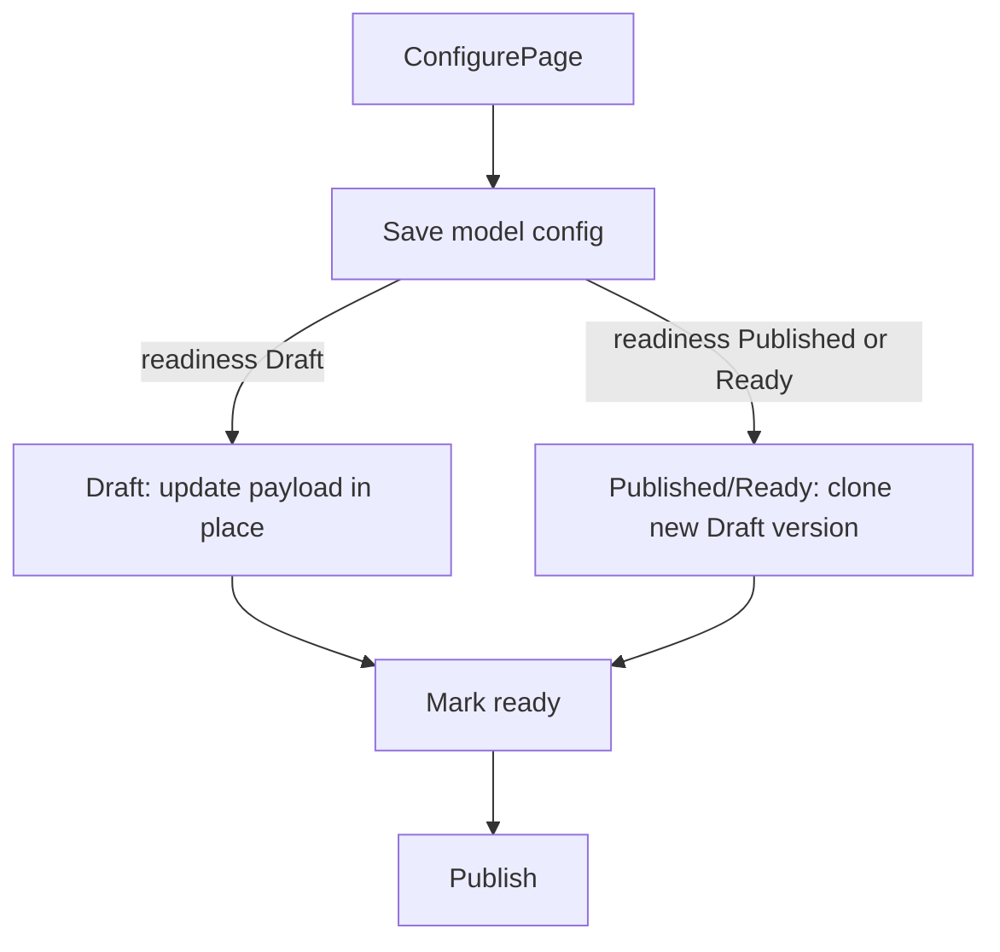

# Editable agent model config on configure page

## Problem

[`/agents/[agentKey]/configure`](ETOS.Frontend/src/app/agents/[agentKey]/configure/page.tsx) is read-only. Switching `openai` ↔ `openai-compatible` requires `/agents/new` or manual API calls, even though model routing is the main local-dev knob.

Published `AgentVersion` payloads are immutable (artifact lifecycle). Model changes must create a **new draft version** (or update an existing **draft** in place).

## Target UX (per your choices)

- Edit **primary provider**, **primary model id**, and **fallback models** on configure.
- **Save** does **not** auto-publish — user runs **Mark ready** then **Publish** on the same page (pattern from [`AgentTemplateDefinitionDetailView.tsx`](ETOS.Frontend/src/components/agent-templates/AgentTemplateDefinitionDetailView.tsx)).
- After save from a published version, redirect to the new draft (`?versionId=...`).



## Backend (small focused API)

### 1. New request/response contracts

In [`AgentDefinitionContracts.cs`](ETOS.Backend/Agents/AgentDefinitionContracts.cs):

```csharp
public sealed record UpdateAgentModelConfigRequest(
    string PrimaryModelProviderKey,
    string PrimaryModelId,
    IReadOnlyCollection<AgentFallbackModelRequest>? FallbackModels);

public sealed record UpdateAgentModelConfigResponse(
    Guid ArtifactId,
    Guid VersionId,
    string VersionLabel,
    string ReadinessState,
    bool CreatedNewVersion);
```

Add `AgentModelProviderKeys` helper (new file under `ETOS.Backend/AgentRuntime/` or `Agents/`) with allowed keys aligned to sidecar: `openai`, `openai-v1`, `openai-compatible`. Validate in service; reject empty model id.

### 2. Service method `UpdateModelConfigAsync`

In [`AgentDefinitionService.cs`](ETOS.Backend/Agents/AgentDefinitionService.cs) + [`IAgentDefinitionService`](ETOS.Backend/Agents/AgentDefinitionService.cs):

| Source version state | Behavior |
|---|---|
| `Draft` | Deserialize payload, replace model fields, serialize back to **same** version; audit `agents.model-config.update` |
| `Published`, `Ready`, `Blocked` | Clone payload from source, apply model fields, create **new** `ArtifactVersion` in `Draft` with auto-bumped label (semver patch increment, e.g. `1.0.0` → `1.0.1`; fallback suffix if label not semver) |

Clone logic: load source `PayloadJson` via `AgentDefinitionPayloadParser.Deserialize`, mutate `PrimaryModelProviderKey`, `PrimaryModelId`, `FallbackModels`, keep all reference GUIDs unchanged. Do **not** re-run template resolution.

Register endpoint in [`AgentDefinitionEndpointExtensions.cs`](ETOS.Backend/Agents/AgentDefinitionEndpointExtensions.cs):

`POST /api/admin/agents/{artifactId}/versions/{versionId}/model-config`

Permission: same as `agents.versions.create` / existing create path (`RequireCreatePermissionAsync`).

### 3. Tests

Extend [`AgentVersionTests.cs`](ETOS.Backend.Tests/AgentVersionTests.cs):

- Published `import-mapping-assistant`-style agent → POST model-config → new draft version, updated provider/model, `CreatedNewVersion=true`.
- Draft agent → POST model-config → same `versionId`, updated fields, `CreatedNewVersion=false`.
- Invalid provider → `400`.
- Existing mark-ready + publish tests remain; add one test: model-config draft → mark-ready → publish succeeds.

## Frontend

### 1. API helpers in [`etos-api.ts`](ETOS.Frontend/src/lib/etos-api.ts)

Add (mirror agent-template helpers):

- `postAgentModelConfig(artifactId, versionId, request)`
- `markAgentDefinitionReady(artifactId, versionId)`
- `publishAgentDefinition(artifactId, versionId, summary?)`
- `buildCreateAgentModelConfigRequest`-style types for fallback rows

### 2. New component [`AgentModelConfigPanel.tsx`](ETOS.Frontend/src/components/agents/AgentModelConfigPanel.tsx)

Server actions (same pattern as agent templates + [`agents/new/page.tsx`](ETOS.Frontend/src/app/agents/new/page.tsx)):

- **Model form**: provider `<select>` (`openai`, `openai-compatible`, `openai-v1`), model id input, dynamic fallback rows (add/remove) with `providerKey`, `modelId`, `triggerReason`.
- **Save model config** → `postAgentModelConfig` → `revalidatePath` configure → redirect with new `versionId` when `createdNewVersion`.
- **Mark ready** / **Publish** buttons shown when `artifactReadinessState` is `Draft` or `Ready` (publish only when ready); hidden/disabled for already-published with note: “Save changes to create a draft version first.”

Copy field defaults from loaded `AgentVersionDetail`.

### 3. Update configure page

[`configure/page.tsx`](ETOS.Frontend/src/app/agents/[agentKey]/configure/page.tsx):

- Load version list via `getArtifactVersions(artifactId)`; simple version picker links (`?versionId=`) like test-run page pattern.
- Replace read-only “Primary model” / “Fallback models” blocks with `AgentModelConfigPanel`.
- Keep other sections read-only (references, derived risk).
- Short helper text: OpenAI uses `OPENAI_API_KEY`; LM Studio uses `openai-compatible` + `OPENAI_BASE_URL` (link to `docs/local-development.md` section).

### 4. Verification

```powershell
dotnet test EnterpriseThreadOS.sln --filter "FullyQualifiedName~AgentVersionTests"
Push-Location ETOS.Frontend; npm run typecheck; npm run lint; Pop-Location
```

Manual: `/agents/import-mapping-assistant/configure` → change to `openai` / `gpt-4o-mini` → save → mark ready → publish → mapping preview diagnostics show new provider.

## Docs (minimal)

One paragraph in [`docs/local-development.md`](docs/local-development.md): model switching via configure page (draft → publish), env vars unchanged.

## Out of scope (follow-up)

- Editing safe mode, runtime adapter, or reference pins on configure.
- Auto-publish on save (explicitly excluded).
- Full mockup-29 advanced configuration beyond model routing.
