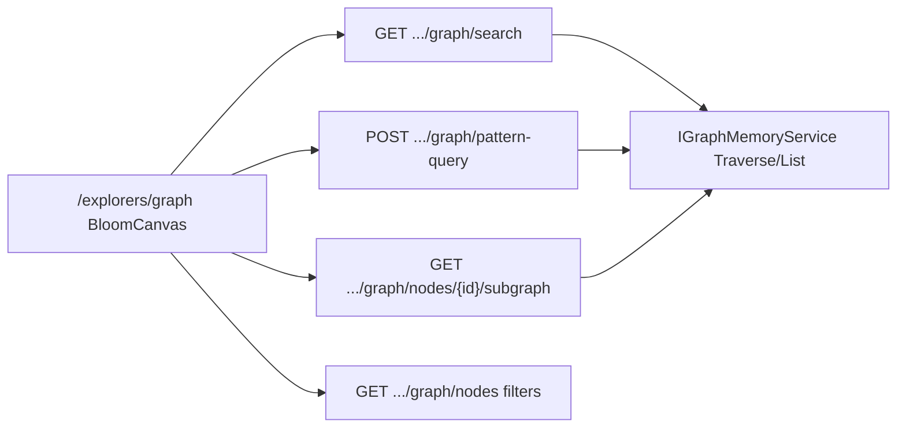

# Bloom-like Graph Explorer (1A + 2C)

## Decisions locked

- **Backend + frontend** (governed explorer APIs; no tenant Cypher).
- **Query = search bar + pattern builder** (Bloom-style, typed).
- **Route:** new primary surface [`/explorers/graph`](ETOS.Frontend/src/app/(shell)/explorers/graph/page.tsx); keep [`/graph`](ETOS.Frontend/src/app/(shell)/graph/page.tsx) as hub linking into it; reuse Sigma stack already in [`GraphNeighborhoodCanvas.tsx`](ETOS.Frontend/src/components/explorers/GraphNeighborhoodCanvas.tsx).

## Architecture



## Backend (Explorers module)

Extend [`GraphExplorerService`](ETOS.Backend/Explorers/GraphExplorerService.cs) + [`ExplorerEndpointExtensions`](ETOS.Backend/Explorers/ExplorerEndpointExtensions.cs) + DTOs in [`ExplorerContracts.cs`](ETOS.Backend/Explorers/ExplorerContracts.cs). Permission stays `graph.explorer.read`.

### 1. Wire / harden list filters + search

- Extend `ListNodesAsync` with `search` (match `objectType`, `nodeId` string, `safeSummary`, selected attribute values — case-insensitive contains).
- Keep **default limit 25, max 100**; return `truncated` flag when more matches exist beyond limit.
- Expose query params already present (`graphSpace`, `trustState`, `objectType`, `limit`, `policyKey`) and new `search`.

### 2. Subgraph endpoint (Bloom expand)

`GET /api/admin/explorers/graph/nodes/{nodeId}/subgraph`

- Params: `depth` (1–5, default 2), `relationshipTypes` (csv), `direction` (`out` default for Neo4j path orientation; document that internal traverse is outgoing-path based), `graphSpace`, `trustState`, `limit` (default 100, **hard max 250** aligned with Neo4j `TraversalRowLimit`).
- Impl: wrap existing `TraverseAsync` ([`TraverseGraphRequest`](ETOS.Backend/GraphMemory/GraphMemoryContracts.cs) already supports depth, rel types, trust), then policy-filter nodes; trim to `limit` nodes (keep start + incident edges among kept nodes).
- Response: `{ startNodeId, nodes[], relationships[], truncated, depth, limit }` with policy-safe summaries + `allowedAttributes` on nodes.

### 3. Pattern query endpoint (Bloom-like, not Cypher)

`POST /api/admin/explorers/graph/pattern-query`

Body (typed only):

```json
{
  "startNodeId": null,
  "startObjectType": "partVersion",
  "endObjectType": "part",
  "relationshipTypes": ["HAS_BOM"],
  "maxDepth": 2,
  "graphSpace": "Trusted",
  "trustState": "Trusted",
  "search": "optional text",
  "limit": 50
}
```

- Clamp `maxDepth` 1–5, `limit` 1–250.
- Algorithm (governed, parameterized GraphMemory only):
  1. Resolve seed nodes: if `startNodeId` use it; else list/filter by `startObjectType` + `search` (cap seeds e.g. 20).
  2. For each seed, `TraverseAsync` with depth + relationshipTypes + trust.
  3. Keep paths whose terminal (or any) node matches `endObjectType` when provided.
  4. Union nodes/edges, apply policy filter, apply `limit`, set `truncated`.
- Reject empty patterns (must have seed id or startObjectType or search).
- **Never** accept Cypher strings.

### 4. Tests

Add cases in [`ETOS.Backend.Tests/ExplorersTests.cs`](ETOS.Backend.Tests/ExplorersTests.cs): search filter, subgraph depth/limit truncation, pattern query type match, permission deny, no Cypher route still 404.

## Frontend

### API client

Extend [`etos-api.ts`](ETOS.Frontend/src/lib/etos-api.ts):

- `getGraphExplorerNodes({ graphSpace, trustState, objectType, search, limit })`
- `getGraphExplorerSubgraph(nodeId, params)`
- `postGraphExplorerPatternQuery(body)`

Server actions in [`explorers/actions.ts`](ETOS.Frontend/src/app/(shell)/explorers/actions.ts) for client expand/query.

### New route: `/explorers/graph`

Bloom layout (one composition):

| Region | Behavior |
|--------|----------|
| Top bar | Search input + Apply; Pattern builder: start type, end type, rel types (multi), depth, limit |
| Left filters | graphSpace, trustState, objectType, result limit (UI default 50, max 100 for search / 250 for pattern/subgraph) |
| Center | Sigma + graphology ForceAtlas2 canvas (extract shared lib from neighborhood canvas) |
| Right inspector | Selected node/edge metadata: type, trust, space, safeSummary, `allowedAttributes`, links to `/graph/[id]` and chat |

Interactions:

- Load: search or pattern → paint result subgraph.
- Click node → inspector; double-click / Expand → subgraph merge (existing hop UX).
- Fit / clear / truncated banner when API says truncated.
- Empty: CTA promote + link `/graph/promote`.

### Shared canvas component

Refactor into [`GraphBloomCanvas.tsx`](ETOS.Frontend/src/components/explorers/GraphBloomCanvas.tsx) (or rename shared module): accept arbitrary `{ nodes, edges }`, selection, expand callback. Keep [`GraphNeighborhoodCanvas`](ETOS.Frontend/src/components/explorers/GraphNeighborhoodCanvas.tsx) as thin wrapper for 360 pages.

### Hub / nav

- [`explorers/page.tsx`](ETOS.Frontend/src/app/(shell)/explorers/page.tsx): primary card **Full graph explorer** → `/explorers/graph`.
- [`navigation.ts`](ETOS.Frontend/src/config/navigation.ts): add Operate item “Graph canvas” → `/explorers/graph` (keep “Graph” → `/graph`).
- [`/graph` hub](ETOS.Frontend/src/app/(shell)/graph/page.tsx): primary button “Open Bloom canvas”.

## Limits (product hard caps)

| Surface | Cap |
|---------|-----|
| Node list / search | max **100** |
| Pattern / subgraph | max **250** nodes (Neo4j row limit) |
| Depth | **1–5** |
| Pattern seed fan-out | max **20** start nodes |

UI always shows current limit + `truncated` warning.

## Out of scope

- Raw Cypher console / `POST /api/admin/graph/query`
- Saved Bloom perspectives / scenes
- Changing GraphMemory provider contracts beyond what explorer needs (prefer wrapping `TraverseAsync` / `ListGraphAsync`; only add a small GraphMemory helper if pattern search cannot stay correct in explorer layer)

## Verify

```powershell
dotnet test EnterpriseThreadOS.sln --filter Explorers
Push-Location ETOS.Frontend; npm run typecheck; npm run lint; npm run build; Pop-Location
```

Manual: open `/explorers/graph`, run search, run pattern, expand node, confirm inspector attributes and limit truncation banner.
