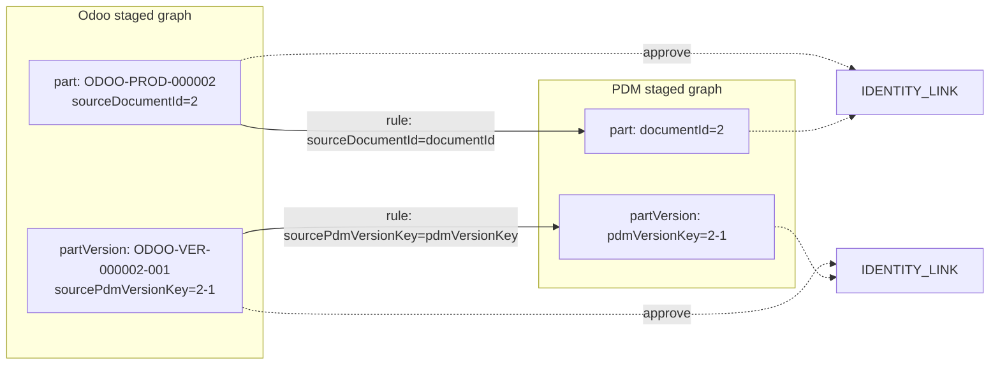

# Cross-Attribute PDM ↔ Odoo Identity Matching

## Problem

Today [`IdentityResolutionService.GenerateCandidatesAsync`](ETOS.Backend/IdentityResolution/IdentityResolutionService.cs) only matches when **the same identity-field value** appears on both sides:

```csharp
!string.Equals(source.IdentityKey, target.IdentityKey, StringComparison.Ordinal)
```

[`LoadIndexedRecordsAsync`](ETOS.Backend/IdentityResolution/IdentityResolutionService.cs) only reads columns marked `IsIdentityField`. That yields:

| System | Identity field | Example |
|---|---|---|
| PDM `partVersion` | `pdmVersionKey` | `2-1` |
| Odoo `partVersion` | `odooVersionKey` | `ODOO-VER-000002-001` |

Bridge columns already exist in demo data and mappings but are ignored:

- Odoo [`odoo-part-versions.csv`](packages/manufacturing-reference/demo-imports/odoo/odoo-part-versions.csv): `sourcePdmVersionKey=2-1`
- PDM [`part-versions.csv`](packages/manufacturing-reference/demo-imports/pdm/part-versions.csv): `pdmVersionKey=2-1`

Same pattern at part level: `sourceDocumentId` ↔ `documentId`.

## Target behavior



After approve + promote: two nodes remain; graph gets non-destructive `IDENTITY_LINK` edges (existing Issue 9 behavior).

## Design

### 1. Extend identity rule model

Add optional cross-system attribute pairs to rules.

**New contract types** in [`IdentityResolutionContracts.cs`](ETOS.Backend/IdentityResolution/IdentityResolutionContracts.cs):

```csharp
public sealed record IdentityCrossAttributePair(
    string SourceSystem,
    string SourceAttributeKey,
    string TargetSystem,
    string TargetAttributeKey);
```

Extend `CreateIdentityResolutionRuleRequest` and `IdentityResolutionRuleResponse` with:

- `IReadOnlyCollection<IdentityCrossAttributePair>? CrossAttributePairs`

**Persist** on [`IdentityResolutionRule`](ETOS.Backend/IdentityResolution/IdentityResolutionModels.cs):

- `CrossAttributePairsJson` (nullable, max ~4000 chars)

**EF migration** + update [`EnterpriseThreadDbContext.cs`](ETOS.Backend/Infrastructure/Persistence/EnterpriseThreadDbContext.cs) snapshot.

**Validation** (FluentValidation):

- Require **at least one** of `IdentityAttributeKeys` or `CrossAttributePairs`
- Cross pairs: all four strings non-empty; systems must differ; attribute keys must exist in ontology attribute schema when rule is created (optional soft check) or at match time via column mappings

### 2. Index more attributes during candidate generation

Update `LoadIndexedRecordsAsync` in [`IdentityResolutionService.cs`](ETOS.Backend/IdentityResolution/IdentityResolutionService.cs):

- Build `requiredAttributeKeys` = identity keys from rule **plus** all `SourceAttributeKey` / `TargetAttributeKey` from cross pairs
- Load values from **all approved column mappings** whose `CanonicalAttributeKey` is in that set (not only `IsIdentityField`)
- Store in expanded `IdentityValues` dictionary on `IdentityIndexedRecord`
- Keep `SourceRecordId` from identity-field columns for display (unchanged)

### 3. Matching logic

Replace the single equality check in `GenerateCandidatesAsync` with a helper, e.g. `TryBuildMatch(source, target, rule)` returning `(matched, identityKey, score)`.

**Same-attribute mode** (existing, unchanged):

- Same object type, different source systems
- All rule `IdentityAttributeKeys` equal (normalized)

**Cross-attribute mode** (new):

For each pair `(systemA, attrA, systemB, attrB)`:

```
if source.System == A && target.System == B:
  match when normalize(source[attrA]) == normalize(target[attrB])
elif source.System == B && target.System == A:
  match when normalize(source[attrB]) == normalize(target[attrA])
```

- `identityKey` = matched bridge value (e.g. `2-1`)
- `CalculateConfidence`: treat bridge match as full identity component for that pair; keep cross-system + lifecycle + validation bonuses
- `BuildEvidenceSummary`: include pair names, e.g. `Matched partVersion via sourcePdmVersionKey=2-1 ↔ pdmVersionKey=2-1`

Conflict detection (`MarkGeneratedConflicts`) stays on `(sourceGraphNodeId, identityKey)` — no change.

### 4. Rule resolution when `ruleId` is null

Update `ResolveRuleAsync` in [`IdentityResolutionService.cs`](ETOS.Backend/IdentityResolution/IdentityResolutionService.cs):

1. Explicit `ruleId` if provided (unchanged)
2. **New:** active tenant rule with non-empty `CrossAttributePairsJson` where:
   - `NormalizedObjectType` matches batch mapping object type
   - current batch `SourceSystem` appears in any pair’s `SourceSystem` or `TargetSystem`
3. **Fallback:** auto-created same-attribute rule from mapping identity fields (existing behavior)

This lets the Odoo wizard keep calling generate with `{ ruleId: null }` and still pick the seeded cross-attribute rule.

### 5. Package profile + installer seeding

**New file:** [`packages/manufacturing-reference/profiles/identity-resolution-rules.json`](packages/manufacturing-reference/profiles/identity-resolution-rules.json)

```json
[
  {
    "ruleKey": "odoo-pdm-part-document-bridge",
    "name": "Odoo part → PDM document",
    "objectType": "part",
    "identityAttributeKeys": [],
    "crossAttributePairs": [
      {
        "sourceSystem": "ODOO-ERP",
        "sourceAttributeKey": "sourceDocumentId",
        "targetSystem": "SOLIDWORKS-PDM",
        "targetAttributeKey": "documentId"
      }
    ],
    "autoApproveThreshold": 0.97,
    "reviewThreshold": 0.6
  },
  {
    "ruleKey": "odoo-pdm-part-version-bridge",
    "name": "Odoo version → PDM version",
    "objectType": "partVersion",
    "identityAttributeKeys": [],
    "crossAttributePairs": [
      {
        "sourceSystem": "ODOO-ERP",
        "sourceAttributeKey": "sourcePdmVersionKey",
        "targetSystem": "SOLIDWORKS-PDM",
        "targetAttributeKey": "pdmVersionKey"
      }
    ],
    "autoApproveThreshold": 0.97,
    "reviewThreshold": 0.6
  }
]
```

**Wire manifest:**

- Add `identityResolutionRulesFile` to [`package.manifest.json`](packages/manufacturing-reference/package.manifest.json) `profiles` section
- Extend [`ReferenceProfilesManifestSection`](ETOS.Backend/Packages/ReferencePackageManifestLoader.cs) + `LoadedReferencePackageManifest` to deserialize rules
- Add `ReferenceIdentityResolutionRuleDocument` DTO with stable `ruleKey` for idempotent install

**Installer** in [`ManufacturingReferencePackageInstaller.cs`](ETOS.Backend/Packages/ManufacturingReferencePackageInstaller.cs):

- Inject `IIdentityResolutionService`
- Add `EnsureIdentityResolutionRulesAsync` called from both fresh install and [`EnsureInstalledReferencePackageContinuityAsync`](ETOS.Backend/Packages/ManufacturingReferencePackageInstaller.cs)
- Upsert by `(tenantId, normalizedRuleKey)` — create missing rules only; do not overwrite reviewer-tuned thresholds on existing rules

### 6. Tests

**New test file:** `ETOS.Backend.Tests/OdooPdmIdentityResolutionTests.cs` (or extend [`IdentityResolutionTests.cs`](ETOS.Backend.Tests/IdentityResolutionTests.cs))

| Test | Setup | Assert |
|---|---|---|
| `CrossAttributeVersionMatching_GeneratesCandidates` | Stage PDM `pdm/part-versions.csv` + Odoo `odoo/odoo-part-versions.csv` with preset mappings from package profiles; seed cross-attribute rule | Generate on Odoo batch → candidate linking `ODOO-ERP` → `SOLIDWORKS-PDM` with identity key `2-1` |
| `CrossAttributePartMatching_GeneratesCandidates` | Same for `parts.csv` / `odoo-parts.csv` | Match on document `2` |
| `CrossAttributeMatching_IsIdempotent` | Generate twice | Second run `CreatedCount=0` |
| `CrossAttributeApproval_CreatesIdentityLink` | Approve candidate | `IDENTITY_LINK` in graph memory |
| `SameAttributeRegression_StillWorks` | Existing flat-import `partNumber` test | Unchanged |
| `Installer_SeedsCrossAttributeRules` | [`ManufacturingReferencePackageTests`](ETOS.Backend.Tests/ManufacturingReferencePackageTests.cs) | After install, tenant has both bridge rules |

Reuse [`ImportFlowTestSupport`](ETOS.Backend.Tests/Fixtures/ImportFlowTestSupport.cs) + demo fixtures under [`packages/manufacturing-reference/demo-imports/`](packages/manufacturing-reference/demo-imports/).

Column mappings should mirror [`pdm-import-mappings.json`](packages/manufacturing-reference/profiles/pdm-import-mappings.json) and [`odoo-import-mappings.json`](packages/manufacturing-reference/profiles/odoo-import-mappings.json) — especially non-identity bridge columns on Odoo `part-versions` / `odoo-parts`.

### 7. Frontend (minimal, optional in same slice)

No new API routes required.

- Backend auto-resolves cross-attribute rules → existing Odoo wizard step 5 at [`/imports/odoo`](ETOS.Frontend/src/app/imports/odoo/page.tsx) works without UI changes
- Optional polish: update identity copy in [`import-source-config.ts`](ETOS.Frontend/src/lib/import-wizard/import-source-config.ts) to state bridge matching is active after package install

Skip dedicated identity explorer UI (gap analysis already notes that as deferred).

### 8. Documentation

- [`docs/local-development.md`](docs/local-development.md): PDM → Odoo identity flow with bridge attributes
- [`ETOS.Helpers/OdooErpTransform/etos_import/README.md`](ETOS.Helpers/OdooErpTransform/etos_import/README.md): note cross-attribute rules are seeded on package install
- Update Issue 29 plan note that PDM ↔ ERP identity is no longer “document only”

## Verification (after implementation)

```powershell
dotnet test EnterpriseThreadOS.sln --filter "FullyQualifiedName~OdooPdmIdentityResolution|FullyQualifiedName~IdentityResolution|FullyQualifiedName~ManufacturingReferencePackage"
graphify update .
graphify cluster-only .
```

Manual smoke:

1. Install reference package (`/model-artifacts` or dev seed)
2. Run PDM demo import → stage all 4 batches
3. Run Odoo demo import → stage all 4 batches
4. `/imports/odoo` step 5 → generate candidates on `odoo-part-versions` batch
5. Approve a `2-1` match → promote → inspect graph

## Out of scope

- Fuzzy / ML matching
- BOM edge cross-linking (`contains` across systems)
- Live Odoo/PDM connectors
- Destructive merge of nodes
- Standalone identity review page

## Key files to change

| Area | Files |
|---|---|
| Core service | [`IdentityResolutionService.cs`](ETOS.Backend/IdentityResolution/IdentityResolutionService.cs), [`IdentityResolutionContracts.cs`](ETOS.Backend/IdentityResolution/IdentityResolutionContracts.cs), [`IdentityResolutionModels.cs`](ETOS.Backend/IdentityResolution/IdentityResolutionModels.cs) |
| Persistence | New EF migration, [`EnterpriseThreadDbContext.cs`](ETOS.Backend/Infrastructure/Persistence/EnterpriseThreadDbContext.cs) |
| Package | [`identity-resolution-rules.json`](packages/manufacturing-reference/profiles/identity-resolution-rules.json) (new), [`package.manifest.json`](packages/manufacturing-reference/package.manifest.json) |
| Installer | [`ReferencePackageManifestLoader.cs`](ETOS.Backend/Packages/ReferencePackageManifestLoader.cs), [`ManufacturingReferencePackageInstaller.cs`](ETOS.Backend/Packages/ManufacturingReferencePackageInstaller.cs) |
| Tests | New `OdooPdmIdentityResolutionTests.cs`, extend [`ManufacturingReferencePackageTests.cs`](ETOS.Backend.Tests/ManufacturingReferencePackageTests.cs) |
| Docs | [`docs/local-development.md`](docs/local-development.md) |
