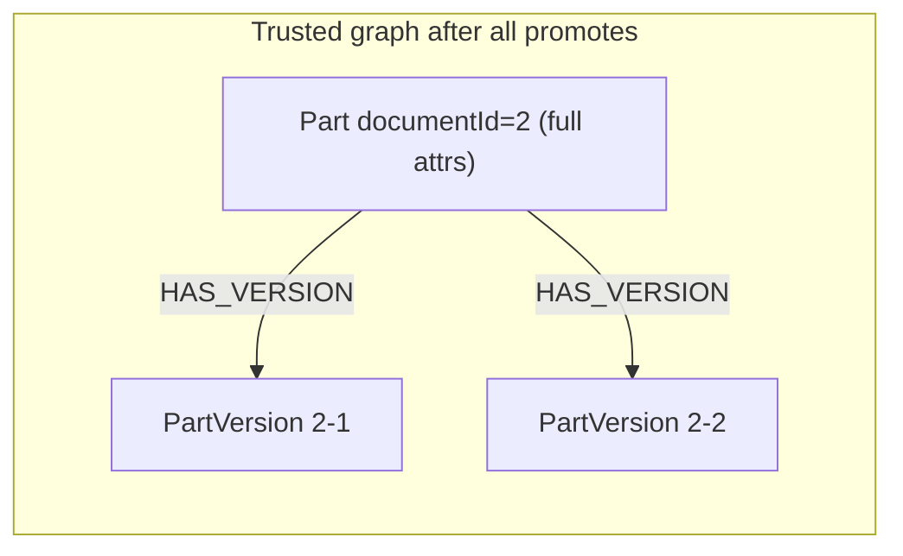

# Identity-Keyed Graph Node Materialization

## Problem

Staging and promote call `CreateNodeAsync` per row. Same object identifier (e.g. `part.documentId=2`) produces multiple graph nodes within a batch, across batches, and again in trusted space. Structural rows (`has-version.csv`, `version-bom.csv`) create their own minimal endpoint nodes instead of linking the real objects.

## Target behavior (confirmed with user)

- Object nodes are keyed by their identity attributes (from `isIdentityField` mappings / ontology identity fields). Same tenant + graph space + source system + object type + identity value = one node.
- Structural (relationship) rows never create or update object nodes. They resolve both endpoints by identity key and create only the relationship (relationship may carry its own attributes, e.g. BOM quantity). Missing endpoint = validation warning, row skipped.
- Promote merges into trusted space by identity key (full scope): promoting all 4 PDM batches yields one trusted `Part(documentId=2)` with `HAS_VERSION` edges to each version.
- Cross-source-system matching stays with identity resolution (`IDENTITY_LINK`) — identity keys include source system, so PDM and ERP parts do not silently merge.

## Changes

### 1. Graph contracts and Neo4j service — `ETOS.Backend/GraphMemory/`

- Add optional `IdentityKey` to `CreateGraphNodeRequest` and persist it as an `identityKey` node property in [Neo4jGraphMemoryService.cs](ETOS.Backend/GraphMemory/Neo4jGraphMemoryService.cs) (`CreateNodeAsync`, `MapNode`).
- New interface members on [IGraphMemoryService.cs](ETOS.Backend/GraphMemory/IGraphMemoryService.cs):
  - `FindNodeByIdentityAsync(tenantId, graphSpace, identityKey)` — Cypher match on `tenantId + graphSpace + identityKey`.
  - `EnsureNodeAsync(CreateGraphNodeRequest)` — find by identity key; on match update attributes/source ref (object's own data, latest wins) and return existing; on miss create. Requests without identity key fall through to plain create.
  - `EnsureRelationshipAsync(CreateGraphRelationshipRequest)` — match on `(tenantId, fromNodeId, toNodeId, relationshipType)`; return existing (refresh attributes) or create. Prevents duplicate `HAS_VERSION` on re-stage/re-promote.
  - Provide default interface implementations that delegate to create/`null`, so the ~13 `RecordingGraphMemoryService` test fakes keep compiling; override for real semantics where needed.
- `MemgraphGraphMemoryService`: new members throw the existing `Deferred()` placeholder.
- `Neo4jGraphBootstrapService`: add index on `identityKey`.

### 2. Identity key builder

Small static helper (in `GraphMemory` or `Imports`): builds normalized key `sourceSystem|objectType|attrKey=value;...` from identity attributes. Used by import staging and carried on nodes so promote can reuse it without recomputation.

### 3. Import staging — [ImportService.cs](ETOS.Backend/Imports/ImportService.cs) `StageBatchAsync` (~lines 385–476)

- **Flat rows:** compute identity key from `identityMappings` + row values; call `EnsureNodeAsync` instead of `CreateNodeAsync`. Keep appending one node ID per row to `nodeIds` (even when reused) — [IdentityResolutionService.cs](ETOS.Backend/IdentityResolution/IdentityResolutionService.cs) `LoadIndexedRecordsAsync` aligns `nodeIds[rowIndex]` with file rows.
- **Structural rows:** stop creating endpoint nodes. Resolve parent and child via `FindNodeByIdentityAsync` in staging space (identity attrs already computed by `ImportStructuralImportHelper.BuildStructuralIdentityAttributes`). Both found: `EnsureRelationshipAsync` with row relationship attributes; record both endpoint node IDs in the run's node list (so promote of a structural batch carries its endpoints). Either missing: add `ImportValidationIssue` warning (code like `structural-endpoint-missing`, does not block promote) and skip the row.
- Import order consequence: structural batches require their flat object batches staged first. The PDM wizard already stages parts → part-versions → has-version → version-bom, so no frontend change.

### 4. Promote — `PromoteStagingAsync` in [Neo4jGraphMemoryService.cs](ETOS.Backend/GraphMemory/Neo4jGraphMemoryService.cs) (~lines 307–352)

- Nodes: for each staging node with an `identityKey`, `EnsureNodeAsync` into Trusted (merge = one trusted node across batches, attributes refreshed from staging copy). Nodes without identity key keep today's copy behavior.
- Relationships: map endpoints through `nodeMap` as today, then `EnsureRelationshipAsync` so re-promotes and overlapping batches do not duplicate edges.
- `GraphPromotionCopyResult` counts stay meaningful (distinct ensured IDs).

### 5. Tests — `ETOS.Backend.Tests/`

- Extend `RecordingGraphMemoryService` in [ImportFlowTestSupport.cs](ETOS.Backend.Tests/Fixtures/ImportFlowTestSupport.cs) (and the identity-resolution / manufacturing-package fakes if they assert graph shape) with real ensure semantics.
- New/updated tests:
  - Staging: flat parts + has-version with `2→2-1`, `2→2-2` yields one staged Part, two PartVersions, two `HAS_VERSION` edges linked to the flat nodes.
  - Staging: structural row with missing endpoint produces the warning issue and no relationship.
  - Promote: promoting all batches yields a single trusted Part (with flat attributes) and both edges; re-promote is idempotent (no duplicate nodes/edges).
- Verify with `dotnet test EnterpriseThreadOS.sln`.

## Additive flat attribute properties (2026-07-11)

Neo4j writes now also persist domain attributes as prefixed top-level properties (`attr_<key>`) on nodes and relationships while keeping `attributesJson` as the canonical API read source. Import staging, ensure/update, and promote paths inherit this automatically through `Neo4jGraphMemoryService`.

## Assumptions

- No backfill/migration of existing duplicate graph data — dev/demo graphs get wiped and re-imported.
- Relationship-row attribute policy per user decision: structural rows never touch object node attributes; flat object rows own their node's attributes (latest staged/promoted wins).
- Identity resolution (cross-source candidates, `IDENTITY_LINK`, promote gates) is untouched.