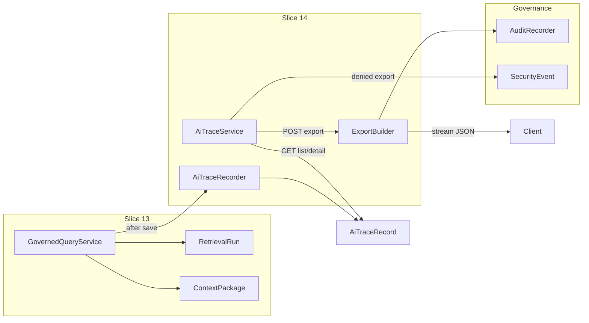

# Issue 14: AI Trace, Trace Explorer, and Trace Export

## Prerequisite

Issue 13 must land first. [Slice 13 plan](.cursor/plans/slice-13-Governed-Query-Intents.md) already defines `RetrievalRun`, `ContextPackage`, and `ContextAccessDecision` in [`ETOS.Backend/GovernedQuery/`](ETOS.Backend/GovernedQuery/). Issue 14 wraps those runtime records into explainable AI Trace records — no live LLM/chat (Issue 15).

## Scope

**In scope**
- `AiTrace` backend module (models, DTOs, service, endpoints, migration)
- Auto-create trace when governed query run completes
- Trace list + detail APIs with tenant/permission fail-closed
- Separate `ai_trace.read` vs `ai_trace.export` permissions
- On-demand JSON export with redaction metadata + SHA-256 hash
- Export audit records; denied export → `SecurityEventType.ExportDenied`
- Basic `/ai-traces` UI + typed API helpers
- `AiTraceTests` covering acceptance criteria

**Out of scope (defer to later issues)**
- Governed chat, live LLM output, pinned `PromptTemplateVersion` / `OutputSchemaVersion` artifacts (store nullable placeholders only)
- Immutable stored export artifacts in object storage (PRD MVP: on-demand only; audit metadata persisted)
- AgentRun / ToolRun trace linkage
- Full 360° context view (Issue 16)

## Architecture



## Backend design

### New module: `ETOS.Backend/AiTrace/`

Mirror existing module layout ([`GovernedQuery/`](ETOS.Backend/GovernedQuery/), [`Governance/`](ETOS.Backend/Governance/)):

| File | Purpose |
|------|---------|
| `AiTraceModels.cs` | Persisted entities |
| `AiTraceContracts.cs` | Permissions, request/response DTOs |
| `AiTraceService.cs` | List/get/export + permission checks |
| `IAiTraceRecorder.cs` + `AiTraceRecorder.cs` | Create trace from completed retrieval run |
| `AiTraceExportBuilder.cs` | Build permission-safe export payload + redaction metadata + hash |
| `AiTraceEndpointExtensions.cs` | Minimal API routes |

### Persisted models

**`AiTraceRecord`** (`ITenantScoped`)
- Links: `RetrievalRunId`, `ContextPackageId`, optional `AuditRecordId`
- Denormalized safe metadata: `TraceKind` (`GovernedQuery` for MVP), `IntentKey`, `StrategyKey`, `QueryText`, `Status`, `SafeSummary`
- JSON snapshots (safe summaries only, copied from context package at creation time):
  - `SourcesSummaryJson` — graph/document source counts + ordered safe source refs
  - `FilteredSummariesJson`
  - `DeniedSafeSummariesJson`
  - `ConfidenceImpactJson` — MVP: `{ retrievedCount, filteredCount, deniedCount, trustFilteredCount, policyKey, notes }` derived from run/package (no LLM confidence yet)
- Placeholders for Issue 15: nullable `PromptTemplateVersionLabel`, `OutputSchemaVersionLabel`, `GeneratedOutputJson` (null/empty)
- `RequestedByUserId`, `CreatedAt`

**`AiTraceArtifactLink`**
- `AiTraceRecordId`, `ObjectType`, `ObjectId`, `LinkKind` (`QueryIntent`, `RetrievalStrategy`, `DocumentArtifact`, `GraphNode`, `ContextPackage`, `RetrievalRun`)
- Seed links from governed query run inputs

**`AiTraceExportRecord`** (audit metadata only — not full package blob)
- `AiTraceRecordId`, `ExportedByUserId`, `ExportHash`, `RedactionMetadataJson`, `EvidenceLevel`, `AuditRecordId`, `CreatedAt`
- Supports “export packages generated on demand with redaction metadata and audit records” without permanent object-storage retention

### Permissions ([`AiTraceContracts.cs`](ETOS.Backend/AiTrace/AiTraceContracts.cs))

```csharp
public static class AiTracePermissions
{
    public const string Read = "ai_trace.read";
    public const string Export = "ai_trace.export";
    public const string Admin = "ai_trace.admin";
}
```

Seed in [`DevelopmentIdentitySeeder.cs`](ETOS.Backend/Identity/DevelopmentIdentitySeeder.cs) and grant to admin role (alongside existing wildcard). **Do not** grant `export` to a read-only test user — tests need both roles to prove separation.

### Trace creation hook

Inject `IAiTraceRecorder` into [`GovernedQueryService`](ETOS.Backend/GovernedQuery/GovernedQueryService.cs). After successful `SaveChangesAsync` + audit on `RunAsync`, call recorder to materialize `AiTraceRecord` + artifact links from the saved run/package.

Recorder loads run with intent/strategy/package (same tenant) and copies safe JSON fields — no re-retrieval from graph.

### Service behavior

**List traces** — `ai_trace.traces.list` requires `AiTracePermissions.Read`
- EF query: filter `TenantId`, order by `CreatedAt` desc, project to summary DTO before materializing (follow [ef-core-query-projection-ordering rule](.cursor/rules/ef-core-query-projection-ordering.mdc))

**Get trace** — `ai_trace.traces.get` requires `Read`
- Return full detail: retrieval strategy, sources, filtered/denied safe summaries, confidence impact, placeholders, artifact links
- **Sensitive denied references**: omit from default detail response; include only when caller has `AiTracePermissions.Admin` (stronger control per PRD). Export applies same rule + explicit redaction metadata when omitted.

**Export trace** — `POST /api/admin/ai-traces/{traceId}/export` requires `AiTracePermissions.Export` (Read alone is insufficient)
- Build export JSON:
  - Trace safe fields + redaction metadata block (`policyKey`, `policyVersion`, `redactedCategories`, `evidenceLevel`, `exportedAt`, `exportedByUserId`)
  - Compute SHA-256 over canonical serialized bytes
- Return `Results.File` (`application/json`) on demand
- Persist `AiTraceExportRecord` + `AuditRecord` (`Action`: `ai_trace.export`, `Result`: `AuditResult.Export`, `RetentionCategory`: `Export`)
- **Denied export**: custom path (do not rely on generic `permission_denied` mapping alone):
  - Write access denial + audit denied
  - Explicit `SecurityEventType.ExportDenied` via [`AuditRecorder.RecordSecurityEventAsync`](ETOS.Backend/Governance/AuditRecorder.cs)
  - Return 403

Cross-tenant access: same fail-closed pattern as [`GovernedQueryService.GetContextPackageAsync`](ETOS.Backend/GovernedQuery/GovernedQueryService.cs) with tenant mismatch security event.

### API endpoints

Register in [`Program.cs`](ETOS.Backend/Program.cs) via `MapEnterpriseThreadAiTraceEndpoints()`.

| Method | Route | Permission |
|--------|-------|------------|
| GET | `/api/admin/ai-traces` | `ai_trace.read` |
| GET | `/api/admin/ai-traces/{traceId}` | `ai_trace.read` |
| POST | `/api/admin/ai-traces/{traceId}/export` | `ai_trace.export` |

Optional convenience: `GET /api/admin/ai-traces/by-retrieval-run/{runId}` for linking from future governed-query UI.

### Persistence

- Add DbSets + indexes in [`EnterpriseThreadDbContext.cs`](ETOS.Backend/Infrastructure/Persistence/EnterpriseThreadDbContext.cs)
- EF migration: `Slice14AiTraceTraceExport`
- Register services in [`EnterpriseThreadPlatform.cs`](ETOS.Backend/Platform/EnterpriseThreadPlatform.cs)

No new object-storage interface for MVP — export streams directly; [`ARCHITECTURE.md`](ARCHITECTURE.md) already notes trace export packages as future object-storage use.

## Frontend

Follow existing admin shell patterns ([`imports/page.tsx`](ETOS.Frontend/src/app/imports/page.tsx), [`documents/page.tsx`](ETOS.Frontend/src/app/documents/page.tsx)):

- Add types + fetch helpers in [`ETOS.Frontend/src/lib/etos-api.ts`](ETOS.Frontend/src/lib/etos-api.ts)
- New server-rendered page [`ETOS.Frontend/src/app/ai-traces/page.tsx`](ETOS.Frontend/src/app/ai-traces/page.tsx):
  - Trace list table (intent, strategy, status, counts, createdAt)
  - Detail panel: retrieval strategy, source summary, filtered/denied safe summaries, confidence impact, artifact links, export button (only if export permission — MVP can show button and surface 403 from API for read-only users, or hide via separate seeded role later)
- Link from home shell nav if other modules do

Read [`ETOS.Frontend/AGENTS.md`](ETOS.Frontend/AGENTS.md) before edits.

## Tests: `ETOS.Backend.Tests/AiTraceTests.cs`

| Test | Validates |
|------|-----------|
| Governed query run creates linked `AiTraceRecord` | Trace creation |
| User with `read` can list/get; user without `export` gets 403 on export | Permission separation |
| Export success writes `AiTraceExportRecord` + audit with `Export` result and redaction metadata + hash | Export audit + redaction metadata |
| Export denied writes `SecurityEventType.ExportDenied` | Security event on denial |
| Cross-tenant trace access denied | Tenant isolation |
| Sensitive denied refs excluded from detail for read-only user | Safe summary boundary |

Reuse test harness patterns from [`GovernedQueryTests.cs`](ETOS.Backend.Tests/GovernedQueryTests.cs): in-memory EF, seeded tenant/users, stub graph/policy services, permission matrix via separate user fixtures.

## Docs touch (minimal)

Update [`ARCHITECTURE.md`](ARCHITECTURE.md) implemented-components list: AI Trace module, move “AI Trace” from planned → implemented (partial — governed-query traces only).

## Verification

```powershell
dotnet test ETOS.Backend.Tests/ETOS.Backend.Tests.csproj --filter AiTrace
dotnet test EnterpriseThreadOS.sln
```

If frontend touched:

```powershell
Push-Location ETOS.Frontend
npm run typecheck
npm run lint
Pop-Location
```

Post-code: `graphify update .`

## Implementation order

1. Models + migration + DbContext + platform registration
2. `AiTraceRecorder` + hook in `GovernedQueryService.RunAsync`
3. `AiTraceService` list/get/export + endpoints
4. Permission seeding
5. Backend tests
6. Frontend API helpers + `/ai-traces` page
7. ARCHITECTURE.md + graphify update

## Key conventions to reuse

- Permission gate pattern from [`GovernedQueryService.RequirePermissionAsync`](ETOS.Backend/GovernedQuery/GovernedQueryService.cs)
- Audit/security writes via [`IAuditRecorder`](ETOS.Backend/Governance/AuditRecorder.cs)
- DTO-only API responses; no EF entity leakage
- Tenant-scoped records implement `ITenantScoped`
- Export denial uses explicit `ExportDenied` event type already defined in [`GovernanceModels.cs`](ETOS.Backend/Governance/GovernanceModels.cs)
