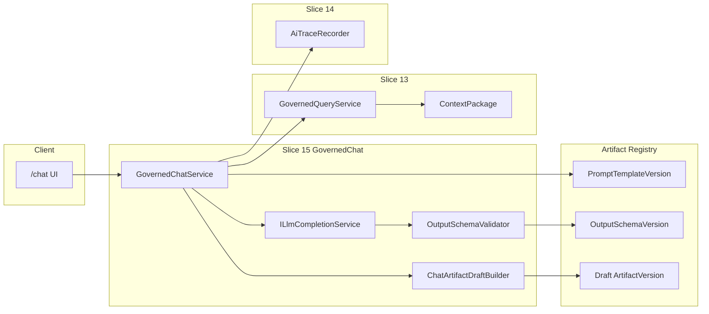

# Issue 15: Governed Chat and Chat-to-Artifact Drafting

## Prerequisite

Issue 14 must land first. Slice 13 provides [`GovernedQueryService`](ETOS.Backend/GovernedQuery/GovernedQueryService.cs) retrieval + `ContextPackage`. Slice 14 provides [`AiTraceRecorder`](ETOS.Backend/AiTrace/AiTraceRecorder.cs) with nullable placeholders for `PromptTemplateVersionLabel`, `OutputSchemaVersionLabel`, and `GeneratedOutputJson`. Issue 15 fills those fields and adds chat orchestration — not explorers (Issue 16) or dashboard preview rendering (Issue 17).

## Scope

**In scope**
- `GovernedChat` backend module (models, DTOs, service, endpoints, migration)
- `ILlmCompletionService` abstraction with deterministic test/dev provider; optional real provider behind config (no fake “always-on” external dependency)
- Platform-seeded `PromptTemplateVersion` and `OutputSchemaVersion` as artifact-registry records (reuse [`Artifact`](ETOS.Backend/Artifacts/ArtifactModels.cs), not new artifact tables)
- Governed chat Q&A: natural-language question → governed retrieval → LLM over `LlmVisibleContext` only → structured answer with evidence, confidence, denied summaries, AI Trace link
- Chat-to-artifact drafting: optional generation of draft `QueryIntentVersion`, `DashboardVersion`, or `ReportVersion` artifact versions with `ReadinessState.Draft`
- Pin prompt/output schema version labels on chat traces and draft artifact payloads
- Publish blocking via existing [`ArtifactRegistryService.PublishVersionAsync`](ETOS.Backend/Artifacts/ArtifactRegistryService.cs) readiness rules
- Basic `/chat` UI + typed API helpers
- `GovernedChatTests` covering acceptance criteria

**Out of scope (defer)**
- Issue 16 explorers and 360° context view
- Issue 17 dashboard/report preview rendering and export
- Tenant-defined executable query intents (Issue 13 placeholder remains; chat drafts are artifact-registry drafts only)
- AgentRun, ToolRun, ConversationArtifact as full artifact lifecycle
- Live vector/Qdrant retrieval changes
- Neo4j Agent Memory

## Architecture



## End-to-end chat turn flow

1. Resolve tenant + `governed_chat.run` permission.
2. Select fixed platform intent (`object-360-context`, `document-evidence-context`, or explicit `intentKey`) from request anchors (`startGraphNodeId`, `documentArtifactId`).
3. Call `GovernedQueryService.RunAsync` with **`createAiTrace: false`** (new optional flag on request) to avoid duplicate traces.
4. Load platform `PromptTemplateVersion` + mode-specific `OutputSchemaVersion` from artifact registry (seeded per tenant).
5. Build prompt from template + **only** `ContextPackage.LlmVisibleContextJson` safe summaries (never denied/sensitive refs).
6. Call `ILlmCompletionService.CompleteStructuredAsync` → JSON output.
7. Validate output against output-schema artifact payload (JsonSchema.Net or equivalent lightweight validator).
8. Create `GovernedChatTurn` runtime record linking session, retrieval run, context package, prompt/output artifact version IDs.
9. Create `AiTraceRecord` with `TraceKind = GovernedChat`, pinned labels, `GeneratedOutputJson`, evidence/confidence fields.
10. If `draftArtifactKind` requested and caller has `governed_chat.draft`: create draft artifact version via `ChatArtifactDraftBuilder`, relate to trace/retrieval run/prompt/output schema.
11. Audit `governed_chat.ask` (+ `governed_chat.draft` when applicable).

## Backend design

### New module: `ETOS.Backend/GovernedChat/`

Mirror Issue 13/14 module layout:

| File | Purpose |
|------|---------|
| `GovernedChatModels.cs` | Persisted session/turn entities |
| `GovernedChatContracts.cs` | Permissions, request/response DTOs, draft kind enum |
| `GovernedChatService.cs` | Ask, list turns, get turn detail |
| `ChatArtifactDraftBuilder.cs` | Create draft artifact versions + relationships |
| `OutputSchemaValidator.cs` | Validate LLM JSON against seeded schema artifacts |
| `GovernedChatEndpointExtensions.cs` | Minimal API routes |
| `Llm/ILlmCompletionService.cs` | Provider abstraction |
| `Llm/DeterministicLlmCompletionService.cs` | Default/test provider (structured JSON from context) |
| `Llm/OpenAiLlmCompletionService.cs` | Optional; registered only when config + API key present |

Register in [`EnterpriseThreadPlatform.cs`](ETOS.Backend/Platform/EnterpriseThreadPlatform.cs); map from [`Program.cs`](ETOS.Backend/Program.cs).

### Persisted runtime models

**`GovernedChatSession`** (`ITenantScoped`)
- `Title`, `StartedByUserId`, `CreatedAt`, `LastTurnAt`
- Optional anchor: `StartGraphNodeId`, `DocumentArtifactId`

**`GovernedChatTurn`** (`ITenantScoped`)
- `SessionId`, `UserMessage`, `AssistantSafeSummary`
- Links: `RetrievalRunId`, `ContextPackageId`, `AiTraceRecordId`
- Pinned artifact refs: `PromptTemplateArtifactId`, `PromptTemplateVersionId`, `OutputSchemaArtifactId`, `OutputSchemaVersionId`
- `GeneratedOutputJson` (validated structured output)
- `EvidenceJson` — safe source refs derived from LLM-visible context (contextId, contextType, safeSummary)
- `ConfidenceJson` — MVP: `{ overall, retrievalCount, allowedCount, deniedCount, trustFilteredCount, notes }`
- Optional draft link: `DraftArtifactId`, `DraftArtifactVersionId`, `DraftArtifactKind`
- `CreatedAt`

Indexes: `(TenantId, SessionId, CreatedAt)`, `(TenantId, CreatedAt)`.

### Platform artifact seeding (not new tables)

Add `IGovernedChatArtifactSeeder` (dev seed, same pattern as fixed query intents) to ensure per-tenant artifacts:

| ArtifactType | Name / versionLabel | Purpose |
|--------------|---------------------|---------|
| `PromptTemplateVersion` | `platform-governed-chat-v1` | Chat system prompt with placeholders for intent, question, context block |
| `OutputSchemaVersion` | `chat-answer-v1` | JSON schema for Q&A responses (answer, evidence[], confidence) |
| `OutputSchemaVersion` | `draft-query-intent-v1` | Draft query intent template payload |
| `OutputSchemaVersion` | `draft-dashboard-v1` | Dashboard template JSON (widgets, query intent refs) |
| `OutputSchemaVersion` | `draft-report-v1` | Report template JSON (sections, query intent refs) |

Store template/schema bodies in `ArtifactVersion.PayloadJson`. Mark seeded platform versions `ReadinessState.Published` so drafts can depend on them.

Chat-generated drafts use **artifact registry only**:

| Draft kind | ArtifactType | Initial readiness | Publish behavior |
|------------|--------------|-------------------|------------------|
| Query intent | `QueryIntentVersion` | `Draft` | Blocked until marked `Ready` + dependencies satisfied |
| Dashboard | `DashboardVersion` | `Draft` | Same |
| Report | `ReportVersion` | `Draft` | Same |

Payload includes: generated template JSON, source `AiTraceRecordId`, `RetrievalRunId`, pinned prompt/output schema version labels, and `createdFromChat: true`. Add `ArtifactRelationship` edges: `CreatedFrom` → trace, `Uses` → prompt/output schema versions, `DerivedFrom` → retrieval run (use existing [`ArtifactRelationshipType`](ETOS.Backend/Artifacts/ArtifactModels.cs) where possible).

**Important:** Draft `QueryIntentVersion` artifacts are **not** inserted into [`QueryIntentVersion`](ETOS.Backend/GovernedQuery/GovernedQueryModels.cs) governed-query table. Execution of tenant-defined intents remains deferred per Issue 13.

### Permissions (`GovernedChatContracts.cs`)

```csharp
public static class GovernedChatPermissions
{
    public const string Run = "governed_chat.run";
    public const string Draft = "governed_chat.draft";
    public const string Admin = "governed_chat.admin";
}
```

Seed in [`DevelopmentIdentitySeeder.cs`](ETOS.Backend/Identity/DevelopmentIdentitySeeder.cs). Admin role gets all three. Add a read-only chat test user **without** `draft` for permission separation tests (mirror AiTrace export pattern).

### Governed query integration

Extend [`RunGovernedQueryRequest`](ETOS.Backend/GovernedQuery/GovernedQueryContracts.cs):

```csharp
bool CreateAiTrace = true  // default preserves Slice 13/14 behavior
```

In `RunAsync`, wrap `aiTraceRecorder.CreateFromRetrievalRunAsync` with `if (request.CreateAiTrace)`.

Alternative considered: internal retrieval extraction — rejected as larger refactor; flag is minimal and backward compatible.

### AiTrace extension

In [`AiTraceModels.cs`](ETOS.Backend/AiTrace/AiTraceModels.cs):
- Add `AiTraceKind.GovernedChat = 1`
- Add optional `GovernedChatTurnId` on `AiTraceRecord` (nullable FK)
- Extend `AiTraceArtifactLinkKind`: `PromptTemplate`, `OutputSchema`, `DraftArtifact`, `GovernedChatTurn`

Add `IAiTraceRecorder.CreateFromChatTurnAsync(GovernedChatTurn turn, ContextPackage package, RetrievalRun run, ...)` that sets:
- `PromptTemplateVersionLabel`, `OutputSchemaVersionLabel` from pinned artifact versions
- `GeneratedOutputJson` from validated output
- `TraceKind = GovernedChat`
- Artifact links for prompt, output schema, draft artifact (if any)

Update [`AiTraceService`](ETOS.Backend/AiTrace/AiTraceService.cs) list/detail DTOs to surface `traceKind = GovernedChat` (no breaking change).

### LLM provider strategy (architecture-honest)

- **Default:** `DeterministicLlmCompletionService` registered always — produces schema-valid JSON from allowed context summaries; enables CI without API keys.
- **Optional:** When `GovernedChat:LlmProvider = OpenAI` and key configured, register `OpenAiLlmCompletionService` (or Semantic Kernel adapter) **instead of** deterministic.
- Provider receives only assembled prompt string + output schema JSON — never raw graph DB, never denied context.
- Log provider name in audit safe summary; do not log full prompt in audit (operational safe summary only).

### API endpoints

| Method | Route | Permission |
|--------|-------|------------|
| POST | `/api/admin/governed-chat/sessions` | `governed_chat.run` |
| GET | `/api/admin/governed-chat/sessions` | `governed_chat.run` |
| GET | `/api/admin/governed-chat/sessions/{sessionId}` | `governed_chat.run` |
| POST | `/api/admin/governed-chat/sessions/{sessionId}/turns` | `governed_chat.run` (+ `draft` if `draftArtifactKind` set) |
| GET | `/api/admin/governed-chat/turns/{turnId}` | `governed_chat.run` |

**`POST .../turns` body (sketch):**
```json
{
  "message": "What parts are linked to this assembly?",
  "intentKey": "object-360-context",
  "startGraphNodeId": "...",
  "documentArtifactId": null,
  "policyKey": null,
  "draftArtifactKind": null
}
```

Response includes: `turnId`, `sessionId`, `assistantSafeSummary`, `evidence[]`, `confidence`, `deniedSummaryCount`, `aiTraceId`, optional `draftArtifact` summary, links to retrieval run/context package.

### Draft + publish governance

Reuse existing artifact registry — **no parallel publish path**:
- Draft creation sets `ReadinessState.Draft`, `CompatibilityStatus.Unknown`, `PolicyRiskStatus.NotEvaluated`
- `GetReadinessAsync` / `PublishVersionAsync` already block draft/unready versions ([`CalculateReadinessAsync`](ETOS.Backend/Artifacts/ArtifactRegistryService.cs))
- Chat service exposes **read-only** readiness on draft response; actual publish stays on artifact registry API (`artifacts.publish` permission)
- Tests prove: chat-created dashboard draft cannot publish until readiness transitioned to `Ready` (and dependencies published)

Optional helper endpoint (nice-to-have, not required for acceptance): `GET /api/admin/governed-chat/turns/{turnId}/draft-readiness` projecting artifact registry readiness — defer if time-constrained.

## Frontend

Follow admin shell patterns ([`ai-traces/page.tsx`](ETOS.Frontend/src/app/ai-traces/page.tsx)):

- Types + fetch helpers in [`etos-api.ts`](ETOS.Frontend/src/lib/etos-api.ts)
- New [`ETOS.Frontend/src/app/chat/page.tsx`](ETOS.Frontend/src/app/chat/page.tsx):
  - Session list + “new session” with optional graph node / document anchor
  - Ask form (message, intent selector for fixed intents)
  - Response panel: assistant summary, evidence list, confidence block, denied count, link to `/ai-traces?traceId=` or detail fetch
  - Draft actions dropdown: “Save as draft query intent / dashboard / report” (calls turn endpoint with `draftArtifactKind`)
  - Show draft artifact id + readiness state when returned
- Home nav link alongside AI Traces

Client component only where form interaction needed; prefer server actions for POST like existing pages.

## Tests: `ETOS.Backend.Tests/GovernedChatTests.cs`

| Test | Validates |
|------|-----------|
| Chat turn runs governed retrieval; LLM receives only allowed context | Governed chat filtering |
| Turn creates `AiTraceRecord` with `GovernedChat` kind, pinned prompt/output labels, generated output | Trace links + pinning |
| Response includes evidence refs matching LLM-visible context | Evidence in response |
| Denied context reflected in confidence/denied counts, not in generated output | Denied context separation |
| `draftArtifactKind=dashboard` creates `DashboardVersion` draft with `ReadinessState.Draft` | Draft artifact creation |
| Publish draft via artifact registry fails while still `Draft` | Publish blocking |
| User without `governed_chat.draft` gets 403 when requesting draft | Permission separation |
| Cross-tenant session/turn access denied | Tenant isolation |
| Governed query run from chat does not create duplicate query-only trace | Single trace per turn |

Reuse harness from [`GovernedQueryTests.cs`](ETOS.Backend.Tests/GovernedQueryTests.cs) + [`AiTraceTests.cs`](ETOS.Backend.Tests/AiTraceTests.cs): in-memory EF, seeded tenant, stub graph/policy, deterministic LLM.

## Docs touch (minimal)

Update [`ARCHITECTURE.md`](ARCHITECTURE.md): Governed Chat module, prompt/output schema seeding, chat-to-artifact drafting; note LLM provider is abstracted with deterministic default.

## Verification

```powershell
dotnet test ETOS.Backend.Tests/ETOS.Backend.Tests.csproj --filter GovernedChat
dotnet test ETOS.Backend.Tests/ETOS.Backend.Tests.csproj --filter "GovernedChat|AiTrace|GovernedQuery"
dotnet test EnterpriseThreadOS.sln
```

```powershell
Push-Location ETOS.Frontend
npm run typecheck
npm run lint
Pop-Location
```

Post-code: `graphify update .`

## Implementation order

1. `ILlmCompletionService` + deterministic provider + platform artifact seeder
2. GovernedChat models + migration + DbContext + platform registration
3. `CreateAiTrace` flag on governed query run
4. Output schema validator + chat artifact draft builder
5. `GovernedChatService` + AiTrace recorder extension
6. Endpoints + permission seeding
7. Backend tests
8. Frontend `/chat` + API helpers
9. ARCHITECTURE.md + graphify update

## Key conventions to reuse

- Permission gate pattern from [`GovernedQueryService`](ETOS.Backend/GovernedQuery/GovernedQueryService.cs)
- Audit via [`IAuditRecorder`](ETOS.Backend/Governance/AuditRecorder.cs)
- Artifact create/version via [`IArtifactRegistryService`](ETOS.Backend/Artifacts/ArtifactRegistryService.cs) (inject, do not duplicate lifecycle logic)
- DTO-only API responses; tenant-scoped `ITenantScoped` entities
- EF list queries: filter/order before DTO projection ([ef-core rule](.cursor/rules/ef-core-query-projection-ordering.mdc))
- No raw graph/DB/vector access from chat module — only governed query + artifact registry APIs

## Risk notes

| Risk | Mitigation |
|------|------------|
| Duplicate AI traces (query + chat) | `CreateAiTrace=false` on chat-orchestrated retrieval |
| LLM leakage of denied context | Prompt built exclusively from `LlmVisibleContextJson`; tests assert denied strings absent from output |
| Tenant-defined query intent scope creep | Drafts live in artifact registry only; governed-query table stays platform-fixed |
| External LLM dependency in CI | Deterministic provider default; OpenAI optional |
| Publish bypass | All publishes go through existing artifact registry gates |

## Acceptance criteria mapping

| Issue 15 criterion | Plan element |
|--------------------|--------------|
| Natural-language questions over trusted graph/document context | Chat turn + governed query + deterministic/real LLM |
| Responses include evidence, confidence, filtered summaries, AI Trace link | Turn DTO + `AiTraceRecord` + evidence/confidence JSON |
| Generate draft query intents, dashboards, reports | `ChatArtifactDraftBuilder` + output schemas |
| Drafts until publish governance passes | `ReadinessState.Draft` + existing publish checks |
| PromptTemplateVersion / OutputSchemaVersion pinned | Seeded artifacts + trace/turn FKs + labels |
| Tests for filtering, drafts, readiness, publish blocking, trace links | `GovernedChatTests` matrix above |
