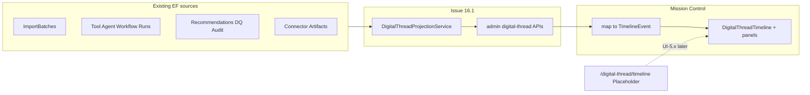

# Issue 16.1 — Digital Thread Projection + Mission Control Wire-Up

**Status: complete (2026-07-16).** Backend projection + Mission Control wire-up shipped. Full `/digital-thread/timeline` canvas remains deferred (UI-5.x / 16.1b).

## Scope decisions (locked)

- **In:** Backend projection service + 3 read APIs; frontend `etos-api` wrappers; Mission Control `/` timeline + widgets those APIs can feed; doc Issue 16.1 into main backlog.
- **Out (later UI-5.x / 16.1b):** Full `/digital-thread/timeline` canvas (zoom, minimap, lineage inspector), SSE/SignalR live stream, branch geometry, WebGL renderer. Route stays [`PlaceholderPage`](ETOS.Frontend/src/app/(shell)/digital-thread/timeline/page.tsx).

Route prefix follows existing admin convention: **`/api/admin/digital-thread/*`** (not bare `/api/digital-thread/*` from the mockup spec). Spec models still apply.



## Phase A — Backend (Issue 16.1 MVP) — done

Shipped under `ETOS.Backend/DigitalThread/`:

| File | Role |
|------|------|
| `DigitalThreadContracts.cs` | Permissions + DTOs |
| `DigitalThreadProjectionService.cs` | `IDigitalThreadProjectionService` + impl |
| `DigitalThreadEndpointExtensions.cs` | Minimal API group |

**Permissions:** `digital_thread.read`, `digital_thread.admin` — seeded in `DevelopmentIdentitySeeder`.

### Endpoints

```
GET /api/admin/digital-thread/summary?windowHours=24
GET /api/admin/digital-thread/systems
GET /api/admin/digital-thread/events?from=&to=&systemId=&limit=50
```

### Tests

`ETOS.Backend.Tests/DigitalThreadProjectionTests.cs` — tenant isolation, permission deny, windowed events ordering, summary counts, empty tenant zeros.

## Phase B — Frontend Mission Control wire-up — done

- `etos-api.ts`: `getDigitalThreadSummary` / `getDigitalThreadSystems` / `getDigitalThreadEvents`
- `lib/digital-thread-map.ts`: event → `TimelineEvent`, stream, heatmap grid helpers
- `(shell)/page.tsx`: real APIs for timeline, stream, KPIs, heatmap, top threads, alerts; Live + scrubber disabled; AI insights fixture only
- Docs: Issue 16.1 in engineering-execution-issues.md; ui-screen-api-map + gap analysis + UI guides updated

### Verify

```powershell
dotnet test EnterpriseThreadOS.sln --filter DigitalThread
Push-Location ETOS.Frontend; npm run typecheck; npm run lint; Pop-Location
```

## Explicitly deferred (call out in Issue 16.1 acceptance)

- `GET .../branches`, `.../lineage/{id}`, `.../events/{id}`, `.../minimap`
- `STREAM .../events/stream`
- UI-5.1–5.3 semantic zoom canvas on `/digital-thread/timeline`
