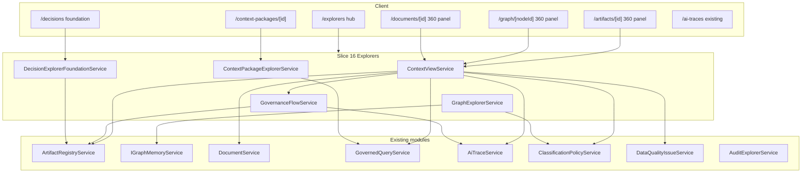

# Issue 16: Explorers and 360-Degree Context Views

## Prerequisite

Issue 15 must land first. Slices 4–14 already provide the data and APIs this slice composes:

| Capability | Existing module |
|------------|-----------------|
| Artifact list/detail/relationships/dependencies | [`ArtifactRegistryService`](ETOS.Backend/Artifacts/ArtifactRegistryService.cs) |
| Graph nodes/relationships (internal) | [`IGraphMemoryService`](ETOS.Backend/GraphMemory/IGraphMemoryService.cs) |
| Document list/detail/links | [`DocumentService`](ETOS.Backend/Documents/DocumentService.cs) |
| Context packages + retrieval runs | [`GovernedQueryService`](ETOS.Backend/GovernedQuery/GovernedQueryService.cs) |
| AI Trace list/detail/links | [`AiTraceService`](ETOS.Backend/AiTrace/AiTraceService.cs) |
| Audit/security explorer (admin) | [`AuditExplorerService`](ETOS.Backend/Governance/AuditRecorder.cs) |
| Data-quality issues linked to graph/docs | [`DataQualityIssueService`](ETOS.Backend/DataQuality/DataQualityIssueService.cs) |
| Policy/classification filtering | [`ClassificationPolicyService`](ETOS.Backend/Classification/ClassificationPolicyService.cs) |
| Governed chat + trace links | [`GovernedChatService`](ETOS.Backend/GovernedChat/GovernedChatService.cs) |

Issue 16 adds **read-only orchestration + UX shell**. It does not implement dashboard/report preview (Issue 17), full DecisionArtifact lifecycle (Milestone 4), or live graph write APIs.

## Scope

**In scope**
- New `Explorers` backend module (contracts, services, endpoints — **no new SQL tables** for MVP)
- Dedicated explorer APIs with tenant/permission/classification/trust fail-closed filtering
- Generic **360° Context View** for anchors:
  - `BaseArtifact` (all artifact types)
  - `DocumentArtifact`
  - `GraphNode` (trusted/staging nodes via governed graph read)
  - `ContextPackage` (runtime assembly record)
  - `AiTrace` (trace-as-anchor for navigation continuity)
- **Governance Flow View foundation**: relationship edges, dependency chains, trace links, audit link summaries, review-chain **placeholders** (Recommendation → ReviewTask → Decision → Outcome → Learning)
- **Decision Explorer foundation**: searchable list/filter over decision-shaped artifacts (`ArtifactType` in `decision`, `DecisionArtifact`) with payload-derived placeholder fields — not full Milestone 4 decision workflow
- Frontend explorer pages + shared panels; enhance home nav
- `ExplorersTests` covering acceptance criteria

**Out of scope (defer)**
- Issue 17 dashboard/report preview rendering and export
- Full RecommendationArtifact, ReviewTaskArtifact, DecisionArtifact workflow (Milestone 4)
- Governance Dashboard KPIs and trend analytics (later issue)
- Customizable 360° layouts per object type (metadata-driven tabs only, fixed default sections)
- Graph visualization library (Cytoscape/D3) — use list/card/chain UI for MVP
- Raw Neo4j/Cypher console or ungoverned graph APIs
- Neo4j Agent Memory
- One-time Governance Flow export (can reuse AI Trace export patterns later)

## User stories (PRD)

- **50** — 360° context view for artifacts and enterprise objects
- **51** — Basic explorers for artifacts, graph nodes, documents, AI traces, context packages
- **57** — Dependency graphs for artifacts (surface existing impact/dependency APIs in explorer UX)
- **83** — Decision Explorer foundation (search/filter placeholder until Milestone 4)

## Architecture



## Backend design

### New module: `ETOS.Backend/Explorers/`

Mirror Issue 14/15 layout:

| File | Purpose |
|------|---------|
| `ExplorerContracts.cs` | Permissions, anchor enums, request/response DTOs |
| `ContextViewService.cs` | Build 360° view for supported anchors |
| `GovernanceFlowService.cs` | Project governance flow nodes/edges + placeholders |
| `GraphExplorerService.cs` | Tenant-scoped graph browse/detail with trust/policy filtering |
| `ContextPackageExplorerService.cs` | List/detail context packages via governed query |
| `DecisionExplorerFoundationService.cs` | Filter/search decision-shaped artifacts |
| `ExplorerEndpointExtensions.cs` | Minimal API routes under `/api/admin/explorers` |
| `ExplorerPolicyFilter.cs` | Shared helper: map records → policy evaluation items → allowed/denied summaries |

### Permissions (`ExplorerContracts.cs`)

```csharp
public static class ExplorerPermissions
{
    public const string Read = "explorers.read";
    public const string ContextView = "context_view.read";
    public const string GovernanceFlow = "governance_flow.read";
    public const string GraphExplorer = "graph.explorer.read";
    public const string Admin = "explorers.admin";
}
```

**Section visibility rule:** `ContextViewService` requires `context_view.read`. Each section additionally requires the owning domain permission (`artifacts.read`, `documents.read`, `governed_query.read`, `ai_trace.read`, `data_quality.read`, `governance.audit` for audit section). Missing permission → section omitted with `visibility: "denied"` summary, not 403 for whole view (fail closed per section, not leak cross-domain data).

### Anchor model

```csharp
public enum ContextViewAnchorKind
{
    Artifact,
    Document,
    GraphNode,
    ContextPackage,
    AiTrace
}
```

### 360° Context View response shape

Single DTO returned by `GET /api/admin/explorers/context-view`:

```csharp
public sealed record ContextView360Response(
    ContextViewAnchorKind AnchorKind,
    string AnchorId,
    string Title,
    string SafeSummary,
    IReadOnlyCollection<ContextViewSectionResponse> Sections,
    GovernanceFlowResponse? GovernanceFlow,
    ContextViewFilterSummaryResponse FilterSummary);
```

**Default sections** (PRD-confirmed tabs + dynamic relationship groups):

| Section key | Source | Notes |
|-------------|--------|-------|
| `overview` | Anchor record | Type, trust/readiness/lifecycle, owner, timestamps |
| `relationships` | Artifact relationships + document-object links + graph adjacency | Dynamic groups by `RelationshipType` |
| `evidence` | Document links, import file evidence refs, DQ issue source links | Policy-filtered safe summaries |
| `ai-trace` | `AiTraceArtifactLink` + traces by retrieval run / chat turn | Links only; detail via `/ai-traces` |
| `audit` | Audit records where `SourceObjectType`/`SourceObjectId` match anchor | Admin permission; safe summaries |
| `versions` | Artifact versions or document versions | Immutable version list |
| `dependencies` | `ArtifactDependency` + `GetImpactAsync` projection | For artifact anchors |
| `issues` | Data-quality issues by graph node / document / generic source id | Read via `data_quality.read` |
| `context-packages` | Retrieval runs referencing anchor graph node or document | `governed_query.read` |

For **graph node anchors**, reuse governed retrieval instead of duplicating traversal logic:

1. Call `GovernedQueryService.RunAsync` with `IntentKey = object-360-context`, `StartGraphNodeId = anchor`, `CreateAiTrace = false`, bounded `MaxDepth`.
2. Map `ContextPackage` into `evidence`, `relationships`, and `context-packages` sections.
3. Attach existing trace if user has `ai_trace.read` (lookup by retrieval run).

For **context package anchors**, hydrate from `GetContextPackageAsync` + parent retrieval run + optional trace.

### Governance Flow View foundation

`GET /api/admin/explorers/governance-flow?anchorKind=&anchorId=`

Returns a **node/edge graph** (not a visual widget — JSON for UI):

```csharp
public sealed record GovernanceFlowResponse(
    IReadOnlyCollection<GovernanceFlowNodeResponse> Nodes,
    IReadOnlyCollection<GovernanceFlowEdgeResponse> Edges,
    IReadOnlyCollection<GovernanceFlowPlaceholderResponse> FutureChainPlaceholders);

public enum GovernanceFlowNodeKind
{
    Anchor,
    Artifact,
    ArtifactVersion,
    Document,
    GraphNode,
    AiTrace,
    AuditRecord,
    Dependency,
    PlaceholderReviewChain
}
```

**MVP nodes/edges (implemented):**
- Artifact ↔ artifact relationships (both directions, deduped)
- Version dependency chains (`ArtifactDependency`, impact reverse edges)
- AI Trace links from `AiTraceArtifactLink`
- Audit record links (when permitted)
- Document / graph evidence links from 360 evidence section

**MVP placeholders (explicit, not faked as real records):**
- `Recommendation`, `ReviewTask`, `Decision`, `OutcomeCheck`, `LearningSignal` node kinds with `status: "not_implemented"` and PRD reference — satisfies “review chain placeholders” without Milestone 4 entities

### Graph Explorer

New governed read surface — **do not** expose raw `ListGraphAsync` without filtering.

Endpoints:
- `GET /api/admin/explorers/graph/nodes?graphSpace=&trustState=&objectType=&limit=`
- `GET /api/admin/explorers/graph/nodes/{nodeId}`
- `GET /api/admin/explorers/graph/nodes/{nodeId}/relationships?direction=`

Implementation:
- Wrap `IGraphMemoryService.ListGraphAsync` / `TraverseAsync` with tenant context + `graph.explorer.read`
- Filter nodes below `RequiredTrustState` from active retrieval strategy defaults (default: `Trusted` for production space, allow `Staging` when `graphSpace=staging`)
- Emit **safe summaries** only (object type, trust state, source batch id, allowed attribute keys) — run policy evaluation on attribute-derived classification keys like governed query does
- Link each node to 360 view and chat (`object-360-context`)

### Context Package Explorer

Thin wrapper over existing governed query APIs with explorer DTOs:
- `GET /api/admin/explorers/context-packages` — paginated list from `ListRunsAsync` including package id, intent, counts, safe summary
- `GET /api/admin/explorers/context-packages/{packageId}` — `GetContextPackageAsync` + denied summary counts + trace link

Requires `explorers.read` + `governed_query.read`.

### Decision Explorer foundation

No new tables. Query `Artifacts` where `ArtifactType` normalized in (`decision`, `decision-artifact`).

Endpoints:
- `GET /api/admin/explorers/decisions?status=&participant=&search=`

Response fields (from latest version `PayloadJson` when present, else placeholders):
- `title`, `status`, `participantUserIds[]`, `evidenceCount`, `conflictState`, `outcomeSummary`
- Empty list OK in dev until Milestone 4 seeds real decision artifacts

Optional dev seed: one sample `DecisionArtifact` draft in `DevelopmentIdentitySeeder` or dedicated `ExplorerSampleSeeder` — **only if** tests need stable data.

### Artifact / Document explorers

Backend: mostly **reuse existing list/detail endpoints**; Issue 16 adds:
- `GET /api/admin/explorers/artifacts` — alias/summary wrapper if needed for consistent explorer pagination/filter (`artifactType`, `lifecycleState`, `search`)
- Navigation targets for 360 view

Frontend moves artifact lists from home-only embed to dedicated `/artifacts` explorer with drill-down.

**AI Trace Explorer:** already shipped (`/ai-traces`). Issue 16 adds hub link + cross-links from 360/trace sections only.

## API summary

| Method | Route | Permission | Purpose |
|--------|-------|------------|---------|
| GET | `/api/admin/explorers/context-view` | `context_view.read` | 360° view for anchor query params |
| GET | `/api/admin/explorers/governance-flow` | `governance_flow.read` | Flow graph for anchor |
| GET | `/api/admin/explorers/graph/nodes` | `graph.explorer.read` | Filtered graph node list |
| GET | `/api/admin/explorers/graph/nodes/{nodeId}` | `graph.explorer.read` | Node detail |
| GET | `/api/admin/explorers/graph/nodes/{nodeId}/relationships` | `graph.explorer.read` | Adjacency |
| GET | `/api/admin/explorers/context-packages` | `explorers.read`, `governed_query.read` | Package list |
| GET | `/api/admin/explorers/context-packages/{id}` | `explorers.read`, `governed_query.read` | Package detail |
| GET | `/api/admin/explorers/decisions` | `explorers.read` | Decision foundation list |
| GET | `/api/admin/explorers/artifacts` | `explorers.read`, `artifacts.read` | Artifact explorer list |

Query params for context view: `anchorKind`, `anchorId`, optional `policyKey`.

Register in [`Program.cs`](ETOS.Backend/Program.cs): `.MapEnterpriseThreadExplorerEndpoints()`.

## Frontend design

Follow Issue 14/15 patterns in [`ETOS.Frontend/src/lib/etos-api.ts`](ETOS.Frontend/src/lib/etos-api.ts) and page shells.

### New routes

| Route | Purpose |
|-------|---------|
| `/explorers` | Hub with cards linking to each explorer |
| `/artifacts` | Artifact list + link to detail |
| `/artifacts/[artifactId]` | Artifact detail + embedded `ContextView360` |
| `/graph` | Graph node list (graph space + trust filters) |
| `/graph/[nodeId]` | Node detail + `ContextView360` |
| `/documents/[documentId]` | Document detail + `ContextView360` (list stays on `/documents`) |
| `/context-packages` | Retrieval run / context package list |
| `/context-packages/[packageId]` | Package detail + trace link |
| `/decisions` | Decision foundation list (may be empty) |

Enhance [`ETOS.Frontend/src/app/page.tsx`](ETOS.Frontend/src/app/page.tsx) nav links; keep home artifact/governance embeds or slim them with “Open explorer →” links to avoid duplication.

### Shared components (under `ETOS.Frontend/src/components/explorers/`)

- `ContextView360.tsx` — tab/section renderer from `ContextView360Response`
- `GovernanceFlowPanel.tsx` — vertical/horizontal step list from flow nodes/edges + placeholder badges
- `ExplorerListShell.tsx` — reuse list/error/empty patterns from existing pages
- `SectionVisibilityBadge.tsx` — shows when section denied by permission/policy

Cross-links:
- 360 AI Trace section → `/ai-traces/[traceId]`
- Graph node → `/graph/[nodeId]`
- Artifact → `/artifacts/[id]`
- Chat prefill → `/chat?startGraphNodeId=` / `documentArtifactId=` (optional query params on existing chat page)

## Tests (`ETOS.Backend.Tests/ExplorersTests.cs`)

Use WebApplicationFactory pattern from [`GovernedChatTests.cs`](ETOS.Backend.Tests/GovernedChatTests.cs) / [`GovernedQueryTests.cs`](ETOS.Backend.Tests/GovernedQueryTests.cs).

| Test | Asserts |
|------|---------|
| `ContextView_artifact_returns_expected_sections` | Overview, relationships, versions, dependencies populated for seeded artifact |
| `ContextView_omits_sections_without_domain_permission` | User without `ai_trace.read` gets no trace section payloads |
| `ContextView_graph_node_uses_governed_query_context` | Node anchor includes governed context items, not raw denied fields |
| `ContextView_enforces_tenant_isolation` | Cross-tenant anchor → 403 |
| `GraphExplorer_filters_untrusted_nodes_by_default` | Staging/untrusted nodes excluded unless requested |
| `GraphExplorer_policy_denies_restricted_summaries` | Restricted classification → denied summary, not raw attribute |
| `GovernanceFlow_includes_dependencies_and_trace_links` | Edges for dependency + AiTraceArtifactLink |
| `GovernanceFlow_includes_review_chain_placeholders` | Placeholder nodes present, marked not implemented |
| `ContextPackageExplorer_lists_runs_with_package_ids` | List matches governed query runs |
| `DecisionExplorer_returns_decision_artifact_types_only` | Filters artifact types |
| `Dependency_projection_matches_registry_impact` | 360 dependencies consistent with `GetImpactAsync` |

## Implementation order

1. **Contracts + permissions** — enums, DTOs, `ExplorerPermissions`, seeder
2. **ExplorerPolicyFilter** — shared classification/trust filtering helper
3. **GovernanceFlowService** — smallest isolated unit, testable without UI
4. **ContextViewService** — artifact anchor first, then document, graph node (governed query), context package, ai trace
5. **GraphExplorerService** + **ContextPackageExplorerService** + **DecisionExplorerFoundationService**
6. **Endpoints + platform registration**
7. **ExplorersTests** (write alongside services; complete before frontend)
8. **Frontend hub + artifact/graph/context-package pages + shared 360/flow components**
9. **ARCHITECTURE.md + verification + graphify update**

## Verification

```powershell
dotnet test EnterpriseThreadOS.sln --filter "FullyQualifiedName~ExplorersTests"
```

```powershell
Push-Location ETOS.Frontend
npm run typecheck
npm run lint
Pop-Location
```

Manual smoke:
1. Open `/explorers` hub
2. Drill artifact → 360 view shows relationships, dependencies, versions
3. Open graph node → 360 shows governed context evidence (not empty if import staging exists)
4. Open context package → see retrieved/filtered/denied counts + trace link
5. Governance flow panel shows dependency + trace edges and future-chain placeholders
6. User missing `ai_trace.read` → trace section hidden/denied without leaking trace payload

## Architecture doc updates

Update [`ARCHITECTURE.md`](ARCHITECTURE.md):
- Add `ETOS.Backend/Explorers/` to implemented components
- Move “explorers/360° context view (Issue 16)” from planned → implemented
- Note Decision Explorer and Governance Flow are **foundation** only until Milestone 4

## Risk notes

| Risk | Mitigation |
|------|------------|
| 360 view becomes a god-service | Keep section builders as private methods or small nested builder types; no write paths |
| Graph explorer leaks staging data | Default `graphSpace=Production`, trust filter, policy on summaries |
| Duplicating governed query logic | Graph node 360 **must** call `GovernedQueryService`, not reimplement retrieval |
| EF translation errors on complex joins | Order/filter on entities before projecting to DTOs (see ef-core-query-projection-ordering rule) |
| Frontend scope creep | List + detail + 360 tabs only; no graph canvas in this slice |
