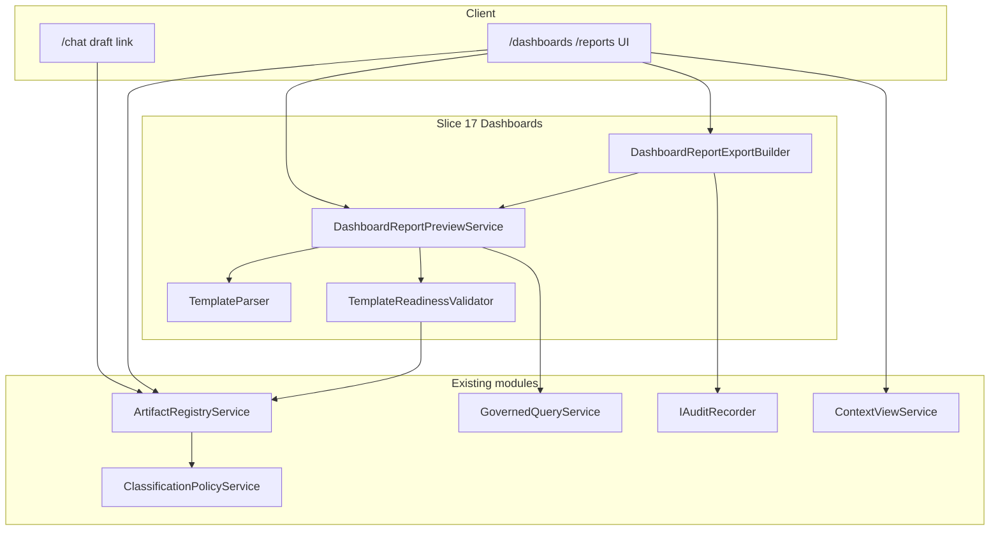
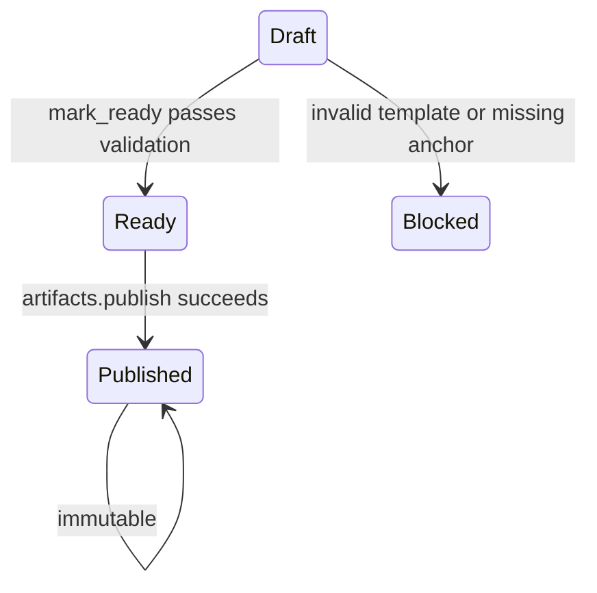

# Issue 17: Dashboard and Report Generation

## Prerequisite

Issue 16 is done. Issue 17 builds on existing slices:

| Capability | Existing module |
|------------|-----------------|
| Chat draft `DashboardVersion` / `ReportVersion` artifacts | [`ChatArtifactDraftBuilder`](ETOS.Backend/GovernedChat/ChatArtifactDraftBuilder.cs) |
| Draft output schemas (`widgets`, `sections`, `queryIntentRef`) | [`GovernedChatArtifactSeeder`](ETOS.Backend/GovernedChat/GovernedChatArtifactSeeder.cs) |
| Publish/readiness/dependency/impact | [`ArtifactRegistryService`](ETOS.Backend/Artifacts/ArtifactRegistryService.cs) |
| Governed data for preview | [`GovernedQueryService`](ETOS.Backend/GovernedQuery/GovernedQueryService.cs) |
| Export + redaction + audit pattern | [`AiTraceService`](ETOS.Backend/AiTrace/AiTraceService.cs), [`AiTraceExportBuilder`](ETOS.Backend/AiTrace/AiTraceExportBuilder.cs) |
| Artifact list by type, 360° context | [`ArtifactExplorerService`](ETOS.Backend/Explorers/GraphExplorerService.cs), [`ContextViewService`](ETOS.Backend/Explorers/ContextViewService.cs) |

Issue 15 created drafts; Issue 17 adds **preview, export, readiness workflow, KPI placeholder catalog, and UI** — not duplicate chat drafting.

## Scope

**In scope**
- New `Dashboards` backend module (contracts, template parser, preview service, export builder, endpoints)
- Richer dashboard/report template JSON (widget/section kinds, anchors, KPI refs)
- Preview rendering **only** through `IGovernedQueryService.RunAsync` (`CreateAiTrace = false`) — no raw graph/DB access
- Artifact readiness transition `Draft → Ready` with dashboard/report-specific validation (gap from Issue 15)
- Reuse existing `PublishVersionAsync` for immutable published versions + dependency blocking
- Simple JSON export with permission checks, redaction metadata, audit + export record
- Platform-defined **governance KPI placeholder catalog** (metadata only; no live counts — defer calculation to Issue 21)
- Custom KPI **future placeholder** entry in catalog (`source: tenant_custom_deferred`)
- Frontend `/dashboards` and `/reports` pages with preview, readiness, publish, export, links to explorers/360° view
- `DashboardReportTests` covering acceptance criteria
- Small enhancements to chat draft payload (embed session anchor) and deterministic LLM widget shape

**Out of scope (defer)**
- Issue 21 Governance Dashboard, live KPI formulas, trend charts, Recharts/Tremor
- Tenant-defined / chat-draft `QueryIntentVersion` execution (Issue 13 placeholder remains)
- PDF/Excel export, scheduled refresh, dashboard agents
- New artifact tables — templates stay in `ArtifactVersion.PayloadJson`
- Neo4j/Cypher from templates; staging graph queries for normal dashboards

## User stories (PRD)

- **53–54** — chat drafts already saved; Issue 17 makes templates **inspectable, previewable, versioned lifecycle complete**
- **55–56** — readiness transition + existing publish governance
- **57** — dependency/impact surfaced on dashboard/report detail (reuse `GetImpactAsync`)
- **84–86** — KPI **placeholder catalog** only (not Issue 21 analytics)

## Architecture



Preview path: load version → parse template → for each `governed_query` widget/section run fixed platform intent → return safe summaries + denied counts only.

## Template contract (payload JSON)

Extend seeded schemas in [`GovernedChatArtifactSeeder`](ETOS.Backend/GovernedChat/GovernedChatArtifactSeeder.cs) and validate in parser:

```json
{
  "name": "Assembly overview",
  "summary": "...",
  "createdFromChat": true,
  "defaultAnchor": {
    "startGraphNodeId": "guid-or-null",
    "documentArtifactId": "guid-or-null"
  },
  "widgets": [
    {
      "widgetId": "primary-context",
      "title": "Trusted context",
      "kind": "governed_query",
      "queryIntentRef": "object-360-context",
      "visualization": "summary_list"
    },
    {
      "widgetId": "open-reviews-kpi",
      "title": "Open Reviews",
      "kind": "governance_kpi_placeholder",
      "kpiKey": "open_reviews"
    }
  ]
}
```

Report `sections[]` mirror widgets (`sectionId`, same `kind` values).

**Allowed `queryIntentRef` values (MVP):** platform-fixed keys only — `object-360-context`, `bom-impact-context`, `document-evidence-context` from [`GovernedQueryService`](ETOS.Backend/GovernedQuery/GovernedQueryService.cs). Reject tenant/chat-draft intent keys at preview/readiness time.

**Widget kinds:**
- `governed_query` — runs governed query, returns `ContextPackage` safe summaries
- `governance_kpi_placeholder` — returns catalog metadata + `status: deferred` (no fabricated counts)
- `static_text` — template summary/name only (optional, for report headers)

Update [`DeterministicLlmCompletionService`](ETOS.Backend/GovernedChat/Llm/DeterministicLlmCompletionService.cs) to emit `kind`, `visualization`, and `defaultAnchor` when drafting.

Enhance [`ChatArtifactDraftBuilder.EnrichDraftPayload`](ETOS.Backend/GovernedChat/ChatArtifactDraftBuilder.cs) to inject `defaultAnchor` from chat session `StartGraphNodeId` / turn context.

## Governance KPI placeholder catalog

Static platform catalog in `DashboardReportContracts.cs` (no SQL table):

| kpiKey | title | notes |
|--------|-------|-------|
| `open_reviews` | Open Reviews | Milestone 4 |
| `pending_decisions` | Pending Decisions | Milestone 4 |
| `blocked_decisions` | Blocked Decisions | Milestone 4 |
| `escalations` | Escalations | Milestone 4 |
| `decision_throughput` | Decision Throughput | Milestone 4 |
| `outcome_verification_rate` | Outcome Verification Rate | Milestone 4 |
| `learning_signal_rate` | Learning Signal Rate | Milestone 4 |
| `high_risk_recommendations` | High-Risk Recommendations | Milestone 4 |
| `tenant_custom_kpi` | Custom KPI (future) | Placeholder only |

`GET /api/admin/dashboards/kpi-placeholders` returns catalog. Preview embeds matching placeholder blocks when templates reference `kpiKey`.

## Backend module: `ETOS.Backend/Dashboards/`

| File | Responsibility |
|------|----------------|
| `DashboardReportContracts.cs` | DTOs, permissions, KPI catalog, preview/export requests/responses |
| `DashboardReportTemplateParser.cs` | Parse/validate `PayloadJson` for DashboardVersion/ReportVersion |
| `DashboardReportPreviewService.cs` | Orchestrate governed query runs per widget/section |
| `DashboardReportReadinessValidator.cs` | Template + anchor + intent validation before Ready |
| `DashboardReportExportBuilder.cs` | JSON bundle: template + preview snapshot + redaction metadata + hash |
| `DashboardReportEndpointExtensions.cs` | Minimal API routes |
| `DashboardReportModels.cs` | Optional `DashboardReportExportRecord` (mirror AI Trace export audit) |

### Permissions

```csharp
public static class DashboardReportPermissions
{
    public const string Preview = "dashboards_reports.preview";
    public const string Export = "dashboards_reports.export";
    public const string Readiness = "dashboards_reports.readiness";
    public const string Admin = "dashboards_reports.admin";
}
```

Seed in [`DevelopmentIdentitySeeder.cs`](ETOS.Backend/Identity/DevelopmentIdentitySeeder.cs). Admin gets all; standard user gets preview; export separate (mirror [`AiTracePermissions`](ETOS.Backend/AiTrace/AiTraceContracts.cs)).

### API endpoints

| Method | Route | Permission | Notes |
|--------|-------|------------|-------|
| GET | `/api/admin/dashboards/kpi-placeholders` | `preview` | Static catalog |
| GET | `/api/admin/dashboards/artifacts` | `preview` + `artifacts.read` | Filter `DashboardVersion` (tenant-scoped) |
| GET | `/api/admin/reports/artifacts` | `preview` + `artifacts.read` | Filter `ReportVersion` |
| GET | `/api/admin/dashboards/{artifactId}/versions/{versionId}/template` | `preview` | Parsed template DTO |
| GET | `/api/admin/reports/{artifactId}/versions/{versionId}/template` | `preview` | Same for reports |
| POST | `/api/admin/dashboards/{artifactId}/versions/{versionId}/preview` | `preview` | Body: optional anchor overrides, `policyKey` |
| POST | `/api/admin/reports/{artifactId}/versions/{versionId}/preview` | `preview` | Same |
| POST | `/api/admin/dashboards/{artifactId}/versions/{versionId}/export` | `export` | Returns JSON file + audit |
| POST | `/api/admin/reports/{artifactId}/versions/{versionId}/export` | `export` | Same |
| POST | `/api/admin/dashboards/{artifactId}/versions/{versionId}/mark-ready` | `readiness` | Validates template → sets `Ready` |
| POST | `/api/admin/reports/{artifactId}/versions/{versionId}/mark-ready` | `readiness` | Same |

Publish stays on existing artifact route: `POST /api/admin/artifacts/{id}/versions/{vid}/publish` (`artifacts.publish`).

Readiness/impact/readiness-get reuse artifact registry internally — do not duplicate publish logic.

### Readiness workflow



`mark-ready` steps:
1. Owner or artifact admin
2. `TemplateReadinessValidator`: schema, allowed intents, anchor present for object/bom intents
3. `classificationPolicyService.EvaluateArtifactPolicyRiskAsync`
4. Set `ReadinessState = Ready` (or `RequiresApproval` if policy risk demands — reuse existing enum)
5. Audit success

Existing [`CalculateReadinessAsync`](ETOS.Backend/Artifacts/ArtifactRegistryService.cs) then allows publish when dependencies published.

### Preview response shape (sketch)

```csharp
public sealed record DashboardReportPreviewResponse(
    Guid ArtifactId,
    Guid VersionId,
    string ArtifactType,
    string VersionLabel,
    IReadOnlyCollection<PreviewBlockResponse> Blocks,
    PreviewFilterSummaryResponse FilterSummary);

public sealed record PreviewBlockResponse(
    string BlockId,
    string Title,
    string Kind,
    string SafeSummary,
    int AllowedCount,
    int DeniedCount,
    string? QueryIntentRef,
    string? KpiKey,
    string Status);
```

No raw node payloads, no denied sensitive references unless export permission allows (same pattern as AI Trace).

### Export

Follow [`AiTraceService.ExportTraceAsync`](ETOS.Backend/AiTrace/AiTraceService.cs):
- Separate export permission; denial → audit + security event
- Build JSON via `DashboardReportExportBuilder` (template + preview + redaction metadata + SHA-256 hash)
- Persist `DashboardReportExportRecord` (new EF entity + migration `Slice17DashboardReportExport`)
- `AuditResult.Export` with retention category Export

### Registration

- Register services in [`EnterpriseThreadPlatform.cs`](ETOS.Backend/Platform/EnterpriseThreadPlatform.cs)
- Map endpoints in [`Program.cs`](ETOS.Backend/Program.cs)

## Frontend

Follow patterns from [`ai-traces/page.tsx`](ETOS.Frontend/src/app/ai-traces/page.tsx) and explorers pages:

- Types + helpers in [`etos-api.ts`](ETOS.Frontend/src/lib/etos-api.ts)
- [`ETOS.Frontend/src/app/dashboards/page.tsx`](ETOS.Frontend/src/app/dashboards/page.tsx) — list via explorer API `artifactType=DashboardVersion` or new list endpoint
- [`ETOS.Frontend/src/app/dashboards/[artifactId]/page.tsx`](ETOS.Frontend/src/app/dashboards/[artifactId]/page.tsx):
  - Version selector, template summary, readiness panel (blocking reasons from artifact API)
  - Preview panel (POST preview; show blocks as cards/list — no chart lib required)
  - Actions: Mark ready, Publish (artifact API), Export
  - Links: `/artifacts/{id}` explorer, 360° context view component reuse from Issue 16
- Mirror under `/reports/` for `ReportVersion`
- Update [`chat/page.tsx`](ETOS.Frontend/src/app/chat/page.tsx): link draft artifact to dashboard/report detail page
- Home + explorers hub nav entries

Client components only where forms/actions needed.

## Tests: `ETOS.Backend.Tests/DashboardReportTests.cs`

| Test | Validates |
|------|-----------|
| Chat-created dashboard template parses and previews via governed query | Template persistence + preview |
| Preview excludes denied context from block summaries | Preview filtering |
| Preview rejects unsupported `queryIntentRef` | Governance |
| User without `export` permission denied on export | Export permission |
| Export writes audit record + redaction metadata | Export audit |
| `mark-ready` fails for draft missing anchor on object-360 widget | Readiness validation |
| `mark-ready` succeeds → publish succeeds when deps published | Publish governance |
| Publish blocked while still `Draft` | Readiness states |
| Dependency impact reflects unpublished output schema | Dependency impact |
| KPI placeholder block returns catalog metadata, not numeric KPI | KPI placeholders |
| Cross-tenant preview denied | Tenant isolation |

Reuse harness from [`GovernedChatTests`](ETOS.Backend.Tests/GovernedChatTests.cs) + [`ExplorersTests`](ETOS.Backend.Tests/ExplorersTests.cs).

## Docs (minimal)

Update [`ARCHITECTURE.md`](ARCHITECTURE.md): Dashboard and Report module, preview-via-governed-query rule, KPI placeholders vs Issue 21 analytics.

## Verification

```powershell
dotnet test ETOS.Backend.Tests/ETOS.Backend.Tests.csproj --filter DashboardReport
dotnet test EnterpriseThreadOS.sln
```

```powershell
Push-Location ETOS.Frontend
npm run typecheck
npm run lint
Pop-Location
```

Post-code: `graphify update .`

## Implementation order

1. Template contract + parser + KPI catalog + seeder/LLM/draft-builder tweaks
2. `DashboardReportPreviewService` + readiness validator
3. Export builder + export record migration
4. Endpoints + permissions + platform registration
5. Backend tests
6. Frontend pages + API helpers + nav/chat links
7. ARCHITECTURE.md + graphify update

## Key conventions to reuse

- Permission gate + denial audit from [`GovernedQueryService`](ETOS.Backend/GovernedQuery/GovernedQueryService.cs)
- Artifact version load via tenant-scoped EF queries (no new registry duplication)
- Export/redaction from AI Trace slice
- Explorer/context view linking from Issue 16 — do not rebuild 360° aggregation

## Risk guardrails

- Preview must never call `IGraphMemoryService` directly — only `IGovernedQueryService`
- KPI placeholders must not invent metrics; `status: deferred` until Issue 21
- Do not enable chat-draft query intents for execution
- Published version payloads remain immutable via existing artifact registry behavior
