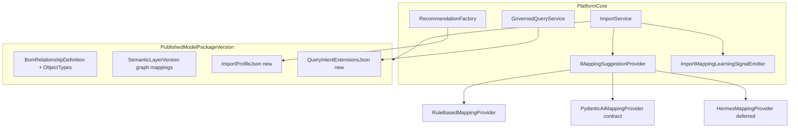

# Issue 18.1: Industry-Neutral Ontology and Import Cleanup

## Scope and prerequisites

- **Source of intent:** [`.docs/.prd/engineering-execution-issues.md`](.docs/.prd/engineering-execution-issues.md) (Issue 18.1), PRD Milestone 4.5 in [`.docs/.prd/engineering-execution-prd.md`](.docs/.prd/engineering-execution-prd.md) (lines 772–792, 499–511)
- **Blocked by:** Issue 18 (complete ~90% per [`.docs/.gapAnalysis/issues-1-18.5-22-23-gap-analysis.md`](.docs/.gapAnalysis/issues-1-18.5-22-23-gap-analysis.md))
- **Unlocks:** Issue 18.2 (Capability Definition Artifacts)
- **Explicitly deferred to 18.5:** standalone manufacturing reference package project and package architecture docs

## Problem summary

Platform core still hardcodes manufacturing semantics in several hot paths while ontology/model-package infrastructure already exists (`BomRelationshipDefinition`, `SemanticLayerVersion`, published `ModelPackageVersion`).

Primary offenders:

| Module | Hardcoded behavior |
|--------|-------------------|
| [`ETOS.Backend/Imports/ImportService.cs`](ETOS.Backend/Imports/ImportService.cs) | BOM staging uses `"part"`, `"partNumber"`, `"BOM_CONTAINS"`; `TryResolveBomHeaders` / `BuildBomComparison` use CAD/EBOM column heuristics; inline `BuildColumnSuggestions` / `BuildLifecycleSuggestions` |
| [`ETOS.Backend/GovernedQuery/GovernedQueryService.cs`](ETOS.Backend/GovernedQuery/GovernedQueryService.cs) | `bom-impact-context` fixed intent with manufacturing relationship types |
| [`ETOS.Backend/Recommendations/RecommendationFactory.cs`](ETOS.Backend/Recommendations/RecommendationFactory.cs) | CAD/EBOM/manufacturing copy in titles, summaries, suggested actions |
| Learning signals | `ImportMappingState.Rejected` exists but no reject endpoint; no mapping learning-signal persistence |

Flat-row staging path is already ontology-driven (uses approved mapping + `LoadModelContextAsync`); BOM shortcut path is not.

## Target architecture



**Design principle:** platform core reads generic contracts; manufacturing demo values live in package JSON + ontology definitions (shared test/dev fixture now, extracted package in 18.5).

## Phase 0 — Shared manufacturing fixture (baseline)

Create a single reusable fixture used by import/ontology/governed-query/recommendation tests (replacing duplicated inline setup in [`ETOS.Backend.Tests/OntologyTests.cs`](ETOS.Backend.Tests/OntologyTests.cs) and [`ETOS.Backend.Tests/ImportTests.cs`](ETOS.Backend.Tests/ImportTests.cs)):

- Publishes `canonical-manufacturing` ontology with existing `part`, `contains` BOM rel, lifecycle, attributes
- Includes forthcoming `ImportProfileJson` and `QueryIntentExtensionsJson` that encode **today's** CAD/EBOM demo behavior
- Optional dev seed helper under [`ETOS.Backend/Platform/Development/`](ETOS.Backend/Platform/Development/) for local demo parity

**Gate:** all existing import/BOM tests pass unchanged before core refactor.

## Phase 1 — Model package metadata + resolver

**Schema (EF migration):** add nullable JSON columns on [`ModelPackageVersion`](ETOS.Backend/Ontology/OntologyModels.cs):

- `ImportProfileJson` — structural import detection, column synonym maps, comparison side labels/aliases, optional display templates for recommendations
- `QueryIntentExtensionsJson` — per-intent relationship type lists and labels (e.g. BOM impact)

**New types** (under `ETOS.Backend/Imports/` or `ETOS.Backend/Ontology/`):

- `ModelPackageImportProfile` — deserialized profile with validated shape
- `ModelPackageQueryIntentExtensions`
- `IModelPackageContextResolver` — loads published package parts + parses profiles; exposes BOM relationship defs, semantic graph type mappings, import/comparison config

**API:** extend [`CreateModelPackageVersionRequest`](ETOS.Backend/Ontology/OntologyContracts.cs), validators in [`OntologyService`](ETOS.Backend/Ontology/OntologyService.cs), and response DTOs.

**Wire:** expand `ImportModelContext` in [`ImportModels.cs`](ETOS.Backend/Imports/ImportModels.cs) and [`LoadModelContextAsync`](ETOS.Backend/Imports/ImportService.cs) to include resolver output.

## Phase 2 — `IMappingSuggestionProvider`

New module `ETOS.Backend/Imports/MappingSuggestions/`:

```csharp
public interface IMappingSuggestionProvider
{
    string ProviderKey { get; }
    Task<ImportMappingSuggestionResult> SuggestAsync(
        ImportMappingSuggestionRequest request,
        CancellationToken cancellationToken);
}
```

| Provider | MVP behavior |
|----------|--------------|
| `RuleBasedMappingProvider` | Move existing `BuildColumnSuggestions` / `BuildLifecycleSuggestions` logic; match only against ontology attribute schema + object types |
| `PydanticAiMappingProvider` | Contract + DI registration; returns structured "disabled/unconfigured" unless feature flag set (no fake agent run) |
| `HermesMappingProvider` | Deferred contract only; not registered in default pipeline |

**Changes in [`ImportService`](ETOS.Backend/Imports/ImportService.cs):**

- Replace `SuggestionProvider = "deterministic-heuristic-v1"` constant with provider-selected key
- `PreviewMappingAsync` delegates to selector (default: rule-based)
- `CreateMappingVersionAsync` persists actual provider key on [`ImportMappingVersion.SuggestionProvider`](ETOS.Backend/Imports/ImportModels.cs)

**DI:** register in [`EnterpriseThreadPlatform.cs`](ETOS.Backend/Platform/EnterpriseThreadPlatform.cs).

## Phase 3 — Ontology-driven staging and BOM comparison

Refactor [`StageBatchAsync`](ETOS.Backend/Imports/ImportService.cs) BOM branch:

1. Resolve structural import profile from active package (`ImportProfileJson` + first/default `BomRelationshipDefinition`)
2. Detect parent/child columns via configured synonyms (not inline `FindHeader` lists)
3. Create nodes using `ParentObjectType` / `ChildObjectType` and identity fields from ontology/attribute schema
4. Create relationships using ontology relationship type resolved through semantic layer graph mapping
5. Map relationship attributes via `QuantityAttributeKey`, `UnitAttributeKey`, `FindNumberAttributeKey`, `ReferenceDesignatorAttributeKey`

Refactor `BuildBomComparison`:

- Side labels and header synonyms from `ImportProfileJson`
- Generic two-side comparison engine; neutral audit messages

**Remove** hardcoded `"part"`, `"BOM_CONTAINS"`, CAD/EBOM literals from platform core.

## Phase 4 — Governed query intent cleanup

In [`GovernedQueryService`](ETOS.Backend/GovernedQuery/GovernedQueryService.cs):

- Keep neutral platform intents: `object-360-context`, `document-evidence-context`
- For structural/BOM impact intent: load relationship types from `QueryIntentExtensionsJson` on the active model package instead of hardcoded `["BOM_CHILD", "BOM_PARENT", ...]`
- **Backward compatibility:** retain intent key `bom-impact-context` (referenced in [`ETOS.Frontend/src/app/chat/page.tsx`](ETOS.Frontend/src/app/chat/page.tsx) and [`ETOS.Frontend/src/lib/etos-api.ts`](ETOS.Frontend/src/lib/etos-api.ts)); only relationship types and summaries become package-driven

## Phase 5 — Recommendation factory neutralization

Update [`RecommendationFactory`](ETOS.Backend/Recommendations/RecommendationFactory.cs) and [`RecommendationEvidenceResolver`](ETOS.Backend/Recommendations/RecommendationEvidenceResolver.cs):

- Replace CAD/EBOM/manufacturing strings with neutral defaults or package-provided templates from `ImportProfileJson`
- Keep internal source keys (`bom:`, `BOM_SYNC`) unchanged
- Generalize suggested action codes/labels (e.g. `REVIEW_STRUCTURAL_DRIFT`) while preserving behavior

## Phase 6 — Mapping learning-signal inputs

**New:** lightweight persisted input records (not full `LearningSignalArtifact` — that belongs to later governance issues):

- Entity e.g. `ImportMappingLearningSignalInput` + emitter service
- Fields: tenant, mapping version id, event type (Approved/Rejected/Corrected), provider key, suggestion-vs-final diff JSON, audit record link, explicit `AutonomousRetraining = false`

**Emit on:**

- Mapping approve — existing [`ApproveMappingVersionAsync`](ETOS.Backend/Imports/ImportService.cs)
- Mapping reject — **new** `POST /api/admin/imports/mappings/{id}/reject` endpoint (state already exists: `ImportMappingState.Rejected`)
- Corrected mapping — new draft whose column/lifecycle mappings differ from preview suggestions

## Phase 7 — Tests and verification

| Test file | Coverage |
|-----------|----------|
| New `MappingSuggestionProviderTests` | Rule provider ontology matching; provider key persisted |
| New/extended import tests | Ontology-driven structural staging; no core literals |
| Existing [`ImportTests.BomMetadataStagesRelationshipsAndComparisonReportsMismatches`](ETOS.Backend.Tests/ImportTests.cs) | Regression via shared fixture |
| New learning-signal tests | approve/reject/correct emit inputs |
| [`GovernedQueryTests`](ETOS.Backend.Tests/GovernedQueryTests.cs) | package-driven rel types for `bom-impact-context` |

**Verification commands:**

```powershell
dotnet test EnterpriseThreadOS.sln --filter "FullyQualifiedName~Import|Ontology|GovernedQuery|Recommendation|MappingSuggestion"
graphify update .
graphify cluster-only .
```

**Frontend (minimal):** only if reject endpoint or preview provider selection is exposed — update [`ETOS.Frontend/src/lib/etos-api.ts`](ETOS.Frontend/src/lib/etos-api.ts) and imports UI. Backend-first is acceptable for 18.1 acceptance.

## Out of scope

- Manufacturing reference package extraction → Issue 18.5
- `CapabilityDefinitionVersion` / policy / optimization / agent-template artifacts → Issues 18.2–18.4
- Full `LearningSignalArtifact` lifecycle → Issues 19–21
- Production PydanticAI/Hermes runtime adapters → Issue 22+

## Execution order

1. Shared manufacturing fixture + green baseline
2. Package JSON fields + resolver
3. `IMappingSuggestionProvider` + rule provider
4. Ontology-driven staging/comparison
5. Governed query + recommendation cleanup
6. Learning-signal emitter + reject endpoint
7. PydanticAI/Hermes contracts + full test pass

## Key risks

- **Highest blast radius:** BOM staging path in `ImportService` — fixture-first, then swap internals
- **Intent key stability:** keep `bom-impact-context` string for frontend; change only relationship resolution
- **PydanticAI provider:** contract-only in 18.1 is PRD-compliant; real HTTP adapter can follow in later milestones
