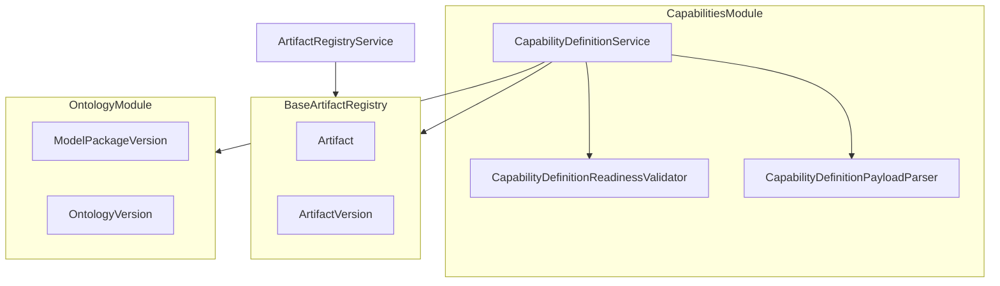

# Issue 18.2: Capability Definition Artifacts

## Scope and prerequisites

- **Source of intent:** [`.docs/.prd/engineering-execution-issues.md`](.docs/.prd/engineering-execution-issues.md) (Issue 18.2), PRD Layer 3 + Milestone 4.5 in [`.docs/.prd/engineering-execution-prd.md`](.docs/.prd/engineering-execution-prd.md) (lines 428–470, 633, 779, 962)
- **Blocked by:** Issue 18.1 — industry-neutral package metadata + resolver ([`.cursor/plans/issue_18.1_cleanup_e7dbd526.plan.md`](.cursor/plans/issue_18.1_cleanup_e7dbd526.plan.md)); treat as prerequisite before starting 18.2
- **Unlocks:** Issue 18.3 (`BusinessPolicyDefinitionVersion` can reference capability definitions)
- **Out of scope:** `AgentCapabilityProfileVersion` / agent runtime risk (Milestone 5), business policies (18.3), optimization/agent templates (18.4), manufacturing package extraction (18.5)

## Problem summary

PRD Layer 3 (“Business Capability”) has no implementation. Platform has BaseArtifact infrastructure ([`ETOS.Backend/Artifacts/ArtifactModels.cs`](ETOS.Backend/Artifacts/ArtifactModels.cs)) and mature module patterns ([`ETOS.Backend/Recommendations/RecommendationService.cs`](ETOS.Backend/Recommendations/RecommendationService.cs), [`ETOS.Backend/Dashboards/DashboardReportService.cs`](ETOS.Backend/Dashboards/DashboardReportService.cs)), but nothing stores governed **business outcome** definitions (rework analysis, BOM impact, harvest scheduling, supplier risk) or pins them to published ontology/model packages.

`ModelPackageVersion` lives in ontology tables ([`ETOS.Backend/Ontology/OntologyModels.cs`](ETOS.Backend/Ontology/OntologyModels.cs)), not the artifact registry today (`ArtifactId`/`ArtifactVersionId` are nullable and unused on create). Capability compatibility should validate against ontology publication state directly; do not fake artifact-registry links for model packages in this slice.

## Target architecture



**Design principle:** `CapabilityDefinitionVersion` answers *what business outcome* is targeted. `AgentCapabilityProfileVersion` (future) answers *what runtime risk/permissions an agent has*. Different artifact type strings, modules, APIs, and payload shapes — no shared types.

## Payload contract (stored in `ArtifactVersion.PayloadJson`)

New types under `ETOS.Backend/Capabilities/`:

```csharp
public sealed record CapabilityDefinitionPayloadDocument(
    string CapabilityKey,
    string OutcomeCategory,          // e.g. structural_analysis, scheduling, supplier_risk
    string OutcomeSummary,
    IReadOnlyDictionary<string, string> OutcomeMetadata,
    IReadOnlyCollection<Guid> CompatibleModelPackageVersionIds,
    IReadOnlyCollection<Guid> CompatibleOntologyVersionIds,  // optional; at least one package or ontology ref required
    IReadOnlyCollection<string> SuggestedQueryIntentRefs,    // optional future wiring placeholder
    IReadOnlyCollection<string> FutureExtensionPlaceholders); // empty allowed; documents deferred agent/policy hooks
```

- **Artifact type constant:** `CapabilityDefinitionVersion` (matches PRD naming alongside `RecommendationVersion`, `DashboardVersion`)
- **Parser/serializer:** mirror [`RecommendationPayloadParser`](ETOS.Backend/Recommendations/) pattern (JSON document + response DTO)
- **Manufacturing demo example** (tests/fixture only until 18.5): `bom-impact-analysis` outcome referencing published package from [`ManufacturingModelPackageFixture`](ETOS.Backend.Tests/Fixtures/ManufacturingModelPackageFixture.cs)

## Phase 1 — Backend module skeleton

Create `ETOS.Backend/Capabilities/`:

| File | Responsibility |
|------|----------------|
| `CapabilityDefinitionContracts.cs` | Permissions, artifact type, request/response DTOs |
| `CapabilityDefinitionPayloadParser.cs` | Parse/serialize/validate JSON shape |
| `CapabilityDefinitionReadinessValidator.cs` | Required fields + published dependency checks |
| `ICapabilityDefinitionService` / `CapabilityDefinitionService.cs` | CRUD-ish flows on BaseArtifact |
| `CapabilityDefinitionEndpointExtensions.cs` | Minimal API routes |

**Service operations:**

1. `ListAsync` — tenant-filtered artifacts where `NormalizedArtifactType == CAPABILITYDEFINITIONVERSION`
2. `GetAsync(artifactId, versionId)` — parsed payload + version metadata + resolved dependency summaries (package key/label, ontology key/label)
3. `CreateAsync` — create `Artifact` + draft `ArtifactVersion` with payload; audit `capabilities.create`
4. `CreateVersionAsync` — new draft version on existing artifact; reject if prior logic would duplicate labels
5. `MarkReadyAsync` — owner/admin + classification policy eval + readiness validation; transition to Ready/RequiresApproval/Blocked (same pattern as dashboards)
6. Publish — **reuse** [`IArtifactRegistryService.PublishVersionAsync`](ETOS.Backend/Artifacts/ArtifactRegistryService.cs) via dedicated endpoint wrapper `POST .../publish` that delegates after readiness checks

**Readiness rules (`CapabilityDefinitionReadinessValidator`):**

- Non-empty `capabilityKey`, `outcomeCategory`, `outcomeSummary`
- At least one of `CompatibleModelPackageVersionIds` or `CompatibleOntologyVersionIds`
- All referenced IDs: same tenant, exist, `State == Published` (query `ModelPackageVersions` / `OntologyVersions`)
- No agent risk/trust fields accepted (reject unknown high-risk keys if present)
- Published versions: service rejects create-version mutations that target Published/Retired versions for in-place edits (immutability via new version only — enforced by existing registry + service guards)

**Permissions** (seed in [`DevelopmentIdentitySeeder.cs`](ETOS.Backend/Identity/DevelopmentIdentitySeeder.cs), grant to admin role):

- `capabilities.read`, `capabilities.create`, `capabilities.readiness`, `capabilities.admin`
- Publish uses existing `artifacts.publish` (consistent with dashboards)

**DI + routing:**

- Register `ICapabilityDefinitionService` in [`EnterpriseThreadPlatform.cs`](ETOS.Backend/Platform/EnterpriseThreadPlatform.cs)
- Map endpoints in [`Program.cs`](ETOS.Backend/Program.cs): `MapEnterpriseThreadCapabilityDefinitionEndpoints()`

**API surface** (`/api/admin/capabilities`):

| Method | Route | Purpose |
|--------|-------|---------|
| GET | `/` | List summaries |
| POST | `/` | Create artifact + v1 draft |
| GET | `/{artifactId}/versions/{versionId}` | Inspect detail |
| POST | `/{artifactId}/versions` | New draft version |
| POST | `/{artifactId}/versions/{versionId}/mark-ready` | Readiness transition |
| POST | `/{artifactId}/versions/{versionId}/publish` | Delegate to artifact registry publish |

No new EF tables/migration required — reuse `Artifacts` / `ArtifactVersions`.

## Phase 2 — Dependency reference model

Because ontology/model packages are not BaseArtifact rows today:

- Store compatibility in payload (primary source of truth for 18.2)
- On `GetAsync`, enrich response with resolved labels from ontology tables
- Optional: expose `GET .../dependencies` returning structured compatibility rows (not `ArtifactDependency` rows) for UI clarity

**Do not** conflate with:

- `PolicyVersion` ([`Classification`](ETOS.Backend/Classification/)) — access-control governance
- Future `AgentCapabilityProfileVersion` — runtime agent risk metadata

Add a compile-time guard constant file or test asserting artifact type strings remain distinct.

## Phase 3 — Frontend list / inspect / publish

Follow [`ETOS.Frontend/src/app/recommendations/page.tsx`](ETOS.Frontend/src/app/recommendations/page.tsx) shell:

- New pages: `/capabilities`, `/capabilities/[artifactId]`
- Shared detail component (read-only payload sections: outcome, compatibility refs, readiness state)
- Server actions or route handlers for mark-ready + publish (same pattern as [`DashboardReportDetailView.tsx`](ETOS.Frontend/src/components/dashboards/DashboardReportDetailView.tsx))
- API helpers in [`ETOS.Frontend/src/lib/etos-api.ts`](ETOS.Frontend/src/lib/etos-api.ts)
- Explorer nav entry in [`ETOS.Frontend/src/app/explorers/page.tsx`](ETOS.Frontend/src/app/explorers/page.tsx)

Keep UI minimal: list, version picker, inspect JSON fields as readable sections, mark-ready + publish buttons for admins.

## Phase 4 — Tests

New `ETOS.Backend.Tests/CapabilityDefinitionTests.cs`:

| Test | Coverage |
|------|----------|
| Create draft with manufacturing package ref | Uses [`ManufacturingModelPackageFixture`](ETOS.Backend.Tests/Fixtures/ManufacturingModelPackageFixture.cs) |
| Mark-ready blocked when package unpublished | Validation message |
| Mark-ready succeeds when package published | Ready state |
| Publish blocked while Draft | Registry blocking reasons |
| Publish succeeds after Ready | Immutability (`Published`) |
| New version allowed after publish | Versioning, not mutation |
| Cross-tenant get denied | Tenant isolation |
| Artifact type separation | `CapabilityDefinitionVersion` ≠ `RecommendationVersion`; payload has no agent risk fields |
| Dependency resolution | GET returns package/ontology labels for referenced IDs |

**Verification:**

```powershell
dotnet test EnterpriseThreadOS.sln --filter "FullyQualifiedName~CapabilityDefinition"
Push-Location ETOS.Frontend; npm run typecheck; Pop-Location
graphify update .
graphify cluster-only .
```

## Execution order

1. Contracts + payload parser + readiness validator
2. Service + endpoints + DI + permissions seed
3. Integration tests with manufacturing fixture
4. Frontend list/detail/publish shell
5. Graphify refresh

## Key risks

- **Ontology vs artifact registry gap:** compatibility validation must query ontology tables; do not invent fake `ArtifactDependency` rows to model packages until registry linkage exists (18.5 optional enhancement)
- **Naming collision:** enforce module boundary now so 18.3/18.4 and Milestone 5 agent profiles do not reuse `capabilities.*` permission keys or artifact types
- **Scope creep:** no agent execution, no business policy artifacts, no wiring capabilities into governed chat/workflow yet — only governed artifact CRUD + publish

## Deferred follow-ups (not 18.2)

- Seed manufacturing capabilities into reference package (18.5)
- `BusinessPolicyDefinitionVersion` references to capability IDs (18.3)
- Artifact registry linkage for `ModelPackageVersion` to unify dependency impact graphs
- `AgentCapabilityProfileVersion` module (Milestone 5)
