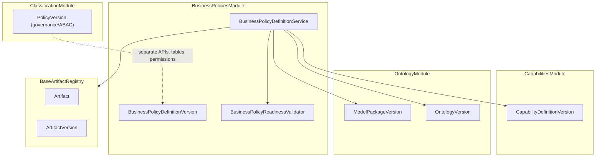

# Issue 18.3: Business Policy Definition Artifacts

## Scope and prerequisites

- **Source of intent:** [`.docs/.prd/engineering-execution-issues.md`](.docs/.prd/engineering-execution-issues.md) (Issue 18.3), PRD Layer 4 + module map in [`.docs/.prd/engineering-execution-prd.md`](.docs/.prd/engineering-execution-prd.md) (lines 432–434, 465, 579, 634, 779, 962)
- **Blocked by:** Issue 18.2 — **implemented** ([`ETOS.Backend/Capabilities/`](ETOS.Backend/Capabilities/), frontend `/capabilities`, [`CapabilityDefinitionTests.cs`](ETOS.Backend.Tests/CapabilityDefinitionTests.cs))
- **Unlocks:** Issue 18.4 (`OptimizationModelVersion` / `AgentTemplateVersion` can reference business policies)
- **Out of scope:** Policy runtime enforcement in workflows/agents (Milestone 5+), optimization models (18.4), manufacturing reference package seeding (18.5), embedding constraints in ontology definitions

## Problem summary

PRD Layer 4 (“Business Policy”) has no implementation. Platform has mature BaseArtifact patterns from Issue 18.2 ([`CapabilityDefinitionService.cs`](ETOS.Backend/Capabilities/CapabilityDefinitionService.cs)) but nothing stores governed **business constraint** definitions (maturity thresholds, distance limits, weather-risk caps, approval gates).

Classification module already owns governance/access-control [`PolicyVersion`](ETOS.Backend/Classification/ClassificationModels.cs) on dedicated tables with `/api/admin/classification` routes. Business policies must be a **separate module**, artifact type, API surface, permission namespace, and UI — not an extension of classification policies.



## Payload contract (stored in `ArtifactVersion.PayloadJson`)

New types under `ETOS.Backend/BusinessPolicies/`:

```csharp
public sealed record BusinessPolicyDefinitionPayloadDocument(
    string PolicyKey,
    string ConstraintCategory,       // e.g. maturity_threshold, distance_limit, weather_risk, approval_gate
    string ConstraintSummary,
    IReadOnlyDictionary<string, string> ConstraintRules,  // e.g. minMaturityPercent=85, maxDistanceKm=50
    IReadOnlyCollection<Guid> ReferencedCapabilityDefinitionVersionIds,
    IReadOnlyCollection<Guid> CompatibleModelPackageVersionIds,
    IReadOnlyCollection<Guid> CompatibleOntologyVersionIds,
    IReadOnlyCollection<string> FutureExtensionPlaceholders);
```

- **Artifact type constant:** `BusinessPolicyDefinitionVersion` (PRD first-class artifact list line 579)
- **Parser/serializer:** mirror [`CapabilityDefinitionPayloadParser`](ETOS.Backend/Capabilities/CapabilityDefinitionPayloadParser.cs) — JSON document + response DTOs, normalize/validate core fields
- **Forbidden properties guard:** reject classification/governance keys if present (`classificationSchemeVersionId`, `permissionRules`, `restrictedContextRules`, `policyKey` collision with governance naming is OK on business side but document that business `policyKey` ≠ classification `PolicyVersion.PolicyKey` — use distinct module constants)
- **Manufacturing demo example** (tests/fixture only until 18.5): `min-maturity-85` constraint referencing a published capability from [`ManufacturingModelPackageFixture`](ETOS.Backend.Tests/Fixtures/ManufacturingModelPackageFixture.cs)

## Phase 1 — Backend module skeleton

Create `ETOS.Backend/BusinessPolicies/`:

| File | Responsibility |
|------|----------------|
| `BusinessPolicyDefinitionContracts.cs` | Permissions, artifact type, request/response DTOs, compile-time separation from `PolicyVersion` |
| `BusinessPolicyDefinitionPayloadParser.cs` | Parse/serialize/validate JSON; reject classification-only property names |
| `BusinessPolicyDefinitionReadinessValidator.cs` | Required fields + published dependency checks |
| `IBusinessPolicyDefinitionService` / `BusinessPolicyDefinitionService.cs` | CRUD-ish flows on BaseArtifact |
| `BusinessPolicyDefinitionEndpointExtensions.cs` | Minimal API routes |

**Service operations** (mirror capabilities):

1. `ListAsync` — tenant-filtered artifacts where `NormalizedArtifactType == BUSINESSPOLICYDEFINITIONVERSION`
2. `GetAsync(artifactId, versionId)` — parsed payload + resolved capability/package/ontology summaries
3. `CreateAsync` — create `Artifact` + draft `ArtifactVersion`; audit `business-policies.create`
4. `CreateVersionAsync` — new draft version on existing artifact
5. `MarkReadyAsync` — owner/admin + classification policy risk eval + readiness validation; transition to Ready/RequiresApproval/Blocked
6. `PublishAsync` — delegate to [`IArtifactRegistryService.PublishVersionAsync`](ETOS.Backend/Artifacts/ArtifactRegistryService.cs)

**Readiness rules (`BusinessPolicyDefinitionReadinessValidator`):**

- Non-empty `policyKey`, `constraintCategory`, `constraintSummary`
- At least one of: `ReferencedCapabilityDefinitionVersionIds`, `CompatibleModelPackageVersionIds`, `CompatibleOntologyVersionIds`
- Referenced capability **version** IDs: same tenant, exist, parent artifact type is `CapabilityDefinitionVersion`, version `ReadinessState == Published`
- Referenced model package / ontology IDs: same tenant, exist, `State == Published` (reuse ontology query pattern from [`CapabilityDefinitionReadinessValidator`](ETOS.Backend/Capabilities/CapabilityDefinitionReadinessValidator.cs))
- Non-empty `constraintRules` when `constraintCategory` implies structured thresholds (validator can require at least one rule entry)
- Published versions: reject in-place mutations (new version only — registry + service guards)

**Permissions** (seed in [`DevelopmentIdentitySeeder.cs`](ETOS.Backend/Identity/DevelopmentIdentitySeeder.cs), grant to admin role):

- `business-policies.read`, `business-policies.create`, `business-policies.readiness`, `business-policies.admin`
- Publish uses existing `artifacts.publish` (consistent with capabilities/dashboards)

**DI + routing:**

- Register `IBusinessPolicyDefinitionService` in [`EnterpriseThreadPlatform.cs`](ETOS.Backend/Platform/EnterpriseThreadPlatform.cs)
- Map endpoints in [`Program.cs`](ETOS.Backend/Program.cs): `MapEnterpriseThreadBusinessPolicyDefinitionEndpoints()`

**API surface** (`/api/admin/business-policies` — deliberately not `/api/admin/policies` or classification routes):

| Method | Route | Purpose |
|--------|-------|---------|
| GET | `/` | List summaries |
| POST | `/` | Create artifact + v1 draft |
| GET | `/{artifactId}/versions/{versionId}` | Inspect detail |
| POST | `/{artifactId}/versions` | New draft version |
| POST | `/{artifactId}/versions/{versionId}/mark-ready` | Readiness transition |
| POST | `/{artifactId}/versions/{versionId}/publish` | Delegate to artifact registry publish |
| GET | `/{artifactId}/versions/{versionId}/dependencies` | Structured capability/package/ontology refs |

No new EF tables/migration — reuse `Artifacts` / `ArtifactVersions`.

## Phase 2 — Dependency reference model

- Store compatibility and capability pins in payload (primary source of truth for 18.3)
- On `GetAsync`, enrich response with:
  - Capability artifact name, capabilityKey, version label for each referenced capability version ID
  - Model package / ontology labels (same resolution as capabilities module)
- **Do not** create `ArtifactDependency` rows for ontology packages (same gap as 18.2; optional 18.5 enhancement)
- **Do not** conflate with:
  - Classification [`PolicyVersion`](ETOS.Backend/Classification/ClassificationModels.cs) — separate persistence, APIs, permissions
  - [`CapabilityDefinitionVersion`](ETOS.Backend/Capabilities/CapabilityDefinitionContracts.cs) — business policies *reference* capabilities; they do not define outcomes
  - Future `AgentCapabilityProfileVersion` — runtime agent risk metadata

Add compile-time guard constants (like [`FutureAgentCapabilityProfileArtifactTypes`](ETOS.Backend/Capabilities/CapabilityDefinitionContracts.cs)) asserting artifact type strings remain distinct from `PolicyVersion` entity naming and classification routes.

## Phase 3 — Frontend list / inspect / publish

Follow capabilities shell ([`ETOS.Frontend/src/app/capabilities/page.tsx`](ETOS.Frontend/src/app/capabilities/page.tsx), [`CapabilityDefinitionDetailView.tsx`](ETOS.Frontend/src/components/capabilities/CapabilityDefinitionDetailView.tsx)):

- New pages: `/business-policies`, `/business-policies/[artifactId]`
- Shared detail component: read-only sections for constraint category, summary, rules map, referenced capabilities, compatible packages/ontologies, readiness state
- Server actions for mark-ready + publish (same pattern as capabilities)
- API helpers in [`ETOS.Frontend/src/lib/etos-api.ts`](ETOS.Frontend/src/lib/etos-api.ts)
- Explorer nav entry in [`ETOS.Frontend/src/app/explorers/page.tsx`](ETOS.Frontend/src/app/explorers/page.tsx)

Keep UI minimal: list, version picker, inspect fields as readable sections, mark-ready + publish for admins. Label clearly as “Business Policy” (Layer 4) to avoid confusion with Classification policies on home/explorer surfaces.

## Phase 4 — Tests

New `ETOS.Backend.Tests/BusinessPolicyDefinitionTests.cs`:

| Test | Coverage |
|------|----------|
| Create draft referencing published capability version | Uses manufacturing fixture + capability from 18.2 API |
| Mark-ready blocked when referenced capability unpublished | Validation message |
| Mark-ready blocked when capability artifact type wrong | Separation from other artifact types |
| Mark-ready succeeds when capability published | Ready state |
| Publish blocked while Draft | Registry blocking reasons |
| Publish succeeds after Ready | Immutability (`Published`) |
| New version allowed after publish | Versioning, not mutation |
| Cross-tenant get denied | Tenant isolation |
| Naming separation | `BusinessPolicyDefinitionVersion` ≠ classification `PolicyVersion`; payload rejects governance-only property names; permission keys ≠ `classification.*` |
| Dependency resolution | GET returns capability/package/ontology labels for referenced IDs |

**Verification:**

```powershell
dotnet test EnterpriseThreadOS.sln --filter "FullyQualifiedName~BusinessPolicyDefinition"
Push-Location ETOS.Frontend; npm run typecheck; Pop-Location
graphify update .
graphify cluster-only .
```

## Execution order

1. Contracts + payload parser + readiness validator + separation guards
2. Service + endpoints + DI + permissions seed
3. Integration tests (create capability helper in test setup, then business policy flows)
4. Frontend list/detail/publish shell + explorer nav
5. Graphify refresh

## Key risks

- **Naming collision with Classification `PolicyVersion`:** enforce module boundary, route prefix `/api/admin/business-policies`, and permission prefix `business-policies.*`; add tests and compile-time constants; UI copy must say “business constraint policy” not “governance policy”
- **Capability reference granularity:** pin **version IDs** (not artifact IDs alone) so published immutability and future workflow/agent composition stay deterministic
- **ConstraintRules flexibility vs validation:** use string dictionary for MVP (PRD examples are key-value thresholds); avoid inventing a constraint DSL — structured validation belongs in 18.4+ optimization/workflow slices
- **Scope creep:** no workflow step execution, no governed-chat enforcement, no agent runtime application of policies — only governed artifact CRUD + publish + dependency validation

## Deferred follow-ups (not 18.3)

- Seed manufacturing business policies into reference package (18.5)
- `OptimizationModelVersion` / `AgentTemplateVersion` references to business policy IDs (18.4)
- Workflow steps that apply business policy definitions before recommendation creation (Milestone 5)
- Artifact registry linkage for unified dependency impact graphs
