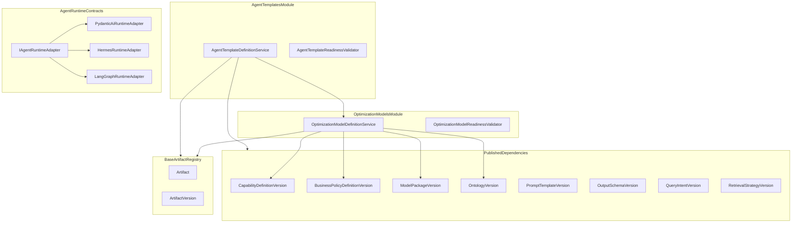

# Issue 18.4: Optimization Model and Agent Template Artifacts

## Scope and prerequisites

- **Source of intent:** [`.docs/.prd/engineering-execution-issues.md`](.docs/.prd/engineering-execution-issues.md) (Issue 18.4), PRD Layers 5–6 + runtime-neutral strategy in [`.docs/.prd/engineering-execution-prd.md`](.docs/.prd/engineering-execution-prd.md) (lines 34, 436–468, 513–545, 579–636, 779–781)
- **Blocked by:** Issue 18.3 — **implemented** in working tree ([`ETOS.Backend/BusinessPolicies/`](ETOS.Backend/BusinessPolicies/), frontend `/business-policies`, [`BusinessPolicyDefinitionTests.cs`](ETOS.Backend.Tests/BusinessPolicyDefinitionTests.cs))
- **Unlocks:** Issue 18.5 (manufacturing reference package can seed optimization models + agent templates)
- **User stories (foundation only):** 87, 88, 96, 98 — 18.4 delivers **template + optimization artifact contracts**; full tenant `AgentVersion`, prompt-to-agent creation, risk derivation, and workflow inheritance land in Issues 22–24

## Problem summary

PRD Layers 5–6 have no implementation. Platform has mature artifact modules from 18.2/18.3 ([`CapabilityDefinitionService.cs`](ETOS.Backend/Capabilities/CapabilityDefinitionService.cs), [`BusinessPolicyDefinitionService.cs`](ETOS.Backend/BusinessPolicies/BusinessPolicyDefinitionService.cs)) but nothing stores:

- Governed **optimization objective metadata** (solver config as metadata only — engines compute; LLMs explain, not solve)
- Reusable **agent pattern** definitions composing ontology, capability, policy, prompt, output-schema, and retrieval references
- Compiled **`IAgentRuntimeAdapter`** boundary (PRD requires PydanticAI first; Hermes/LangGraph deferred)

Existing related pieces to reuse (not reimplement):

- BaseArtifact registry — no new EF tables
- [`GovernedChatArtifactSeeder`](ETOS.Backend/GovernedChat/GovernedChatArtifactSeeder.cs) — seeds published `PromptTemplateVersion` / `OutputSchemaVersion` artifact versions agent templates can pin
- [`QueryIntentVersion`](ETOS.Backend/GovernedQuery/GovernedQueryModels.cs) / `RetrievalStrategyVersion` — separate tables; validate by ID + tenant + `IsEnabled`
- Deferred-adapter pattern from [`DeferredMappingProviders.cs`](ETOS.Backend/Imports/MappingSuggestions/DeferredMappingProviders.cs) — stub throws `RequestValidationException`, no fake Python/FastAPI



## Out of scope (explicit)

- Optimization **solver execution** or workflow optimization-step hooks (Issue 24)
- `AgentVersion`, `AgentRun`, `AgentTypeDefinition`, safe/preview mode runtime (Issue 22)
- `ToolDefinitionVersion` CRUD module (Issue 22) — agent templates may store optional tool version ID refs; validate artifact type only when IDs are provided
- Python FastAPI service, live PydanticAI HTTP calls, Hermes/LangGraph production wiring
- Manufacturing demo seeds for optimization/agent templates (Issue 18.5)
- Embedding objectives or agent patterns inside ontology definitions

---

## Phase 1 — Optimization Model module (`OptimizationModelVersion`)

Create [`ETOS.Backend/OptimizationModels/`](ETOS.Backend/OptimizationModels/) mirroring business-policies layout:

| File | Responsibility |
|------|----------------|
| `OptimizationModelDefinitionContracts.cs` | Permissions, artifact type, DTOs, separation guards vs future solver runtime |
| `OptimizationModelDefinitionPayloadParser.cs` | Parse/serialize/validate JSON |
| `OptimizationModelDefinitionReadinessValidator.cs` | Required fields + published dependency checks |
| `IOptimizationModelDefinitionService` / `OptimizationModelDefinitionService.cs` | CRUD-ish BaseArtifact flows |
| `OptimizationModelDefinitionEndpointExtensions.cs` | Minimal API routes |

### Payload contract (`ArtifactVersion.PayloadJson`)

```csharp
public sealed record OptimizationModelDefinitionPayloadDocument(
    string OptimizationKey,
    string ObjectiveCategory,        // minimize_distance, maximize_utilization, cost_minimization, ...
    string ObjectiveSummary,
    IReadOnlyDictionary<string, string> ObjectiveMetadata,
    IReadOnlyDictionary<string, string> SolverConfiguration,  // metadata only; no solver invocation
    IReadOnlyCollection<string> InputRequirements,              // e.g. candidateLocations[], maturityScores[]
    IReadOnlyCollection<Guid> ReferencedCapabilityDefinitionVersionIds,
    IReadOnlyCollection<Guid> ReferencedBusinessPolicyDefinitionVersionIds,
    IReadOnlyCollection<Guid> CompatibleModelPackageVersionIds,
    IReadOnlyCollection<Guid> CompatibleOntologyVersionIds,
    IReadOnlyCollection<string> FutureExtensionPlaceholders);
```

- **Artifact type:** `OptimizationModelVersion`
- **Forbidden properties guard:** reject LLM/agent keys (`promptTemplate`, `runtimeAdapter`, `agentKey`, classification governance keys) — optimization is not an agent

### Readiness rules

- Non-empty `optimizationKey`, `objectiveCategory`, `objectiveSummary`
- At least one `inputRequirements` entry
- At least one of: `referencedCapabilityDefinitionVersionIds`, `referencedBusinessPolicyDefinitionVersionIds`, `compatibleModelPackageVersionIds`, `compatibleOntologyVersionIds`
- Referenced capability/business-policy **version** IDs: same tenant, correct artifact types (`CapabilityDefinitionVersion`, `BusinessPolicyDefinitionVersion`), `ReadinessState == Published` (reuse validation pattern from [`BusinessPolicyDefinitionReadinessValidator`](ETOS.Backend/BusinessPolicies/BusinessPolicyDefinitionReadinessValidator.cs))
- Model package / ontology IDs: same tenant, `State == Published`
- Published versions immutable (registry guards)

### API + permissions

- Routes: `/api/admin/optimization-models` (list, create, get, create-version, mark-ready, publish, dependencies)
- Permissions (seed in [`DevelopmentIdentitySeeder.cs`](ETOS.Backend/Identity/DevelopmentIdentitySeeder.cs)): `optimization-models.read`, `.create`, `.readiness`, `.admin`
- Publish: existing `artifacts.publish`
- Register in [`EnterpriseThreadPlatform.cs`](ETOS.Backend/Platform/EnterpriseThreadPlatform.cs) + [`Program.cs`](ETOS.Backend/Program.cs)

**Manufacturing demo example (tests only until 18.5):** `minimize-transport-distance` objective referencing published capability + `min-maturity-85` business policy from test helpers.

---

## Phase 2 — Agent Template module (`AgentTemplateVersion`)

Create [`ETOS.Backend/AgentTemplates/`](ETOS.Backend/AgentTemplates/):

| File | Responsibility |
|------|----------------|
| `AgentTemplateDefinitionContracts.cs` | Permissions, artifact type, DTOs, guards vs `AgentVersion` / `AgentCapabilityProfileVersion` |
| `AgentTemplateDefinitionPayloadParser.cs` | Parse/validate; reject optimization-solver-only keys |
| `AgentTemplateDefinitionReadinessValidator.cs` | Composition + published dependency checks |
| `IAgentTemplateDefinitionService` / `AgentTemplateDefinitionService.cs` | BaseArtifact flows + enriched dependency resolution |
| `AgentTemplateDefinitionEndpointExtensions.cs` | `/api/admin/agent-templates` routes |

### Payload contract

```csharp
public sealed record AgentTemplateDefinitionPayloadDocument(
    string TemplateKey,
    string PatternCategory,          // analyzer, planner, investigator, optimization, recommendation
    string PatternSummary,
    string PreferredRuntimeAdapterKey, // default AgentRuntimeAdapterKeys.PydanticAi
    IReadOnlyCollection<Guid> CompatibleModelPackageVersionIds,
    IReadOnlyCollection<Guid> CompatibleOntologyVersionIds,
    IReadOnlyCollection<Guid> ReferencedCapabilityDefinitionVersionIds,
    IReadOnlyCollection<Guid> ReferencedBusinessPolicyDefinitionVersionIds,
    IReadOnlyCollection<Guid> ReferencedOptimizationModelVersionIds,  // optional
    Guid? PromptTemplateVersionId,
    Guid? OutputSchemaVersionId,
    Guid? QueryIntentVersionId,
    Guid? RetrievalStrategyVersionId,
    IReadOnlyCollection<Guid> ReferencedToolDefinitionVersionIds,     // optional; Issue 22
    IReadOnlyDictionary<string, string> CompositionMetadata,
    IReadOnlyCollection<string> FutureExtensionPlaceholders);
```

### Readiness rules

- Non-empty `templateKey`, `patternCategory`, `patternSummary`
- `preferredRuntimeAdapterKey` must be a known adapter key constant
- At least one ontology or model-package ref **and** at least one capability ref
- `promptTemplateVersionId` + `outputSchemaVersionId` required; parent artifact types `PromptTemplateVersion` / `OutputSchemaVersion`, published
- `queryIntentVersionId` + `retrievalStrategyVersionId` required; exist in tenant `QueryIntentVersions` / `RetrievalStrategyVersions`, `IsEnabled == true` (seed via governed-query fixed intents in tests, same as [`GovernedQueryTests`](ETOS.Backend.Tests/GovernedQueryTests.cs))
- Optional refs validated when present:
  - Business policies, optimization models, capabilities — published artifact versions, correct types
  - Tool version IDs — if any provided, artifact type must be `ToolDefinitionVersion` (tests can insert stub artifact row; no Tool module required)
- Compile-time guard constants (like [`FutureAgentCapabilityProfileArtifactTypes`](ETOS.Backend/Capabilities/CapabilityDefinitionContracts.cs)):

```csharp
public static class FutureAgentArtifactTypes
{
    public const string AgentVersion = "AgentVersion";
    public const string AgentCapabilityProfile = "AgentCapabilityProfileVersion";
}
```

### API + permissions

- Routes: `/api/admin/agent-templates`
- Permissions: `agent-templates.read`, `.create`, `.readiness`, `.admin`

---

## Phase 3 — `IAgentRuntimeAdapter` contracts (no production runtime)

Create [`ETOS.Backend/AgentRuntime/`](ETOS.Backend/AgentRuntime/):

| File | Responsibility |
|------|----------------|
| `IAgentRuntimeAdapter.cs` | Runtime-neutral execution contract |
| `AgentRuntimeContracts.cs` | `AgentRuntimeExecutionRequest` / `AgentRuntimeExecutionResult`, adapter key constants |
| `PydanticAiRuntimeAdapter.cs` | First adapter — stub/disabled unless future config enables it |
| `DeferredAgentRuntimeAdapters.cs` | `HermesRuntimeAdapter`, `LangGraphRuntimeAdapter` deferred stubs |
| `AgentRuntimeAdapterSelector.cs` | Resolve adapter by `PreferredRuntimeAdapterKey` (mirror [`MappingSuggestionProviderSelector`](ETOS.Backend/Imports/MappingSuggestions/MappingSuggestionProviderSelector.cs)) |

### Contract shape (MVP)

```csharp
public interface IAgentRuntimeAdapter
{
    string AdapterKey { get; }
    Task<AgentRuntimeExecutionResult> ExecuteAsync(
        AgentRuntimeExecutionRequest request,
        CancellationToken cancellationToken);
}
```

- **Request fields:** tenant/user context, `AgentTemplateVersionId` (or inline composition snapshot), governed context summary JSON, structured input JSON, `PreviewMode` flag
- **Result fields:** `AdapterKey`, `Status` (Disabled/Deferred/Succeeded placeholder), optional structured output JSON, trace notes
- **PydanticAiRuntimeAdapter:** throws `RequestValidationException("PydanticAI agent runtime is not configured for this deployment.")` — same posture as [`PydanticAiMappingProvider`](ETOS.Backend/Imports/MappingSuggestions/DeferredMappingProviders.cs)
- **Hermes / LangGraph:** throw deferred-not-available messages; document in XML comments + optional `docs/backend/agent-runtime-adapters.md` one-paragraph stub (only if team wants ADR pointer; otherwise inline comments suffice per AGENTS.md doc-minimization)
- **DI:** register all adapters + `IAgentRuntimeAdapterSelector` in [`EnterpriseThreadPlatform.cs`](ETOS.Backend/Platform/EnterpriseThreadPlatform.cs)
- **No public execute endpoint in 18.4** — contract is compiled and unit-tested; HTTP execution surface belongs to Issue 22

---

## Phase 4 — Frontend list / inspect / publish

Follow business-policies shell ([`ETOS.Frontend/src/app/business-policies/page.tsx`](ETOS.Frontend/src/app/business-policies/page.tsx), [`BusinessPolicyDefinitionDetailView.tsx`](ETOS.Frontend/src/components/business-policies/BusinessPolicyDefinitionDetailView.tsx)):

- Pages: `/optimization-models`, `/optimization-models/[artifactId]`
- Pages: `/agent-templates`, `/agent-templates/[artifactId]`
- Detail views: read-only sections for objective/pattern metadata, dependency refs (capabilities, policies, optimization models, prompt/output schema, query intent, retrieval strategy)
- Server actions: mark-ready + publish (admin)
- API helpers in [`ETOS.Frontend/src/lib/etos-api.ts`](ETOS.Frontend/src/lib/etos-api.ts)
- Explorer nav entry in [`ETOS.Frontend/src/app/explorers/page.tsx`](ETOS.Frontend/src/app/explorers/page.tsx)
- Label clearly: "Optimization Model (Layer 5)" and "Agent Template (Layer 6)" — not `AgentVersion`

---

## Phase 5 — Tests

### `OptimizationModelDefinitionTests.cs`

| Test | Coverage |
|------|----------|
| Create draft referencing published capability + business policy | Manufacturing fixture chain |
| Mark-ready blocked when referenced policy unpublished | Validation message |
| Mark-ready blocked when wrong artifact type referenced | Type separation |
| Publish immutability + new version after publish | Registry workflow |
| Cross-tenant get denied | Tenant isolation |
| Payload rejects agent/LLM-only properties | Layer separation |
| GET dependencies returns resolved labels | Enrichment |

### `AgentTemplateDefinitionTests.cs`

| Test | Coverage |
|------|----------|
| Create draft with published prompt/output schema + query intent/strategy | Use chat seeder + governed query seed |
| Mark-ready blocked when prompt template unpublished | Validation |
| Mark-ready blocked when optimization model ref wrong type | Type guard |
| Composition includes optional optimization model ref | Cross-layer link |
| `AgentTemplateVersion` ≠ `AgentVersion` artifact type | Naming separation |
| Publish immutability + tenant isolation | Standard artifact guards |

### `AgentRuntimeAdapterTests.cs`

| Test | Coverage |
|------|----------|
| All adapters registered in DI | Selector resolves by key |
| PydanticAi stub throws expected disabled message | Contract compile + behavior |
| Hermes/LangGraph stubs throw deferred messages | No fake integration |
| Unknown adapter key rejected | Selector validation |

**Verification:**

```powershell
dotnet test EnterpriseThreadOS.sln --filter "FullyQualifiedName~OptimizationModelDefinition|FullyQualifiedName~AgentTemplateDefinition|FullyQualifiedName~AgentRuntimeAdapter"
Push-Location ETOS.Frontend; npm run typecheck; Pop-Location
graphify update .
graphify cluster-only .
```

---

## Execution order

1. Optimization model contracts + parser + readiness validator
2. Optimization model service + endpoints + permissions
3. Agent runtime contracts + deferred adapters + DI
4. Agent template contracts + parser + readiness validator (cross-module refs)
5. Agent template service + endpoints + permissions
6. Integration tests (build on capability/business-policy test helpers from 18.2/18.3)
7. Frontend shells + explorer nav
8. Graphify refresh

---

## Key risks

| Risk | Mitigation |
|------|------------|
| **Scope creep into Issue 22 agents** | No `AgentVersion`, no execute API, no `AgentRun`; template artifacts only |
| **Fake Python/PydanticAI integration** | Stub adapter throws disabled message; tests assert contract, not HTTP |
| **Tool refs without Tool module** | Optional IDs only; validate artifact type when present; empty allowed |
| **QueryIntent vs artifact registry split** | Document in validator: intent/strategy are table IDs; prompt/schema are artifact version IDs |
| **Optimization vs agent conflation** | Separate modules, routes, permissions; payload guards reject cross-layer keys |
| **Hermes/LangGraph temptation** | Deferred classes with explicit throw messages; LangGraph reserved for Issue 25 per PRD |

## Deferred follow-ups (not 18.4)

- Manufacturing optimization + agent template seeds ([Issue 18.5](.docs/.prd/engineering-execution-issues.md))
- `AgentVersion`, runtime execute API, `AgentRun` records ([Issue 22](.docs/.prd/engineering-execution-issues.md))
- `ToolDefinitionVersion` module ([Issue 22](.docs/.prd/engineering-execution-issues.md))
- Workflow optimization-step hooks + inherited risk ([Issues 24–25](.docs/.prd/engineering-execution-issues.md))
