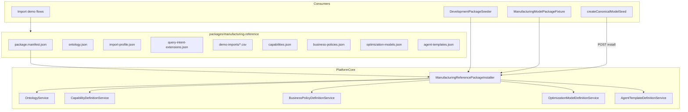

# Issue 18.5: Manufacturing Reference Package Extraction

## Backlog source and gate

From [`.docs/.prd/engineering-execution-issues.md`](.docs/.prd/engineering-execution-issues.md) (Issue 18.5) and Milestone 4.5 in [`.docs/.prd/engineering-execution-prd.md`](.docs/.prd/engineering-execution-prd.md):

**Build:** Extract manufacturing demo assumptions into a published reference model package (ontology, capabilities, business policies, demo import fixtures, manufacturing-specific import/query behavior) plus package architecture docs.

**Acceptance:**
- Manufacturing object types, BOM metadata, CAD/EBOM comparison behavior, and demo seeds live in the package — not platform core
- Existing manufacturing demo flow still works end-to-end via the extracted package
- Package architecture docs explain ontology-as-brain vs capability / business policy / optimization / agent-template siblings
- Tests cover package publish, demo import, BOM comparison, and staging graph behavior through the package only

**Blocked by:** Issue 18.4 (optimization models + agent templates + runtime adapter contracts)

**Unlocks:** Issue 22 (Tool Registry) — explicitly blocked until 18.5 is complete

---

## Current state (gap analysis)

| Area | Today | 18.5 target |
|------|-------|-------------|
| Package content | [`ManufacturingReferencePackageProfiles`](ETOS.Backend/Ontology/ModelPackageProfiles.cs) lives in **backend core** | Move to `packages/manufacturing-reference/` manifest |
| Test setup | [`ManufacturingModelPackageFixture`](ETOS.Backend.Tests/Fixtures/ManufacturingModelPackageFixture.cs) builds ontology inline via API | Fixture calls shared installer; no duplicated ontology JSON in tests |
| Dev/local seed | [`createCanonicalModelSeed()`](ETOS.Frontend/src/lib/etos-api.ts) duplicates ~220 lines of manufacturing ontology in frontend; **missing** `importProfileJson` / `queryIntentExtensionsJson` | Single backend install endpoint; frontend delegates |
| Package key | Inconsistent: frontend `canonical-manufacturing-package` vs fixture `canonical-package` | One canonical key in manifest (`etos-manufacturing-reference`) |
| Layer-4 artifacts | Test-only seeds: `bom-impact-analysis`, `min-maturity-85`, `minimize-transport-distance`, agent template chain | Published as part of reference package install |
| Dev identity seed | [`DevelopmentIdentitySeeder`](ETOS.Backend/Identity/DevelopmentIdentitySeeder.cs) seeds users/permissions only | Optionally auto-install reference package when `SeedIdentityOptions` enabled |
| Core literals | [`RecommendationEvidenceResolver`](ETOS.Backend/Recommendations/RecommendationEvidenceResolver.cs) fallback `"Missing in EBOM..."`; entity `MissingInEbomCount` | Neutral secondary-side naming or package-driven summary |
| Docs | No domain-package architecture doc | New doc under `docs/` |

**18.1–18.4 already done (foundation for 18.5):**
- Package-driven import staging, BOM comparison, query intents, recommendation templates via `ImportProfileJson` / `QueryIntentExtensionsJson`
- `IMappingSuggestionProvider`, capability/policy/optimization/agent-template artifact modules
- Deferred seeds explicitly marked for 18.5 in plans [18.2](.cursor/plans/issue_18.2_capabilities_3556da49.plan.md), [18.3](.cursor/plans/issue_18.3_business_policies_05e07e22.plan.md), [18.4](.cursor/plans/issue_18.4_optimization_agents_0c306932.plan.md)

---

## Target architecture



**Design principle:** Platform core keeps generic parsers ([`ModelPackageProfileParser`](ETOS.Backend/Ontology/ModelPackageProfiles.cs)), resolvers, and install orchestration. All manufacturing-specific **values** move to the package folder.

**Delivery shape (chosen):** JSON/CSV content folder + backend installer — simplest, no new deployable project, mirrors existing fixture pattern.

---

## Phase 0 — Package manifest layout

Create [`packages/manufacturing-reference/`](packages/manufacturing-reference/) with:

```
packages/manufacturing-reference/
  package.manifest.json          # keys, version, install order, stable IDs
  ontology/
    object-types.json
    relationships.json
    bom-relationships.json
    semantic-layer.json
    lifecycle.json
    attribute-schema.json
  profiles/
    import-profile.json          # move from ManufacturingReferencePackageProfiles
    query-intent-extensions.json
  demo-imports/
    flat-part-import.csv         # partNumber,lifecycle,cost (identity demo)
    bom-comparison.csv           # from ImportTests BOM test
  artifacts/
    capabilities.json            # bom-impact-analysis
    business-policies.json       # min-maturity-85
    optimization-models.json     # minimize-transport-distance
    agent-templates.json         # composes capability + policy + optimization refs
  README.md                      # package-local overview (not architecture ADR)
```

**Canonical keys** (fix inconsistency):
- Package: `etos-manufacturing-reference`
- Ontology: `etos-manufacturing-ontology`
- Stable version label: `1.0.0` for reference install (tests may suffix for isolation)

Migrate content from [`ManufacturingReferencePackageProfiles`](ETOS.Backend/Ontology/ModelPackageProfiles.cs) and [`ManufacturingModelPackageFixture`](ETOS.Backend.Tests/Fixtures/ManufacturingModelPackageFixture.cs) into these files. Align frontend ontology shape (includes `change` object type, richer lifecycle) with manifest — use **frontend's richer seed** as source of truth since it powers local QA.

---

## Phase 1 — Reference package installer (backend)

New module `ETOS.Backend/Packages/`:

| Type | Responsibility |
|------|----------------|
| `IReferencePackageInstaller` | Generic contract: `InstallAsync(tenantId, userId, packageKey, options)` |
| `ManufacturingReferencePackageInstaller` | Reads manifest from disk (configurable root via `ReferencePackageOptions`) |
| `ReferencePackageManifestLoader` | Validates manifest schema, loads JSON fragments |
| `InstallReferencePackageResponse` | Returns published model package + artifact version IDs |

**Install sequence** (idempotent where possible):
1. Check if active published package with manifest key already exists → return existing (dev re-run safe)
2. Create + publish ontology layers (ontology → semantic → lifecycle → attributes)
3. Create + publish model package with `importProfileJson` + `queryIntentExtensionsJson`
4. Create + mark-ready + publish capability definitions (refs model package version ID)
5. Create + publish business policies (refs capability version IDs)
6. Create + publish optimization models (refs capability + policy)
7. Create + publish agent templates (refs optimization + governed-chat prompt/output schema seeds if required)
8. Audit record: `reference-package.installed`

Wire existing domain services — **do not** bypass publish/readiness validators.

Register in [`EnterpriseThreadPlatform.cs`](ETOS.Backend/Platform/EnterpriseThreadPlatform.cs).

**Development endpoint** in [`DevelopmentEndpointExtensions.cs`](ETOS.Backend/Platform/Development/DevelopmentEndpointExtensions.cs):

```
POST /api/admin/development/install-reference-package
Body: { "packageKey": "etos-manufacturing-reference" }
```

Dev-only; requires tenant admin + development environment guard (same pattern as clean-demo-data).

**Optional dev auto-seed:** extend [`DevelopmentIdentitySeeder`](ETOS.Backend/Identity/DevelopmentIdentitySeeder.cs) or add `IDevelopmentPackageSeeder` invoked after identity seed when `SeedIdentityOptions.InstallReferencePackage = true` (default true in Development).

---

## Phase 2 — Remove manufacturing content from core

1. **Delete** `ManufacturingReferencePackageProfiles` from [`ModelPackageProfiles.cs`](ETOS.Backend/Ontology/ModelPackageProfiles.cs) — keep only generic profile types + parser
2. **Refactor** [`ManufacturingModelPackageFixture`](ETOS.Backend.Tests/Fixtures/ManufacturingModelPackageFixture.cs) to call installer (or shared test helper) instead of inline API ontology construction
3. **Refactor** [`StubModelPackageContextResolver`](ETOS.Backend.Tests/Fixtures/StubModelPackageContextResolver.cs) to load profiles from manifest loader test helper
4. **Neutralize remaining core literals** (small, scoped):
   - [`RecommendationEvidenceResolver`](ETOS.Backend/Recommendations/RecommendationEvidenceResolver.cs): use neutral fallback (`Missing in secondary side {count}...`) or template from active package import profile
   - Consider rename `MissingInEbomCount` → `MissingInSecondarySideCount` in [`ImportModels.cs`](ETOS.Backend/Imports/ImportModels.cs), contracts, and one EF migration — maps to package comparison side order, not CAD/EBOM semantics

**Do not** move governed-chat prompt/output schema creation into the package unless agent-template readiness requires it — seed minimal prompt/output schema artifacts during install step 7 using existing governed-chat tables (same pattern as [`AgentTemplateDefinitionTests`](ETOS.Backend.Tests/AgentTemplateDefinitionTests.cs)).

---

## Phase 3 — Frontend delegation

In [`ETOS.Frontend/src/lib/etos-api.ts`](ETOS.Frontend/src/lib/etos-api.ts):

- Replace `createCanonicalModelSeed()` body with `POST /api/admin/development/install-reference-package`
- Update demo import flows to use manifest constant `etos-manufacturing-reference` (export from shared constant or read from install response)
- Move inline CSV strings to optional fetch of packaged demo CSV paths served by backend **or** keep minimal inline CSV in frontend but document they mirror `packages/manufacturing-reference/demo-imports/` (backend-served is cleaner for single source of truth)

Update [`docs/local-development.md`](docs/local-development.md) and [`.docs/.QA/issues-1-18-e2e-flow-to-recommendations.md`](.docs/.QA/issues-1-18-e2e-flow-to-recommendations.md) with new install flow and package key.

---

## Phase 4 — Package architecture documentation

New doc: [`docs/architecture/domain-packages.md`](docs/architecture/domain-packages.md)

Sections:
- **Core vs domain package boundary** — what lives in `ETOS.Backend` vs `packages/*`
- **Ontology-as-brain** — object types, BOM defs, semantic mappings, lifecycle, attributes, import/query profiles
- **Sibling artifacts** — capability outcomes, business policy constraints, optimization objectives, agent templates (with dependency diagram)
- **Install lifecycle** — manifest → publish order → active package selection
- **Adding a new domain package** — checklist for future industries
- **Explicit non-goals** — no runtime enforcement, no fake ERP connectors, no tenant marketplace yet

Cross-link from [`docs/backend/architecture.md`](docs/backend/architecture.md) Extension Points / Ontology section.

Optional Issue 27 ADR stub pointer — full ADR remains Issue 27; this doc is implementation-facing.

---

## Phase 5 — Tests and verification

New `ETOS.Backend.Tests/ManufacturingReferencePackageTests.cs`:

| Test | Coverage |
|------|----------|
| Install publishes model package with import + query profiles | Manifest → DB |
| Re-install is idempotent | Same active package key |
| Flat CSV import + mapping + staging | Uses installed package only |
| BOM comparison CSV reports mismatches | Regression of [`ImportTests.BomMetadataStagesRelationshipsAndComparisonReportsMismatches`](ETOS.Backend.Tests/ImportTests.cs) via installer |
| Capability/policy/optimization/agent-template chain published | Deferred 18.2–18.4 seeds |
| Core has no `ManufacturingReferencePackageProfiles` symbol | Grep/architecture guard test optional |
| Cross-tenant install denied | Tenant isolation |

Refactor existing tests to use installer-backed fixture — reduce duplication in Capability/BusinessPolicy/Optimization/AgentTemplate test helpers where practical.

**Verification commands:**

```powershell
dotnet test EnterpriseThreadOS.sln --filter "FullyQualifiedName~ManufacturingReference|Import|Ontology"
Push-Location ETOS.Frontend; npm run typecheck; npm run lint; Pop-Location
graphify update .
graphify cluster-only .
```

Manual QA: model-artifacts seed button → imports identity demo → BOM comparison recommendation path still works.

---

## Out of scope (explicit)

- Issue 22 tool registry, agent execution, `AgentRun`
- Production package marketplace / cross-tenant package distribution
- `ArtifactDependency` rows linking model packages to artifact registry (optional enhancement noted in 18.2/18.3 — defer unless needed for install validation)
- Full Issue 27 ADR set
- Renaming platform query intent key `bom-impact-context` (keep for frontend compatibility; behavior stays package-driven)

---

## Execution order

1. Create `packages/manufacturing-reference/` manifest + migrate profile JSON from core
2. Build installer + dev endpoint + options/DI
3. Refactor test fixture to use installer; green baseline
4. Add artifact seeds (capability → policy → optimization → agent template)
5. Frontend seed delegation + package key unification
6. Core cleanup (remove `ManufacturingReferencePackageProfiles`, neutralize EBOM literals)
7. Architecture doc + local-dev doc updates
8. Full test pass + graphify refresh

---

## Key risks

| Risk | Mitigation |
|------|------------|
| Frontend/backend ontology drift | Single manifest source; delete frontend inline ontology |
| Missing import profiles in current frontend seed | Installer always sets profiles; fixes latent demo gap |
| Agent-template install needs prompt/output schema | Reuse governed-chat seed pattern from agent template tests |
| Package key breaking existing QA scripts | Document migration; support one release alias if needed |
| `MissingInEbomCount` rename blast radius | Small migration + update DTOs/tests; map from generic comparison result internally |
