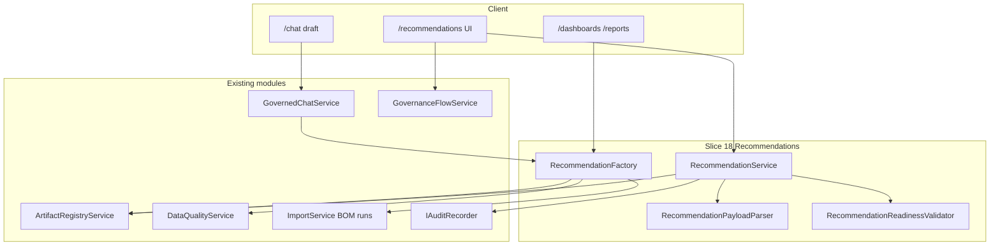

# Issue 18: Recommendation Artifacts and Evidence Rules

## Prerequisite

Issue 17 is done. Issue 18 builds on existing slices:

| Capability | Existing module |
|------------|-----------------|
| Versioned artifacts, publish, dependencies | [`ArtifactRegistryService`](ETOS.Backend/Artifacts/ArtifactRegistryService.cs) |
| Typed module service pattern | [`DashboardReportService`](ETOS.Backend/Dashboards/DashboardReportService.cs) |
| Chat draft creation | [`ChatArtifactDraftBuilder`](ETOS.Backend/GovernedChat/ChatArtifactDraftBuilder.cs), [`GovernedChatArtifactSeeder`](ETOS.Backend/GovernedChat/GovernedChatArtifactSeeder.cs) |
| BOM comparison evidence | [`ImportService.CreateBomComparisonAsync`](ETOS.Backend/Imports/ImportService.cs) |
| Data quality + trust exclusion | [`DataQualityService`](ETOS.Backend/DataQuality/DataQualityService.cs), `ExcludedFromTrustedRecommendations` |
| AI trace / context provenance | [`AiTraceService`](ETOS.Backend/AiTrace/AiTraceService.cs), governed chat turns |
| Dashboard/report anchors | Issue 17 templates + `bom-impact-context` intent |
| Governance flow placeholder | [`GovernanceFlowService`](ETOS.Backend/Explorers/GovernanceFlowService.cs) `Recommendation = 0` |

No `RecommendationArtifact` code exists yet (graphify confirms). Copy Issue 17 module shape, not new persistence layer for core artifact data.

## Scope

**In scope**
- New `Recommendations` backend module
- Artifact type `RecommendationVersion` stored in existing `Artifact` / `ArtifactVersion` tables (`PayloadJson`)
- Payload contract: recommendation metadata, embedded `evidenceLinks[]`, embedded `suggestedActions[]`, risk/capability/trust/conflict state
- Evidence-required `MarkReviewed` + registry-aligned `MarkReady` with trust/conflict blocking
- Creation factories: manual, data quality issue, BOM comparison run, governed chat draft, dashboard/report anchor (on-demand from existing BOM comparison)
- Extend governed chat with `ChatDraftArtifactKind.Recommendation` + output schema seed
- Minimal API + permissions + audit
- Frontend `/recommendations` list + detail with create/inspect/review/ready transitions
- `RecommendationTests` covering Issue 18 acceptance criteria
- Replace governance-flow recommendation placeholder with real artifact nodes when anchor is a recommendation

**Out of scope (defer)**
- Issue 19 review task creation from suggested actions (wire `CONVERTED_TO_REVIEW_TASK` as status only + placeholder note)
- Production agent/workflow auto-creation (Milestone 5) — document stub endpoint or metadata-only `creationSource: agent_deferred`
- Tenant-configurable graph-diff rule engine (platform-fixed BOM/DQ rules only in MVP)
- `RecommendationTypeDefinition` governed artifact — use seeded enum in payload
- Separate `SuggestedActionArtifact` table
- Live governance KPI counts for `high_risk_recommendations` (Issue 21)
- PDF/export bundles (not in Issue 18 acceptance)

## User stories (PRD)

- **18** — conflicted/unverified evidence blocks trusted/actionable recommendation status
- **21** — recommendations link to `DataQualityIssue` evidence
- **24–25** — BOM comparison runs become recommendation evidence + auto/manual creation
- **66** — first-class versioned artifact with outcome hooks (outcome tracking flag in payload; full outcomes = Issue 20)
- **67** — suggested actions embedded in payload, not separate artifact classes
- **68** — evidence required before reviewed/ready

## Architecture



Lifecycle split (two layers, same as PRD):
- **Payload `lifecycleStatus`**: `Draft` → `Reviewed` → (`Accepted`/`Rejected` deferred to Issue 19/20)
- **`ArtifactReadinessState`**: stays `Draft` until reviewed + evidence valid; `MarkReady` → `Ready`/`RequiresApproval`/`Blocked` via existing policy eval

## Payload contract (`ArtifactVersion.PayloadJson`)

Validate in [`RecommendationPayloadParser`](ETOS.Backend/Recommendations/RecommendationPayloadParser.cs) (new):

```json
{
  "title": "CAD BOM changed but EBOM unchanged",
  "summary": "Structural drift detected for ASM-100.",
  "recommendationType": "BOM_SYNC",
  "creationSource": "BOM_COMPARISON",
  "sourceReference": { "kind": "bom_comparison_run", "id": "uuid" },
  "severity": "HIGH",
  "priority": "HIGH",
  "riskState": "MEDIUM",
  "capabilityState": "READ_ONLY_ANALYSIS",
  "trustState": "PROVISIONAL",
  "conflictState": "NONE",
  "lifecycleStatus": "DRAFT",
  "evidenceLinks": [
    {
      "linkId": "uuid",
      "evidenceType": "BOM_COMPARISON_RUN",
      "sourceId": "uuid",
      "safeSummary": "3 missing EBOM components",
      "trustState": "TRUSTED",
      "permissionFiltered": false
    }
  ],
  "suggestedActions": [
    {
      "actionId": "uuid",
      "title": "Review EBOM synchronization",
      "kind": "REVIEW_EBOM",
      "riskScore": "MEDIUM",
      "requiredReviewPath": "ENGINEERING_REVIEW",
      "status": "PROPOSED"
    }
  ],
  "relatedObjects": [{ "graphNodeId": "uuid", "objectType": "Assembly" }],
  "explainability": {
    "aiTraceId": "uuid-or-null",
    "contextPackageId": "uuid-or-null",
    "retrievalRunId": "uuid-or-null"
  },
  "outcomeTrackingRequired": true
}
```

**MVP enums** (contracts file):
- `RecommendationType`: `DATA_QUALITY`, `BOM_SYNC`, `REWORK_RISK`, `IDENTITY_RESOLUTION`, `DOCUMENT_LINK`, `SECURITY`, `POLICY`, `IMPORT_VALIDATION`, `LIFECYCLE_CONFLICT`
- `EvidenceLinkType`: `GRAPH_NODE`, `GRAPH_RELATIONSHIP`, `DOCUMENT`, `DATA_QUALITY_ISSUE`, `GRAPH_DIFF`, `GRAPH_SNAPSHOT`, `BOM_COMPARISON_RUN`, `IMPORT_BATCH`, `AI_TRACE`, `RETRIEVAL_RUN`, `CONTEXT_PACKAGE`, `MANUAL_NOTE`, `DASHBOARD`, `REPORT`, `AUDIT_RECORD`
- `SuggestedActionStatus`: `PROPOSED`, `SELECTED_FOR_REVIEW`, `REJECTED`, `DEFERRED`, `SUPERSEDED`, `CONVERTED_TO_REVIEW_TASK` (last = status only until Issue 19)
- `CreationSource`: `MANUAL`, `DATA_QUALITY`, `BOM_COMPARISON`, `CHAT`, `DASHBOARD`, `REPORT`, `AGENT_DEFERRED`

Also persist provenance via existing [`ArtifactRelationship`](ETOS.Backend/Artifacts/ArtifactModels.cs) rows (`DerivedFrom`, `References`) to AI traces, DQ issues, BOM runs, dashboards — not only payload copies.

## Readiness and trust rules

[`RecommendationReadinessValidator`](ETOS.Backend/Recommendations/RecommendationReadinessValidator.cs):

| Transition | Rules |
|------------|-------|
| `MarkReviewed` | `evidenceLinks.length >= 1`; each link has `evidenceType`, `sourceId`, `safeSummary`; suggested actions validated (title, kind, riskScore) |
| `MarkReady` | `lifecycleStatus == REVIEWED`; evidence still present; **no trusted claim** if any evidence `trustState` is `CONFLICTED` or `UNVERIFIED`, or linked DQ/identity source has `ExcludedFromTrustedRecommendations`; recompute payload `trustState`/`conflictState` from evidence |
| Trusted/actionable | Block when `conflictState != NONE` or any evidence conflicted — satisfies story **18** |

Reuse [`TrustState`](ETOS.Backend/GraphMemory/GraphMemoryModels.cs) values in evidence DTOs. When factory builds from DQ issue or BOM run with unresolved identity, set `trustState: PROVISIONAL` and `ExcludedFromTrustedRecommendations` sources force non-trusted readiness.

## Backend module: `ETOS.Backend/Recommendations/`

| File | Responsibility |
|------|----------------|
| `RecommendationContracts.cs` | Permissions, artifact type const, enums, request/response DTOs |
| `RecommendationPayloadParser.cs` | Parse/validate/normalize `PayloadJson` |
| `RecommendationReadinessValidator.cs` | Evidence, trust, conflict, suggested-action validation |
| `RecommendationEvidenceResolver.cs` | Resolve linked IDs to safe summaries + trust flags (DQ, BOM, trace, graph node existence, tenant scope) |
| `RecommendationService.cs` | List/get, manual create, mark-reviewed, mark-ready, suggested-action status update |
| `RecommendationFactory.cs` | `FromDataQualityIssue`, `FromBomComparisonRun`, `FromChatDraft`, `FromDashboardReport` |
| `RecommendationEndpointExtensions.cs` | Minimal API routes |
| `RecommendationPlatformArtifacts.cs` | Seeded output schema for chat drafts (mirror dashboard seeder pattern) |

### Permissions

```csharp
public static class RecommendationPermissions
{
    public const string Read = "recommendations.read";
    public const string Create = "recommendations.create";
    public const string Review = "recommendations.review";
    public const string Readiness = "recommendations.readiness";
    public const string Admin = "recommendations.admin";
}
```

Seed in [`DevelopmentIdentitySeeder`](ETOS.Backend/Identity/DevelopmentIdentitySeeder.cs). Register in [`EnterpriseThreadPlatform.cs`](ETOS.Backend/Platform/EnterpriseThreadPlatform.cs) + map in [`Program.cs`](ETOS.Backend/Program.cs).

### Endpoints (MVP)

| Method | Route | Purpose |
|--------|-------|---------|
| GET | `/api/admin/recommendations` | Tenant-scoped list (`RecommendationVersion`) |
| GET | `/api/admin/recommendations/{artifactId}/versions/{versionId}` | Parsed payload + registry metadata |
| POST | `/api/admin/recommendations` | Manual create with evidence + suggested actions |
| POST | `/api/admin/recommendations/from-data-quality-issue/{issueId}` | Factory create (idempotent key: issue + type) |
| POST | `/api/admin/recommendations/from-bom-comparison/{runId}` | Factory create when drift counts > 0 |
| POST | `/api/admin/recommendations/{artifactId}/versions/{versionId}/mark-reviewed` | Evidence gate |
| POST | `/api/admin/recommendations/{artifactId}/versions/{versionId}/mark-ready` | Reviewed + trust gate + policy eval |
| PATCH | `/api/admin/recommendations/{artifactId}/versions/{versionId}/suggested-actions/{actionId}` | Status transition + audit |

Optional thin hook after BOM comparison in [`ImportService`](ETOS.Backend/Imports/ImportService.cs): call factory when `MissingInEbomCount + QuantityMismatchCount + UsageReferenceMismatchCount > 0` (platform-fixed rule, idempotent). Keep import service from owning readiness logic — delegate to factory + service.

## Governed chat extension

Mirror Issue 17 dashboard draft path:

1. Add `ChatDraftArtifactKind.Recommendation` in [`GovernedChatContracts.cs`](ETOS.Backend/GovernedChat/GovernedChatContracts.cs)
2. Map to `"RecommendationVersion"` in [`ChatArtifactDraftBuilder`](ETOS.Backend/GovernedChat/ChatArtifactDraftBuilder.cs)
3. Seed `draft-recommendation-schema` in [`GovernedChatArtifactSeeder`](ETOS.Backend/GovernedChat/GovernedChatArtifactSeeder.cs) + update [`DeterministicLlmCompletionService`](ETOS.Backend/GovernedChat/Llm/DeterministicLlmCompletionService.cs) to emit recommendation payload shape with evidence stubs from turn trace/context
4. Extend [`GovernedChatService.ResolveDraftSchema`](ETOS.Backend/GovernedChat/GovernedChatService.cs) switch
5. On draft save, enrich explainability refs from chat turn (`aiTraceId`, `contextPackageId`)

Unmatched chat intents must **not** auto-create recommendations (negative test).

## Dashboard/report creation path

For story **25** on-demand path without new query engine:
- Detail UI action on dashboard/report using `bom-impact-context` anchor: call existing `CreateBomComparisonAsync` for related import batch (when resolvable from anchor/context) → `FromBomComparisonRun` → link recommendation to dashboard/report via `ArtifactRelationship` + `evidenceType: DASHBOARD|REPORT`
- If batch not resolvable, manual create with `MANUAL_NOTE` + dashboard reference evidence only

## Frontend

Copy Issue 17 shell:

| File | Pattern source |
|------|----------------|
| [`ETOS.Frontend/src/app/recommendations/page.tsx`](ETOS.Frontend/src/app/recommendations/page.tsx) | [`dashboards/page.tsx`](ETOS.Frontend/src/app/dashboards/page.tsx) |
| [`ETOS.Frontend/src/app/recommendations/[artifactId]/page.tsx`](ETOS.Frontend/src/app/recommendations/[artifactId]/page.tsx) | dashboard detail route |
| [`ETOS.Frontend/src/components/recommendations/RecommendationDetailView.tsx`](ETOS.Frontend/src/components/recommendations/RecommendationDetailView.tsx) | [`DashboardReportDetailView.tsx`](ETOS.Frontend/src/components/dashboards/DashboardReportDetailView.tsx) |
| [`ETOS.Frontend/src/lib/etos-api.ts`](ETOS.Frontend/src/lib/etos-api.ts) | add typed helpers |

Detail view sections: summary, evidence links (safe summaries + trust badges), suggested actions table, lifecycle/readiness actions, links to explorers/360°/AI trace, dependency/impact from registry.

Nav updates: [`page.tsx`](ETOS.Frontend/src/app/page.tsx), [`explorers/page.tsx`](ETOS.Frontend/src/app/explorers/page.tsx) — add Recommendations entry.

## Tests: `ETOS.Backend.Tests/RecommendationTests.cs`

Mirror [`DashboardReportTests`](ETOS.Backend.Tests/DashboardReportTests.cs) setup (in-memory DB, `FixedPermissionService`, seeded tenant).

| Test | Acceptance mapping |
|------|-------------------|
| Manual create with evidence parses and lists | UI create path |
| `MarkReviewed` rejected with zero evidence | Story 68 |
| `MarkReviewed` succeeds with `MANUAL_NOTE` + DQ/BOM evidence | Story 68 |
| `MarkReady` blocked when evidence includes `CONFLICTED` trust | Story 18 |
| `MarkReady` blocked when DQ source has `ExcludedFromTrustedRecommendations` | Story 18 |
| Multiple suggested actions validate independently | Story 67 |
| Invalid suggested action missing title/kind fails validation | Story 67 |
| `FromDataQualityIssue` links issue + sets type `DATA_QUALITY` | Story 21 |
| `FromBomComparisonRun` creates `BOM_SYNC` with comparison evidence | Stories 24–25 |
| Chat draft `Recommendation` creates artifact with trace explainability refs | Chat source |
| Cross-tenant get/create denied | Tenant isolation |
| Suggested-action status change writes audit record | Trace links |
| Governance flow returns real recommendation node (not placeholder) | Explorer integration |

## Docs and verification

- Update [`ARCHITECTURE.md`](ARCHITECTURE.md) — Recommendation Module section, evidence rules, deferred agent creation
- Run `dotnet test EnterpriseThreadOS.sln`
- Run `npm run typecheck` + `npm run lint` in `ETOS.Frontend`
- `graphify update .` after code changes

## Implementation order

1. Contracts + payload parser + readiness validator (testable core)
2. `RecommendationService` manual CRUD + mark-reviewed/ready
3. `RecommendationFactory` (DQ + BOM first — highest demo value)
4. Endpoints + permissions + platform registration
5. Governed chat draft kind + seeder + deterministic LLM
6. ImportService optional post-comparison hook (idempotent)
7. `RecommendationTests`
8. Frontend list/detail + `etos-api` helpers
9. Governance flow placeholder replacement
10. ARCHITECTURE.md + verification

## Key risks / decisions

- **No new artifact table** unless export audit needed later — keeps slice small; relationships + payload carry evidence
- **Reviewed vs Ready** — payload `lifecycleStatus` for reviewed gate; `ArtifactReadinessState` for publish-ready gate (same pattern Issue 17 uses for ready/publish split)
- **Agent creation** — expose `creationSource: AGENT_DEFERRED` in contract only; no fake agent integration
- **Idempotent factories** — prevent duplicate recs per same DQ issue or BOM run + recommendation type
