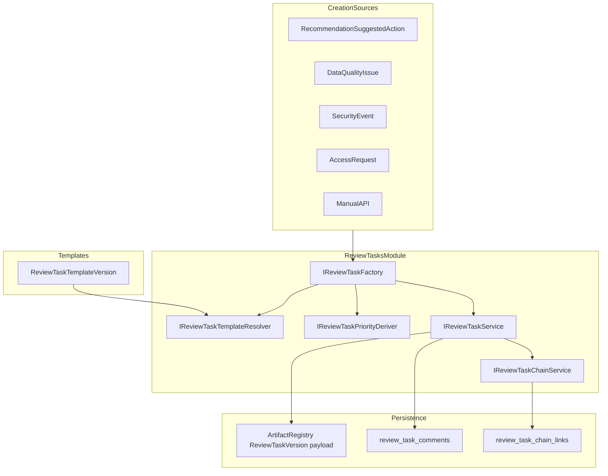

# Issue 19: Review Tasks, Task Chains, and Escalation Placeholders

## Status: Completed (2026-06-28)

All five phases implemented. Backend module at `ETOS.Backend/ReviewTasks/`, EF migration `Issue19ReviewTasks`, 11 passing tests, frontend `/tasks` inbox + detail, recommendation "Create review task" action, architecture docs updated.

## Context and readiness

**Blocked by Issue 18 — satisfied.** [Recommendation module](ETOS.Backend/Recommendations/) is implemented with evidence, suggested actions, and `SuggestedActionStatus.ConvertedToReviewTask` (status-only today). [ARCHITECTURE.md](ARCHITECTURE.md) explicitly defers full review workflows to Issue 19.

**Existing hooks to wire (not replace):**

| Source | Location | Today |
|--------|----------|-------|
| Recommendations | [RecommendationContracts.cs](ETOS.Backend/Recommendations/RecommendationContracts.cs) | `ConvertedToReviewTask` status only |
| Data quality | [DataQualityService.cs](ETOS.Backend/DataQuality/DataQualityService.cs) | `ReviewTaskReady`, `ReviewTaskHint` |
| Security events | [GovernanceModels.cs](ETOS.Backend/Governance/GovernanceModels.cs) | `ReviewTaskCreatedAt` after DQ hook |
| Access requests | [IdentityAdminService.cs](ETOS.Backend/Identity/IdentityAdminService.cs) | CRUD only; no task |
| Governance flow | [GovernanceFlowService.cs](ETOS.Backend/Explorers/GovernanceFlowService.cs) | `ReviewTask` placeholder node |
| Tools/agents | [ToolDefinitionPayloadParser.cs](ETOS.Backend/ToolRegistry/ToolDefinitionPayloadParser.cs) | `CreatesReviewTask` metadata flag |

**Issue 20 boundary:** Task `Complete` sets status and returns `decisionCreationDeferred: true`. No `DecisionArtifact`. Escalation task API is template-gated placeholder; auto-create from blocked decisions is Issue 20.

---

## Target architecture



Follow the same module pattern as [RecommendationService.cs](ETOS.Backend/Recommendations/RecommendationService.cs) and [AgentTemplateDefinitionService.cs](ETOS.Backend/AgentTemplates/AgentTemplateDefinitionService.cs): permissions, payload JSON on artifact versions, tenant fail-closed, audit via [AuditRecorder.cs](ETOS.Backend/Governance/AuditRecorder.cs).

---

## Data model

### Artifact types

- **`ReviewTaskTemplateVersion`** — governed template artifact (draft/publish lifecycle like agent templates).
- **`ReviewTaskVersion`** — task instance artifact; lifecycle state in `PayloadJson` (mutable in-place on same version, matching suggested-action updates in recommendations).

### Template payload (key fields)

- `templateKey`, `reviewTaskType`
- `priorityRules` (severity/trust/conflict weights)
- `requiresDataQualityPrerequisite` (bool)
- `escalationPath` placeholder: `{ enabled, escalationTargetRoleKey, escalationPolicyId, slaPolicyVersion }` — stored only, no timers/notifications
- `participantRoleDefaults`, `allowedOutcomeOptions` (for Issue 20)

### Task payload (key fields)

- `sourceType`, `sourceReference`, `reviewTaskType`, `status`
- `primaryOwnerUserId`, optional `assignedRoleKey`, `participants[]` with roles (`PrimaryOwner`, `Reviewer`, `Approver`, `Observer`, `Contributor`, `EscalationContact`)
- `priority`, `severity`, `trustState`, `conflictState`, confidence fields
- `evidenceReferences[]` (reuse [EvidenceLinkType](ETOS.Backend/Recommendations/RecommendationContracts.cs) subset)
- `reviewTemplateVersionId`, linked source IDs (recommendation, suggestedAction, dataQualityIssue, securityEvent, accessRequest, aiTrace, contextPackage)
- `dueDate`, `escalationPlaceholder`
- `prerequisiteTaskIds[]`, `blockingReason`

### Status enum (MVP)

`Draft | Open | Blocked | InReview | Completed | Cancelled | NeedsReevaluation`

### Operational tables (new EF migration `Issue19ReviewTasks`)

| Table | Purpose |
|-------|---------|
| `review_task_comments` | Append-only: `taskArtifactId`, `authorUserId`, `body`, `createdAt` |
| `review_task_chain_links` | `blockedTaskId`, `blockingTaskId`, `chainReason`, `blockingCondition`, `createdByUserId`, `resolvedAt` |

Use a dedicated chain table (not [ArtifactRelationshipType](ETOS.Backend/Artifacts/ArtifactModels.cs)) because chain metadata and auto-unblock rules need richer fields than current relationship enum.

### Permissions (seed in dev identity seeder)

```
review_tasks.read | .create | .assign | .manage | .admin
review_task_templates.read | .create | .readiness | .admin
```

---

## Backend module: `ETOS.Backend/ReviewTasks/`

| Component | Responsibility |
|-----------|----------------|
| `ReviewTaskTemplateContracts.cs` / `ReviewTaskTemplatePayloadParser.cs` | DTOs + JSON schema |
| `ReviewTaskTemplateService.cs` | Template CRUD + publish (mirror agent templates) |
| `ReviewTaskTemplateReadinessValidator.cs` | Publish gates; validate escalation placeholder shape when enabled |
| `ReviewTaskContracts.cs` / `ReviewTaskPayloadParser.cs` | Task DTOs + JSON |
| `ReviewTaskPriorityDeriver.cs` | Deterministic priority from severity, trust, conflict, template rules |
| `ReviewTaskTemplateResolver.cs` | Map source type / `RequiredReviewPath` / recommendation type → published template |
| `ReviewTaskFactory.cs` | Creation from all sources; copy evidence + trace refs from recommendation |
| `ReviewTaskChainService.cs` | Create chain links; auto-unblock on prerequisite completion with audit |
| `ReviewTaskService.cs` | List/get/assign/comment/status/complete/escalation |
| `ReviewTaskEndpointExtensions.cs` | `/api/admin/review-tasks` |
| `ReviewTaskTemplateEndpointExtensions.cs` | `/api/admin/review-task-templates` |

Register in [EnterpriseThreadPlatform.cs](ETOS.Backend/Platform/EnterpriseThreadPlatform.cs) and map from [Program.cs](ETOS.Backend/Program.cs).

### API endpoints

```
GET/POST  /api/admin/review-tasks
GET       /api/admin/review-tasks/{artifactId}/versions/{versionId}
POST      /api/admin/review-tasks/from-recommendation/{artifactId}/versions/{versionId}/actions/{actionId}
POST      /api/admin/review-tasks/from-data-quality-issue/{issueId}
POST      /api/admin/review-tasks/from-security-event/{eventId}
POST      /api/admin/review-tasks/from-access-request/{requestId}
PATCH     /api/admin/review-tasks/{artifactId}/versions/{versionId}/assign
PATCH     /api/admin/review-tasks/{artifactId}/versions/{versionId}/status
POST      /api/admin/review-tasks/{artifactId}/versions/{versionId}/comments
POST      /api/admin/review-tasks/{artifactId}/versions/{versionId}/complete
POST      /api/admin/review-tasks/{artifactId}/versions/{versionId}/escalation  (template-gated)
```

Template routes mirror [AgentTemplateDefinitionEndpointExtensions.cs](ETOS.Backend/AgentTemplates/AgentTemplateDefinitionEndpointExtensions.cs).

### Core behavior rules

1. **Internal assignees only** — validate `TenantMembership.IsActive` for assignee and participants; reject cross-tenant users.
2. **Recommendation → task** — govern a specific [SuggestedAction](ETOS.Backend/Recommendations/RecommendationContracts.cs), not whole recommendation; set action status to `ConvertedToReviewTask`.
3. **Task chains** — when business task needs DQ prerequisite: create DQ task (`Open`), business task (`Blocked`), chain link with reason; on DQ `Completed` with accepted resolution → business `Blocked → Open`; on rejected → `NeedsReevaluation` or stay `Blocked`; every auto-transition audited.
4. **Priority** — unit-tested matrix; no LLM.
5. **Escalation placeholder** — `CreateEscalationTaskAsync` only when template `escalationPath.enabled`; no SLA automation.
6. **Complete** — sets `Completed`; returns `decisionCreationDeferred: true`; stub `IReviewTaskCompletionHandler` interface for Issue 20.

### Platform template seeds (dev seeder, industry-neutral)

Seed 4 published templates: `data-quality-review`, `business-action-review`, `governance-security-review`, `access-request-review`. Optional follow-up: add manufacturing-specific templates under [packages/manufacturing-reference/](packages/manufacturing-reference/) — not required for Issue 19 AC.

---

## Integration touchpoints

| File | Change |
|------|--------|
| [RecommendationService.cs](ETOS.Backend/Recommendations/RecommendationService.cs) | On convert-to-task (via factory call from endpoint or service hook), update suggested action status + audit |
| [DataQualityService.cs](ETOS.Backend/DataQuality/DataQualityService.cs) | Optional create-task endpoint; stamp hook when task created |
| [GovernanceFlowService.cs](ETOS.Backend/Explorers/GovernanceFlowService.cs) | Replace ReviewTask placeholder with live nodes + chain edges from `review_task_chain_links` |
| [ARCHITECTURE.md](ARCHITECTURE.md), [docs/backend/architecture.md](docs/backend/architecture.md) | Document module; remove "deferred" wording for Issue 19 scope |

**Out of scope:** SLA timers, external assignees, `DecisionArtifact`, workflow auto-creation (Issue 24), live agent/tool auto task creation beyond optional admin factory hook.

---

## Frontend (minimal)

No dedicated tasks mockup in pack; follow mockup **21/22** inbox + detail patterns.

| Route | Work |
|-------|------|
| `/tasks` | Inbox: status, priority, assignee, blocked badge |
| `/tasks/[artifactId]` | Detail: source links, evidence, comments, chain, assign, complete |
| [RecommendationDetailView.tsx](ETOS.Frontend/src/components/recommendations/RecommendationDetailView.tsx) | Wire "Create review task" on selected suggested action |
| [etos-api.ts](ETOS.Frontend/src/lib/etos-api.ts) | Typed review-task DTOs + fetch helpers |
| [navigation.ts](ETOS.Frontend/src/config/navigation.ts) | Enable `/tasks` (currently placeholder per [ui-screen-api-map.md](.docs/.prd/.ui/ui-screen-api-map.md)) |

Thin admin surface for templates optional in this slice (API-first acceptable).

---

## Tests ([ETOS.Backend.Tests/](ETOS.Backend.Tests/))

New suites (~25–35 tests), mirroring [RecommendationTests.cs](ETOS.Backend.Tests/RecommendationTests.cs):

| Acceptance criterion | Test focus |
|---------------------|------------|
| Internal tenant users only | Assign non-member → forbidden |
| Links to rec/issues/evidence/comments/traces/prereqs | Factory + get integration |
| Priority derivation | Unit matrix: severity × trust × conflict × template |
| DQ blocks business until accepted | Chain integration: blocked → unblock on complete |
| Escalation only with template path | Create escalation without path → validation error |
| Assignments, chains, blocking, escalation placeholders | Dedicated `ReviewTaskTests`, `ReviewTaskChainTests`, `ReviewTaskTemplateTests` |

---

## Verification

```powershell
dotnet test EnterpriseThreadOS.sln --filter "FullyQualifiedName~ReviewTask"
Push-Location ETOS.Frontend; npm run typecheck; Pop-Location
```

Manual smoke: recommendation action → task → assign → comment → complete (no decision); DQ prerequisite chain unblock; governance flow shows live task node.

After code changes: `graphify update .` and `graphify cluster-only .` per repo rules.
