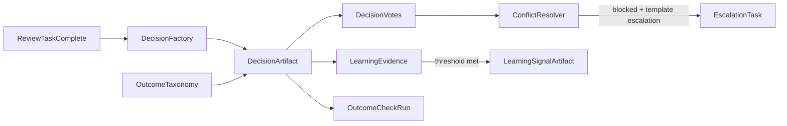

# Issue 20: Decisions, Votes, Outcomes, and Learning Evidence

## Context

Issue 19 landed review tasks with an explicit Issue 20 hook:

- [`IReviewTaskCompletionHandler`](ETOS.Backend/ReviewTasks/ReviewTaskCompletionHandler.cs) is registered as `DeferredReviewTaskCompletionHandler` (no-op)
- [`ReviewTaskService.CompleteAsync`](ETOS.Backend/ReviewTasks/ReviewTaskService.cs) always returns `DecisionCreationDeferred: true`
- [`DecisionExplorerFoundationService`](ETOS.Backend/Explorers/GraphExplorerService.cs) lists decision-shaped artifacts by payload fields already used in tests ([`ExplorersTests.SeedDecisionArtifacts`](ETOS.Backend.Tests/ExplorersTests.cs))
- [`GovernanceFlowService`](ETOS.Backend/Explorers/GovernanceFlowService.cs) still emits Decision/Outcome/Learning **placeholders** after review-task nodes

PRD intent ([Issue 20](.docs/.prd/engineering-execution-issues.md), user stories 74–83): **every completed review task produces a DecisionArtifact** (including reject/no-action), multi-participant votes with conflict handling, manual outcomes, learning evidence with rollup thresholds, and LearningPolicy/LearningModel placeholders.



---

## Architecture

Add three backend modules mirroring existing slice layout (`ReviewTasks/`, `Recommendations/`):

| Module | Responsibility |
|--------|----------------|
| [`ETOS.Backend/Decisions/`](ETOS.Backend/Decisions/) | Artifact lifecycle, votes, comments, conflict resolution, completion handler, admin APIs |
| [`ETOS.Backend/Outcomes/`](ETOS.Backend/Outcomes/) | `OutcomeTaxonomyVersion` artifact, `OutcomeCheckRun` runtime records, manual outcome APIs |
| [`ETOS.Backend/Learning/`](ETOS.Backend/Learning/) | `DecisionLearningEvidence` ops records, rollup → `LearningSignalArtifact`, policy/model placeholder artifacts |

**Storage split** (matches PRD + existing identity/import patterns):

- **Artifacts + versions** (PostgreSQL via artifact registry): `DecisionArtifact`, `OutcomeTaxonomyVersion`, `LearningSignalArtifact`, `LearningPolicyVersion`, `LearningModelVersion`
- **Operational tables**: `decision_votes`, `decision_comments`, `outcome_check_runs`, `decision_learning_evidence` (mirror [`IdentityLearningEvidence`](ETOS.Backend/IdentityResolution/IdentityResolutionModels.cs) and [`ImportMappingLearningSignalInput`](ETOS.Backend/Imports/ImportMappingLearningSignalEmitter.cs))
- **Artifact relationships**: `ReviewTask → Decision` (`DerivedFrom`), `Decision → Recommendation/Evidence` (`References`), escalation `Decision → Decision` (`RelatedTo` + description `RESOLVES`)

---

## Phase 1 — Extend review task templates (prerequisite for rules)

Extend [`ReviewTaskTemplatePayloadParser`](ETOS.Backend/ReviewTasks/ReviewTaskTemplatePayloadParser.cs) payload with **approval rule snapshot source**:

```json
{
  "approvalRule": {
    "mode": "single_approver | all_required | any_one | majority | role_based",
    "requiredRoles": ["approver", "reviewer"],
    "outcomeTaxonomyVersionId": "<guid|null>",
    "outcomeTrackingRequired": false
  }
}
```

- Update [`ReviewTaskDevelopmentTemplateSeeder`](ETOS.Backend/ReviewTasks/ReviewTaskDevelopmentTemplateSeeder.cs): business/governance templates → `all_required` + escalation; access/DQ → `single_approver`
- Extend template create/update contracts + readiness validator
- Keep existing `allowedOutcomeOptions`; validate completion `outcomeKey` against template list

Extend [`CompleteReviewTaskRequest`](ETOS.Backend/ReviewTasks/ReviewTaskContracts.cs):

- Add optional `OutcomeKey` (default from `Resolution`: `Accepted` → `accept`, `Rejected` → `reject`)
- Support explicit no-action keys already seeded: `defer`, plus `no_action`, `duplicate`, `known_exception`

---

## Phase 2 — Decision artifact core

### Artifact contract

- Artifact type: `DecisionArtifact` (normalized `DECISIONARTIFACT`; keep compatibility with explorer’s `DECISION` filter)
- Payload fields (JSON in `ArtifactVersion.PayloadJson`):
  - `title`, `status` (`PendingVotes`, `Finalized`, `BlockedConflict`, `Escalated`, `Superseded`)
  - `outcomeKey`, `outcomeSummary`, `decisionReason`
  - `reviewTaskArtifactId`, `reviewTaskVersionId`, `reviewTemplateVersionId`
  - source links copied from task payload: recommendation, DQ issue, security event, access request, trace, context package
  - `approvalRuleSnapshot` (copied from template at creation time)
  - `participantUserIds`, `evidenceReferences[]`, `conflictState` (`none`, `blocked`, `resolved`)
  - `outcomeTrackingRequired`, `outcomeTaxonomyVersionId`
  - `finalizedAt`, `finalizedByUserId`, `parentDecisionArtifactId` (escalation resolution chain)

### Operational entities

- `DecisionVote`: tenant, decisionArtifactId, userId, vote (`Approve`, `Reject`, `Abstain`, `Dissent`), comment, optional confidence, evidence ref ids, createdAt
- `DecisionComment`: append-only thread (reuse review-task comment pattern)

### Services

- `IDecisionFactory` — build decision from completed task + template snapshot + evidence copy
- `IDecisionVoteService` — cast/update vote, append comment, recompute status
- `IDecisionConflictResolver` — apply approval rule snapshot:
  - unanimous/all-required conflict → `BlockedConflict` unless majority mode resolves
  - majority mode → finalize when >50% approvers voted approve
  - any-one → first approve finalizes
- `DecisionReviewTaskCompletionHandler` replaces `DeferredReviewTaskCompletionHandler`:
  1. Load task + template version
  2. Create `DecisionArtifact` + link relationships
  3. Record completing user’s vote/outcome
  4. Auto-finalize for `single_approver`; else `PendingVotes`
  5. Emit `DecisionLearningEvidence` immediately (low-level, per PRD hierarchy)
  6. Invoke rollup evaluator

### Wire completion response

In [`ReviewTaskService.CompleteAsync`](ETOS.Backend/ReviewTasks/ReviewTaskService.cs):

- Return `DecisionCreationDeferred: false` and new `DecisionArtifactId`
- Update [`CompleteReviewTaskResponse`](ETOS.Backend/ReviewTasks/ReviewTaskContracts.cs) + frontend DTOs

### Permissions + DI

New permission keys (seed in [`DevelopmentIdentitySeeder`](ETOS.Backend/Identity/DevelopmentIdentitySeeder.cs)):

- `decisions.read`, `decisions.vote`, `decisions.manage`, `decisions.admin`
- `outcomes.read`, `outcomes.record`, `outcomes.admin`
- `learning_signals.read`, `learning.admin`

Register in [`EnterpriseThreadPlatform.cs`](ETOS.Backend/Platform/EnterpriseThreadPlatform.cs); map endpoints in [`Program.cs`](ETOS.Backend/Program.cs).

---

## Phase 3 — Vote APIs and escalation from conflict

Admin routes under `/api/admin/decisions`:

```
GET    /api/admin/decisions
GET    /api/admin/decisions/{artifactId}/versions/{versionId}
POST   /api/admin/decisions/{artifactId}/versions/{versionId}/votes
POST   /api/admin/decisions/{artifactId}/versions/{versionId}/comments
POST   /api/admin/decisions/{artifactId}/versions/{versionId}/finalize   (when rule satisfied)
POST   /api/admin/decisions/{artifactId}/versions/{versionId}/escalation (template-gated, reuses ReviewTaskFactory pattern)
```

**Escalation behavior** (PRD conversation 957–959):

- Only when source template `escalationPath.enabled` and decision status is `BlockedConflict`
- Preserve original decision + votes; create escalation review task linked to blocked decision
- Child escalation decision gets `parentDecisionArtifactId`; on finalize sets `RESOLVES` relationship and updates original status to `Superseded` or `Finalized` per template authority flag (placeholder metadata on escalation path: `canOverrideOriginalOutcome: true`)

Reuse [`ReviewTaskService.CreateEscalationTaskAsync`](ETOS.Backend/ReviewTasks/ReviewTaskService.cs) internals via shared helper or call from decision service with `sourceDecisionArtifactId`.

---

## Phase 4 — Outcomes

### OutcomeTaxonomyVersion artifact

- CRUD/readiness/publish endpoints (mirror [`AgentTemplateDefinitionEndpointExtensions`](ETOS.Backend/AgentTemplates/AgentTemplateDefinitionEndpointExtensions.cs) depth)
- Dev seed one published taxonomy with categories aligned to PRD examples: `approved`, `rejected`, `no_action`, `defer`, `duplicate`, `known_exception`, `escalated`
- Link template `approvalRule.outcomeTaxonomyVersionId` in seeder

### OutcomeCheckRun runtime record

Table `outcome_check_runs`:

- `decisionArtifactId`, `checkType`, `expectedOutcome`, `actualOutcome`, `outcomeStatus` (`Pending`, `Successful`, `Failed`, `Partial`), `outcomeConfidence`, `measuredAt`, `evidenceSummary`, `recordedByUserId`

### Manual outcome API

```
POST /api/admin/decisions/{artifactId}/versions/{versionId}/outcomes
```

- Creates `OutcomeCheckRun` + optional links to recommendation/source evidence
- Validates taxonomy category when `outcomeTaxonomyVersionId` present on decision

No scheduled outcome checks in MVP (future placeholder only).

---

## Phase 5 — Learning evidence and rollup

### Immediate learning evidence

On decision finalize, vote cast, and manual outcome record:

- Insert `DecisionLearningEvidence` with `patternKey` (e.g. `{sourceType}:{outcomeKey}:{reviewTaskType}`), safe summary, source ids
- Pattern mirrors [`ImportMappingLearningSignalEmitter`](ETOS.Backend/Imports/ImportMappingLearningSignalEmitter.cs) — inputs first, artifacts later

### Rollup → LearningSignalArtifact

- `ILearningSignalRollupService` counts matching `patternKey` per tenant within configurable window
- Config section `LearningSignals:Rollup` in [`appsettings.json`](ETOS.Backend/appsettings.json): `MinOccurrences` (default **3** for testability; PRD narrative uses higher counts for production tuning), `WindowDays` (default 30)
- When threshold met: create `LearningSignalArtifact` version with payload `{ patternKey, occurrenceCount, sourceDecisionIds[], summary, status: "active" }`, link via `ArtifactRelationship` `DerivedFrom` evidence rows
- Idempotent: do not create duplicate signal for same patternKey while an active signal exists

### Placeholder artifacts

- `LearningPolicyVersion` + `LearningModelVersion`: registry CRUD + readiness only; payload documents future-scope metadata (`status: "placeholder"`, no execution)
- Seed one draft placeholder each in dev for explorer visibility

---

## Phase 6 — Explorer and governance flow integration

Upgrade [`DecisionExplorerFoundationService`](ETOS.Backend/Explorers/GraphExplorerService.cs):

- Query live decision artifacts created by Issue 20 (not seed-only)
- Add filters: `conflict`, `outcomeKey`, `hasOutcome` (Issue 21 adds richer KPI filters)

Update [`GovernanceFlowService`](ETOS.Backend/Explorers/GovernanceFlowService.cs):

- When review task node exists, look up linked `DecisionArtifact` via relationship or payload `reviewTaskArtifactId`
- Replace Decision placeholder with live node + edge `review-task → decision`
- Show OutcomeCheckRun summary node when present; LearningSignal placeholder → live when linked

---

## Phase 7 — Frontend (detail page included)

Per your scope choice: **backend + `/decisions/[artifactId]` detail**.

| Route | Work |
|-------|------|
| [`/decisions`](ETOS.Frontend/src/app/decisions/page.tsx) | Remove “foundation only” copy; show status/conflict/outcome from live API |
| `/decisions/[artifactId]` | **New** server page + client panel: participants, vote list, cast vote (if permitted), comments, linked review task/recommendation, manual outcome form |
| [`/tasks/[artifactId]`](ETOS.Frontend/src/app/tasks/) | After complete, show link to created decision (`decisionArtifactId`) |
| [`etos-api.ts`](ETOS.Frontend/src/lib/etos-api.ts) | Typed DTOs + fetch helpers for decision list/detail/vote/outcome endpoints |

Follow existing task debug/detail patterns ([`ReviewTaskDetailDebugPanel`](ETOS.Frontend/src/components/review-tasks/)) — functional, not full mockup reskin (UI backlog owns chrome).

---

## Phase 8 — Tests and docs

New test suites in [`ETOS.Backend.Tests/`](ETOS.Backend.Tests/) (~30–40 tests):

| AC area | Tests |
|---------|-------|
| Decision on every completed task | Accepted + Rejected + `no_action`/`defer` outcome keys |
| Multi-participant votes | All-required conflict → `BlockedConflict`; majority resolves |
| Escalation | Conflict + enabled path → escalation task; disabled path → validation error |
| Outcome links | Manual `OutcomeCheckRun` linked to decision + recommendation evidence |
| Learning | Evidence on finalize; rollup at threshold; no duplicate signal |
| Explorer | List returns new decisions; governance flow includes decision node |
| Agent boundary | Existing guards stay: agents/tools cannot create decisions ([`RecommendationFactory`](ETOS.Backend/Recommendations/RecommendationFactory.cs)) |

Update:

- [`ARCHITECTURE.md`](ARCHITECTURE.md), [`docs/backend/architecture.md`](docs/backend/architecture.md), [`docs/local-development.md`](docs/local-development.md) — remove deferred wording for Issue 20 scope
- Post-change: `graphify update .` + `graphify cluster-only .`

Verification:

```powershell
dotnet test EnterpriseThreadOS.sln --filter "FullyQualifiedName~Decision|FullyQualifiedName~Outcome|FullyQualifiedName~Learning"
Push-Location ETOS.Frontend; npm run typecheck; npm run lint; Pop-Location
```

---

## Explicit out of scope (Issue 21+)

- Governance Dashboard KPI calculations and trend analytics ([Issue 21](.docs/.prd/engineering-execution-issues.md))
- Decision Explorer advanced filters (participants/evidence/conflicts at KPI depth)
- Scheduled OutcomeCheckRun automation
- LearningModel execution / autonomous recommendation creation from signals
- Custom KPI definitions
- Full mockup reskin of decision screens (UI backlog)

---

## Key files to touch

**New:** `ETOS.Backend/Decisions/*`, `ETOS.Backend/Outcomes/*`, `ETOS.Backend/Learning/*`, EF migration `Issue20DecisionsOutcomesLearning`, `ETOS.Backend.Tests/DecisionTests.cs`, `OutcomeTests.cs`, `LearningSignalTests.cs`, `ETOS.Frontend/src/app/decisions/[artifactId]/page.tsx`

**Modify:** [`ReviewTaskCompletionHandler.cs`](ETOS.Backend/ReviewTasks/ReviewTaskCompletionHandler.cs), [`ReviewTaskService.cs`](ETOS.Backend/ReviewTasks/ReviewTaskService.cs), [`ReviewTaskTemplatePayloadParser.cs`](ETOS.Backend/ReviewTasks/ReviewTaskTemplatePayloadParser.cs), [`GovernanceFlowService.cs`](ETOS.Backend/Explorers/GovernanceFlowService.cs), [`GraphExplorerService.cs`](ETOS.Backend/Explorers/GraphExplorerService.cs), [`EnterpriseThreadPlatform.cs`](ETOS.Backend/Platform/EnterpriseThreadPlatform.cs), [`DevelopmentIdentitySeeder.cs`](ETOS.Backend/Identity/DevelopmentIdentitySeeder.cs), [`etos-api.ts`](ETOS.Frontend/src/lib/etos-api.ts)
