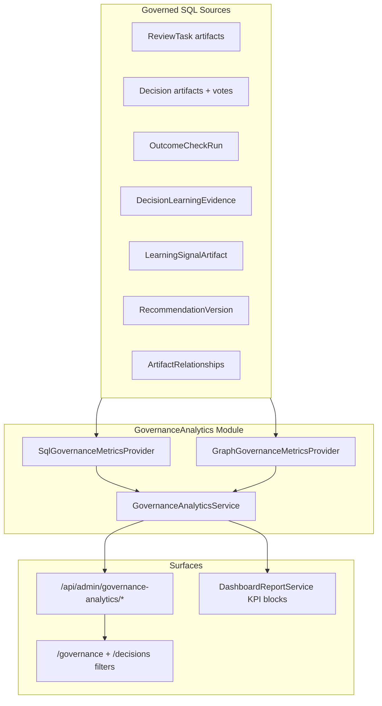

# Issue 21: Governance Dashboard and KPI Analytics

## Context

**Blocked by:** [Issue 20](.docs/.prd/engineering-execution-issues.md) (Decisions, Outcomes, Learning). Uncommitted Issue 20 work in repo ([`ETOS.Backend/Decisions/`](ETOS.Backend/Decisions/), [`Outcomes/`](ETOS.Backend/Outcomes/), [`Learning/`](ETOS.Backend/Learning/)) must land first.

**PRD intent** (user stories 83–86): Decision Explorer with rich filters; Governance Dashboard with platform-defined KPIs and trends; custom KPI definitions as placeholders only.

**Already exists:**

| Asset | Location | Gap |
|-------|----------|-----|
| KPI key catalog (8 platform + 1 deferred custom) | [`PlatformGovernanceKpiPlaceholders`](ETOS.Backend/Dashboards/DashboardReportContracts.cs) | Preview blocks return `"deferred"` via [`BuildKpiPlaceholderBlock`](ETOS.Backend/Dashboards/DashboardReportService.cs) |
| Decision admin list with `status`, `conflict`, `outcomeKey` | [`DecisionService.ListAsync`](ETOS.Backend/Decisions/DecisionService.cs) | Explorer path lacks parity |
| Decision Explorer (basic) | [`DecisionExplorerFoundationService`](ETOS.Backend/Explorers/GraphExplorerService.cs) | Only `status`, `participant`, `search`; in-memory filter after full tenant load |
| Audit/security lists | [`GovernanceEndpointExtensions`](ETOS.Backend/Governance/GovernanceEndpointExtensions.cs) | No governance KPI endpoints |
| Frontend decisions page | [`/decisions`](ETOS.Frontend/src/app/decisions/page.tsx) | No filters; no `/governance` route |
| Operational data for KPIs | `ReviewTaskVersion`, `DecisionArtifact`, `OutcomeCheckRun`, `DecisionLearningEvidence`, `LearningSignalArtifact`, recommendation payloads | No aggregation layer |



---

## Architecture

Add module [`ETOS.Backend/GovernanceAnalytics/`](ETOS.Backend/GovernanceAnalytics/) mirroring slice layout of [`Decisions/`](ETOS.Backend/Decisions/) and [`Dashboards/`](ETOS.Backend/Dashboards/).

| Component | Responsibility |
|-----------|----------------|
| `GovernanceAnalyticsContracts.cs` | DTOs, permissions, KPI keys, trend bucket types |
| `PlatformGovernanceKpiDefinitions.cs` | Platform formulas (single source of truth for keys already in catalog) |
| `SqlGovernanceMetricsProvider.cs` | Counts, rates, durations from EF operational tables |
| `GraphGovernanceMetricsProvider.cs` | Relationship-derived supplements via `ArtifactRelationships` (+ optional graph memory when linked) |
| `GovernanceAnalyticsService.cs` | Unified KPI layer; tenant-scoped orchestration |
| `GovernanceAnalyticsEndpointExtensions.cs` | Minimal API routes |
| `DecisionExplorerQueryHelper.cs` (shared) | Parse latest decision payloads once; apply filters consistently |

**Storage:** No new operational tables for MVP. KPIs computed from existing tables + artifact payloads. Custom KPI = catalog placeholder only (`tenant_custom_kpi` + optional read-only `CustomKpiDefinitionVersion` artifact type constant—no CRUD execution).

**Tenant boundary:** All queries filter on `ITenantContextResolver` tenant ID. “Tenant filter” in acceptance = fail-closed isolation, not cross-tenant admin views.

---

## Platform KPI formulas (MVP)

Align keys 1:1 with [`PlatformGovernanceKpiPlaceholders.Catalog`](ETOS.Backend/Dashboards/DashboardReportContracts.cs):

| KPI key | Formula (tenant-scoped, window default 30d for rates) |
|---------|--------------------------------------------------------|
| `open_reviews` | Review tasks whose latest payload `Status` ∈ `{Open, InReview, Blocked, NeedsReevaluation}` |
| `pending_decisions` | Decisions with `Status == PendingVotes` |
| `blocked_decisions` | Decisions with `Status == BlockedConflict` OR `ConflictState == Blocked` |
| `escalations` | Open review tasks whose title/source contains `:escalation` OR decisions with `Status == Escalated` OR review tasks linked from blocked decisions via `ArtifactRelationship` |
| `decision_throughput` | Count of `Finalized` decisions with `FinalizedAt` (or `UpdatedAt` fallback) in window |
| `outcome_verification_rate` | `OutcomeCheckRun` rows with `OutcomeStatus == Successful` ÷ finalized decisions with ≥1 outcome check (0 if denominator 0) |
| `learning_signal_rate` | New `LearningSignalArtifact` versions in window ÷ finalized decisions in window |
| `high_risk_recommendations` | Recommendations with payload `RiskState` ∈ `{High, Critical}` and lifecycle ∉ `{Accepted, Rejected}` (still actionable) |
| `tenant_custom_kpi` | Placeholder only—return `{ source: "tenant_custom_deferred", value: null }` |

**Trend analytics:** `GET .../kpis/{kpiKey}/trends?windowDays=30&bucket=day` returns `{ bucketStart, value }[]` for throughput, blocked, outcome rate, learning rate, open reviews. Use UTC day buckets; order on entity timestamps before projection ([EF rule](.cursor/rules/ef-core-query-projection-ordering.mdc)).

**Graph supplements** (secondary cards, not blocking acceptance):
- Max decision chain depth via `ArtifactRelationships` (`DerivedFrom` review→decision, escalation links)
- Count of decisions with unresolved upstream review chain

---

## Phase 1 — Backend module and permissions

**New permission** (seed in [`DevelopmentIdentitySeeder`](ETOS.Backend/Identity/DevelopmentIdentitySeeder.cs)):

- `governance_analytics.read`

Register in [`EnterpriseThreadPlatform.cs`](ETOS.Backend/Platform/EnterpriseThreadPlatform.cs); map in [`Program.cs`](ETOS.Backend/Program.cs).

**Endpoints** under `/api/admin/governance-analytics`:

```
GET  /dashboard                          → snapshot: all KPI cards + generatedAt + windowDays
GET  /kpis                               → list KPI definitions + current values
GET  /kpis/{kpiKey}/trends               → time series (validate kpiKey against catalog)
GET  /high-risk-recommendations          → paginated list (title, risk, lifecycle, route)
GET  /kpi-placeholders                   → platform + custom deferred catalog (reuse catalog)
```

Response shape example:

```csharp
public sealed record GovernanceKpiValueResponse(
    string KpiKey, string Title, string Source,
    decimal? Value, string? Unit, string? FormattedValue,
    string Status); // ready | deferred

public sealed record GovernanceDashboardResponse(
    IReadOnlyCollection<GovernanceKpiValueResponse> Kpis,
    IReadOnlyCollection<HighRiskRecommendationSummaryResponse> HighRiskRecommendations,
    int WindowDays, DateTimeOffset GeneratedAt);
```

Reuse existing artifact-type constants: [`ReviewTaskArtifactTypes`](ETOS.Backend/ReviewTasks/ReviewTaskContracts.cs), [`DecisionArtifactTypes`](ETOS.Backend/Decisions/DecisionContracts.cs), [`RecommendationArtifactTypes`](ETOS.Backend/Recommendations/RecommendationContracts.cs), [`LearningArtifactTypes`](ETOS.Backend/Learning/LearningContracts.cs).

---

## Phase 2 — Decision Explorer completion

Extract shared filtering from [`DecisionService.MatchesFilter`](ETOS.Backend/Decisions/DecisionService.cs) into `DecisionExplorerQueryHelper` and use in both admin list and explorer.

**Extend explorer query params** in [`ExplorerEndpointExtensions`](ETOS.Backend/Explorers/ExplorerEndpointExtensions.cs):

```
GET /api/admin/explorers/decisions
  ?status &participant &search
  &conflict &outcomeKey &hasOutcome &minEvidenceCount
```

Filter semantics:

- `hasOutcome=true` → non-empty `OutcomeKey` or ≥1 `OutcomeCheckRun`
- `minEvidenceCount` → payload `EvidenceReferences.Count >= n`
- `conflict` → matches `ConflictState` enum string

Update [`DecisionExplorerItemResponse`](ETOS.Backend/Explorers/ExplorerContracts.cs) if needed (`outcomeKey`, `hasOutcome` booleans for UI).

**Performance note:** Payload fields still require loading latest versions; keep tenant-bounded queries and consider `Take(500)` cap with documented limit (matches artifact explorer patterns).

---

## Phase 3 — Wire Dashboard KPI placeholders

In [`DashboardReportService`](ETOS.Backend/Dashboards/DashboardReportService.cs):

- Inject `IGovernanceAnalyticsService`
- Replace `BuildKpiPlaceholderBlock` static text with live values when `block.KpiKey != tenant_custom_kpi`
- Set `PreviewBlockResponse.Status` to `"ready"` and put formatted value in `SafeSummary`
- Custom KPI block stays `"deferred"`

Move or re-export catalog from GovernanceAnalytics to avoid duplication—Dashboards imports KPI keys from GovernanceAnalytics contracts.

---

## Phase 4 — Frontend (minimal functional dashboard)

Issue 21 acceptance requires dashboard **displays** KPIs; full mockup reskin stays [UI-4.1](.docs/.prd/.ui/engineering-execution-ui-issues.md).

**[`etos-api.ts`](ETOS.Frontend/src/lib/etos-api.ts):**

- `getGovernanceDashboard()`, `getGovernanceKpiTrends(kpiKey, windowDays)`, `getHighRiskRecommendations()`
- Extend `getDecisionExplorerList(filters)` with new query params

**New route:** `ETOS.Frontend/src/app/governance/page.tsx`

- KPI card grid from `/dashboard` API
- Simple trend table (no chart lib required for Issue 21; defer Recharts to UI-4.1)
- High-risk recommendations table with links to `/recommendations/[id]`
- Reuse existing audit/security sections from `getGovernanceLists()` for UI-4.1 parity stub

**Update [`/decisions`](ETOS.Frontend/src/app/decisions/page.tsx):**

- Server-side filter form → query string → `getDecisionExplorerList`
- Filter chips: status, conflict, has outcome, min evidence

Add nav link to `/governance` from home/explorers hub.

---

## Phase 5 — Tests and docs

**New test file:** [`ETOS.Backend.Tests/GovernanceAnalyticsTests.cs`](ETOS.Backend.Tests/GovernanceAnalyticsTests.cs)

| Test | Validates |
|------|-----------|
| `Dashboard_counts_open_reviews_and_pending_decisions` | SQL provider with seeded review tasks + decisions |
| `Blocked_decisions_and_escalations` | Conflict + escalation task seed |
| `Outcome_verification_rate` | OutcomeCheckRun numerator/denominator |
| `Learning_signal_rate` | LearningSignalArtifact + finalized decisions |
| `High_risk_recommendations_excludes_terminal` | RiskState filter |
| `Trend_aggregation_buckets_by_day` | 7-day series ordering |
| `Tenant_isolation_denies_other_tenant_data` | Cross-tenant seed invisible |
| `Custom_kpi_returns_deferred` | Placeholder never computes |

**Extend** [`ExplorersTests.cs`](ETOS.Backend.Tests/ExplorersTests.cs): decision explorer filters (`conflict`, `hasOutcome`, `minEvidenceCount`).

**Docs:** Update [`ARCHITECTURE.md`](ARCHITECTURE.md) — replace “deferred to Issue 21” wording for Dashboards/Explorers; add GovernanceAnalytics module bullet. Post-change: `graphify update .` + `graphify cluster-only .`.

**Verification:**

```powershell
dotnet test EnterpriseThreadOS.sln --filter "FullyQualifiedName~GovernanceAnalytics|FullyQualifiedName~DecisionExplorer"
Push-Location ETOS.Frontend; npm run typecheck; npm run lint; Pop-Location
```

---

## Explicit out of scope

- `CustomKpiDefinitionVersion` artifact CRUD or tenant-configurable formulas
- Scheduled KPI materialization / caching layer
- Full UI-4.1 shell, Recharts/Tremor charts, light/dark design-system reskin
- Cross-tenant governance admin views
- Neo4j-heavy graph analytics beyond lightweight `ArtifactRelationships` supplements
- Issue 22+ tool registry changes

---

## Key files

**New:** `ETOS.Backend/GovernanceAnalytics/*`, `ETOS.Backend.Tests/GovernanceAnalyticsTests.cs`, `ETOS.Frontend/src/app/governance/page.tsx`

**Modify:** [`EnterpriseThreadPlatform.cs`](ETOS.Backend/Platform/EnterpriseThreadPlatform.cs), [`Program.cs`](ETOS.Backend/Program.cs), [`DevelopmentIdentitySeeder.cs`](ETOS.Backend/Identity/DevelopmentIdentitySeeder.cs), [`DashboardReportService.cs`](ETOS.Backend/Dashboards/DashboardReportService.cs), [`GraphExplorerService.cs`](ETOS.Backend/Explorers/GraphExplorerService.cs) (DecisionExplorer), [`ExplorerEndpointExtensions.cs`](ETOS.Backend/Explorers/ExplorerEndpointExtensions.cs), [`ExplorerContracts.cs`](ETOS.Backend/Explorers/ExplorerContracts.cs), [`etos-api.ts`](ETOS.Frontend/src/lib/etos-api.ts), [`decisions/page.tsx`](ETOS.Frontend/src/app/decisions/page.tsx), [`ARCHITECTURE.md`](ARCHITECTURE.md)
