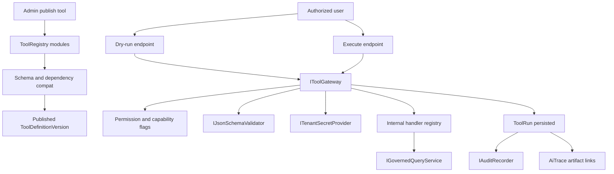

# Issue 22 — Tool, Skill, and Connector Registry

## Context and boundaries

Per [engineering-execution-checkpoints.md](.context/.checkpoints/engineering-execution-checkpoints.md) **Option A**, Issue 22 is the first agent-layer spike slice. Issue 18.5 is complete; Issues 19–21 stay deferred.

**In scope (Issue 22):**
- `ToolDefinitionVersion`, `SkillDefinitionVersion`, `ConnectorDefinitionVersion` registry (BaseArtifact + `PayloadJson`, same pattern as [CapabilityDefinitionService.cs](ETOS.Backend/Capabilities/CapabilityDefinitionService.cs))
- Schema compatibility at publish and execution
- `ToolRun` runtime records, dry-run, audit + AI Trace links
- Tenant-aware secret provider abstraction + scoped credential contracts
- Disabled write-capable connector contracts (metadata only; execution blocked)
- One live internal read-only tool handler for end-to-end validation
- Reference package seed for `graph-query-tool` + connector fixtures
- Minimal frontend shells matching mockup routes 24–27 in [SCREEN_MAP.md](References/etos_ui_mockup_pack_with_digital_thread_timeline/etos_ui_mockups/SCREEN_MAP.md)

**Explicitly out of scope (Issue 23+):**
- `AgentVersion`, `AgentRun`, agent execute API, live `PydanticAiRuntimeAdapter` HTTP
- MassTransit-backed async execution (contract/placeholder only)
- Real ERP/source-system connectors, enabled write actions
- Review-task/decision creation from tools (stub metadata flags OK; no Issue 19 workflows)
- `SkillRun` records (optional enum placeholder; `ToolRun` is the MVP execution record)



---

## Phase 1 — Backend module layout (`ETOS.Backend/ToolRegistry/`)

Create one module with three artifact families (matches PRD “Tool Registry Module”), mirroring [Capabilities/](ETOS.Backend/Capabilities/) and [AgentTemplates/](ETOS.Backend/AgentTemplates/):

| Area | Files | Artifact type |
|------|-------|---------------|
| Tools | `ToolDefinitionContracts.cs`, `ToolDefinitionPayloadParser.cs`, `ToolDefinitionReadinessValidator.cs`, `ToolDefinitionService.cs`, `ToolDefinitionEndpointExtensions.cs` | `ToolDefinitionVersion` |
| Skills | Same pattern under `Skills/` subfolder or prefixed types | `SkillDefinitionVersion` |
| Connectors | Same pattern under `Connectors/` subfolder | `ConnectorDefinitionVersion` |
| Shared | `ToolRegistryPermissions.cs`, `ToolCapabilityFlags.cs`, `ToolRiskLevels.cs` | — |

Move `FutureToolDefinitionArtifactTypes` from [AgentTemplateDefinitionContracts.cs](ETOS.Backend/AgentTemplates/AgentTemplateDefinitionContracts.cs) into `ToolDefinitionContracts.cs` and update agent-template validators to reference the real constant (no behavior change).

### Tool payload contract (`ArtifactVersion.PayloadJson`)

Align with PRD capability model ([engineering-execution-prd.md](.docs/.prd/engineering-execution-prd.md) Milestone 5 + conversation spec):

```csharp
// Essential fields (toolKey, toolCategory, riskLevel, capability flags, schemas, deps)
ToolKey, ToolCategory,
ReadOnly, CreatesPlatformArtifact, CreatesReviewTask, CreatesDecision,
CallsExternalSystem, WritesExternalSystem, RequiresApproval, SupportsDryRun,
RiskLevel, RequiredPermissionKeys[],
InputSchemaJson, OutputSchemaJson,
ReferencedOutputSchemaVersionId?, ReferencedCapabilityDefinitionVersionIds[],
ReferencedBusinessPolicyDefinitionVersionIds[], CompatibleModelPackageVersionIds[],
CompatibleOntologyVersionIds[], AllowedQueryIntentKeys[],
InternalHandlerKey?, ConnectorDefinitionVersionId?,
CompositionMetadata, FutureExtensionPlaceholders
```

**Publish/readiness rules:**
- Required: `toolKey`, `toolCategory`, `riskLevel`, valid JSON for both schemas
- At least one compatibility anchor: published model package, ontology, capability, or business policy (reuse validator style from [CapabilityDefinitionReadinessValidator.cs](ETOS.Backend/Capabilities/CapabilityDefinitionReadinessValidator.cs))
- `WritesExternalSystem == true` → publish allowed only when linked `ConnectorDefinitionVersion` exists and `ExecutionEnabled == false` with `DisabledReason` (MVP write contracts are register-only)
- `InternalHandlerKey` required for non-connector tools in MVP; unknown keys block publish
- Optional `ReferencedOutputSchemaVersionId`: same-tenant, correct artifact type, published; output schemas must be structurally compatible (shared validator)

### Skill payload contract

- `skillKey`, summary, `ReferencedToolDefinitionVersionIds[]` (all published, same tenant)
- Composed `inputSchemaJson` / `outputSchemaJson` (skill-level envelope; tool refs validated at publish)
- `IsGloballyShared` metadata for Issue 23 (no runtime yet)

### Connector payload contract

- `connectorKey`, `connectorKind` (`Read`, `Write`, `Action`)
- `CallsExternalSystem`, `WritesExternalSystem`, `ExecutionEnabled`, `DisabledReason`
- `CredentialScopeKey`, `SecretReferenceKey` (provider path only—never store secret values)
- `SupportedOperations[]` metadata
- MVP: seed read connector `mock-erp-read` (`ExecutionEnabled=true`), write connectors (`ExecutionEnabled=false`, explicit disabled reason)

### Admin API routes

Mirror capabilities lifecycle:

- `GET/POST /api/admin/tools`, version CRUD, `mark-ready`, `publish`, `dependencies`
- `GET/POST /api/admin/skills`, same lifecycle
- `GET/POST /api/admin/connectors`, same lifecycle
- `POST /api/admin/tools/{artifactId}/versions/{versionId}/compatibility-scan` (returns blocking notes; also invoked from mark-ready/publish)

Register in [EnterpriseThreadPlatform.cs](ETOS.Backend/Platform/EnterpriseThreadPlatform.cs) and [Program.cs](ETOS.Backend/Program.cs).

### Permissions (seed in [DevelopmentIdentitySeeder.cs](ETOS.Backend/Identity/DevelopmentIdentitySeeder.cs))

- Registry: `tools.read|create|readiness|admin`, `skills.*`, `connectors.*`
- Execution: `tools.execute`, `tools.dry_run`, `tool-runs.read`
- Grant admin role full set; consider `tools.execute` on admin only for MVP (Issue 23 will add draft-agent test permissions)

---

## Phase 2 — Schema compatibility service

Add **JsonSchema.Net** to [ETOS.Backend.csproj](ETOS.Backend/ETOS.Backend.csproj).

Extract shared validation from [OutputSchemaValidator.cs](ETOS.Backend/GovernedChat/OutputSchemaValidator.cs) into `ETOS.Backend/Platform/JsonSchema/IJsonSchemaValidator.cs`:
- `ValidateDocumentAgainstSchema(json, schemaJson)` — used by governed chat (delegate existing logic) and tool gateway
- `ValidateSchemaDefinition(schemaJson)` — structural JSON Schema check at publish
- `ValidateSchemaCompatibility(outputSchemaA, outputSchemaB)` — subset/compatibility check when pinning `OutputSchemaVersion` artifacts

**Publish-time:** `ToolDefinitionReadinessValidator` + compatibility scan endpoint.
**Execution-time:** validate input before handler; validate output safe summary against output schema.

---

## Phase 3 — Runtime: `ToolRun` + gateway

### EF model + migration `Issue22ToolRuns`

New entity in `ETOS.Backend/ToolRegistry/ToolRunModels.cs`, map in [EnterpriseThreadDbContext.cs](ETOS.Backend/Infrastructure/Persistence/EnterpriseThreadDbContext.cs):

| Field | Purpose |
|-------|---------|
| `ToolDefinitionVersionId`, `TenantId`, `RequestedByUserId` | Scope |
| `Status` | `Pending`, `Running`, `Succeeded`, `Failed`, `DryRunSucceeded`, `Blocked` |
| `IsDryRun` | Dry-run metadata |
| `InputSafeSummaryJson`, `OutputSafeSummaryJson` | Safe summaries only |
| `ValidationResultJson`, `CompatibilityNotesJson`, `ErrorSafeSummary` | Schema/compat results |
| `AuditRecordId`, `AiTraceRecordId` | Trace links |
| `ConnectorCredentialSafeSummaryJson` | Scoped cred metadata (no raw token in API) |
| `ParentAgentRunId?` | Nullable forward-compat column for Issue 23 |
| `CreatedAt`, `CompletedAt` | Retention placeholders |

### `IToolGateway` + `ToolGatewayService`

1. Load published tool version; deny cross-tenant
2. Enforce `RequiredPermissionKeys` + tool execute permission
3. Reject `WritesExternalSystem` or disabled connector execution with `Blocked` ToolRun + audit
4. **Dry-run:** validate input schema, simulate handler metadata (expected output schema shape, handler key, connector scope summary), no side effects → `DryRunSucceeded`
5. **Execute (sync MVP):** run internal handler, validate output, persist ToolRun, record audit

### Internal handlers (`IToolHandler` registry)

| Handler key | Behavior |
|-------------|----------|
| `governed-query-v1` | Delegates to [IGovernedQueryService](ETOS.Backend/GovernedQuery/GovernedQueryService.cs); read-only; produces safe context summary JSON |
| `disabled-write-connector-v1` | Always blocked; used to test disabled write contract enforcement |

MassTransit placeholder: `IToolExecutionQueue` + `DisabledToolExecutionQueue` registered in DI; document in [docs/architecture/extension-points.md](docs/architecture/extension-points.md).

### Secret provider

`ITenantSecretProvider` + `DevelopmentTenantSecretProvider`:
- `IssueScopedCredentialAsync(tenantId, connectorKey, scope, ct)` → `{ CredentialReferenceId, ExpiresAt, SafeSummary }`
- API responses and ToolRun records never include raw secret material
- Connector-backed dry-run returns credential issuance safe summary only

### Execution endpoints

- `POST /api/admin/tools/{artifactId}/versions/{versionId}/dry-run`
- `POST /api/admin/tools/{artifactId}/versions/{versionId}/execute` (sync)
- `GET /api/admin/tool-runs`, `GET /api/admin/tool-runs/{runId}`

---

## Phase 4 — AI Trace and audit integration

Extend [AiTraceModels.cs](ETOS.Backend/AiTrace/AiTraceModels.cs):
- `AiTraceKind.ToolRun`
- `AiTraceArtifactLinkKind.ToolRun`, `ToolDefinition`, `ConnectorDefinition`

Extend [IAiTraceRecorder](ETOS.Backend/AiTrace/AiTraceRecorder.cs) with `CreateFromToolRunAsync(toolRunId, auditRecordId, ct)` — links tool version, connector (if any), retrieval run (when handler used governed query).

Record audit actions: `tools.dry_run`, `tools.execute`, `tools.publish`, `connectors.credential.issue` (safe summaries).

---

## Phase 5 — Reference package + agent-template wiring

Extend [packages/manufacturing-reference/](packages/manufacturing-reference/):

- `artifacts/tools.json` — `graph-query-tool` (`internalHandlerKey: governed-query-v1`, read-only, medium risk, schemas, allowed query intents)
- `artifacts/skills.json` — optional thin skill wrapping graph-query-tool
- `artifacts/connectors.json` — `mock-erp-read` (enabled read), `mock-erp-write-item` (disabled write)
- Update [package.manifest.json](packages/manufacturing-reference/package.manifest.json)
- Extend [ManufacturingReferencePackageInstaller.cs](ETOS.Backend/Packages/ManufacturingReferencePackageInstaller.cs): install tools/connectors/skills, publish, wire [agent-templates.json](packages/manufacturing-reference/artifacts/agent-templates.json) `referencedToolKeys: ["graph-query-tool"]`

Update [AgentTemplateDefinitionReadinessValidator.cs](ETOS.Backend/AgentTemplates/AgentTemplateDefinitionReadinessValidator.cs) — no code change needed if tool IDs validate as published `ToolDefinitionVersion` (already wired at lines 122–131).

---

## Phase 6 — Frontend minimal shells

Follow [capabilities/page.tsx](ETOS.Frontend/src/app/capabilities/page.tsx) pattern:

| Route | Purpose |
|-------|---------|
| `/tools` | Registry list (tools, skills, connectors summary) |
| `/tools/[artifactId]` | Tool definition detail + compat/dep panel |
| `/connectors/[artifactId]` | Connector detail + credential boundary + disabled write badge |
| `/tool-runs/[runId]` | ToolRun detail: dry-run vs execute, validation, audit/trace links |

Add typed helpers to [etos-api.ts](ETOS.Frontend/src/lib/etos-api.ts). Link from home/explorers nav. Run `npm run typecheck` + `npm run lint`.

---

## Phase 7 — Tests

New [ETOS.Backend.Tests/ToolRegistryTests.cs](ETOS.Backend.Tests/ToolRegistryTests.cs) covering PRD acceptance criteria:

| Test | Asserts |
|------|---------|
| Publish blocked on invalid/broken JSON Schema | Schema compatibility |
| Publish blocked when write tool lacks disabled connector contract | Disabled write contracts |
| Mark-ready/publish blocked on unpublished capability/policy refs | Dependency governance |
| Dry-run succeeds without governed-query side effects | Dry-run metadata |
| Execute `governed-query-v1` creates ToolRun + audit + trace link | Tool run audit links |
| Execute write-capable/disabled connector returns Blocked | Disabled write enforcement |
| Cross-tenant tool run denied | Tenant isolation |
| Secret provider response has no raw secret fields | Secret boundaries |
| Agent template with published tool ref passes mark-ready | Integration with 18.4 |

Extend [ManufacturingReferencePackageTests.cs](ETOS.Backend.Tests/ManufacturingReferencePackageTests.cs) to assert installed `graph-query-tool` and connector fixtures.

Target: `dotnet test EnterpriseThreadOS.sln` green; expect ~20–30 new tests.

---

## Phase 8 — Documentation and graph refresh

Update implemented-vs-planned wording in:
- [AGENTS.md](AGENTS.md)
- [docs/backend/architecture.md](docs/backend/architecture.md)
- [docs/ai-agent-workflow.md](docs/ai-agent-workflow.md)

After code changes: `graphify update .` + `graphify cluster-only .`

---

## Issue 23 handoff (do not implement in 22)

Issue 22 should leave clean extension points for Issue 23:

- `ParentAgentRunId` on `ToolRun`
- Published `graph-query-tool` referenced from manufacturing agent template
- `IToolGateway` callable from future `AgentRuntimeExecution` path
- `AiTraceKind` ready for agent runs
- No public `/api/admin/agents/.../execute` yet

First Issue 23 E2E test will compose: reference agent template → governed query context → tool run → (later) recommendation-only agent output.
