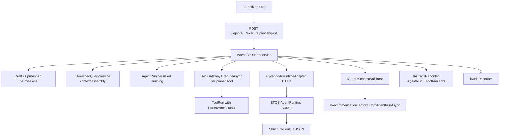

# Issue 23 — Tenant-Defined Agents and Agent Runs

## Context and boundaries

**Prerequisite (complete):** Issue 22 delivered [`IToolGateway`](ETOS.Backend/ToolRegistry/ToolGatewayService.cs), `ToolRun` with nullable `ParentAgentRunId`, `governed-query-v1` handler, and manufacturing `manufacturing-investigator` template referencing `graph-query-tool`. Issue 18.4 delivered [`AgentTemplateVersion`](ETOS.Backend/AgentTemplates/) and stub [`IAgentRuntimeAdapter`](ETOS.Backend/AgentRuntime/AgentRuntimeContracts.cs) contracts.

**Runtime choice (confirmed):** Python-first — new FastAPI + PydanticAI sidecar; .NET `PydanticAiRuntimeAdapter` is HTTP client only (no in-process LLM reasoning).

**In scope:**
- `AgentTypeDefinition` + `AgentVersion` BaseArtifact modules (tenant agents)
- Prompt-based draft creation + advanced configuration (model fallback, safe/preview mode, tool/skill/retrieval composition)
- Publish governance with **derived** capability/risk profile (computed JSON on publish, not a separate `AgentCapabilityProfileVersion` artifact module)
- `AgentRun` runtime entity, list/get API, execute/preview/test endpoints
- Orchestration: governed context → tool calls via `IToolGateway` → PydanticAI HTTP → recommendation-only output
- Wire `ToolRun.ParentAgentRunId`; extend AI Trace + audit
- Minimal frontend shells for mockup routes 28–31 ([SCREEN_MAP.md](References/etos_ui_mockup_pack_with_digital_thread_timeline/etos_ui_mockups/SCREEN_MAP.md))
- First E2E test: reference template → agent version → execute → child tool run → recommendation → trace links

**Explicitly out of scope (Issue 24+):**
- Live `HermesRuntimeAdapter` / `LangGraphRuntimeAdapter` (keep deferred stubs)
- `ModelProviderDefinition` / `ModelDefinitionVersion` full artifact registry (inline model config in `AgentVersion` payload for MVP)
- `SkillRun` execution, agent memory persistence, Neo4j Agent Memory
- Decision artifact creation, review-task creation, enterprise write actions
- `WorkflowVersion`, `AgentTeamVersion`, Dapr Workflow
- Dedicated `SafeModeEvent` table (store agent safe-mode outcome on `AgentRun` JSON fields; workflow `SafeModeEvent` remains Issue 24)



---

## Phase 1 — Agent type + agent version artifacts (`ETOS.Backend/Agents/`)

Mirror the Issue 18.4 [`AgentTemplates`](ETOS.Backend/AgentTemplates/) module layout (contracts, payload parser, readiness validator, service, endpoints).

### 1a. `AgentTypeDefinition` (catalog artifact)

| Concern | Detail |
|---------|--------|
| Artifact type | `AgentTypeDefinition` |
| Route | `/api/admin/agent-types` |
| Payload | `typeKey`, `purpose`, `allowedIntentCategoryKeys[]`, `defaultPatternCategory`, `riskBaseline` |
| Permissions | `agent-types.read|create|readiness|admin` |

Seed one platform type in development (e.g. `analysis-agent`) via [`DevelopmentIdentitySeeder`](ETOS.Backend/Identity/DevelopmentIdentitySeeder.cs) or reference package extension.

### 1b. `AgentVersion` (tenant agent instance)

| Concern | Detail |
|---------|--------|
| Artifact type | `AgentVersion` (promote [`FutureAgentArtifactTypes.AgentVersion`](ETOS.Backend/AgentTemplates/AgentTemplateDefinitionContracts.cs) to real constant in Agents module) |
| Route | `/api/admin/agents` |
| Permissions | `agents.read|create|readiness|admin|test|execute` |

**Payload contract** (`ArtifactVersion.PayloadJson`) — pins everything PRD requires:

```csharp
// Essential AgentVersion payload fields
AgentKey, DisplayName, Description?,
AgentTypeDefinitionVersionId,
SourceAgentTemplateVersionId?,   // optional lineage from template
PreferredRuntimeAdapterKey,    // default pydantic-ai-v1
// Composition (version IDs, same shape as AgentTemplate)
CompatibleModelPackageVersionIds[], CompatibleOntologyVersionIds[],
ReferencedCapabilityDefinitionVersionIds[], ReferencedBusinessPolicyDefinitionVersionIds[],
ReferencedOptimizationModelVersionIds[],
PromptTemplateVersionId, OutputSchemaVersionId,
QueryIntentVersionId, RetrievalStrategyVersionId,
ReferencedToolDefinitionVersionIds[], ReferencedSkillDefinitionVersionIds[],
// Model + fallback (inline MVP — no ModelDefinitionVersion artifact)
PrimaryModelProviderKey, PrimaryModelId,
FallbackModels[]: { ProviderKey, ModelId, TriggerReason },
// Runtime governance
SafeModeEnabled, PreviewModeDefault, BlockedModeMessage?,
CompatibilityTestNotes[], CompatibilityFixtureKeys[],
// Publish-time derived (written by publish validator, read-only after publish)
DerivedCapabilityRiskJson: { effectiveRiskLevel, toolRiskContributions[], retrievalRisk, permissionCeiling },
CreatedByUserId   // draft permission anchor
```

**Readiness/publish validator** (extend [`AgentTemplateDefinitionReadinessValidator`](ETOS.Backend/AgentTemplates/AgentTemplateDefinitionReadinessValidator.cs) patterns):
- All referenced artifacts published/enabled (capabilities, policies, tools, skills, query intent, retrieval strategy, prompt/output schema)
- Schema compatibility against pinned output schema
- **Capability/risk derivation:** max tool `RiskLevel`, retrieval strategy flags, output schema `CreatesDecision` must be false, aggregate into `DerivedCapabilityRiskJson`; block publish if declared agent metadata understates derived risk
- Adapter key must be in [`AgentRuntimeAdapterKeys.All`](ETOS.Backend/AgentRuntime/AgentRuntimeContracts.cs) and not `hermes-v1`/`langgraph-v1` for MVP execute path

**Draft test rule (user story 90):** Only `CreatedByUserId` or users with `agents.admin` may call `/test-run` or `/preview` on unpublished versions; published execute requires `agents.execute`.

### 1c. Prompt-based creation

`POST /api/admin/agents/from-prompt` and `POST /api/admin/agents/from-template`:
- **From template:** clone published `AgentTemplateVersion` composition into new draft `AgentVersion` + set `SourceAgentTemplateVersionId`
- **From prompt:** call existing [`ILlmCompletionService`](ETOS.Backend/GovernedChat/Llm/) with a structured schema to produce draft metadata (name, agentKey suggestion, pattern summary); bind to default `AgentTypeDefinition`; user completes advanced config before mark-ready

Reference package addition: optional seed `analysis-agent` type + sample tenant agent derived from `manufacturing-investigator` template in [`packages/manufacturing-reference/`](packages/manufacturing-reference/).

---

## Phase 2 — AgentRun runtime (`ETOS.Backend/AgentRuns/`)

Runtime record (not BaseArtifact), same pattern as [`ToolRun`](ETOS.Backend/ToolRegistry/ToolRunModels.cs).

### EF entity `AgentRun`

| Field | Purpose |
|-------|---------|
| `Id`, `TenantId`, `AgentVersionId`, `RequestedByUserId` | Identity |
| `Status` | `Pending`, `Running`, `Succeeded`, `Failed`, `Blocked`, `PreviewSucceeded`, `SafeModeBlocked` |
| `IsPreview`, `IsDryRun`, `SafeModeApplied` | Mode flags |
| `InputSafeSummaryJson`, `OutputSafeSummaryJson` | Safe summaries only |
| `StructuredOutputJson` | Validated output (preview may omit persistence of recommendation) |
| `DerivedRiskSnapshotJson` | Copy from agent version at run time |
| `FallbackUsedJson` | Which model fallback fired, if any |
| `ValidationResultJson`, `ErrorSafeSummary` | Schema/blocking notes |
| `GovernedContextSummaryJson` | Safe context summary passed to runtime |
| `RetrievalRunId?`, `RecommendationArtifactId?` | Downstream links |
| `AuditRecordId?`, `AiTraceRecordId?` | Governance links |
| `StartedAt`, `CompletedAt` | Timing |

Migration: `Issue23AgentRuns` (+ `AiTraceRecord.AgentRunId` nullable FK).

**Endpoints:** `/api/admin/agent-runs` (list/get), nested under agents: `POST .../preview`, `POST .../test-run`, `POST .../execute`.

---

## Phase 3 — Execution orchestration (`ETOS.Backend/AgentRuntime/`)

New **`IAgentExecutionService`** (or `AgentRuntimeOrchestrator`) — the missing glue between artifacts and adapters.

**Execute flow** (reuse [`GovernedChatService.AskAsync`](ETOS.Backend/GovernedChat/GovernedChatService.cs) context assembly patterns):

1. Resolve tenant + permissions; enforce draft vs published rules
2. Load published-or-draft `AgentVersion` payload
3. If `SafeModeEnabled` and not preview → persist `AgentRun` as `SafeModeBlocked` with `BlockedModeMessage`; audit; return (no recommendation)
4. Create `AgentRun` (`Running`)
5. Run governed query via `IGovernedQueryService` using pinned query intent + retrieval strategy + structured input
6. For each pinned tool: call `IToolGateway.ExecuteAsync` with extended **`ToolExecutionContext`** carrying `ParentAgentRunId`
7. Build enriched `AgentRuntimeExecutionRequest` (extend contract with `AgentVersionId`, `AgentRunId`, `PromptTemplatePayloadJson`, `OutputSchemaJson`, model config, tool output summaries)
8. Call `IAgentRuntimeAdapterSelector.ExecuteAsync` → HTTP PydanticAI adapter
9. Validate structured output via existing output schema validator
10. If preview: complete run without `IRecommendationFactory`; if execute: `FromAgentRunAsync` (new factory method); **never** create decision artifacts
11. Finalize `AgentRun`, `CreateFromAgentRunAsync`, audit actions `agents.preview|agents.test|agents.execute`

### Extend Issue 22 handoff points

| Extension | Change |
|-----------|--------|
| [`ToolExecutionRequest`](ETOS.Backend/ToolRegistry/) | Add optional `ParentAgentRunId` |
| [`ToolGatewayService.PersistRunAsync`](ETOS.Backend/ToolRegistry/ToolGatewayService.cs) | Set `ParentAgentRunId` when provided |
| [`AiTraceKind`](ETOS.Backend/AiTrace/AiTraceModels.cs) | Add `AgentRun = 3`; add `AgentRunId` on `AiTraceRecord`; `CreateFromAgentRunAsync` with child `ToolRun` artifact links |
| [`AgentRuntimeExecutionRequest`](ETOS.Backend/AgentRuntime/AgentRuntimeContracts.cs) | Add agent/run IDs, prompt/schema/model fields, tool summaries |

---

## Phase 4 — Python agent runtime (`ETOS.AgentRuntime/`)

New top-level Python project (first Python code in repo).

```
ETOS.AgentRuntime/
  pyproject.toml          # fastapi, pydantic-ai, pydantic, httpx, uvicorn
  app/
    main.py               # FastAPI app + health
    contracts.py          # ExecuteRequest / ExecuteResponse (mirror .NET DTOs)
    execute_service.py    # PydanticAI Agent, structured output
    model_router.py       # primary + fallback model selection
  tests/
    test_execute.py
  Dockerfile
```

**HTTP contract** `POST /v1/execute`:
- **Input:** governed context summary (pre-filtered by .NET), prompt template body, output JSON Schema, primary/fallback model config, structured user input, preview flag
- **Output:** `status`, `structuredOutputJson`, `traceNotes[]`, `modelUsed`, `fallbackApplied`
- **Rules:** No DB/Neo4j/Qdrant clients; no tool execution in Python (tools run in .NET before HTTP call); structured output only

**.NET adapter:** Replace throw in [`PydanticAiRuntimeAdapter`](ETOS.Backend/AgentRuntime/DeferredAgentRuntimeAdapters.cs) with `HttpClient`-based implementation reading `AgentRuntime:BaseUrl` + timeout from config (new `AgentRuntimeOptions` section, parallel to [`GovernedChatLlmOptions`](ETOS.Backend/GovernedChat/Llm/)).

**Local infra:** Add `agent-runtime` service to [`infra/local/docker-compose.yml`](infra/local/docker-compose.yml); document env vars in [docs/local-development.md](docs/local-development.md) and `.env.example` (`AGENT_RUNTIME_PORT`, `OPENAI_API_KEY` passthrough for PydanticAI).

**Model fallback:** Python side tries primary model; on configured retriable failures, tries fallback chain; returns which model was used. .NET persists on `AgentRun.FallbackUsedJson`.

---

## Phase 5 — Recommendation output

Add to [`IRecommendationFactory`](ETOS.Backend/Recommendations/RecommendationFactory.cs):

```csharp
Task<CreateRecommendationResponse> FromAgentRunAsync(
    Guid agentRunId,
    CancellationToken cancellationToken);
```

- Map structured agent output + governed context + tool run IDs into recommendation payload with evidence links (`EvidenceLinkType.AgentRun`, linked `ToolRun`s, `RetrievalRun`)
- Guard: reject if output schema or agent payload implies decision creation
- Idempotent `uniqueSourceKey` per agent run

---

## Phase 6 — Frontend minimal shells (`ETOS.Frontend/`)

Follow Issue 22 pattern ([`/tools`](ETOS.Frontend/src/app/tools/), [`etos-api.ts`](ETOS.Frontend/src/lib/etos-api.ts)):

| Route | Purpose |
|-------|---------|
| `/agents` | List tenant agents + draft/published state |
| `/agents/new` | Create from template or prompt form |
| `/agents/[agentKey]/configure` | Advanced config (read-only refs + safe/preview/fallback) |
| `/agents/[agentKey]/test-run` | Draft test trigger + output/trace links |
| `/agent-runs` | Explorer list |
| `/agent-runs/[runId]` | Detail with ToolRun + AI Trace links |

Server components + typed fetch helpers; no rich builder UX yet.

---

## Phase 7 — Tests

| Test file | Coverage |
|-----------|----------|
| `AgentTypeDefinitionTests.cs` | CRUD, publish, tenant isolation |
| `AgentVersionTests.cs` | Create from template, mark-ready blocks, publish governance, derived risk, draft permission deny |
| `AgentRunTests.cs` | Preview vs execute, safe mode block, ParentAgentRunId on child ToolRun, no decision artifacts |
| `AgentExecutionE2ETests.cs` | Install manufacturing reference → create agent from `manufacturing-investigator` → execute → assert ToolRun parent link, AgentRun trace, recommendation created |
| `AgentRuntimeAdapterTests.cs` | Update: HTTP adapter with `MockHttpMessageHandler` |
| `ETOS.AgentRuntime/tests/` | pytest for `/v1/execute` structured output + fallback |

**CI note:** .NET tests mock Python HTTP; optional separate workflow step for `pytest` + Docker build of `ETOS.AgentRuntime` (document in plan, implement if repo CI exists).

---

## Phase 8 — Documentation and registration

- Register services/endpoints in [`EnterpriseThreadPlatform.cs`](ETOS.Backend/Platform/EnterpriseThreadPlatform.cs) + [`Program.cs`](ETOS.Backend/Program.cs)
- Seed permissions in [`DevelopmentIdentitySeeder`](ETOS.Backend/Identity/DevelopmentIdentitySeeder.cs)
- Update [`AGENTS.md`](AGENTS.md), [`docs/backend/architecture.md`](docs/backend/architecture.md), [`docs/ai-agent-workflow.md`](docs/ai-agent-workflow.md) implemented-vs-planned wording
- After code changes: `graphify update .` + `graphify cluster-only .`

---

## Implementation order (recommended)

1. **AgentTypes + AgentVersion artifacts** — unblocks all API/UI work
2. **AgentRun entity + read APIs** — persistence shape stable early
3. **ToolGateway ParentAgentRunId wiring** — small, high-value handoff from Issue 22
4. **Python sidecar + HTTP PydanticAiRuntimeAdapter** — unblocks real execution
5. **AgentExecutionService orchestration** — core path
6. **AiTrace + RecommendationFactory extensions** — complete governance loop
7. **Execute/preview/test endpoints + permissions**
8. **Frontend shells + E2E test + docs**

---

## Key files to leverage (do not reinvent)

- Artifact lifecycle: [`AgentTemplateDefinitionService.cs`](ETOS.Backend/AgentTemplates/AgentTemplateDefinitionService.cs), [`CapabilityDefinitionService.cs`](ETOS.Backend/Capabilities/CapabilityDefinitionService.cs)
- Context assembly: [`GovernedChatService.cs`](ETOS.Backend/GovernedChat/GovernedChatService.cs), [`IGovernedQueryService`](ETOS.Backend/GovernedQuery/)
- Tool execution: [`ToolGatewayService.cs`](ETOS.Backend/ToolRegistry/ToolGatewayService.cs)
- Trace/audit: [`AiTraceRecorder.cs`](ETOS.Backend/AiTrace/AiTraceRecorder.cs)
- Reference fixtures: [`packages/manufacturing-reference/artifacts/agent-templates.json`](packages/manufacturing-reference/artifacts/agent-templates.json)
