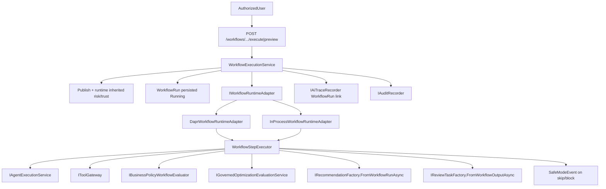
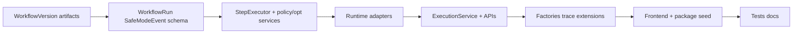

# Issue 24 — Workflow Runtime and Safe Read-Only Execution

## Context and boundaries

**Prerequisite (complete):** Issue 23 delivered [`AgentExecutionService`](ETOS.Backend/AgentRuntime/AgentExecutionService.cs), [`IToolGateway`](ETOS.Backend/ToolRegistry/ToolGatewayService.cs), `AgentRun`/`ToolRun` with `ParentAgentRunId`, derived capability/risk on agent publish ([`AgentDefinitionReadinessValidator`](ETOS.Backend/Agents/AgentDefinitionReadinessValidator.cs)), and recommendation-only output via [`IRecommendationFactory.FromAgentRunAsync`](ETOS.Backend/Recommendations/RecommendationFactory.cs). Issues 20–21 (decisions/outcomes, governance analytics) are also present in the working tree but do not change workflow output constraints.

**User stories:** 98–103, 114 ([`engineering-execution-issues.md`](.docs/.prd/engineering-execution-issues.md) lines 689–707).

**In scope:**
- `WorkflowVersion` BaseArtifact (JSON-canonical definition; visual builder is a thin editor over JSON)
- Runtime-neutral [`IWorkflowRuntimeAdapter`](.docs/.prd/.initialConversation/chatgpt-conversation-part-011-1001-1100.md) with **Dapr Workflow** as MVP default and **in-process sequential adapter** for CI/local-without-Dapr
- `WorkflowRun` + first-class `SafeModeEvent` runtime records (Issue 23 deferred this to 24)
- Inherited + workflow-level risk/trust (derived JSON on publish + runtime recalculation before execute — same fold as agents, **not** separate `WorkflowCapabilityProfileVersion` artifacts)
- Manual trigger execution; scheduled/event-driven **metadata placeholders only**
- Step types: `agent_execute`, `tool_execute`, `business_policy_check`, `optimization_evaluate`, `create_recommendation`, `create_review_task`
- Partial safe mode with per-step skip/stop rules and auditable `SafeModeEvent` rows
- Governed optimization-step hook (deterministic/metadata-driven engine — **not** LLM solver)
- Reviewable recommendations + review tasks only; **no** decision artifacts or enterprise writes
- Minimal frontend shells for mockup routes 32–34 ([`engineering-execution-ui-issues.md`](.docs/.prd/.ui/engineering-execution-ui-issues.md) UI-3.5–3.7)
- Manufacturing reference sample workflow + dev seed + focused tests

**Explicitly out of scope (Issue 25+):**
- `AgentTeamVersion`, LangGraph multi-agent orchestration, coordinator/delegation
- Live Temporal runtime ([`StaticExtensionPointCatalog`](ETOS.Backend/Platform/Extensions/StaticExtensionPointCatalog.cs) stays deferred)
- Scheduled/event-driven **execution** (placeholders in payload + disabled UI only)
- Full React Flow polish, chat-to-workflow generation, Hermes runtime
- Decision artifact creation, enterprise source-system writes, external connector writes



---

## Phase 1 — `WorkflowVersion` artifact module (`ETOS.Backend/Workflows/`)

Mirror Issue 23 [`Agents`](ETOS.Backend/Agents/) / Issue 18.4 [`AgentTemplates`](ETOS.Backend/AgentTemplates/) layout: contracts, payload parser, readiness validator, service, endpoint extensions.

| Concern | Detail |
|---------|--------|
| Artifact type | `WorkflowVersion` |
| Route | `/api/admin/workflows` |
| Permissions | `workflows.read`, `workflows.create`, `workflows.readiness`, `workflows.admin`, `workflows.preview`, `workflows.execute` |

**Payload contract** (`ArtifactVersion.PayloadJson`) — JSON source of truth:

```csharp
// WorkflowVersion essentials
WorkflowKey, DisplayName, Description?, WorkflowScope, // platform | tenant | personal
WorkflowDefinitionJson,   // canonical step graph (see below)
InputSchemaVersionId?, OutputSchemaVersionId?,
ReferencedAgentVersionIds[], ReferencedToolDefinitionVersionIds[],
ReferencedBusinessPolicyDefinitionVersionIds[], ReferencedOptimizationModelVersionIds[],
CompatibleModelPackageVersionIds[], CompatibleOntologyVersionIds[],
// Orchestration governance (workflow-level, not inherited)
SafeModeEnabled, PreviewModeDefault, BlockedModeMessage?,
AllowPartialCompletion, DefaultStepSafeModeBehavior, // skip | stop
TriggerConfig: { manual: { enabled }, scheduled: { enabled: false, placeholder }, eventDriven: { enabled: false, placeholder } },
ApprovalRequirements?, CompatibilityTestNotes[], CompatibilityFixtureKeys[],
CreatedByUserId,
DerivedCapabilityRiskJson   // written at publish, read-only after
```

**`WorkflowDefinitionJson` MVP step shape** (array of steps, linear + optional `dependsOnStepKeys`):

| stepType | Purpose |
|----------|---------|
| `agent_execute` | Calls `IAgentExecutionService` for pinned `agentVersionId` |
| `tool_execute` | Calls `IToolGateway` for pinned tool version |
| `business_policy_check` | Evaluates pinned `BusinessPolicyDefinitionVersion` constraint rules against prior step context |
| `optimization_evaluate` | Calls governed optimization engine with pinned `OptimizationModelVersion` |
| `create_recommendation` | Materializes recommendation from prior agent/tool output |
| `create_review_task` | Creates review task when step not blocked; high-impact skip may auto-create warning task |

Each step carries `stepKey`, `safeModeOnBlock` (`skip` | `stop_workflow`), and typed config IDs.

**Publish validator** ([`WorkflowDefinitionReadinessValidator`](ETOS.Backend/Workflows/WorkflowDefinitionReadinessValidator.cs) — new):
- Required fields + valid `WorkflowDefinitionJson` schema
- All referenced agents/tools/policies/optimization models published and tenant-scoped
- Block if any pinned agent/tool metadata claims `createsDecision` / `writesExternalSystem`
- **Inherited risk derivation:** max agent/tool/policy/optimization risk; aggregate tool risk contributions (reuse patterns from [`AgentDefinitionReadinessValidator.ValidatePublishedDependenciesAsync`](ETOS.Backend/Agents/AgentDefinitionReadinessValidator.cs)); write `DerivedCapabilityRiskJson`
- Block publish when workflow-level permission ceiling understates derived risk

Register in [`EnterpriseThreadPlatform.cs`](ETOS.Backend/Platform/EnterpriseThreadPlatform.cs) + map from [`Program.cs`](ETOS.Backend/Program.cs).

---

## Phase 2 — Runtime records + migration

New module `ETOS.Backend/WorkflowRuns/`.

### `WorkflowRun` entity

| Field | Purpose |
|-------|---------|
| `Id`, `TenantId`, `WorkflowVersionId`, `RequestedByUserId` | Identity |
| `Status` | `Pending`, `Running`, `Succeeded`, `Failed`, `Blocked`, `PreviewSucceeded`, `SafeModeCompleted`, `SafeModeBlocked` |
| `IsPreview`, `SafeModeApplied`, `PartialCompletion` | Mode flags |
| `InputSafeSummaryJson`, `OutputSafeSummaryJson`, `StepResultsJson` | Safe summaries + per-step outcomes |
| `InheritedRiskSnapshotJson`, `RuntimeTrustRecalculationJson` | Publish-time + pre-execute trust |
| `RecommendationArtifactIdsJson`, `ReviewTaskArtifactIdsJson` | Output links |
| `AuditRecordId?`, `AiTraceRecordId?` | Governance links |
| `StartedAt`, `CompletedAt` | Timing |

### `SafeModeEvent` entity (first-class per acceptance criteria)

| Field | Purpose |
|-------|---------|
| `Id`, `TenantId`, `WorkflowRunId`, `StepKey` | Identity |
| `EventKind` | `Blocked`, `Skipped`, `Downgraded`, `RuntimeTrustDowngrade` |
| `Reason`, `PolicyRuleKey?`, `BlockedAction?` | Explainability |
| `AgentRunId?`, `ToolRunId?`, `ReviewTaskArtifactId?` | Linked runtime records |
| `CreatedAt` | Timestamp |

### Cross-run linkage extensions

- `AgentRun.ParentWorkflowRunId` (nullable FK)
- `ToolRun.ParentWorkflowRunId` (nullable FK); keep existing `ParentAgentRunId`
- `AiTraceRecord.WorkflowRunId` (nullable FK) + `AiTraceKind.WorkflowRun`
- Extend `ToolExecutionRequest` with optional `ParentWorkflowRunId`

Migration: `Issue24WorkflowRuns`.

---

## Phase 3 — Runtime adapter layer (`ETOS.Backend/WorkflowRuntime/`)

Contracts (parallel to [`IAgentRuntimeAdapter`](ETOS.Backend/AgentRuntime/AgentRuntimeContracts.cs)):

```csharp
interface IWorkflowRuntimeAdapter {
    Task<WorkflowRuntimeStartResult> StartManualRunAsync(WorkflowRuntimeStartRequest request, CancellationToken ct);
}

interface IWorkflowRuntimeAdapterSelector {
    IWorkflowRuntimeAdapter Resolve(string adapterKey);
}
```

| Adapter | Behavior |
|---------|----------|
| `dapr-v1` (`DaprWorkflowRuntimeAdapter`) | Uses `Dapr.Workflow` SDK; generic interpreter workflow reads `WorkflowDefinitionJson` + dispatches Dapr activities |
| `in-process-v1` (`InProcessWorkflowRuntimeAdapter`) | Same `WorkflowStepExecutor`, sequential execution — default in tests / when Dapr sidecar absent |

**Config** (`WorkflowRuntimeOptions` in [`appsettings.json`](ETOS.Backend/appsettings.json)):

```json
"WorkflowRuntime": {
  "AdapterKey": "in-process-v1",
  "DaprAppId": "etos-backend",
  "DaprWorkflowComponent": "workflow"
}
```

**Local infra** ([`infra/local/docker-compose.yml`](infra/local/docker-compose.yml)):
- Add optional `dapr` sidecar service (profile `dapr-workflow`) wired to existing `redis` state store
- Document in [`docs/local-development.md`](docs/local-development.md): run backend with `daprd`, switch `AdapterKey` to `dapr-v1`
- Mark `temporal` extension point unchanged (deferred)

**Dapr activities** (thin wrappers over DI-resolved `WorkflowStepExecutor`):
- `ExecuteAgentStepActivity`, `ExecuteToolStepActivity`, `EvaluatePolicyStepActivity`, `EvaluateOptimizationStepActivity`, `CreateRecommendationStepActivity`, `CreateReviewTaskStepActivity`, `RecordSafeModeEventActivity`

---

## Phase 4 — Execution orchestration (`WorkflowExecutionService`)

Central service (analogous to [`AgentExecutionService`](ETOS.Backend/AgentRuntime/AgentExecutionService.cs)):

1. Resolve tenant + permissions; draft preview/test rules mirror agents (`CreatedByUserId` or `workflows.admin` for unpublished preview)
2. Load workflow version payload
3. **Runtime trust recalculation** before execute: re-validate pinned artifacts still published; compare derived risk vs current agent/tool/policy state; downgrade to safe mode if trust degraded
4. If workflow `SafeModeEnabled` and not preview → `WorkflowRun` = `SafeModeBlocked` + audit (whole-workflow block path)
5. Create `WorkflowRun` (`Running`); call `IWorkflowRuntimeAdapter.StartManualRunAsync`
6. For each step, `WorkflowStepExecutor`:
   - **agent_execute:** `IAgentExecutionService.ExecuteAsync|PreviewAsync` with `ParentWorkflowRunId`; child `AgentRun` linked
   - **tool_execute:** `IToolGateway` with `ParentWorkflowRunId` (+ `ParentAgentRunId` when nested)
   - **business_policy_check:** new `IBusinessPolicyWorkflowEvaluator` — load [`BusinessPolicyDefinitionPayloadParser`](ETOS.Backend/BusinessPolicies/BusinessPolicyDefinitionPayloadParser.cs) `constraintRules`, evaluate against accumulated safe context; on fail apply step `safeModeOnBlock`
   - **optimization_evaluate:** new `IGovernedOptimizationEvaluationService` — load [`OptimizationModelDefinitionPayloadParser`](ETOS.Backend/OptimizationModels/OptimizationModelDefinitionPayloadParser.cs) objective + `solverConfiguration` metadata; run **deterministic** scoring/ranking (constraint-rule matching, no LLM, no external solver)
   - **create_recommendation:** `IRecommendationFactory.FromWorkflowRunAsync` (new) with evidence from child agent/tool runs
   - **create_review_task:** `IReviewTaskFactory.FromWorkflowOutputAsync` (new) when allowed; on high-impact skip create warning task per PRD safe-mode guidance
7. On step block/skip: persist `SafeModeEvent`; respect `AllowPartialCompletion` + per-step `safeModeOnBlock`
8. `GuardAgainstDecisionCreation` on all structured outputs (reuse agent pattern)
9. Finalize `WorkflowRun`, `IAiTraceRecorder.CreateFromWorkflowRunAsync`, audit `workflows.preview|workflows.execute`

**Scheduled/event placeholders:** store in payload + expose read-only fields on detail DTO; no background consumer.

---

## Phase 5 — Output factories, trace, and permissions

| Extension | Change |
|-----------|--------|
| [`IRecommendationFactory`](ETOS.Backend/Recommendations/RecommendationFactory.cs) | Add `FromWorkflowRunAsync(workflowRunId)` — evidence links to child `AgentRun`/`ToolRun` |
| [`IReviewTaskFactory`](ETOS.Backend/ReviewTasks/ReviewTaskFactory.cs) | Add `FromWorkflowOutputAsync(workflowRunId, stepKey, ...)` + optional `FromSafeModeEventAsync` for high-impact skips |
| [`IAiTraceRecorder`](ETOS.Backend/AiTrace/AiTraceRecorder.cs) | Add `CreateFromWorkflowRunAsync`; extend `AiTraceKind` + artifact link kinds |
| [`DevelopmentIdentitySeeder`](ETOS.Backend/Identity/DevelopmentIdentitySeeder.cs) | Seed workflow permissions for dev tenant admin |
| [`DevelopmentDemoDataCleaner`](ETOS.Backend/Platform/Development/DevelopmentDemoDataCleaner.cs) | Delete tenant `WorkflowRun` / `SafeModeEvent` rows |

---

## Phase 6 — API surface

Under `/api/admin/workflows` (mirror agents):

- CRUD + mark-ready + publish + dependency summary
- `POST /from-template` (optional: clone platform workflow seed)
- `POST /{artifactId}/versions/{versionId}/preview`
- `POST /{artifactId}/versions/{versionId}/test-run` (draft, admin/creator only)
- `POST /{artifactId}/versions/{versionId}/execute` (published, manual trigger)

Under `/api/admin/workflow-runs`:

- `GET /` list, `GET /{runId}` detail (includes `SafeModeEvent` summaries, child run links)

---

## Phase 7 — Frontend minimal shells (`ETOS.Frontend/`)

Follow Issue 23 agent pages pattern ([`ETOS.Frontend/src/app/agents/`](ETOS.Frontend/src/app/agents/)):

| Route | Screen |
|-------|--------|
| `/workflows` | List tenant workflows |
| `/workflows/new` | Create draft + JSON step editor (minimal; React Flow canvas can render read-only graph from JSON in MVP) |
| `/workflows/[workflowKey]/edit` | Edit draft definition |
| `/workflows/[workflowKey]/publish` | Publish risk/trust review panel (derived + inherited risk) |
| `/workflow-runs/[runId]` | Run trace: status, safe mode events, skipped steps, child agent/tool run links |

Add typed helpers in `etos-api.ts`; install `@xyflow/react` per UI backlog when implementing canvas.

---

## Phase 8 — Reference package + dev demo

Add [`packages/manufacturing-reference/artifacts/workflows.json`](packages/manufacturing-reference/artifacts/workflows.json):

- Sample `bom-impact-review` workflow: `tool_execute` (graph-query) → `agent_execute` (manufacturing-investigator) → `optimization_evaluate` (minimize-transport-distance) → `business_policy_check` → `create_recommendation` → `create_review_task`
- Extend [`ManufacturingReferencePackageInstaller`](ETOS.Backend/Packages/ManufacturingReferencePackageInstaller.cs) to install workflow artifacts

Dev seeder: publish sample workflow + wire E2E test fixture (published agent + tools already exist from Issue 23 tests).

---

## Phase 9 — Tests and docs

**Backend tests** (`ETOS.Backend.Tests/`):

| Test file | Covers |
|-----------|--------|
| `WorkflowDefinitionTests.cs` | CRUD, publish validation, inherited risk/trust derivation |
| `WorkflowRunTests.cs` | Manual execute, preview, tenant isolation |
| `WorkflowSafeModeTests.cs` | Partial safe mode, skipped steps, `SafeModeEvent` persistence |
| `WorkflowExecutionE2ETests.cs` | Reference workflow → agent run + tool run + recommendation + review task + trace links; assert no decision created |
| `WorkflowReadOnlyConstraintTests.cs` | Block publish when pinned tool `writesExternalSystem`; execute path rejects decision-shaped output |

Use `InProcessWorkflowRuntimeAdapter` in test host (no Dapr dependency). Optional separate `[Trait("Dapr")]` integration test skipped in CI.

**Verification commands:**

```powershell
dotnet test EnterpriseThreadOS.sln --filter "FullyQualifiedName~Workflow"
Push-Location ETOS.Frontend; npm run typecheck; npm run lint; Pop-Location
graphify update .
graphify cluster-only .
```

**Docs:** Update [`AGENTS.md`](AGENTS.md), [`ARCHITECTURE.md`](ARCHITECTURE.md), [`docs/local-development.md`](docs/local-development.md) implemented-vs-planned wording for workflows.

---

## Key design decisions (aligned with repo conventions)

1. **Derived risk JSON, not separate profile artifacts** — matches Issue 23 agent publish pattern; PRD “workflow capability/trust profiles” = payload governance fields + `DerivedCapabilityRiskJson`.
2. **JSON-canonical workflow model, runtime-neutral adapter** — Dapr is execution engine only; workflow definition does not embed Dapr types.
3. **In-process adapter for CI** — real Dapr path available locally via compose profile; avoids flaky CI without sidecar.
4. **Optimization = governed engine hook** — metadata + deterministic evaluation; explicitly not LLM solver (Issue 18.4 boundary).
5. **Read-only outputs enforced at orchestration layer** — same `GuardAgainstDecisionCreation` + factory boundaries as agents; no enterprise write connectors enabled.

## Dependency order within implementation


