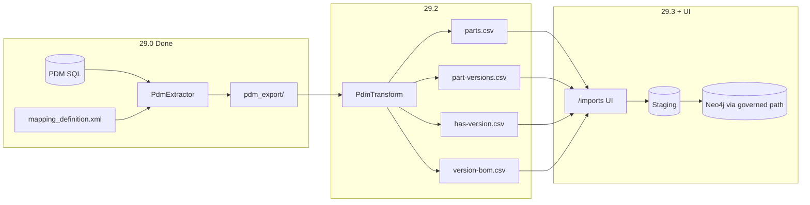
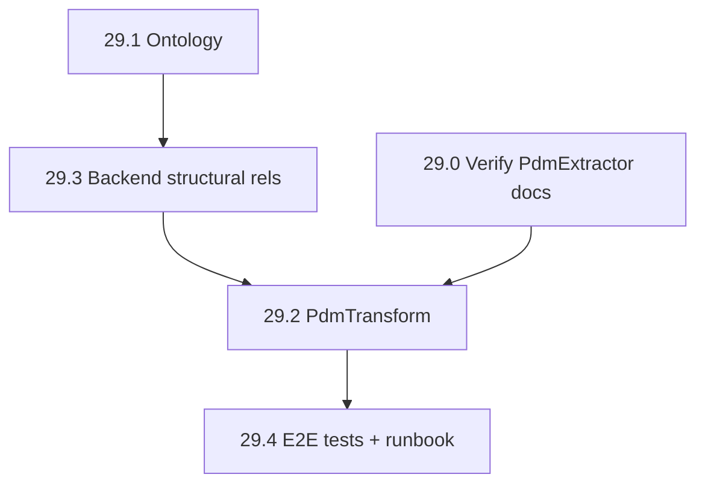

# Issue 29: PDM Extract → Transform → Import

## Scope

| Slice | Work |
|-------|------|
| **29.0** PdmExtractor | Done — verify only |
| **29.1** Ontology | `partVersion`, `hasVersion`, version-level `contains` |
| **29.3** Backend | Per-mapping structural relationship type + mapping-driven identity |
| **29.2** PdmTransform | Python helper: `pdm_export/` → 4 CSV batches |
| **29.4** E2E | Fixtures, integration tests, runbook |
| **29.5** Live connector | Out of scope |

**User defaults (confirmed):**
- Keep `part` identity `partNumber`+`revision` for demos; add `documentId` attribute; structural rels use **mapping-driven identity**
- Transform exports **all versions** (~479), not `IsLatest` only

---

## Target data flow



---

## 29.1 — Ontology extension

**Files:** [`packages/manufacturing-reference/ontology/`](packages/manufacturing-reference/ontology/)

### `object-types.json`
Add `partVersion`:

```json
{
  "type": "partVersion",
  "label": "Part Version",
  "identityFields": ["pdmVersionKey"],
  "attributes": [
    "pdmVersionKey", "documentId", "revision", "fileName",
    "status", "workflow", "isLatest", "projectPath"
  ]
}
```

Add `documentId` to existing `part` attributes (identity stays `partNumber`+`revision`).

### `relationships.json`
Add non-BOM relationship:

```json
{ "type": "hasVersion", "from": "part", "to": "partVersion", "label": "Has Version" }
```

### `bom-relationships.json`
Add version-level BOM (keep existing `part`→`part` `contains` for demos):

```json
{ "type": "contains", "from": "partVersion", "to": "partVersion", "label": "Contains" }
```

Use distinct relationship **type** strings if the engine requires unique types per from/to pair; if collision, use `versionContains` in ontology and map transform output to that type.

### `import-profile.json`
Extend `structuralImport` with optional relationship catalog reference (or document that per-mapping `structuralRelationshipType` overrides `defaultBomRelationshipType`). Keep `defaultBomRelationshipType: "contains"` for backward-compatible part→part demos.

### Package reinstall
After ontology edits, reinstall manufacturing-reference package for test tenant (same pattern as existing package tests in [`ETOS.Backend.Tests`](ETOS.Backend.Tests/)).

---

## 29.3 — Backend: generalized structural relationship import

**Problem today:** [`ImportService.cs`](ETOS.Backend/Imports/ImportService.cs) calls `RequireDefaultBomRelationship()` for every structural CSV — only supports package default `part`→`part` `contains`. [`ImportStructuralImportHelper.BuildIdentityAttributes`](ETOS.Backend/Imports/ImportStructuralImportHelper.cs) uses only the **first** ontology identity field.

### Model + migration
- Add nullable `StructuralRelationshipType` (string) to `ImportMappingVersion` entity + EF migration
- Add to [`ImportContracts.cs`](ETOS.Backend/Imports/ImportContracts.cs) create/approve DTOs and response DTOs

### Relationship resolution
New helper (e.g. `StructuralRelationshipResolver`):

1. If mapping has `StructuralRelationshipType` → resolve from **both** [`bom-relationships.json`](packages/manufacturing-reference/ontology/bom-relationships.json) and [`relationships.json`](packages/manufacturing-reference/ontology/relationships.json)
2. Else fall back to `import-profile.json` → `defaultBomRelationshipType` (current behavior)
3. Validate `from`/`to` object types match parent/child object types on the mapping

Wire into [`ImportService.cs`](ETOS.Backend/Imports/ImportService.cs) structural path (replace unconditional `RequireDefaultBomRelationship()`).

### Mapping-driven structural identity
When CSV headers are `parent`/`child` (structural mode):

- Resolve parent object type + child object type from the structural relationship definition
- For each side, use the **approved mapping's identity column mappings** for that object type (same logic as flat import identity extraction), not `identityFields[0]` from ontology alone
- Enables: `has-version.csv` with `parent=documentId`, `child=pdmVersionKey` while demos keep `partNumber`/`revision`

Touch [`ImportStructuralImportHelper.cs`](ETOS.Backend/Imports/ImportStructuralImportHelper.cs) and any identity builder used by flat import for reuse.

### API + minimal UI
- Approve-mapping endpoint accepts optional `structuralRelationshipType`
- Optional: dropdown on [`ETOS.Frontend/src/app/imports/page.tsx`](ETOS.Frontend/src/app/imports/page.tsx) when structural mapping detected (low priority — API + tests first)

### Tests ([`ImportTests.cs`](ETOS.Backend.Tests/ImportTests.cs), [`ImportFlowTestSupport.cs`](ETOS.Backend.Tests/Fixtures/ImportFlowTestSupport.cs))
1. Existing part→part structural BOM test still passes (no `structuralRelationshipType` → default)
2. New: `hasVersion` batch — `part` + `partVersion` nodes + relationship
3. New: `partVersion`→`partVersion` `contains` batch
4. Negative: wrong `structuralRelationshipType` for mapping object types → validation error

---

## 29.2 — PdmTransform helper

**New project:** `ETOS.Helpers/PdmTransform/` (mirror PdmExtractor layout: `pyproject.toml`, `app/`, README)

### Config: `transform.config.json`
```json
{
  "sourceSystem": "SOLIDWORKS-PDM",
  "versionFilter": "all",
  "variablePivot": { "enabled": true, "columns": ["Material", "Description", "..."] },
  "outputs": {
    "parts": "parts.csv",
    "partVersions": "part-versions.csv",
    "hasVersion": "has-version.csv",
    "versionBom": "version-bom.csv"
  }
}
```

### Inputs (from PdmExtractor `pdm_export/`)
| Source | Target CSV | Key columns |
|--------|------------|-------------|
| `objects/File.csv` | `parts.csv` | `documentId`, `fileName`, `projectPath` (join Folder) |
| `objects/Version.csv` (all rows) | `part-versions.csv` | `pdmVersionKey`←`MigrationSourceId`, `documentId`, `revision`←`RevNr`, attrs |
| `relationships/FileToVersion.csv` | `has-version.csv` | `parent`←File `DocumentID`, `child`←Version `MigrationSourceId` |
| `relationships/VersionToVersion.csv` | `version-bom.csv` | `parent`←`ParentId`, `child`←`ChildId`, `quantity`←`QTY` |

### Variable pivot (optional v1)
Join `VersionToVariable` + `Variables` → pivot configured columns onto `part-versions.csv`. Unlisted variables → JSON attribute `pdmVariables` or skip.

### CLI
```
pdm-transform --input pdm_export --output etos_import/ [--config transform.config.json]
```
Emit `manifest.json` listing four files + row counts + `sourceSystem`.

### Unit tests
pytest with small fixture subset (5–10 rows) under `ETOS.Helpers/PdmTransform/tests/fixtures/`.

---

## 29.4 — E2E runbook, fixtures, integration tests

### Demo fixtures
Add under `packages/manufacturing-reference/demo-imports/pdm/` (trimmed from real export or synthetic):
- `parts.csv`, `part-versions.csv`, `has-version.csv`, `version-bom.csv`
- README snippet in [`docs/local-development.md`](docs/local-development.md) or PdmTransform README

### Backend integration test
New test class (e.g. `PdmImportFlowTests.cs`):
1. Install package with extended ontology
2. Four import batches with `SourceSystem=SOLIDWORKS-PDM`
3. Approve mappings with correct `structuralRelationshipType` on rel batches
4. Commit → assert graph: part count, partVersion count, `hasVersion` edges, version `contains` edges

### Runbook (PowerShell)
Document in [`.docs/.prd/issue-29-pdm-extract-transform-import.md`](.docs/.prd/issue-29-pdm-extract-transform-import.md) or `ETOS.Helpers/README.md`:

```powershell
# 1. Extract (done)
cd ETOS.Helpers/PdmExtractor && uv run pdm-extract ...

# 2. Transform
cd ETOS.Helpers/PdmTransform && uv run pdm-transform --input ../PdmExtractor/pdm_export --output ./etos_import

# 3. Import via UI or API — four batches, source SOLIDWORKS-PDM
```

Link from [`ETOS.Helpers/README.md`](ETOS.Helpers/README.md).

---

## Implementation order



1. **29.1** — unblocks relationship types and identity fields
2. **29.3** — unblocks `hasVersion` + version BOM imports (transform output useless without this)
3. **29.2** — produces real CSVs from Steris `pdm_export`
4. **29.4** — proves full pipeline; update issue sheet status

---

## Verification

| Step | Command |
|------|---------|
| Backend | `dotnet test EnterpriseThreadOS.sln --filter "FullyQualifiedName~Import"` |
| PdmTransform | `cd ETOS.Helpers/PdmTransform && uv run pytest` |
| Graph | `graphify update .` after backend changes |

---

## Out of scope (explicit)

- Live PDM SQL connector / scheduled extract (29.5)
- `Configuration` / `DataCard` as graph nodes (defer; variables as attributes only)
- Identity resolution across `SOLIDWORKS-PDM` and other `SourceSystem` (existing Issue 9 path; document only)
- Merge/upsert on import (still CREATE per row — duplicates if re-imported)
