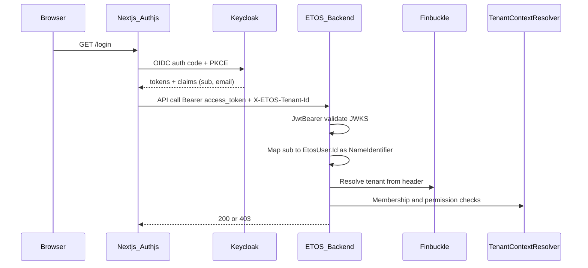

# Issue 2.1 / UI-Auth-1 — Keycloak OIDC + Admin Identity (1A + 2A)

## Locked decisions

- **Provisioning:** Admin-only. No public signup, no self-serve create-tenant. Invites (path to hybrid C) are out of this slice.
- **Auth:** Keycloak = IdP (OIDC). ETOS keeps `EtosUser` + Finbuckle + membership/RBAC. Link Keycloak `sub` → `EtosUser`.
- **Tenancy library:** Keep **Finbuckle.MultiTenant** (already `10.1.0`) for request tenant resolution. Keycloak does not replace it.
- **Local passwords:** Stop being the product login path. Seed/Keycloak own credentials. Optional password on `CreateUser` may still set Identity hash for legacy/tests only; login UX is Keycloak-only.

## Architecture

Layers (do not collapse):

| Layer | Owner |
|-------|--------|
| Who are you? | Keycloak OIDC |
| Which tenant? | Finbuckle + `X-ETOS-Tenant-Id` + [`EtosTenantStore`](ETOS.Backend/Identity/EtosTenantStore.cs) |
| What can you do? | [`ITenantContextResolver`](ETOS.Backend/Identity/TenantContext.cs) + memberships/grants |

## Phase 1 — Infra + Keycloak realm

1. Add `keycloak` service to [`infra/local/docker-compose.yml`](infra/local/docker-compose.yml) (Postgres already present; use dedicated DB or Keycloak dev DB).
2. Add realm import JSON under `infra/local/keycloak/` with:
   - Realm `etos`
   - Client `etos-frontend` (public, PKCE, redirect `http://localhost:3000/*`)
   - Client `etos-backend` (bearer-only / resource server audience)
   - Seed admin user aligned with [`SeedIdentityOptions`](ETOS.Backend/Identity/SeedIdentityOptions.cs) email (`admin@etos.com`)
3. Document ports and env in [`docs/local-development.md`](docs/local-development.md) and `.env.example`.
4. Flip extension catalog entry in [`StaticExtensionPointCatalog.cs`](ETOS.Backend/Platform/Extensions/StaticExtensionPointCatalog.cs): `keycloak` → `active` for local MVP (not “fake”; real container + real OIDC).

## Phase 2 — Backend auth (JwtBearer + LocalHeader gate)

Touch [`EnterpriseThreadPlatform.cs`](ETOS.Backend/Platform/EnterpriseThreadPlatform.cs) and [`Program.cs`](ETOS.Backend/Program.cs):

1. Add `Authentication:Keycloak` options (Authority, Audience/ClientId, RequireHttpsMetadata=false in Development).
2. Register **JwtBearer** as default authenticate scheme for non-test runs.
3. Keep [`LocalHeaderAuthenticationHandler`](ETOS.Backend/Identity/LocalHeaderAuthenticationHandler.cs) only when `Authentication:AllowLocalHeaders` is true (default **true** in Test/Development for existing `WebApplicationFactory` suites; **false** in Staging/Production).
4. Policy scheme or forward default: try JwtBearer first; fall back to LocalHeader only if allowed.
5. After JWT success, ensure principal has `ClaimTypes.NameIdentifier` = **ETOS user Guid** (not raw Keycloak sub). Implement `IClaimsTransformation` or middleware that:
   - Reads `sub` (and email)
   - Looks up `EtosUser` by `ExternalSubjectId` (new column) or linked login
   - If missing and email matches a provisioned user → JIT **link only** (admin already created `EtosUser`); do **not** auto-create tenants or random users
   - If no matching provisioned user → 401/403 with clear reason (admin-only rule)
6. Add `ExternalSubjectId` (nullable string, unique index) on [`EtosUser`](ETOS.Backend/Identity/IdentityModels.cs) + EF migration.
7. New minimal endpoints under `/api/auth` (not under admin identity):
   - `GET /api/auth/me` → user id, email, display name, memberships (tenant id/name/role)
   - No public register endpoint

CORS: keep origin allowlist; if browser ever calls API with cookies, add credentials — prefer **Bearer from Next server** so CORS stays simple ([`FrontendOptions`](ETOS.Backend/Infrastructure/Configuration/FrontendOptions.cs)).

## Phase 3 — Harden identity admin APIs (admin-only robustness)

Today [`CreateTenantAsync`](ETOS.Backend/Identity/IdentityAdminService.cs) / `CreateUserAsync` only need any authenticated principal; roles/memberships correctly use `RequireTenantAdminAsync`.

1. Introduce **platform admin** check for global ops (`POST/GET` tenants list-all, `POST` users):
   - Seeded admin (or users with platform grant / membership in bootstrap tenant + `identity.admin` + explicit `platform.admin` permission key).
2. Scope `ListTenants` / `ListUsers` for non-platform admins to tenants they belong to / users in active tenant.
3. Keep tenant-scoped role/membership/grant APIs on `identity.admin`.
4. User create flow (admin-only):
   - ETOS creates `EtosUser` (email, userName, displayName).
   - Call Keycloak Admin API to create user in realm (temporary password + update-password required action) when `Keycloak:Admin` config present; store returned Keycloak id in `ExternalSubjectId`.
   - If Keycloak Admin unavailable in CI: allow create without Keycloak user only when `AllowLocalHeaders` (tests); document that login will fail until linked.
5. Tenant create: platform admin only; keep auto Tenant Admin membership for creator (existing behavior).

## Phase 4 — Frontend login + session transport

1. Add Auth.js (next-auth v5) + Keycloak provider to [`ETOS.Frontend`](ETOS.Frontend/package.json).
2. Routes outside shell: `/login` (sign-in button → Keycloak), `/api/auth/[...nextauth]` callback; logout clears session + optional Keycloak end-session.
3. Middleware: protect `(shell)/*`; redirect unauthenticated to `/login`.
4. Change [`etos-api.ts`](ETOS.Frontend/src/lib/etos-api.ts):
   - Stop using `NEXT_PUBLIC_ETOS_ADMIN_USER_ID` as product principal when session exists.
   - Server fetch: `Authorization: Bearer <access_token>` from Auth.js session + keep `X-ETOS-Tenant-Id` from `etos-tenant-id` cookie / [`resolveSelectedTenantId`](ETOS.Frontend/src/lib/etos-api.ts).
   - Dev fallback headers only if explicitly enabled and no session (local demos without Keycloak).
5. After login, call `/api/auth/me`; if multiple memberships, reuse [`TenantSwitcher`](ETOS.Frontend/src/components/admin/TenantSwitcher.tsx); if one, set cookie.
6. Update [`/admin/identity`](ETOS.Frontend/src/app/(shell)/admin/identity/page.tsx) copy: passwords/Keycloak provision for real login; remove “not a login portal” once live.
7. New UI issue docs under [`.docs/.prd/.ui/`](.docs/.prd/.ui/) (`UI-Auth-1`): login shell + session wiring; exception to frontend-only rule for new `/api/auth/*` and Keycloak-dependent admin create.

## Phase 5 — Tests and verification

1. Keep existing header-based tests working via `Authentication:AllowLocalHeaders=true` in test host ([`IdentityAccessTests`](ETOS.Backend.Tests/IdentityAccessTests.cs) pattern).
2. Add tests:
   - JWT with valid token maps to linked `EtosUser` and passes tenant membership.
   - JWT for unknown (non-provisioned) subject denied.
   - Cross-tenant still forbidden + audit (existing assertion style).
   - Platform vs tenant admin authorization on create tenant/user.
3. Integration smoke: docker Keycloak up → login via frontend → Mission Control loads with Bearer.
4. Verify commands: `dotnet test EnterpriseThreadOS.sln`; Frontend `npm run typecheck && npm run lint && npm run build`.

## Phase 6 — Docs / PRD honesty

Update (no fake “Keycloak later” once active locally):

- [`docs/backend/architecture.md`](docs/backend/architecture.md) — dual auth schemes, Finbuckle role unchanged
- [`docs/local-development.md`](docs/local-development.md) — Keycloak + header fallback
- [`.docs/.prd/engineering-execution-issues.md`](.docs/.prd/engineering-execution-issues.md) — Issue **2.1** closes login/token flow with Keycloak
- Gap analysis / AGENTS wording: Keycloak local = implemented; enterprise federation hardening still roadmap

## Out of scope (this slice)

- Public register / create-tenant (B)
- Invite links (C) — design so `ExternalSubjectId` + membership APIs make invites a later add-on
- OpenIddict
- One Keycloak realm per tenant
- Dropping Finbuckle or ASP.NET Identity user entity
- Replacing ETOS RBAC with Keycloak realm roles

## Primary files

| Area | Files |
|------|--------|
| Auth DI | [`ETOS.Backend/Platform/EnterpriseThreadPlatform.cs`](ETOS.Backend/Platform/EnterpriseThreadPlatform.cs) |
| Pipeline | [`ETOS.Backend/Program.cs`](ETOS.Backend/Program.cs) |
| Identity | [`ETOS.Backend/Identity/*`](ETOS.Backend/Identity/) |
| Infra | [`infra/local/docker-compose.yml`](infra/local/docker-compose.yml), new `infra/local/keycloak/` |
| Frontend | new auth routes, [`etos-api.ts`](ETOS.Frontend/src/lib/etos-api.ts), middleware, identity page |
| Tests | [`ETOS.Backend.Tests/IdentityAccessTests.cs`](ETOS.Backend.Tests/IdentityAccessTests.cs) + new OIDC mapping tests |
