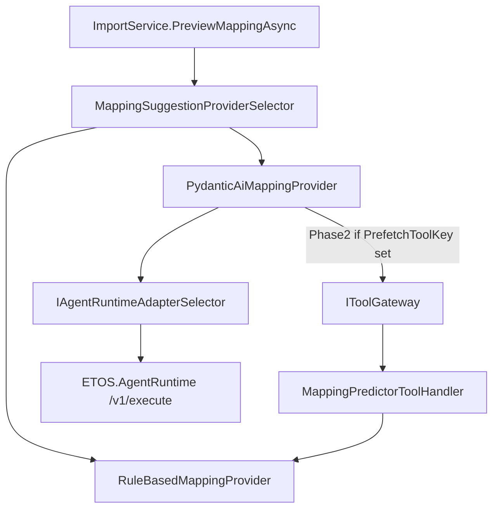

# LLM Import Mapping (Phase 1 + Phase 2)

## Scope

Close the documented gap: live LLM-assisted import mapping preview via existing runtime infrastructure, with OpenAI cloud and local LM Studio support, plus a dummy tool prefetch for phase 2.

**In scope**
- Replace stub in [`ETOS.Backend/Imports/MappingSuggestions/DeferredMappingProviders.cs`](ETOS.Backend/Imports/MappingSuggestions/DeferredMappingProviders.cs)
- Extend [`MappingSuggestionOptions`](ETOS.Backend/Imports/MappingSuggestions/MappingSuggestionProviderSelector.cs)
- LM Studio fix in [`ETOS.AgentRuntime/app/model_router.py`](ETOS.AgentRuntime/app/model_router.py)
- Phase 2: `mapping-predictor-v1` handler + seeded tool + gateway prefetch in provider
- Tests + minimal config/docs

**Out of scope**
- `AgentRun` / `/agents/.../execute` routing (PRD: mapping is not a governed agent)
- New public API endpoints
- Frontend mapping review UI (optional one-line `suggestionProviderKey` only)
- Full ML mapping predictor (phase 2 tool is deterministic rule-based wrapper)

## Architecture



**Reuse (no parallel LLM stack)**
- [`AgentRuntimeExecutionRequest`](ETOS.Backend/AgentRuntime/AgentRuntimeContracts.cs) — same model fields as Issue 23 agents
- [`PydanticAiHttpRuntimeAdapter`](ETOS.Backend/AgentRuntime/PydanticAiHttpRuntimeAdapter.cs)
- [`ImportPreviewRequest.SuggestionProviderKey`](ETOS.Backend/Imports/ImportContracts.cs) — already supports provider switch
- [`RuleBasedMappingProvider.BuildColumnSuggestions`](ETOS.Backend/Imports/MappingSuggestions/RuleBasedMappingProvider.cs) — phase 2 tool backend

---

## Phase 1 — Live LLM mapping provider

### 1. Extend `MappingSuggestionOptions`

In [`MappingSuggestionProviderSelector.cs`](ETOS.Backend/Imports/MappingSuggestions/MappingSuggestionProviderSelector.cs), add:

| Property | Purpose |
|----------|---------|
| `Enabled` | Gate LLM provider; default `false` in base `appsettings.json`, `true` in Development |
| `RuntimeAdapterKey` | Default `pydantic-ai-v1` |
| `PrimaryModelProviderKey` / `PrimaryModelId` | Model routing (OpenAI or `openai-compatible` for LM Studio) |
| `FallbackModels[]` | Same shape as agent runtime fallback chain |
| `PromptTemplateBody` | Mapping assistant system prompt |
| `FallbackToRuleBasedOnRuntimeFailure` | Dev-only resilience; default `false` in prod config |

Phase 2 additions on same class:
| `PrefetchToolEnabled` | Default `true` in Development when phase 2 shipped |
| `PrefetchToolKey` | Default `mapping-predictor-tool` |

Wire via existing `services.Configure<MappingSuggestionOptions>(...)` in [`EnterpriseThreadPlatform.cs`](ETOS.Backend/Platform/EnterpriseThreadPlatform.cs) — no DI changes for phase 1 beyond provider constructor deps.

### 2. Add small support types (Imports module)

**New files (~70 lines total):**

- `MappingSuggestionOutputSchema.cs` — static JSON schema constant matching existing DTOs:
  - `columnSuggestions[]`: `sourceColumn`, `canonicalObjectType`, `canonicalAttributeKey?`, `isIdentityField`, `isRequired`, `confidence`, `rationale`
  - `lifecycleSuggestions[]`: `sourceValue`, `canonicalLifecycleKey`, `confidence`, `rationale`

- `MappingSuggestionOntologyValidator.cs` — static validation against `ResolvedModelPackageContext`:
  - Reject unknown object types, attributes, lifecycle keys
  - Clamp confidence to 0–1

- `MappingSuggestionContextBuilder.cs` — build safe JSON payloads:
  - **Governed context:** model package key/version, object types, attributes, lifecycle states (no storage paths)
  - **Structured input:** headers + sample rows from request

### 3. Implement `PydanticAiMappingProvider`

Replace stub in [`DeferredMappingProviders.cs`](ETOS.Backend/Imports/MappingSuggestions/DeferredMappingProviders.cs) (or move to dedicated file).

**Inject:** `IAgentRuntimeAdapterSelector`, `IOptions<MappingSuggestionOptions>`, `IOptions<AgentRuntimeOptions>`, `ITenantContextResolver`, `RuleBasedMappingProvider` (fallback only), and for phase 2: `IToolGateway`, `IPublishedToolVersionResolver`.

**Flow:**
1. Fail if `!Enabled` or `AgentRuntime:BaseUrl` empty
2. Resolve tenant/user via `ITenantContextResolver`
3. Build governed context + structured input
4. **(Phase 2)** Optionally prefetch tool output → `toolOutputSummariesJson`
5. Call `adapterSelector.ExecuteAsync(AgentRuntimeExecutionRequest)` with `PreviewMode: true`, no `AgentRunId`
6. Deserialize `StructuredOutputJson` → map to `ImportMappingSuggestionResponse` types
7. Run ontology validator; throw `RequestValidationException` on invalid LLM output
8. Return `ImportMappingSuggestionResult(ProviderKey = pydantic-ai-v1, ...)`
9. Optional: if runtime fails and `FallbackToRuleBasedOnRuntimeFailure`, delegate to rule-based (Development only)

### 4. LM Studio / model provider abstraction (sidecar only)

Update [`model_router.py`](ETOS.AgentRuntime/app/model_router.py):

- Read `OPENAI_BASE_URL` for `openai-compatible` provider (default `http://host.docker.internal:1234/v1` in Docker)
- Treat provider as available when `OPENAI_BASE_URL` is set even without real OpenAI key
- Pass `base_url` + `api_key` into `OpenAIModel`

Document in [`.env.example`](.env.example) and [`docs/local-development.md`](docs/local-development.md):

```env
OPENAI_API_KEY=sk-...           # OpenAI cloud
# or for LM Studio:
OPENAI_API_KEY=lm-studio
OPENAI_BASE_URL=http://localhost:1234/v1
```

**Switch providers via config only** — no new .NET model abstraction layer.

Example Development config in [`appsettings.Development.json`](ETOS.Backend/appsettings.Development.json):

```json
"ImportMappingSuggestions": {
  "DefaultProviderKey": "pydantic-ai-v1",
  "Enabled": true,
  "PrimaryModelProviderKey": "openai-compatible",
  "PrimaryModelId": "<lm-studio-model-id>",
  "FallbackModels": [{ "ProviderKey": "openai", "ModelId": "gpt-4o-mini", "TriggerReason": "local unavailable" }]
}
```

---

## Phase 2 — Dummy tool prefetch via existing gateway

Goal: exercise the same tool path agents use (`IToolGateway` → `IToolHandler` → output in `ToolOutputSummariesJson`) without `AgentRun`. Tool output is deterministic rule-based suggestions (dummy stand-in for future ML predictor).

### 5. Add internal handler `mapping-predictor-v1`

In [`ToolHandlers.cs`](ETOS.Backend/ToolRegistry/ToolHandlers.cs):

```csharp
public sealed class MappingPredictorToolHandler : IToolHandler
{
    public string HandlerKey => ToolInternalHandlerKeys.MappingPredictor;
    // Input JSON: { headers, sampleRows }
    // Execute: RuleBasedMappingProvider.BuildColumnSuggestions + BuildLifecycleSuggestions
    // Output safe summary JSON: { columnSuggestions, lifecycleSuggestions, providerKey: "rule-based-v1" }
}
```

Add constant to [`ToolInternalHandlerKeys`](ETOS.Backend/ToolRegistry/ToolRegistryPermissions.cs) and include in `All` list (required by [`ToolDefinitionReadinessValidator`](ETOS.Backend/ToolRegistry/ToolDefinitionReadinessValidator.cs)).

Register in [`EnterpriseThreadPlatform.cs`](ETOS.Backend/Platform/EnterpriseThreadPlatform.cs):
```csharp
services.AddScoped<IToolHandler>(sp => sp.GetRequiredService<MappingPredictorToolHandler>());
```

### 6. Seed dummy tool in reference package

Add entry to [`packages/manufacturing-reference/artifacts/tools.json`](packages/manufacturing-reference/artifacts/tools.json):

- `toolKey`: `mapping-predictor-tool`
- `internalHandlerKey`: `mapping-predictor-v1`
- `readOnly`: true, `supportsDryRun`: true
- `requiredPermissionKeys`: [`imports.read`] (aligns with mapping preview permission)
- Input schema: `{ headers, sampleRows }`
- Output schema: `{ columnSuggestions, lifecycleSuggestions }`

Re-run reference package install (idempotent) so dev tenant gets published tool.

### 7. Resolve published tool by key (minimal helper)

Add [`PublishedToolVersionResolver.cs`](ETOS.Backend/ToolRegistry/PublishedToolVersionResolver.cs):

```csharp
public interface IPublishedToolVersionResolver
{
    Task<(Guid ArtifactId, Guid VersionId)?> TryResolvePublishedToolAsync(
        Guid tenantId, string toolKey, CancellationToken ct);
}
```

Extract logic from test helper in [`ToolRegistryTests.cs`](ETOS.Backend.Tests/ToolRegistryTests.cs) (`ResolvePublishedToolAsync`). Register scoped in platform DI.

### 8. Wire prefetch in `PydanticAiMappingProvider`

When `PrefetchToolEnabled && PrefetchToolKey` set:

1. `TryResolvePublishedToolAsync(tenantId, PrefetchToolKey)` — if not found, skip prefetch (log/trace note only; do not fail mapping)
2. `IToolGateway.ExecuteAsync(artifactId, versionId, new ToolExecutionRequest(inputJson, ParentAgentRunId: null))`
3. Append to list passed as `ToolOutputSummariesJson` on runtime request (same shape as [`AgentExecutionService`](ETOS.Backend/AgentRuntime/AgentExecutionService.cs) lines 177–184)
4. Extend prompt: *"Consider tool outputs as deterministic hints; override with rationale when appropriate."*

**Dummy behavior:** handler always returns rule-based suggestions. Real gateway call creates a `ToolRun` with `ParentAgentRunId = null` — validates integration without agent orchestration.

---

## Tests

| Test | File |
|------|------|
| Mock runtime returns valid mapping JSON → provider maps + validates | [`MappingSuggestionProviderTests.cs`](ETOS.Backend.Tests/MappingSuggestionProviderTests.cs) |
| Invalid ontology in LLM output → validation error | same |
| `Enabled=false` → clear error | same |
| Phase 2: prefetch enabled → mock gateway/handler output appears in runtime request | new test with mocked `IToolGateway` + `IPublishedToolVersionResolver` |
| Phase 2: `MappingPredictorToolHandler` returns rule-based output for sample CSV headers | new test in ToolRegistry or Mapping tests |
| Sidecar: `openai-compatible` + `OPENAI_BASE_URL` uses mock without API key | [`test_execute.py`](ETOS.AgentRuntime/tests/test_execute.py) |
| Reference package install includes `mapping-predictor-tool` | [`ManufacturingReferencePackageTests.cs`](ETOS.Backend.Tests/ManufacturingReferencePackageTests.cs) |

Use existing [`MockAgentRuntimeAdapter`](ETOS.Backend.Tests/Fixtures/MockAgentRuntimeAdapter.cs) pattern; extend mock to return mapping-shaped JSON for mapping tests.

---

## Optional frontend (minimal)

In [`ETOS.Frontend/src/lib/etos-api.ts`](ETOS.Frontend/src/lib/etos-api.ts), pass `suggestionProviderKey: "pydantic-ai-v1"` in mapping-preview POST when backend default is still rule-based — or rely on Development config default only.

---

## Verification (manual)

1. Start infra + `agent-runtime` + backend
2. LM Studio: load model, enable OpenAI-compatible server on `:1234`
3. Set `.env`: `OPENAI_BASE_URL`, dummy `OPENAI_API_KEY`
4. Enable `ImportMappingSuggestions` in Development config
5. Reinstall reference package (for phase 2 tool seed)
6. `/imports` → **Create CAD/PDM draft batch**
7. Confirm Mapping Versions card: `Suggestion provider: pydantic-ai-v1`, LLM-style rationales
8. Confirm `ToolRun` row exists for prefetch (DB or `/tool-runs` if listed) with null parent agent run

Run: `dotnet test EnterpriseThreadOS.sln --filter "FullyQualifiedName~MappingSuggestion|MappingPredictor|ManufacturingReference"` and `pytest ETOS.AgentRuntime/tests`.

---

## File change summary

| File | Change |
|------|--------|
| `DeferredMappingProviders.cs` | Real provider (+ prefetch logic) |
| `MappingSuggestionProviderSelector.cs` | Extended options |
| `MappingSuggestionOutputSchema.cs` | **New** |
| `MappingSuggestionOntologyValidator.cs` | **New** |
| `MappingSuggestionContextBuilder.cs` | **New** |
| `ToolHandlers.cs` | `MappingPredictorToolHandler` |
| `ToolRegistryPermissions.cs` | New handler key |
| `PublishedToolVersionResolver.cs` | **New** |
| `EnterpriseThreadPlatform.cs` | Register handler + resolver |
| `packages/.../tools.json` | Seed dummy tool |
| `model_router.py` | LM Studio base URL |
| `appsettings.Development.json` | ImportMappingSuggestions block |
| `.env.example`, `docs/local-development.md` | LM Studio vars |
| Tests | Mapping + tool + package |

**No migrations. No new HTTP routes.**

---

## Completion notes (2026-06-27)

- `PydanticAiMappingProvider` live in `ETOS.Backend/Imports/MappingSuggestions/PydanticAiMappingProvider.cs` with ontology validation, runtime adapter integration, and optional tool prefetch.
- Phase 2 `mapping-predictor-v1` handler + `mapping-predictor-tool` seeded in manufacturing reference package; `IPublishedToolVersionResolver` registered in DI.
- Sidecar updated for `openai-compatible` / LM Studio via `OPENAI_BASE_URL` and `OpenAIProvider` + `OpenAIChatModel`.
- `PydanticAiRuntimeAdapter` forwards `toolOutputSummariesJson`; sidecar prompt includes tool summaries.
- Development config enables LLM mapping; base config keeps `Enabled: false`.
- Tests: 11 filtered .NET tests + 8 Python tests passing.
