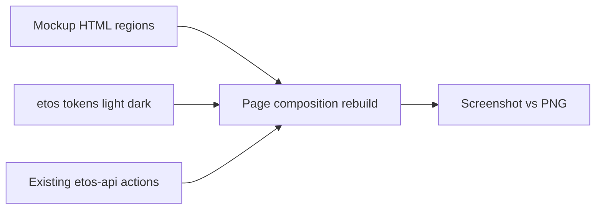

# Mockup-parity rebuild (layout from mockups, themes from tokens)

## Problem

Phase 1 reskin kept old admin page structure and only swapped classes. Live pages do **not** match mockup compositions (regions, hierarchy, card patterns, steppers, side panels). Example: mockup [`08-import-hub.html`](References/etos_ui_mockup_pack_with_digital_thread_timeline/etos_ui_mockups/html/08-import-hub.html) is a light-content hub with KPI strip + numbered demo list + state timeline; live [`/imports`](ETOS.Frontend/src/app/(shell)/imports/page.tsx) is a dark dump of every action + debug panel.

## Non-negotiables (your decisions)

- **Layout / style / components:** follow mockup pack HTML + PNG under [`References/etos_ui_mockup_pack_with_digital_thread_timeline/etos_ui_mockups/`](References/etos_ui_mockup_pack_with_digital_thread_timeline/etos_ui_mockups/) — title row, KPI grids, card splits, steppers, list-items, side panels, table-as-card-rows.
- **Light and dark:** every screen works in both modes via existing `--etos-*` tokens in [`ETOS.Frontend/src/app/globals.css`](ETOS.Frontend/src/app/globals.css) and [`design-system-light-dark.md`](.docs/.prd/.ui/design-system-light-dark.md). **Do not** copy mockup hex as the only palette; map mockup roles (canvas/panel/ink/badge/btn) onto tokens so `.dark` stays correct.
- **Backend freeze:** `ETOS.Frontend/` only; reuse existing `etos-api` + server actions.
- **Honesty:** debug/dev tools stay available but **demoted** (collapsed “Advanced / Debug” or `/admin/foundation`-adjacent), not on the primary mockup surface.

## Method (each screen)

1. Open matching `html/NN-*.html` + `images/NN-*.png`.
2. Extract **regions** (title+actions, KPI row, main/side split, stepper, tables, rails).
3. Rebuild page JSX to those regions; wire real data into the same slots.
4. QA: screenshot live vs PNG for layout match; toggle light+dark for readable tokens.

## Slice 0 — Shared mockup primitives (token-mapped)

Extend [`ETOS.Frontend/src/components/ui/`](ETOS.Frontend/src/components/ui/) so pages stop inventing one-off layouts:

- **Mockup card / list-item** — soft shadow, 18px radius, muted row wells (match `.card` / `.list-item` in mockup CSS, using `bg-etos-panel`, `shadow-etos`, `border-etos-border`).
- **KPI strip** — uppercase label + large value + hint (mockup `.kpi`).
- **Stepper** — numbered circles + connector lines with done/active states (upgrade current [`Stepper.tsx`](ETOS.Frontend/src/components/ui/Stepper.tsx) to mockup 10 pattern: Source → Mapping → Validate → Identity → Commit).
- **Side panel / pill stack** — governance / rationale rails (mockup `.side-panel` / `.pill-line`).
- **Card-row table** — separated rounded rows (mockup `.table` border-spacing style), not flat dense admin tables.
- **Primary / ghost / good / danger buttons** — gradient primary already exists; align sizes/radius to mockup `.btn`.

Keep theme toggle; content surfaces must read as light workspace in light mode and panel hierarchy in dark mode (navy sidebar already correct).

## Slice 1 — Import surfaces (gold standard) — mockups 08–13

Rebuild to match HTML structure; demote Mapping Agent Debug + long manual tool dumps into `
` Advanced section.

| Route | Mockup | Target composition |
| --- | --- | --- |
| `/imports` | 08 | Title + New import / Upload; 4 KPIs; span-2 “Recommended demo actions” (3 numbered items); “Import state” timeline |
| `/imports/new` | 09 | Upload step layout from HTML |
| `/imports/[batchId]/mapping` | 10 | Stepper; column mapping table + suggestion rationale side card; Approve / Reject |
| `/imports/[batchId]/staging` | 11 | Validation + promote blockers layout |
| `/imports/[batchId]/identity` | 12 | Candidate cards + trust scores composition |
| `/imports/data-quality` | 13 | Triage table with severity / trust penalty |

Files: rewrite [`imports/page.tsx`](ETOS.Frontend/src/app/(shell)/imports/page.tsx), sub-routes under [`imports/`](ETOS.Frontend/src/app/(shell)/imports/), slim [`ImportHubShared.tsx`](ETOS.Frontend/src/components/imports/ImportHubShared.tsx); keep [`imports/actions.ts`](ETOS.Frontend/src/app/(shell)/imports/actions.ts) behavior.

## Slice 2 — Chat, traces, recommendations — 17–18, 21–22

- `/chat` (17): conversation card + Answer Governance side panel (intent/retrieval/confidence/evidence + draft CTAs) — not a form dump.
- `/ai-traces/[traceId]` (18): timeline + export panel matching mockup regions.
- `/recommendations` (21): 4 KPI cards + card-row inbox table + Filter high risk.
- Recommendation detail (22): evidence / actions layout from HTML.

## Slice 3 — Model + Operate remainder — 02–07, 14–16, 19–20, 23

Same method for model package, ontology, Layer 3–6 lists, graph promote, documents, 360, dashboards/reports, artifacts. Prefer shared list/detail shells that mirror mockup card grids, not `DefinitionLibraryPage` flat tables if mockup shows richer cards.

## Slice 4 — Close

- Per-screen light+dark smoke; screenshot vs PNG for Slice 1 at minimum.
- Update gap analysis: “token reskin” vs “mockup composition parity.”
- `graphify update .` + `cluster-only .` after frontend changes.

## Explicitly out of scope this pass

- Inventing new backend APIs.
- Copying mockup-only light hex into pages (use tokens).
- Phase 2–5 screens (24–40) except shared primitives they will reuse.