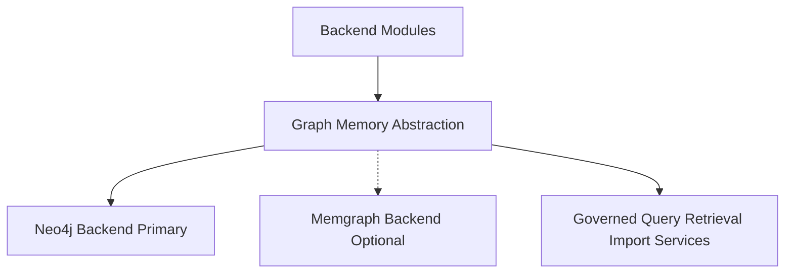

# Neo4j Primary Graph Backend Plan

## Recommendation
Yes, switch the MVP primary graph backend from Memgraph to Neo4j.

Reason: Memgraph is durable, but its default and recommended transactional mode is memory-first. It can persist snapshots/WALs and has an on-disk RocksDB mode, but graph objects used by transactions still need to fit in RAM. For EnterpriseThreadOS, the digital thread can grow across CAD, PDM, PLM, ERP, MES, QMS, documents, identity links, trust states, snapshots, and diffs. Neo4j is a better default system of record for a large persistent graph because it is disk-backed with page-cache based memory management and a mature enterprise operations model.

Keep the existing abstraction goal: do not couple domain modules or public APIs directly to Neo4j. Issue 6 should implement a graph memory abstraction first, then a Neo4j backend as the active MVP implementation, with Memgraph retained as an optional/experimental Bolt/Cypher-compatible backend.

## Files To Update

- [`.docs/.prd/engineering-execution-prd.md`](.docs/.prd/engineering-execution-prd.md)
  - Change the architecture diagram storage node from `Memgraph Digital Thread Graph` to `Neo4j Digital Thread Graph`.
  - Change `Graph Memory` in `Tech Stack by Layer` from `Memgraph via graph abstraction contracts` to `Neo4j via graph abstraction contracts`.
  - Move Memgraph to future/optional backend wording alongside other graph backends.
  - Change local infrastructure wording from including Memgraph as the primary graph service to Neo4j as primary, with Memgraph optional if needed for evaluation.
  - Update the OSS accelerator row from `Neo4j.Driver over Bolt-compatible Memgraph access` to `Neo4j.Driver for Neo4j primary access`, while noting the abstraction should preserve Cypher/Bolt portability where practical.
  - Update testing wording from Memgraph-focused Testcontainers to Neo4j-focused Testcontainers, with optional Memgraph contract tests only if the backend is enabled.

- [`.docs/.prd/engineering-execution-issues.md`](.docs/.prd/engineering-execution-issues.md)
  - Change the roadmap summary row for `Issue 6: Graph Memory` to list Neo4j as primary and Memgraph as optional/experimental.
  - Rename `Issue 6: Graph Memory Abstraction and Memgraph Backend` to `Issue 6: Graph Memory Abstraction and Neo4j Backend`.
  - Update `What to build` so Issue 6 implements graph abstraction, BaseNode/BaseRelationship conventions, graph health checks, internal query contracts, Neo4j implementation, and Memgraph optional placeholder/adapter contract.
  - Update acceptance criteria so Neo4j can create, query, update, and traverse tenant-scoped graph records.
  - Replace `Neo4j support exists only as a disabled placeholder contract` with `Memgraph support exists only as an optional disabled placeholder or later adapter unless explicitly enabled`.
  - Update bootstrap script wording from Memgraph constraints to Neo4j constraints/indexes/conventions.
  - Update graph tests to target Neo4j health, tenant filtering, relationship metadata, traversal constraints, and raw access restrictions.

## Decision Wording To Add

Add a short decision note near the PRD graph stack section:

```md
Decision: Neo4j is the primary MVP graph memory backend because EnterpriseThreadOS must support large, durable enterprise digital-thread graphs without requiring the full graph dataset to fit in RAM. Memgraph remains a possible optional backend behind the graph abstraction for memory-first analytics or future evaluation, but it is not the default system-of-record graph backend.
```

## Implementation Process

1. Update PRD architecture wording first so product intent is clear.
2. Update Issue 6 scope and acceptance criteria to match the new primary backend.
3. Search `.docs/.prd` for remaining `Memgraph` references and classify each as either:
   - local infra from old decision, replace with Neo4j;
   - optional backend/future evaluation, keep but reword;
   - historical initial conversation, leave untouched unless you want historical docs rewritten.
4. Do not change backend code in this documentation pass unless you explicitly ask for implementation next.
5. After doc edits, run a focused search for stale contradictions such as `Memgraph implementation`, `Memgraph Digital Thread Graph`, and `Neo4j placeholder`.

## Architecture Direction



The important boundary remains the same: public APIs and modules depend on the graph abstraction, not direct database query access.