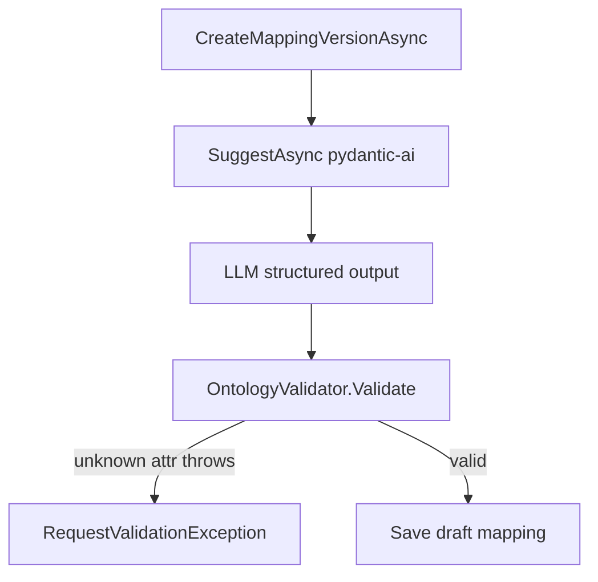

# Ontology-constrained import mapping suggestions

## Problem

With `ImportMappingSuggestions:DefaultProviderKey=pydantic-ai-v1`, Odoo one-click demo fails on `CreateMappingVersionAsync` because that path always calls `SuggestAsync`. The LLM copies source columns (e.g. `productCategory`) into `canonicalAttributeKey`; ontology only allows `category`. `MappingSuggestionOntologyValidator.Validate` throws. Rule-based fallback does not run for non-empty-but-invalid keys.



## Chosen approach

One backend slice (not three separate PRs at once). Order inside the slice:

1. Soft sanitize + ontology-invalid → rule-based fallback
2. Create-mapping isolation (learning must not block draft create)
3. Prompt + structured-input allow-list
4. Dynamic closed `enum` on output schema per request
5. Tests + docs

Hard throw remains when `FallbackToRuleBasedOnRuntimeFailure=false` (strict preview for operators).

## Implementation

### 1. Sanitize + fallback

**Files:**
- [ETOS.Backend/Imports/MappingSuggestions/MappingSuggestionOntologyValidator.cs](ETOS.Backend/Imports/MappingSuggestions/MappingSuggestionOntologyValidator.cs)
- [ETOS.Backend/Imports/MappingSuggestions/MappingSuggestionOutputQuality.cs](ETOS.Backend/Imports/MappingSuggestions/MappingSuggestionOutputQuality.cs)
- [ETOS.Backend/Imports/MappingSuggestions/PydanticAiMappingProvider.cs](ETOS.Backend/Imports/MappingSuggestions/PydanticAiMappingProvider.cs)

Add `Sanitize(...)` that returns cleaned suggestions + issue list:
- unknown object type → drop column suggestion (or clear and skip usable)
- unknown `canonicalAttributeKey` → set key `null`, clamp confidence ≤ 0.3, append rationale note
- unknown lifecycle key → drop / clear similarly

In `PydanticAiMappingProvider` after `ParseRuntimeOutput` (~273–307):
- run `Sanitize` instead of hard `Validate` when fallback enabled
- if `Issues.Count > 0` OR `!HasUsableColumnSuggestions(...)`, call existing rule-based fallback (`UsedRuleBasedFallback=true`, record issues in diagnostics error message)
- when fallback disabled, call existing `Validate` (preserve hard fail)

### 2. Create-mapping isolation

**File:** [ETOS.Backend/Imports/ImportService.cs](ETOS.Backend/Imports/ImportService.cs) (`CreateMappingVersionAsync` ~198–250)

Wrap learning `SuggestAsync` so draft create never dies on LLM/ontology failure:
- try default selector `SuggestAsync`
- on `RequestValidationException` (or any suggest failure), run `RuleBasedMappingProvider.SuggestAsync` for learning compare only
- still persist request column mappings (presets/AI draft from client)
- `EmitCorrectedAsync` uses whatever suggestions succeeded

This unblocks `runDemoImportFlow` with `mappingSource: "preset"` under Development pydantic-ai defaults.

### 3. Prompt + allow-list

**Files:**
- [ETOS.Backend/Imports/ImportMappingArtifactSeeder.cs](ETOS.Backend/Imports/ImportMappingArtifactSeeder.cs) — update `BuildPromptTemplatePayload` body:
  - map only to `attributes[].attributeKey`, `objectTypes[].key`, `lifecycleStates[].key`
  - never invent; never copy `sourceColumn` unless it equals an attribute key
  - no match → `canonicalAttributeKey: null` + low confidence
  - prefer tool prefetch when ontology-valid
- [ETOS.Backend/Imports/MappingSuggestions/MappingSuggestionContextBuilder.cs](ETOS.Backend/Imports/MappingSuggestions/MappingSuggestionContextBuilder.cs) — extend `BuildStructuredInputJson` with `allowedObjectTypes`, `allowedAttributes` (`attributeKey` + `appliesToObjectType`), `allowedLifecycleKeys`

Seeder already updates published prompt payload when string differs; reinstall/ensure reference package (or normal backend start seed path) refreshes tenant prompt.

### 4. Dynamic closed enum schema

**Files:**
- New helper beside [MappingSuggestionOutputSchema.cs](ETOS.Backend/Imports/MappingSuggestions/MappingSuggestionOutputSchema.cs): `MappingSuggestionOutputSchemaFactory.Build(ResolvedModelPackageContext)` clones base JSON and injects enums for object type / attribute key / lifecycle key (attribute key may include `null` if JSON Schema allows type null|string — keep nullable via omitting enum value and allowing null by clearing in sanitize if schema forbids null).
- [ETOS.Backend/AgentRuntime/AgentRuntimePreviewOrchestrator.cs](ETOS.Backend/AgentRuntime/AgentRuntimePreviewOrchestrator.cs) + `AgentRuntimePreviewInput`: add optional `OutputSchemaJsonOverride`; when set, use it instead of loading `OutputSchemaVersionId` artifact.
- `PydanticAiMappingProvider`: pass factory-built schema as override into `RunPreviewAsync`.

Agent Runtime already honors `enum` in structured output / mocks. No Python change required for MVP.

### 5. Tests

**File:** [ETOS.Backend.Tests/MappingSuggestionProviderTests.cs](ETOS.Backend.Tests/MappingSuggestionProviderTests.cs)

- Change `PydanticAiProviderRejectsInvalidOntologyInRuntimeOutput` → with fallback **true**: returns rule-based usable suggestions + diagnostics fallback; with fallback **false**: still throws.
- Add `productCategory` → unknown attr case → fallback (mirrors Odoo failure).
- Cover structured input contains allow-list keys / override schema present on runtime request (assert via existing `RecordingAgentRuntimeAdapter.LastRequest.OutputSchemaJson` if exposed).

Add focused unit tests for `Sanitize` / schema factory if cleanest as separate facts in same file.

### 6. Docs

Update implemented wording (not PRD intent):

- [docs/backend/architecture.md](docs/backend/architecture.md) — Imports `IMappingSuggestionProvider` bullet (~160): document ontology sanitize, ontology-invalid → rule-based fallback when configured, per-request closed enum overlay, create-mapping uses suggestions for learning only and must not fail drafts.
- [docs/local-development.md](docs/local-development.md) — LLM-assisted import mapping section (~191+): note that invalid LLM attribute keys fall back to `rule-based-v1` when `FallbackToRuleBasedOnRuntimeFailure` is true; one-click Odoo/PDM preset demo remains package-preset mappings; if create still sees suggestion noise, Mapping Agent Debug shows `usedRuleBasedFallback` / issues.

Light touch in [.docs/gapAnalysis/issues-1-18.5-22-23-gap-analysis.md](.docs/gapAnalysis/issues-1-18.5-22-23-gap-analysis.md) AI-mapping row only if it still implies hard ontology reject with no fallback — align to new behavior.

### 7. Graphify after code

```powershell
graphify update .
graphify cluster-only .
```

## Out of scope

- Teaching C# `OutputSchemaValidator` full `enum` enforcement (agent execute path)
- Hermes provider
- Frontend changes (preset demo path already correct)
- Changing default provider away from pydantic-ai in Development

## Verification

```powershell
dotnet test ETOS.Backend.Tests/ETOS.Backend.Tests.csproj --filter "FullyQualifiedName~MappingSuggestionProviderTests"
```

Manual: restart backend, Mapping Agent Debug or Odoo **Run full Odoo ERP demo import** — no `unknown attribute 'productCategory'` on create mapping.
