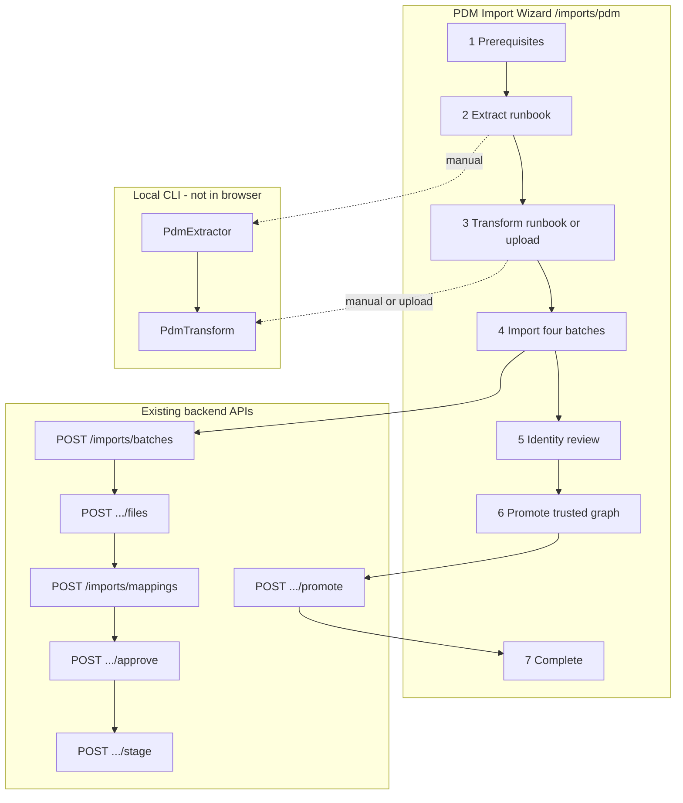
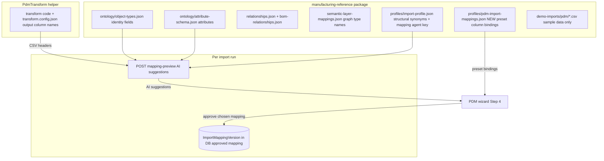
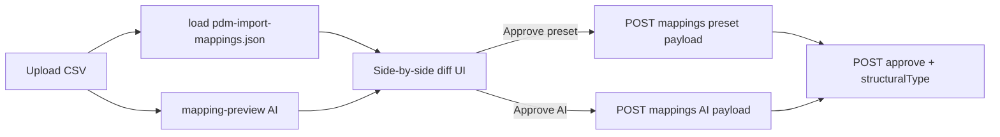

# PDM Import Wizard UI

## Issue 29 verification (done)

Backend + helpers ship as described:

| Slice | Status | Key artifacts |
|-------|--------|---------------|
| 29.1 Ontology | Done | [`packages/manufacturing-reference/ontology/`](packages/manufacturing-reference/ontology/) — `partVersion`, `hasVersion`, version `contains` |
| 29.3 Backend | Done | [`StructuralRelationshipResolver.cs`](ETOS.Backend/Imports/StructuralRelationshipResolver.cs), `StructuralRelationshipType` on mapping + migration |
| 29.2 PdmTransform | Done | [`ETOS.Helpers/PdmTransform/`](ETOS.Helpers/PdmTransform/) |
| 29.4 E2E | Done | [`PdmImportFlowTests.cs`](ETOS.Backend.Tests/PdmImportFlowTests.cs), demo CSVs in [`packages/manufacturing-reference/demo-imports/pdm/`](packages/manufacturing-reference/demo-imports/pdm/) |

**Gaps for UI (frontend-only fixes):**

- No PDM-specific page; [`/imports`](ETOS.Frontend/src/app/imports/page.tsx) is generic debug harness
- [`etos-api.ts`](ETOS.Frontend/src/lib/etos-api.ts) lacks batch-specific helpers and never passes `structuralRelationshipType` (backend supports it on create + approve per [`ImportContracts.cs`](ETOS.Backend/Imports/ImportContracts.cs))
- `ImportMappingVersion` TS type missing `structuralRelationshipType` field
- Dev demo-imports endpoint only serves `flat-part-import` / `bom-comparison` — **not** extending per your choice; demo uses server fs read instead

---

## Target flow



**Import order (must match [`PdmImportFlowTests`](ETOS.Backend.Tests/PdmImportFlowTests.cs)):**

1. `parts.csv` — flat `part`
2. `part-versions.csv` — flat `partVersion`
3. `has-version.csv` — structural `hasVersion`
4. `version-bom.csv` — structural `contains` on `partVersion`

`SourceSystem` = `SOLIDWORKS-PDM` for all batches.

---

## Mapping strategy (preset + AI suggestions; no user JSON upload)

**You do not upload a mapping JSON file.** Per-batch mapping comes from two sources shown side-by-side; you pick which to approve.

### Where mapping is defined (layers)



| Layer | Location | What it defines | PDM-specific? |
|-------|----------|-----------------|---------------|
| **Ontology** | [`packages/manufacturing-reference/ontology/`](packages/manufacturing-reference/ontology/) | Object types (`part`, `partVersion`), identity fields, attributes, `hasVersion` / `contains` rels | Yes — `partVersion`, `documentId` on part |
| **Semantic layer** | [`ontology/semantic-layer-mappings.json`](packages/manufacturing-reference/ontology/semantic-layer-mappings.json) | Graph labels (`part`→`Part`, `hasVersion`→`HAS_VERSION`) | Yes |
| **Import profile** | [`profiles/import-profile.json`](packages/manufacturing-reference/profiles/import-profile.json) | Default BOM type, `parent`/`child` column synonyms, `mappingAssistantAgentKey` | Generic — helps AI + structural detection, **not** per-column PDM bindings |
| **PDM preset mappings** | **`profiles/pdm-import-mappings.json`** (new, in package) | CSV column → ontology field bindings per PDM file + `structuralRelationshipType` | **Yes — canonical preset** |
| **Transform contract** | [`ETOS.Helpers/PdmTransform/`](ETOS.Helpers/PdmTransform/) | Output filenames and CSV header names (`documentId`, `pdmVersionKey`, `parent`, `child`) | Yes |
| **AI suggestions** | Runtime via `POST .../mapping-preview` | Suggestions from ontology + import-profile + mapping assistant agent + `mapping-predictor-tool` | Uses same package ontology; not pre-authored |
| **Approved mapping** | DB `ImportMappingVersion` | What actually stages graph — created when you approve preset or AI draft | Per batch / per run |
| **Demo CSVs** | [`demo-imports/pdm/`](packages/manufacturing-reference/demo-imports/pdm/) | Sample rows only — **not** mapping definitions | Data only |

**Answer:** Ontology and relationships **are** part of the package. Per-column PDM CSV bindings **will be** part of the package (`pdm-import-mappings.json`). AI does not ship a static mapping file — it derives suggestions from the installed package ontology at preview time.

### Preset content (`profiles/pdm-import-mappings.json`)

New package file (mirrors [`PdmImportFlowTests.cs`](ETOS.Backend.Tests/PdmImportFlowTests.cs)):

| CSV | Mode | Key bindings | `structuralRelationshipType` |
|-----|------|--------------|------------------------------|
| `parts.csv` | flat | `documentId`→`part.documentId` (identity), `fileName`→`part.partNumber` | — |
| `part-versions.csv` | flat | `pdmVersionKey` identity; attrs: `documentId`, `revision`, `fileName`, `status`, `workflow`, `isLatest`, `projectPath` | — |
| `has-version.csv` | structural | `parent`→`part.documentId`, `child`→`partVersion.pdmVersionKey` | `hasVersion` |
| `version-bom.csv` | structural | `parent`/`child`→`partVersion.pdmVersionKey` | `contains` |

Lifecycle (flat): `released`→`released`.

Frontend loads this JSON from the monorepo package path (same pattern as demo CSV fs read). TypeScript types in `pdm-import-config.ts` wrap/validate the loaded JSON.

### AI suggestions (alongside preset)

After CSV upload per batch, wizard calls existing **`previewImportMapping`** (same as [`MappingAgentDebugPanel`](ETOS.Frontend/src/components/imports/MappingAgentDebugPanel.tsx) on `/imports`):

1. Upload CSV → evidence on batch
2. `POST /api/admin/imports/batches/{batchId}/mapping-preview` with `includeDiagnostics: true`
3. AI returns `columnSuggestions` + `lifecycleSuggestions` using package ontology + `import-mapping-assistant` agent

### Step 4 UI — dual mapping review

Per batch, show **two columns**:

| Preset (package) | AI suggestion |
|----------------|---------------|
| From `pdm-import-mappings.json` | From `mapping-preview` response |
| Always available after upload | Requires mapping assistant agent configured |
| Default for one-click demo | Optional override |

- **Diff highlights** where AI disagrees with preset (column, object type, identity flag)
- **Approve preset** — creates mapping from package JSON (default; one-click demo uses this)
- **Approve AI suggestion** — creates mapping from `buildDraftImportMappingPayloadFromPreview` (existing helper in `etos-api.ts`)
- Structural batches: UI still sets `structuralRelationshipType` from preset profile when approving either path (AI does not infer structural rel type today — preset supplies it)
- If AI preview fails: show error, preset-only path still works



### What you upload

Only the **4 CSVs** (+ optional `manifest.json` for row-count display). No mapping file upload.

### If you change PdmTransform columns

Update together: PdmTransform code → `pdm-import-mappings.json` → `PdmImportFlowTests` → package reinstall for tenant.

---

## Route and navigation

| Item | Path |
|------|------|
| New wizard | [`ETOS.Frontend/src/app/imports/pdm/page.tsx`](ETOS.Frontend/src/app/imports/pdm/page.tsx) |
| Link from import hub | Add CTA card on [`/imports`](ETOS.Frontend/src/app/imports/page.tsx) |
| Home MVP line | Add link near existing import step on [`/`](ETOS.Frontend/src/app/page.tsx) |

No `(shell)` layout exists yet — match current imports page styling (dark slate cards, server actions).

---

## New modules

### 1. PDM mapping presets — package JSON + `src/lib/pdm-import-config.ts`

**Canonical source:** new [`packages/manufacturing-reference/profiles/pdm-import-mappings.json`](packages/manufacturing-reference/profiles/pdm-import-mappings.json) — part of manufacturing-reference package, versioned with ontology.

Reference in [`package.manifest.json`](packages/manufacturing-reference/package.manifest.json) under `profiles` (optional key `pdmImportMappingsFile` for discoverability).

`pdm-import-config.ts` loads + validates JSON from monorepo path; exports typed `PDM_IMPORT_FILES` profiles.

```ts
export const PDM_SOURCE_SYSTEM = "SOLIDWORKS-PDM";
// PDM_IMPORT_FILES loaded from package profiles/pdm-import-mappings.json
```

### 2. Demo CSV loader — `src/lib/pdm-demo-fixtures.ts`

Server-only helper (imported only from server actions):

- Read `packages/manufacturing-reference/demo-imports/pdm/{fileName}` via `fs/promises` + `path.join(process.cwd(), "..", "packages", ...)`
- Return clear error if file missing (e.g. deployed without monorepo)
- Optional: parse uploaded `manifest.json` to show row counts (display only)

### 3. API extensions — [`src/lib/etos-api.ts`](ETOS.Frontend/src/lib/etos-api.ts)

Wrap **existing** endpoints (no backend changes):

| New export | Endpoint | Notes |
|------------|----------|-------|
| `getImportBatchDetail(batchId)` | `GET /api/admin/imports/batches/{id}` | Per UI screen map |
| `createImportBatch(...)` | `POST /api/admin/imports/batches` | `modelPackageKey: manufacturing-reference` |
| `uploadImportBatchFile(batchId, csv, fileName)` | `POST .../files` | FormData pattern from `createDemoImportForSource` |
| `createImportMappingVersion(...)` | `POST /api/admin/imports/mappings` | Include `structuralRelationshipType` when structural |
| `approveImportMapping(id, { summary, structuralRelationshipType })` | `POST .../approve` | Fix gap vs backend |
| `validateImportBatch(batchId)` | `POST .../validate` | Batch-specific (not “latest”) |
| `stageImportBatch(batchId)` | `POST .../stage` | Batch-specific |
| `getIdentityCandidatesForBatch(batchId)` | existing identity endpoint | Batch-specific |
| `runPdmImportBatch(profile, csv, mappingSource)` | composes above | `mappingSource`: `'preset'` \| `'ai'` |
| `runPdmDemoImportFlow()` | composes 4 × preset path | One-click demo uses preset only |
| `previewPdmBatchMapping(batchId, evidenceId)` | wraps `previewImportMapping` | For Step 4 AI column |

Also update `ImportMappingVersion` type with `structuralRelationshipType?: string | null`.

Keep existing `approveLatestImportMapping` etc. unchanged for `/imports` compatibility.

### 4. Server actions — `src/app/imports/pdm/actions.ts`

- `runPdmDemoImportAction()` — loads 4 demo CSVs from fs, runs full pipeline, returns batch IDs + per-batch staging stats
- `runPdmBatchAction(formData)` — step-by-step: accepts `profileKey` + uploaded file (or `useDemoFixture=true`)
- `approvePdmBatchMappingAction(batchId)` — approve draft with correct structural type from profile
- `stagePdmBatchAction(batchId)` — validate (optional) + stage
- `promotePdmBatchesAction()` — reuse `promoteReadyStagedImportBatch` logic scoped to PDM batches created in session
- `generatePdmIdentityCandidatesAction(batchId)` — wrap existing identity generate endpoint

Redirect pattern: `redirect(/imports/pdm?step=4&error=...)` same as imports page.

### 5. UI components — `src/components/pdm-import/`

| Component | Role |
|-----------|------|
| `PdmImportWizard.tsx` | Client stepper; reads `searchParams.step`; modes: `demo` / `guided` |
| `PdmRunbookPanel.tsx` | Copy-paste PowerShell from [`ETOS.Helpers/README.md`](ETOS.Helpers/README.md) |
| `PdmTransformUpload.tsx` | Client: manifest + 4 file inputs; validates filenames |
| `PdmMappingCompare.tsx` | Side-by-side preset vs AI; diff highlights; Approve preset / Approve AI buttons |
| `PdmBatchPipeline.tsx` | 4-row progress: batch status, mapping state, staging node/rel counts |
| `PdmBatchDetailCards.tsx` | Reuse card patterns from imports page (`StatusBadge`, evidence, mapping, staging) |

**Step content:**

| Step | UI |
|------|-----|
| 1 Prerequisites | Checklist: tenant env vars, manufacturing-reference package published, link to `/model-artifacts` |
| 2 Extract | Runbook panel; “Continue” checkbox (no server call) |
| 3 Transform | Runbook + upload zone OR “Use demo fixtures” shortcut |
| 4 Import | **Demo:** one-click uses preset only. **Guided:** per-file upload → dual mapping review (preset + AI) → Approve preset or Approve AI → Stage |
| 5 Identity | List candidates for staged PDM batches; approve/conflict actions (reuse existing etos-api helpers) |
| 6 Promote | Promote ready batches; show blockers (validation errors, unresolved candidates) |
| 7 Complete | Summary counts + links to `/graph`, `/imports`, `/chat` |

Wizard stores session batch IDs in URL: `?step=4&batches=id1,id2,id3,id4` after demo run so refresh survives.

---

## Behavioral rules (from tests + imports page)

- Structural batches: `structuralRelationshipType` from package preset on create + approve (both preset and AI approve paths)
- One-click demo: preset only (skip AI for speed)
- Guided mode: always fetch AI preview after upload; show compare UI
- Lifecycle: use `released` → `released` for flat batches (same as tests)
- Promotion: only when no blocking validation errors and no unresolved identity candidates (existing `promoteReadyStagedImportBatch` logic)
- Re-import warning: show note that staging is CREATE-per-row (duplicates on re-run) — from Issue 29 scope

---

## Impact on existing imports and backend

### Backend — no changes planned

| Area | Impact |
|------|--------|
| `ETOS.Backend/Imports/*` | **None** — wizard calls existing endpoints only |
| EF migrations / schema | **None** |
| Import service behavior | **None** — `structuralRelationshipType` already shipped in Issue 29 |
| API routes | **None** — no new routes; same `POST /batches`, `/files`, `/mappings`, `/approve`, `/stage`, `/promote` |
| Tests | **None** required for backend; existing `ImportTests` + `PdmImportFlowTests` stay as-is |

PDM wizard is a **new consumer** of APIs tests already exercise.

### Existing `/imports` page — minimal, additive

| Change | Risk |
|--------|------|
| New link/card → `/imports/pdm` | None |
| Existing server actions (`createDemoImport`, `runIdentityDemo`, `approveLatestImportMapping`, etc.) | **Unchanged** — plan explicitly keeps them |
| `MappingAgentDebugPanel` | **Unchanged** |
| Page layout / demo buttons | **Unchanged** except optional CTA |

No refactor of monolithic `/imports` page in this slice.

### `etos-api.ts` — additive only

| Safe (new exports) | Do not modify behavior |
|--------------------|-------------------------|
| `getImportBatchDetail`, `createImportBatch`, batch-scoped validate/stage | `createDemoImportFlow`, `runIdentityResolutionDemoFlow` |
| `approveImportMapping` (new batch-specific fn) | `approveLatestImportMapping` (still targets latest batch draft) |
| `runPdmImportBatch`, `runPdmDemoImportFlow` | `getImportLists` aggregation |
| `ImportMappingVersion` type + optional `structuralRelationshipType` field | Existing callers ignore new field |

**Rule for implementation:** add new functions; avoid editing bodies of existing demo/latest-batch helpers unless fixing an unrelated bug.

### Package — additive file only

| File | Impact on existing imports |
|------|---------------------------|
| New `profiles/pdm-import-mappings.json` | **None** — not read by backend today; only PDM wizard loads it from disk |
| Optional `package.manifest.json` key | **None** — documentation/discoverability |
| `import-profile.json`, ontology JSON | **Unchanged** in this slice |

Existing `demo-cad-pdm` / `flat-part-import` flows do not reference PDM preset file. Tenant package reinstall only needed if ontology changes (already done in Issue 29).

### Shared tenant data — only indirect effect

All import batches (demo + PDM) share one tenant list. **Pre-existing pattern:**

- `/imports` “latest batch” buttons (`approveLatestImportMapping`, `stageLatestImportBatch`, …) always target **newest batch by list order**, regardless of `sourceSystem`.
- Running PDM wizard creates `SOLIDWORKS-PDM` batches that appear in the same list on `/imports`.
- If you run PDM import then use `/imports` “latest batch” tools, those tools may act on a PDM batch instead of `demo-cad-pdm` / `demo-erp`.

**Not a regression** — same limitation as today when mixing any two import runs. PDM wizard mitigates by using **batch-scoped** actions on `/imports/pdm`. Document in wizard Step 7: “For generic import debugging, use `/imports` — latest-batch actions follow list order.”

Identity demo (`demo-cad-pdm` + `demo-erp`) and MVP demo flows are **unchanged** — different `sourceSystem` values, separate code paths.

### AI mapping preview — shared, not altered

`previewImportMapping` / mapping assistant agent used by both `/imports` debug panel and PDM wizard Step 4. No change to provider logic — wizard adds another caller.

---

## Out of scope

- Running PdmExtractor/PdmTransform from browser or backend (29.5 live connector)
- Backend changes (including demo-imports endpoint extension)
- Full UI-1.4 import hub split / shell reskin (can land later; this page is self-contained)
- Zip upload parsing (four separate CSV inputs is enough for v1)

---

## Verification

```powershell
dotnet test EnterpriseThreadOS.sln --filter "FullyQualifiedName~PdmImport"
```

```powershell
Push-Location ETOS.Frontend
npm run typecheck
npm run lint
Pop-Location
```

**Manual smoke:**

1. Open `/imports/pdm` with backend + env configured
2. One-click demo → 4 batches staged, graph has Part + PartVersion nodes
3. Guided mode → upload single CSV from `etos_import/`, approve + stage one batch
4. Identity + promote steps behave like `/imports` demo
5. Link from `/imports` hub works
