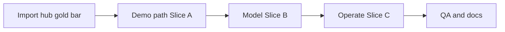

# Phase 1 gold-standard pass (remaining surfaces)

## Gold bar (non-negotiable)

Match [`/imports`](ETOS.Frontend/src/app/(shell)/imports/page.tsx) quality, not “token reskin of old admin”:

1. Open matching `html/NN-*.html` + `images/NN-*.png` under [`References/etos_ui_mockup_pack_with_digital_thread_timeline/etos_ui_mockups/`](References/etos_ui_mockup_pack_with_digital_thread_timeline/etos_ui_mockups/).
2. Rebuild **regions** (title-row + actions, KPI strip, main/side split, card-row tables, list-items, side panels).
3. Colors via existing `--etos-*` tokens only ([`globals.css`](ETOS.Frontend/src/app/globals.css)) — never mockup hex as the palette.
4. Reuse primitives: [`KpiCard`](ETOS.Frontend/src/components/ui/KpiCard.tsx), [`ListItem`](ETOS.Frontend/src/components/ui/ListItem.tsx), [`SidePanel`/`PillStack`/`Quote`](ETOS.Frontend/src/components/ui/SidePanel.tsx), [`DataTable`](ETOS.Frontend/src/components/ui/DataTable.tsx) (card-row), [`Timeline`](ETOS.Frontend/src/components/ui/Timeline.tsx), [`GovernancePanel`](ETOS.Frontend/src/components/ui/GovernancePanel.tsx), [`Button`](ETOS.Frontend/src/components/ui/Button.tsx).
5. Demote session dumps / create forms / raw API panels into `
 Advanced / Debug`.
6. Backend freeze: `ETOS.Frontend/` only; existing `etos-api` + server actions.

**Done already (skip):** `/` Mission Control, `/imports` + wizard 08–13.

**Out of scope:** Phase 2–5 (tools/agents/workflows/governance charts/digital thread 24–40).

**Sequence default:** demo path first (chat → recs → model → docs → dashboards), then remainder.

---

## Execution result (2026-07-16)

All slices landed. Shared gold title row via [`PageHeader`](ETOS.Frontend/src/components/ui/PageHeader.tsx) (`text-[30px] font-bold` + `px-6 py-8 lg:px-8` content padding matching import hub).

| Slice | Surfaces | Status |
|---|---|---|
| A | `/chat`, `/ai-traces`, `/ai-traces/[id]`, `/recommendations`, detail | **Gold** — conversation+governance; KPI+card-row list; timeline+access rail; inbox filter + evidence detail |
| B | `/model-artifacts`, ontology, Layer 3–6 | **Gold** — package callout+table+boundaries; catalog+bars; `DefinitionLibraryPage` + policy flow / opt donut+contract / template pills |
| C | promote, documents, graph hub, 360, dashboards, reports, artifacts, explorers hub | **Gold** — gate/diff/heat; docs split; lightweight graph hub; KPI+spark; outline+canvas; registry+flowline |
| D | typecheck/lint pass; gap + UI issue docs; graphify refresh | **Done** |

---

## Slice A — Demo path (highest impact)

| # | Route | Mockup | Primary files | Target composition |
|---|---|---|---|---|
| 1 | `/chat` | 17 | [`chat/page.tsx`](ETOS.Frontend/src/app/(shell)/chat/page.tsx) | Title row; conversation card as primary; Answer Governance `SidePanel` (intent/retrieval/confidence/evidence + draft CTAs). Session create / intent form / raw errors → Advanced. |
| 2 | `/ai-traces/[traceId]` | 18 | [`ai-traces/[traceId]/page.tsx`](ETOS.Frontend/src/app/(shell)/ai-traces/[traceId]/page.tsx) | Timeline main + export/context `SidePanel`. |
| 3 | `/ai-traces` list | (list for 18) | [`ai-traces/page.tsx`](ETOS.Frontend/src/app/(shell)/ai-traces/page.tsx) | Title + KPI or card-row table; demo export actions demoted. |
| 4 | `/recommendations` | 21 | [`recommendations/page.tsx`](ETOS.Frontend/src/app/(shell)/recommendations/page.tsx) | 4 KPIs + card-row inbox + “Filter high risk” CTA matching HTML columns. Prefer server `DataTable` over TanStack unless sort needed. |
| 5 | `/recommendations/[id]` | 22 | [`RecommendationDetailView.tsx`](ETOS.Frontend/src/components/recommendations/RecommendationDetailView.tsx) | Evidence / risk / actions main + side rail; publish/debug controls demoted. |

Acceptance per screen: light+dark readable; first viewport matches mockup regions (screenshot vs PNG).

---

## Slice B — Model package + Layer 3–6

| # | Route | Mockup | Primary files | Target composition |
|---|---|---|---|---|
| 6 | `/model-artifacts` | 02 | [`model-artifacts/page.tsx`](ETOS.Frontend/src/app/(shell)/model-artifacts/page.tsx) | Tighten to mockup: callout + card-row artifact table + Package boundaries pill-stack; raw version lists stay Advanced only. |
| 7 | `/model-artifacts/ontology` | 03 | [`model-artifacts/ontology/page.tsx`](ETOS.Frontend/src/app/(shell)/model-artifacts/ontology/page.tsx) | Catalog table + selected-object detail rail; bar/progress from tokens; dumps demoted. |
| 8–11 | `/capabilities`, `/business-policies`, `/optimization-models`, `/agent-templates` | 04–07 | list pages + [`DefinitionLibraryPage.tsx`](ETOS.Frontend/src/components/model/DefinitionLibraryPage.tsx); detail views under each folder | Upgrade shared shell so lists match mockup KPI + registry + preview. Per-mockup extras: policies flow callout (05), optimization donut/code well (06), templates pill-stack (07). Detail pages: same card/side-panel language, not slate dumps. |

---

## Slice C — Operate remainder

| # | Route | Mockup | Primary files | Target composition |
|---|---|---|---|---|
| 12 | `/graph/promote` | 14 | [`graph/promote/page.tsx`](ETOS.Frontend/src/app/(shell)/graph/promote/page.tsx) | Gate ring + pill stack, diff table, BOM heat table aligned to PNG; batch dump Advanced. |
| 13 | `/documents` (+ detail) | 15 | [`documents/page.tsx`](ETOS.Frontend/src/app/(shell)/documents/page.tsx), `[documentId]/page.tsx` | Split: registry table + document detail `SidePanel`; CAD/DQ/vector dumps → Advanced. |
| 14 | `/explorers/360/[anchorId]` | 16 | [`ContextView360.tsx`](ETOS.Frontend/src/components/explorers/ContextView360.tsx), [`explorers/360/.../page.tsx`](ETOS.Frontend/src/app/(shell)/explorers/360/[anchorId]/page.tsx) | Canvas + mini-nav context panels + list-items; governance flow Advanced. |
| 15 | `/graph` list | supports 16 | [`graph/page.tsx`](ETOS.Frontend/src/app/(shell)/graph/page.tsx) | Lightweight hub into 360/promote — not a third dump. |
| 16 | `/dashboards` (+ detail) | 19 | [`dashboards/page.tsx`](ETOS.Frontend/src/app/(shell)/dashboards/page.tsx), [`DashboardReportDetailView.tsx`](ETOS.Frontend/src/components/dashboards/DashboardReportDetailView.tsx) | KPI strip + spark/table + publish readiness rail; detail widget grid on tokens. |
| 17 | `/reports` (+ detail) | 20 | [`reports/page.tsx`](ETOS.Frontend/src/app/(shell)/reports/page.tsx) + shared detail view | Outline list + canvas/wire preview + Quote evidence. |
| 18 | `/artifacts` | 23 | [`artifacts/page.tsx`](ETOS.Frontend/src/app/(shell)/artifacts/page.tsx) | Registry table + dependency flowline + readiness pill rail. |

Optional tight follow if time: `/explorers` hub reshell to point at 360/artifacts without new mockup inventing.

---

## Method (every screen)

Same as import gold:

1. Extract `<section class="content">` regions from mockup HTML.
2. Rebuild page JSX to those regions; wire real `etos-api` data into slots.
3. Collapse non-mockup controls into Advanced/Debug.
4. Smoke light+dark; screenshot vs PNG for that screen before moving on.

Do **not** edit [`.cursor/plans/mockup_parity_rebuild_a43d9889.plan.md`](.cursor/plans/mockup_parity_rebuild_a43d9889.plan.md) — this is a follow-on execution plan.

---

## Slice D — Close

- Typecheck + lint on `ETOS.Frontend`.
- Update [`.docs/.gapAnalysis/.ui/ui-issues-gap-analysis.md`](.docs/.gapAnalysis/.ui/ui-issues-gap-analysis.md) and UI-1.x status lines in [`.docs/.prd/.ui/engineering-execution-ui-issues.md`](.docs/.prd/.ui/engineering-execution-ui-issues.md): mark each surface **gold** vs **partial**.
- `graphify update .` then `graphify cluster-only . --no-viz` after frontend changes.
