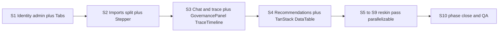

# Phase 1 — Operate & Model Surfaces (UI-1.2 – UI-1.10)

Source specs: [.docs/.prd/.ui/engineering-execution-ui-issues.md](.docs/.prd/.ui/engineering-execution-ui-issues.md) (Phase 1 section) and closure order from [.docs/.gapAnalysis/.ui/ui-issues-gap-analysis.md](.docs/.gapAnalysis/.ui/ui-issues-gap-analysis.md). UI-1.1 already shipped.

**Hard constraints**

- Backend freeze: touch `ETOS.Frontend/` only; all wrappers call existing endpoints already exposed via `src/lib/etos-api.ts` patterns.
- Every reworked page: `--etos-*` tokens + Phase 0 primitives (`PageHeader`, `Card`, `Badge`, `Button`, `KpiCard`, `EmptyState`, `ErrorState`), light + dark verified, no raw `slate-*` left in the page.
- Honesty policy: disabled CTAs with blocker tooltips where backend/API absent.
- Per-slice verification: `npm run typecheck`, `npm run lint`, browser smoke both themes; `npm run build` at phase end.

## Slice 1 — UI-1.10 Identity Admin (`/admin/identity`)

Highest value, zero backend gap (Issue 2 APIs shipped). Replace the `PlaceholderPage`.

- New `Tabs` primitive in `src/components/ui/Tabs.tsx` (URL-param driven: `?tab=tenants|users|roles|memberships|grants`).
- `etos-api.ts` wrappers: `createTenant`, `createUser`, `createRole`, `createMembership`, `createGrant` → existing `POST /api/admin/identity/*`; reuse `getIdentityLists()` after mutate + `revalidatePath`.
- `src/components/admin/IdentityCreateForms.tsx` — per-tab list table + Create form via server actions; surface backend validation errors; success callout after tenant create (auto Tenant Admin note); password field optional with "not a login portal" helper.
- Active tenant switcher (topbar or identity page): pick from `getIdentityLists().tenants`, persist as cookie the server-side api client reads for `X-ETOS-Tenant-Id` (match existing header pattern; no new backend session API).
- Update `src/config/navigation.ts`: mark `/admin/identity` implemented.
- Acceptance: create tenant → user → role → membership → grant happy path from UI; `/admin/foundation` untouched.

## Slice 2 — UI-1.4 Import Hub & Wizard Split

Split monolithic 786-line [ETOS.Frontend/src/app/(shell)/imports/page.tsx](ETOS.Frontend/src/app/(shell)/imports/page.tsx) preserving all ~18 server actions' behavior.

- New `Stepper` primitive (`src/components/ui/Stepper.tsx`); state derived from batch status fields (`getImportBatchDetail`).
- Routes: `/imports` hub (cards: batches, identity, DQ summary, demo actions), `/imports/new` (upload step), `/imports/[batchId]/mapping` (approve/reject per batch, not just latest), `/imports/[batchId]/staging`, `/imports/[batchId]/identity`, `/imports/data-quality` (triage table: severity + trust-penalty columns).
- Move shared server actions into `imports/actions.ts`; keep `imports/odoo`, `imports/pdm` wizards working unchanged.
- Shared `ImportStepper` across batch sub-routes; reskin all import surfaces to tokens.

## Slice 3 — UI-1.7 Governed Chat & AI Trace Detail

- New primitives: `GovernancePanel` (right-rail pills: intent, retrieval, confidence, policy, trace links) and `TraceTimeline` in `src/components/ui/`.
- `/chat` split layout: conversation left + `GovernancePanel` right; keep existing session/turn server actions; chat-to-artifact draft buttons (dashboard/recommendation) styled per mockup 17.
- New route `/ai-traces/[traceId]`: add `getAiTraceDetail(id)` wrapper (existing endpoint), trace step timeline, export panel, context-package link; `/ai-traces` list becomes token-styled table linking to detail.

## Slice 4 — UI-1.9 Recommendation Inbox & Detail

- Install `@tanstack/react-table`; build TanStack-backed `DataTable` wrapper (client sort/filter) in `src/components/ui/`.
- `/recommendations` inbox: risk filters, trusted/blocked tabs (reuse `Tabs`), high-risk queue panel.
- Reskin `RecommendationDetailView` (evidence chain, suggested actions, trace links, review-task actions stay wired).

## Slice 5 — UI-1.2 Model Package & Ontology

- Reskin `/model-artifacts`: package overview cards, seed action, published version cards, dependency-graph summary.
- New `/model-artifacts/ontology` route: semantic-layer tabs, AI usage metadata, version timeline from `getOntologyLists()`; publish/impact CTAs wired to existing artifact APIs or disabled with explanation.

## Slice 6 — UI-1.3 Layer 3–6 Definition Libraries

- Unified list pattern for `/capabilities`, `/business-policies`, `/optimization-models`, `/agent-templates`: DataTable with readiness badges + dependency columns.
- Reskin the four `*DetailView` components (~250 lines each): version-history sidebar, publish-gate panel, resolved dependency labels, cross-links capability ↔ policy ↔ optimization ↔ agent-template.

## Slice 7 — UI-1.5 Graph Promotion & Document Explorer

- New `/graph/promote` route: snapshot/diff/BOM compare UI reusing existing helpers (`captureTrustedGraphSnapshot`, `createBomComparisonForLatestStagedBatch`, promotion actions currently on `/imports`), promotion CTA with DQ blocker display.
- `/documents` explorer layout: list + filters + detail drawer, vector-index status column, links to graph/360; reskin `[documentId]`.

## Slice 8 — UI-1.6 Graph Explorer & 360° Context

- Alias route `/explorers/360/[anchorId]` reusing `ContextView360` in split layout (graph mini-panel + sections).
- Reskin `ExplorerListShell`, `ContextView360`, `GovernanceFlowPanel`, `SectionVisibilityBadge` to tokens; `/artifacts` unified table with type/readiness/dependency-impact columns.

## Slice 9 — UI-1.8 Dashboard & Report Builder Preview

- Reskin `DashboardReportDetailView`: widget-grid preview placeholder, evidence appendix panel for reports, Save draft / Request publish approval CTAs (wired via existing `markDashboardReportReady`/`publishArtifactVersion` or disabled per readiness).

## Slice 10 — Phase close

- `Notice`/`Callout` primitive sweep replacing ad-hoc MVP-boundary divs on touched pages.
- Grep gate: no `slate-` in Phase 1 page files; `npm run build`; light+dark smoke on every Phase 1 route.
- Update `.docs/.prd/.ui/engineering-execution-ui-issues.md` statuses and gap analysis; `graphify update .` + `graphify cluster-only .`.

