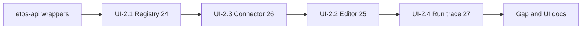

# Phase 2 — Tool Registry UX (mockups 24–27)

**Status:** ✅ Complete (2026-07-16) — UI-2.1–2.4 gold vs import hub.

## Constraints (same as Phase 1 gold)

- **Frontend-only:** `ETOS.Frontend/` only. No `ETOS.Backend/` changes.
- **Mockups win layout:** extract regions from [`References/.../html/`](References/etos_ui_mockup_pack_with_digital_thread_timeline/etos_ui_mockups/html/) `24`–`27` + PNG peers; rebuild compositions; colors via `--etos-*` only.
- **Primitives:** reuse [`PageHeader`](ETOS.Frontend/src/components/ui/PageHeader.tsx), [`KpiCard`](ETOS.Frontend/src/components/ui/KpiCard.tsx), [`DataTable`](ETOS.Frontend/src/components/ui/DataTable.tsx), [`SidePanel`](ETOS.Frontend/src/components/ui/SidePanel.tsx)/`PillStack`, [`TraceTimeline`](ETOS.Frontend/src/components/ui/TraceTimeline.tsx), [`Tabs`](ETOS.Frontend/src/components/ui/Tabs.tsx), [`Button`](ETOS.Frontend/src/components/ui/Button.tsx), [`Notice`](ETOS.Frontend/src/components/ui/Notice.tsx)/`Callout`.
- **API honesty:** extend [`etos-api.ts`](ETOS.Frontend/src/lib/etos-api.ts) only to wrap endpoints that already exist (Issue 22). Missing create/edit → disabled CTA + Advanced note — never fake success.
- **Docs first before coding each slice:** [ui-agent-implementation-guide](.docs/.prd/.ui/ui-agent-implementation-guide.md), [engineering-execution-ui-issues Phase 2](.docs/.prd/.ui/engineering-execution-ui-issues.md) (UI-2.1–2.4), [ui-screen-api-map](.docs/.prd/.ui/ui-screen-api-map.md) rows 24–27, [ETOS.Frontend/AGENTS.md](ETOS.Frontend/AGENTS.md).

## Delivered

| Route | Result |
|---|---|
| [`/tools`](ETOS.Frontend/src/app/(shell)/tools/page.tsx) | **24** KPI + unified Kind table + `?kind=` Tabs |
| [`/tools/[artifactId]/edit`](ETOS.Frontend/src/app/(shell)/tools/[artifactId]/edit/page.tsx) | **25** Definition + schema wells; Mark ready / Publish / Validate / Dry-run |
| [`/tools/[artifactId]`](ETOS.Frontend/src/app/(shell)/tools/[artifactId]/page.tsx) | Redirect → `/edit` |
| [`/connectors/[artifactId]`](ETOS.Frontend/src/app/(shell)/connectors/[artifactId]/page.tsx) | **26** capability table + credential TraceTimeline |
| [`/tool-runs/[runId]`](ETOS.Frontend/src/app/(shell)/tool-runs/[runId]/page.tsx) | **27** KPI + TraceTimeline + gated Execute |
| [`/tool-runs`](ETOS.Frontend/src/app/(shell)/tool-runs/page.tsx) | Thin list (discoverability) |
| [`tools/actions.ts`](ETOS.Frontend/src/app/(shell)/tools/actions.ts) | Server actions for scan / mark-ready / publish / dry-run / execute |
| `etos-api` wrappers | `markToolDefinitionReady`, `publishToolDefinition`, `compatibilityScanToolDefinition`, `dryRunToolDefinition`, `executeToolDefinition` |

## Residual (honest deferrals)

- Register tool / Save draft disabled (no half-wired create)
- Skill detail route not built (name-only in registry)
- Schema fields read-only (no interactive JSON schema authoring)

## Approach defaults (historical)

- **Layout:** mockup HTML regions (24 uses **one Kind-column table**, not three stacked sections). Use `?kind=` filter via existing `Tabs` (All | Tools | Skills | Connectors).
- **Editor depth:** gold form + schema code well from live `ToolDefinitionDetail`; wire **Mark ready**, **Publish**, **Validate** (= compatibility-scan), **Dry-run**.
- **Execute:** show on run detail rail; enable only when tool/connector allow it.

## Out of scope

- Phase 3 agents/workflows (28–36)
- New backend endpoints or schema migration
- Full interactive JSON schema authoring / Register tool create wizard (follow-up)
- Fake write-connector enablement
