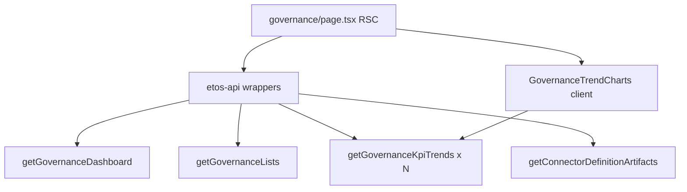

# Phase 4 — Governance Dashboard UX (UI-4.1 / mockup 37)

**Status: completed (2026-07-16)** — gold `/governance` + Recharts trends + docs/graphify refreshed.

## Scope decision

- **In:** UI-4.1 only — rebuild [`ETOS.Frontend/src/app/(shell)/governance/page.tsx`](ETOS.Frontend/src/app/(shell)/governance/page.tsx) to mockup **37** gold.
- **In:** Install **`recharts`** (not Tremor) for trend line charts against existing `getGovernanceKpiTrends`.
- **Out:** Adjacent slate dumps (`/tasks`, `/decisions`, `/context-packages`, `/admin/foundation`) — same pattern later, not Phase 4 backlog.
- **Out:** New backend endpoints; fake export/download success; inventing KPI values not returned by Issue 21.

## Constraints (same as Phase 2–3 gold)

- Frontend-only: [`ETOS.Frontend/`](ETOS.Frontend/) only.
- Mockup wins layout: HTML/PNG [`37-governance-audit-dashboard`](References/etos_ui_mockup_pack_with_digital_thread_timeline/etos_ui_mockups/html/37-governance-audit-dashboard.html); colors via `--etos-*` only.
- Primitives: `PageHeader`, shared `KpiCard`, `DataTable`, `SidePanel`/`PillStack`, `Badge`/`StatusBadge`, `Button`, `Notice`/`Card`, Advanced/Debug demotion.
- API honesty: only [`etos-api.ts`](ETOS.Frontend/src/lib/etos-api.ts) helpers already present (`getGovernanceDashboard`, `getGovernanceKpiTrends`, `getGovernanceLists`, optional `getConnectorDefinitionArtifacts` for write flags).
- Docs before impl: [ui-agent-implementation-guide](.docs/.prd/.ui/ui-agent-implementation-guide.md), [engineering-execution-ui-issues Phase 4](.docs/.prd/.ui/engineering-execution-ui-issues.md), [ui-screen-api-map](.docs/.prd/.ui/ui-screen-api-map.md) row 37, [ETOS.Frontend/AGENTS.md](ETOS.Frontend/AGENTS.md).

## Shipped

| Piece | Result |
|---|---|
| Dep | `recharts` in `ETOS.Frontend/package.json` |
| Chart island | [`GovernanceTrendCharts.tsx`](ETOS.Frontend/src/components/governance/GovernanceTrendCharts.tsx) — segmented tabs + LineChart; empty/error honest |
| Page | Gold `PageHeader` + shared KPIs + Write actions = 0 SAFE + events `DataTable` + boundary `SidePanel` + trends card + Advanced/Debug |
| Docs | Gap UI-4.1 gold; UI issues/README/screen-map/checklist/AGENTS/rule updated |

**Live KPI keys** (backend `PlatformGovernanceKpiKeys`): `open_reviews`, `pending_decisions`, `blocked_decisions`, `escalations`, `decision_throughput`, `outcome_verification_rate`, `learning_signal_rate`, `high_risk_recommendations`, deferred `tenant_custom_kpi`.

**Trend-supported keys:** `open_reviews`, `blocked_decisions`, `decision_throughput`, `outcome_verification_rate`, `learning_signal_rate`.

## Honesty rules (shipped)

| CTA / widget | Behavior |
|---|---|
| Export audit summary | Disabled + title reason (no export endpoint) |
| Write actions | Always `0` / SAFE — architecture-honest |
| Connector writes | From live connector list flags |
| Missing trend points | Empty chart + EmptyState |
| Deferred KPI | Show “Deferred” via shared KpiCard |

## Out of scope (unchanged)

- Phase 5 digital thread; Issue 25 teams
- Reskin `/tasks`, `/decisions`, `/context-packages`, `/admin/foundation`
- Backend CustomKpiDefinition / new analytics endpoints
- Tremor
