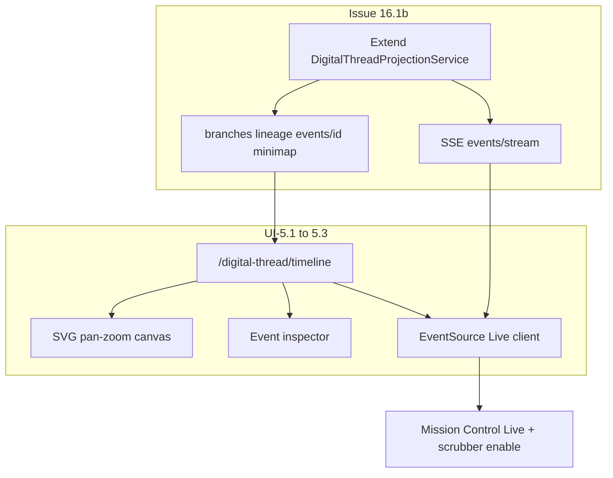

# Phase 5 — Digital Thread Timeline (Issue 16.1b + UI-5.1–5.3)

**Status:** ✅ Shipped 2026-07-16

**Scope choice (locked):** Option 2 — backend **Issue 16.1b** first, then full UI-5.1–5.3. Phase 4 governance gold stays untouched.



## Preconditions (already true)

- Issue 16.1 shipped: [`ETOS.Backend/DigitalThread/`](ETOS.Backend/DigitalThread/) + Mission Control wire-up on `summary` / `systems` / `events`
- Route [`digital-thread/timeline/page.tsx`](ETOS.Frontend/src/app/(shell)/digital-thread/timeline/page.tsx) is still PlaceholderPage (blocker text stale — still says 16.1)
- Mockups 38–40 + [`DIGITAL_THREAD_TIMELINE_SPEC.md`](References/etos_ui_mockup_pack_with_digital_thread_timeline/etos_ui_mockups/docs/DIGITAL_THREAD_TIMELINE_SPEC.md)
- **No SignalR** in repo today → stream = **SSE** (`text/event-stream`)

## Locked technical decisions

| Decision | Choice |
|---|---|
| Route prefix | Keep `/api/admin/digital-thread/*` (same as 16.1) |
| Stream | SSE poll-delta (cursor = `since` timestamp/eventId); not SignalR |
| Renderer | SVG + CSS/transform pan-zoom (reuse MC thread visual language); **not** WebGL; **not** `@xyflow/react` (workflow-shaped, wrong metaphor) |
| Branch/minimap geometry | Deterministic layout from systems + event aggregates (projectionPoints computed server-side); empty tenant → empty arrays |
| Lineage source | Tenant `ArtifactRelationships` + related projected events for `artifactId`; no raw Neo4j public query |
| Site / product-line filters | Disabled + tooltip (“no site dimension in MVP data”) |
| Live on Mission Control `/` | Enable Live + scrubber once SSE works (same client hook) |

---

## Phase A — Backend Issue 16.1b ✅

### Docs

Add **Issue 16.1b** under 16.1 in [`.docs/.prd/engineering-execution-issues.md`](.docs/.prd/engineering-execution-issues.md): acceptance = branches/lineage/event-detail/minimap APIs + SSE stream; UI-5.x canvas consumes them.

### Extend contracts ([`DigitalThreadContracts.cs`](ETOS.Backend/DigitalThread/DigitalThreadContracts.cs))

- `DigitalThreadBranchResponse` — branchId, systemIds, timeStart/End, eventCount, health, trustScore?, projectionPoints `[[x,y],…]`
- `DigitalThreadLineageResponse` — artifactId, label, hops (from/to, relationshipType, trustState), relatedEvents
- `DigitalThreadEventDetailResponse` — extends list event + evidenceLinks, drillRoutes (360 / ai-trace / artifact), policy/DQ safe summaries when available
- `DigitalThreadMinimapResponse` — systems + coarse points + window
- Stream payload: reuse `DigitalThreadEventResponse` (or thin delta wrapper with `cursor`)

### Extend service + endpoints

Extend [`IDigitalThreadProjectionService`](ETOS.Backend/DigitalThread/DigitalThreadProjectionService.cs) / [`DigitalThreadEndpointExtensions.cs`](ETOS.Backend/DigitalThread/DigitalThreadEndpointExtensions.cs):

```
GET  /api/admin/digital-thread/branches?windowHours=24
GET  /api/admin/digital-thread/lineage/{artifactId}
GET  /api/admin/digital-thread/events/{eventId}
GET  /api/admin/digital-thread/minimap?windowHours=24
GET  /api/admin/digital-thread/events/stream?since=   → text/event-stream
```

Same fail-closed tenant + `digital_thread.read|admin|*` checks as 16.1.

**Projection rules (honest):**

- **Branches:** cluster systems that co-appear in windowed events; health from sync/connection status; `projectionPoints` = stable layout (index → x,y) — not invented ERP topology
- **Lineage:** `ArtifactRelationships` for artifact + related projected events; 404/validation if artifact missing/wrong tenant
- **Event detail:** parse existing eventId prefixes (`tool-run:`, `import…`, `dq:`, …) back to source row; include drill links only when ids present
- **Minimap:** downsample systems + branch endpoints for 24h window
- **SSE:** auth via same headers; loop with cancel; emit new events since cursor every N seconds (bounded Take); heartbeat comments; no fake SAP pulses

### Tests

Extend [`DigitalThreadProjectionTests.cs`](ETOS.Backend.Tests/DigitalThreadProjectionTests.cs) (or sibling): branches empty/non-empty, lineage tenant isolation, event detail found/missing, minimap shape, stream emits after seed (integration-style or service-level enumerator).

---

## Phase B — Frontend UI-5.1–5.3 ✅

### API client

In [`etos-api.ts`](ETOS.Frontend/src/lib/etos-api.ts): getters for branches/lineage/eventDetail/minimap.

New small client helper (e.g. `lib/digital-thread-stream.ts`): `EventSource`/fetch-stream wrapper with tenant headers — if browser EventSource cannot send custom headers, use **fetch ReadableStream** SSE parse (preferred for ETOS header auth).

Extend [`digital-thread-map.ts`](ETOS.Frontend/src/lib/digital-thread-map.ts) for branch/minimap → canvas scene model.

### Route — replace PlaceholderPage

[`digital-thread/timeline/page.tsx`](ETOS.Frontend/src/app/(shell)/digital-thread/timeline/page.tsx):

- RSC loads summary/systems/events/branches/minimap via Promise.all
- Client island owns zoom/pan/scrub/live/selection

New components under `src/components/digital-thread/`:

| Component | Role |
|---|---|
| `DigitalThreadCanvas.tsx` | Full-bleed ops canvas; zoom bands 5–25 / 25–200 / 200–600; pan; fit-to-view; pulse nodes from events |
| `DigitalThreadMinimap.tsx` | Viewport mirror from minimap API |
| `DigitalThreadFilterBar.tsx` | time / system / eventType / trust; site+productLine disabled |
| `DigitalThreadScrubber.tsx` | window scrub → refetch events/branches with `from`/`to` |
| `DigitalThreadEventInspector.tsx` | SidePanel: detail API + Links to `/explorers/360/…`, `/ai-traces/…`, `/artifacts/…` |
| `DigitalThreadLiveClient.tsx` | SSE → append pulses without resetting viewport |

Mockup parity: ops tokens (`--etos-ops-*`), mockups 38–40 as visual reference; light/dark via existing theme.

### UI-5.2 drill-through

Inspector only; reuse existing explorer routes; never invent evidence text — show `safeSummary` / API fields only.

### UI-5.3 Live + Mission Control

- Wire Live on timeline page
- Update [`(shell)/page.tsx`](ETOS.Frontend/src/app/(shell)/page.tsx): enable Live button + scrubber using same stream/scrub helpers; drop “16.1b required” tooltips when stream succeeds
- AI insights stay fixture

### Honesty

| Control | Behavior |
|---|---|
| Site / product line filters | Disabled + reason |
| Empty tenant | Empty canvas + EmptyState (no fixture fallback) |
| API error | ErrorState |
| Write / connector writes | N/A (read-only) |
| WebGL | Out of scope |

---

## Phase C — Docs + verify + graphify ✅

Update:

- Plan file status when shipping
- [`.docs/.prd/.ui/engineering-execution-ui-issues.md`](.docs/.prd/.ui/engineering-execution-ui-issues.md) Phase 5 status
- [`ui-screen-api-map.md`](.docs/.prd/.ui/ui-screen-api-map.md) rows 38–40
- [`ui-issues-gap-analysis.md`](.docs/.gapAnalysis/.ui/ui-issues-gap-analysis.md)
- [`AGENTS.md`](AGENTS.md), UI README / agent guide / frontend-ui-only rule (16.1b shipped; placeholder removed)
- Fix PlaceholderPage blocker copy only if any leftover refs

Verify:

```powershell
dotnet test EnterpriseThreadOS.sln --filter DigitalThread
Push-Location ETOS.Frontend; npm run typecheck; npm run lint; Pop-Location
graphify update .; graphify cluster-only .
```

---

## Explicitly out of this plan

- WebGL renderer / `@xyflow` for thread canvas
- SignalR hubs
- Issue 25 agent teams
- Site/product-line ontology dimensions
- Inventing SAP/PDM/MES rows without connectors/imports
- Phase 6 Playwright visual suite (separate)
