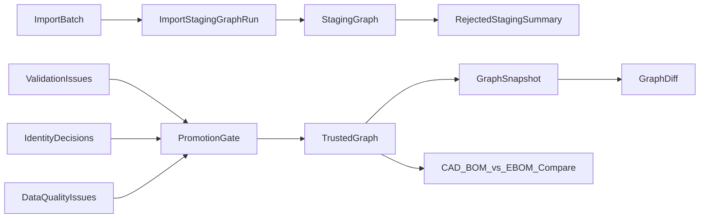

# Implement Issue 11

## Scope
- Source of intent: [`.docs/.prd/engineering-execution-issues.md`](D:/00.WORK/SOURCE_REPS/EnterpriseThreadOS/.docs/.prd/engineering-execution-issues.md), Issue 11.
- Build on current staging flow in [`ETOS.Backend/Imports/ImportService.cs`](D:/00.WORK/SOURCE_REPS/EnterpriseThreadOS/ETOS.Backend/Imports/ImportService.cs): `StageBatchAsync` creates `GraphSpace.Staging` + `TrustState.Unverified` nodes and stores graph ids on `ImportStagingGraphRun`.
- Replace deferred graph contracts in [`ETOS.Backend/GraphMemory/DeferredGraphSnapshotService.cs`](D:/00.WORK/SOURCE_REPS/EnterpriseThreadOS/ETOS.Backend/GraphMemory/DeferredGraphSnapshotService.cs) and [`ETOS.Backend/GraphMemory/DeferredGraphDiffService.cs`](D:/00.WORK/SOURCE_REPS/EnterpriseThreadOS/ETOS.Backend/GraphMemory/DeferredGraphDiffService.cs).
- Keep public API at admin/service level only. No raw Neo4j query endpoint.

## Backend Design
- Add Issue 11 domain records in imports/graph memory:
  - `ImportPromotionRun`: batch, staging run, status, promoted node/relationship counts, source evidence ids, audit id, failure summary.
  - `RejectedStagingSummary`: batch, staging run, validation summary, decision summary, node/relationship counts, source evidence references, audit id. Store summaries and ids, not low-value raw row payloads.
  - `GraphSnapshot`: tenant, graph space, captured counts, snapshot JSON payload/checksum, safe summary, created by/audit link.
  - `GraphDiff`: tenant, from/to snapshot ids, diff JSON payload/checksum, safe summary.
  - `BomComparisonRun`: batch/source context, CAD side summary, EBOM side summary, mismatch counts, result JSON, audit id.
- Extend [`EnterpriseThreadDbContext`](D:/00.WORK/SOURCE_REPS/EnterpriseThreadOS/ETOS.Backend/Infrastructure/Persistence/EnterpriseThreadDbContext.cs) with `DbSet`s, relationships, tenant indexes, and enum string conversions. Add EF migration named for Issue 11.
- Extend graph service contract in [`IGraphMemoryService`](D:/00.WORK/SOURCE_REPS/EnterpriseThreadOS/ETOS.Backend/GraphMemory/IGraphMemoryService.cs) with focused methods needed by services, such as listing tenant graph nodes/relationships by `GraphSpace` and source batch, plus creating trusted copies. Keep implementation internal to `Neo4jGraphMemoryService`.

## Promotion Flow
- Add import service methods and endpoints:
  - `POST /api/admin/imports/batches/{batchId}/promote`
  - `POST /api/admin/imports/batches/{batchId}/reject-staging`
  - likely `GET /api/admin/imports/batches/{batchId}/promotion-runs`
- Promotion gates fail closed:
  - batch must be `Staged`.
  - latest staging run must be completed.
  - approved mapping required.
  - no validation errors.
  - no unresolved blocking data-quality issues for batch/staging graph ids.
  - no conflicted/unapproved required identity links for staged objects.
- On pass, create trusted graph nodes/relationships from staging graph ids with `GraphSpace.Trusted`, `TrustState.Trusted`, source evidence references, and audit record. Record promotion run and update batch status with new enum values like `Promoted` / `Rejected`.
- On reject, create `RejectedStagingSummary`, record validation/decision/data-quality summaries, audit, and set batch status to rejected without copying raw staged payload into relational tables.

## Snapshot And Diff
- Replace deferred snapshot/diff services with real implementations:
  - `GraphSnapshotService.CaptureAsync(tenantId, graphSpace)` reads graph nodes/relationships, identity-link state, related document links when present, and data-quality links from relational records.
  - Canonicalize snapshot payload ordering by stable ids, then persist JSON + checksum so diffs are deterministic.
  - `GraphDiffService.CreateDiffAsync(...)` compares two persisted snapshots and emits additions, removals, relationship changes, attribute changes, identity-link changes, and data-quality changes.
- Add admin endpoints under current graph/admin route pattern if present, or import admin endpoints if not:
  - capture snapshot.
  - list/get snapshots.
  - create/get diff.

## BOM Compare
- Implement metadata-based BOM comparison only:
  - Recognize CAD BOM and EBOM rows from import metadata columns or mapping attributes, not native CAD files.
  - Model BOM lines as graph relationships using existing `CreateGraphRelationshipRequest`, with quantity/unit/find/reference usage metadata.
  - Compare parent-child identity + quantity + unit + usage/reference metadata.
  - Return categories: missing in CAD, missing in EBOM, quantity mismatch, usage/reference mismatch, unresolved identity.
- Add endpoints:
  - `POST /api/admin/imports/batches/{batchId}/bom-comparison`
  - optional `GET /api/admin/imports/batches/{batchId}/bom-comparisons`
- During import/staging, create BOM relationships when mapping can identify parent/child/item columns. If mapping is absent, on-demand compare returns a clear validation problem.

## Tests
- Add focused tests in [`ETOS.Backend.Tests/ImportTests.cs`](D:/00.WORK/SOURCE_REPS/EnterpriseThreadOS/ETOS.Backend.Tests/ImportTests.cs), [`ETOS.Backend.Tests/GraphMemoryTests.cs`](D:/00.WORK/SOURCE_REPS/EnterpriseThreadOS/ETOS.Backend.Tests/GraphMemoryTests.cs), and new Issue 11 tests if files get too large.
- Cover:
  - promotion blocked by validation errors.
  - promotion blocked by unresolved data-quality/identity conflicts.
  - successful promotion preserves source evidence and audit links.
  - rejected staging stores summaries, not raw payloads.
  - snapshot captures nodes, relationships, attributes, identity, documents when present, and data-quality state.
  - diff reports each required change type.
  - BOM compare covers missing lines, quantity mismatch, usage/reference mismatch, and clean match.

## Verification
- Run `dotnet test EnterpriseThreadOS.sln`.
- Run `graphify update .` after code changes to refresh graph knowledge.
- Use `ReadLints` on edited C# files after substantive edits.