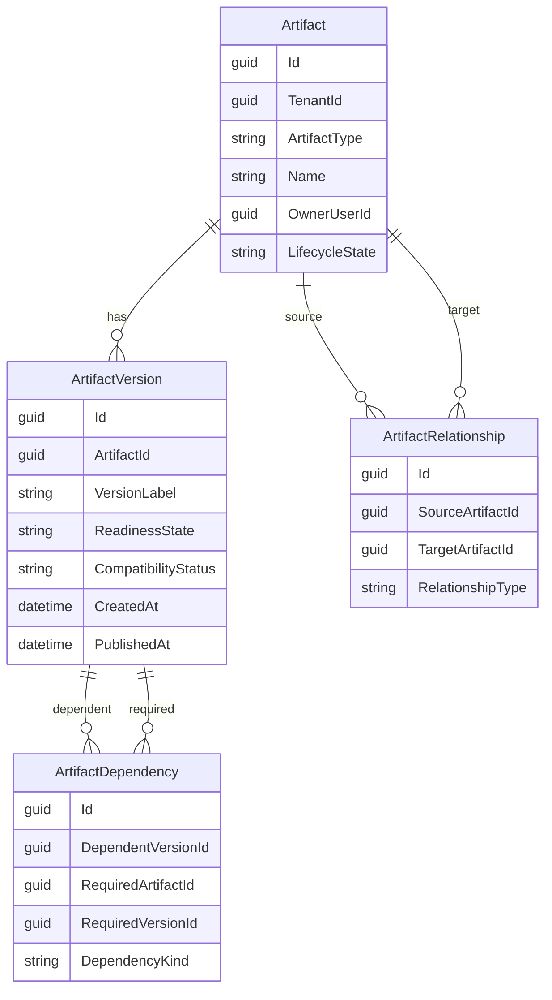
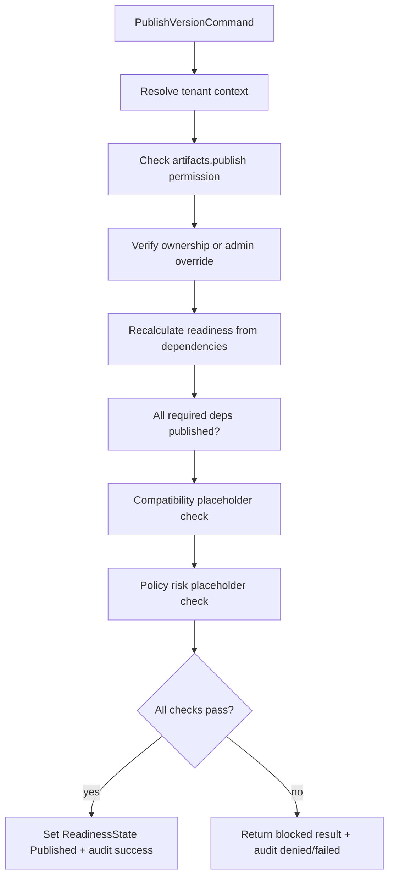

# Slice 4 Base Artifact Registry And Dependency Graph

## Goal

Deliver the shared artifact foundation required by later ontology, policy, import, agent, and workflow slices. A tenant admin can create governed artifacts, add immutable versions, link generic relationships and dependency edges, inspect readiness, and attempt publish with fail-closed checks for tenant, ownership, permissions, dependencies, and policy-risk placeholders.

## Scope Source

Implements **Issue 4** from [`.docs/.prd/engineering-execution-issues.md`](.docs/.prd/engineering-execution-issues.md), aligned with BaseArtifact and Artifact Registry intent in [`.docs/.prd/engineering-execution-prd.md`](.docs/.prd/engineering-execution-prd.md). Blocker **Issue 3** is implemented (`Governance` module, `IAuditRecorder`, explorer APIs).

## Existing Foundation To Reuse

| Capability | Where |
|------------|-------|
| Module composition | [`ETOS.Backend/Platform/EnterpriseThreadPlatform.cs`](ETOS.Backend/Platform/EnterpriseThreadPlatform.cs), [`ETOS.Backend/Program.cs`](ETOS.Backend/Program.cs) |
| Tenant resolution + fail-closed access | [`ETOS.Backend/Identity/TenantContext.cs`](ETOS.Backend/Identity/TenantContext.cs) |
| Permission checks | `IAccessPermissionService`, `IdentityPermissions` |
| Audit side effects | [`ETOS.Backend/Governance/AuditRecorder.cs`](ETOS.Backend/Governance/AuditRecorder.cs) via `SourceObjectType` / `SourceObjectId` |
| Tenant-owned EF convention | [`ETOS.Backend/Tenancy/ITenantScoped.cs`](ETOS.Backend/Tenancy/ITenantScoped.cs) |
| API + test patterns | [`ETOS.Backend/Identity/IdentityEndpointExtensions.cs`](ETOS.Backend/Identity/IdentityEndpointExtensions.cs), [`ETOS.Backend.Tests/GovernanceAuditTests.cs`](ETOS.Backend.Tests/GovernanceAuditTests.cs) |
| Admin shell | [`ETOS.Frontend/src/app/page.tsx`](ETOS.Frontend/src/app/page.tsx), [`ETOS.Frontend/src/lib/etos-api.ts`](ETOS.Frontend/src/lib/etos-api.ts) |

**Greenfield gap:** no artifact entities, services, endpoints, permissions, UI, tests, or `0002-artifact-lifecycle.md` ADR exist yet.

## Assumptions

- Add a new backend module folder **`ETOS.Backend/Artifacts/`** mirroring Identity/Governance layout (`*Models.cs`, `*Contracts.cs`, service, `*EndpointExtensions.cs`).
- Use a **single generic artifact model** with `ArtifactType` string (e.g. `prompt-template`, `query-intent`, `dashboard-template`) rather than subtype tables or inheritance hierarchies in this slice.
- **Dependency and relationship persistence lives in PostgreSQL** for Issue 4. Memgraph projection is explicitly deferred to Issue 6; do not expose raw graph access.
- **Policy/classification enforcement is placeholder-only** in publish checks (e.g. `PolicyRiskStatus = NotEvaluated` until Issue 5). Publish must still block on missing permissions, unresolved dependencies, and non-ready states.
- **CompatibilityReport** remains a future runtime record per PRD; Issue 4 stores only lightweight compatibility placeholders on versions (`CompatibilityStatus`, `CompatibilitySummary`).
- Add **FluentValidation** for create/publish commands. Keep DTO mapping manual (like current modules) unless mapping volume justifies Mapperly later.
- Seed dev admin with artifact permissions via [`ETOS.Backend/Identity/DevelopmentIdentitySeeder.cs`](ETOS.Backend/Identity/DevelopmentIdentitySeeder.cs).

## Domain Model (MVP)

### Enums / states

**Readiness** (Issue 4 acceptance): `Draft`, `Blocked`, `RequiresApproval`, `Ready`, `Published`, `Rejected`, `Retired`

**Lifecycle** (artifact header metadata, not source-system lifecycle): `Active`, `Archived` (minimal; expand later)

**Compatibility placeholder**: `Unknown`, `Compatible`, `Warning`, `Incompatible`

**Relationship types** (generic): `RelatedTo`, `Uses`, `References`, `DerivedFrom`

**Dependency kinds**: `DependsOn` (primary), `OptionalDependsOn` (future-safe)

### Invariants

- `Artifact`, `ArtifactRelationship`, and `ArtifactDependency` are tenant-scoped (`ITenantScoped` or equivalent enforced in service layer).
- `ArtifactVersion` rows are **immutable after insert** except publish metadata fields (`ReadinessState`, `PublishedAt`, `PublishedByUserId`, compatibility summary updated only through governed publish/recalculate paths).
- Relationships cannot cross tenants.
- Dependency edges must reference artifacts/versions in the same tenant.
- An artifact cannot depend on itself (direct cycle at artifact level); publish traversal detects blocked/unpublished required versions.

## Publish Flow

Stored readiness is updated on create/version events for UI; **publish always recalculates** before deciding (per PRD design intent).

## Task Breakdown

### T0 - Artifact Lifecycle ADR

Author [`docs/architecture/adr/0002-artifact-lifecycle.md`](docs/architecture/adr/0002-artifact-lifecycle.md) before implementation locks schema.

Acceptance criteria:
- Documents readiness state machine, version immutability rules, generic relationship vs dependency distinction, and SQL-first dependency storage with Memgraph projection deferred.
- Status `Accepted`; links Issue 4 and PRD artifact registry module.

### T1 - Artifact Domain Model And EF Mapping

Add persisted entities, enums, and EF configuration in `Artifacts/ArtifactModels.cs`; extend [`ETOS.Backend/Infrastructure/Persistence/EnterpriseThreadDbContext.cs`](ETOS.Backend/Infrastructure/Persistence/EnterpriseThreadDbContext.cs).

Acceptance criteria:
- Tables for `artifacts`, `artifact_versions`, `artifact_relationships`, `artifact_dependencies`.
- Indexes on `(TenantId, ArtifactType)`, `(ArtifactId, CreatedAt)`, `(DependentVersionId)`, `(RequiredArtifactId)`.
- Unique constraint on `(ArtifactId, VersionLabel)`.
- FK constraints with restrict delete to preserve immutability/history.
- EF migration named `Slice4ArtifactRegistry`.

### T2 - Artifact Permissions And Contracts

Extend [`ETOS.Backend/Identity/IdentityContracts.cs`](ETOS.Backend/Identity/IdentityContracts.cs) or add `ArtifactPermissions` in `ArtifactContracts.cs`.

Acceptance criteria:
- Permissions: `artifacts.read`, `artifacts.create`, `artifacts.publish`, `artifacts.admin`.
- Request/response DTOs for create artifact, create version, add relationship, add dependency, publish, readiness query, list/get/detail responses with version summaries.
- `PublishArtifactVersionResult` includes `Succeeded`, `ReadinessState`, `BlockingReasons[]`, `CompatibilityStatus`, `PolicyRiskStatus` placeholder.

### T3 - Validation And Registry Service

Add `IArtifactRegistryService` + `ArtifactRegistryService` with FluentValidation validators.

Acceptance criteria:
- Add `FluentValidation` package to [`ETOS.Backend/ETOS.Backend.csproj`](ETOS.Backend/ETOS.Backend.csproj).
- Validators for create artifact/version, relationship, dependency, publish commands.
- Service methods: create/list/get artifact, create/list versions, add/list relationships, add/list dependencies, get dependency impact (direct + one-hop for tests), recalculate readiness, publish version.
- All mutations use `ITenantContextResolver` and `IAccessPermissionService`; cross-tenant access fails closed.
- Successful and denied publish attempts emit `IAuditRecorder` records with safe summaries.

### T4 - Artifact Admin APIs

Add `MapEnterpriseThreadArtifactEndpoints()` and register in [`ETOS.Backend/Program.cs`](ETOS.Backend/Program.cs) + platform DI.

Proposed routes under `/api/admin/artifacts`:
- `GET /` list artifacts (tenant-filtered)
- `POST /` create artifact
- `GET /{artifactId}` artifact detail + latest version
- `POST /{artifactId}/versions` create version
- `GET /{artifactId}/versions` version history
- `POST /{artifactId}/relationships` add generic relationship
- `GET /{artifactId}/relationships` list relationships
- `POST /{artifactId}/versions/{versionId}/dependencies` add dependency edge
- `GET /{artifactId}/versions/{versionId}/dependencies` list dependencies
- `GET /{artifactId}/versions/{versionId}/impact` direct dependents/dependencies (minimal traversal)
- `POST /{artifactId}/versions/{versionId}/publish` publish
- `GET /{artifactId}/versions/{versionId}/readiness` stored + recalculated readiness snapshot

Acceptance criteria:
- Minimal API style matches Identity/Governance (`ExecuteAsync`, DTO-only responses, 403 on tenant denial).
- Endpoints require auth + resolved tenant context.
- No EF entities returned from endpoints.

### T5 - Development Seed And Sample Data

Extend dev seeder with artifact permissions and optional sample artifacts for local smoke testing.

Acceptance criteria:
- Seeded admin role receives `artifacts.*` or individual artifact permissions.
- Optional: one sample artifact with two versions and one dependency edge for explorer verification.

### T6 - Frontend Artifact Explorer

Extend admin shell with read-only artifact views.

Acceptance criteria:
- Typed DTOs + fetch helpers in [`ETOS.Frontend/src/lib/etos-api.ts`](ETOS.Frontend/src/lib/etos-api.ts).
- New sections in [`ETOS.Frontend/src/app/page.tsx`](ETOS.Frontend/src/app/page.tsx): artifact list, version history, readiness, relationships, dependencies.
- Reuse existing server-component/no-store fetch pattern and tenant/user headers.
- No create/publish forms required unless needed for local verification (read-only list-first is acceptable; POST smoke can remain test-only).

### T7 - Tests And Invariants

Add [`ETOS.Backend.Tests/ArtifactRegistryTests.cs`](ETOS.Backend.Tests/ArtifactRegistryTests.cs).

Acceptance criteria:
- Version immutability: content fields cannot change after create via service/API.
- Publish blocked when required dependency version is unpublished or missing.
- Publish succeeds when dependencies are published and readiness is `Ready`.
- Cross-tenant artifact read/write/relationship/dependency attempts return 403 and create audit denial records.
- Relationship invariants: no cross-tenant links, no self-dependency at same version.
- Dependency traversal/impact endpoint returns expected edges.
- Existing Identity and Governance tests continue to pass.

### T8 - Documentation And Verification

Acceptance criteria:
- Update [`docs/backend/architecture.md`](docs/backend/architecture.md) and [`ARCHITECTURE.md`](ARCHITECTURE.md) to mark artifact registry foundation as implemented.
- Note Memgraph projection and full policy checks as deferred.
- Run `dotnet test EnterpriseThreadOS.sln`.
- Run `npm run typecheck` and `npm run lint` in `ETOS.Frontend` after UI changes.

## Suggested Milestones

1. **M1 - Durable artifact foundation:** T0, T1, T2 establish ADR, schema, and contracts.
2. **M2 - Registry behavior and APIs:** T3, T4, T5 deliver publish/readiness logic and admin endpoints.
3. **M3 - Explorer, tests, docs:** T6, T7, T8 complete the verification loop.

## Critical Path

T0 -> T1 -> T2 -> T3 -> T4 -> T5 -> T6 -> T7 -> T8

## Out Of Scope

- Issue 5 classification/policy publishing, ABAC filtering, and real `PolicyRisk` evaluation.
- Memgraph dependency projection and graph traversal APIs (Issue 6).
- Specific artifact subtypes (`AgentVersion`, `WorkflowVersion`, etc.) beyond `ArtifactType` string.
- `CompatibilityReport` operational report records and automated compatibility test runs.
- Chat-to-artifact generation, AI-assisted upgrades, impact analysis UI beyond minimal lists.
- Background jobs, approval workflows, review task creation from blocked publish.
- Object storage, vector indexing, or import/mapping artifacts (Issues 7-8).

## Key Files To Create/Modify

| Action | Path |
|--------|------|
| Create | `ETOS.Backend/Artifacts/ArtifactModels.cs` |
| Create | `ETOS.Backend/Artifacts/ArtifactContracts.cs` |
| Create | `ETOS.Backend/Artifacts/ArtifactRegistryService.cs` |
| Create | `ETOS.Backend/Artifacts/ArtifactEndpointExtensions.cs` |
| Create | `ETOS.Backend.Tests/ArtifactRegistryTests.cs` |
| Create | `docs/architecture/adr/0002-artifact-lifecycle.md` |
| Modify | `ETOS.Backend/Infrastructure/Persistence/EnterpriseThreadDbContext.cs` |
| Modify | `ETOS.Backend/Platform/EnterpriseThreadPlatform.cs` |
| Modify | `ETOS.Backend/Program.cs` |
| Modify | `ETOS.Backend/Identity/DevelopmentIdentitySeeder.cs` |
| Modify | `ETOS.Frontend/src/lib/etos-api.ts`, `ETOS.Frontend/src/app/page.tsx` |
