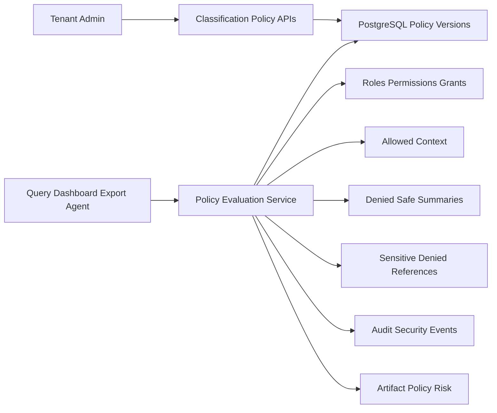

# Slice 5 Classification And Policy Enforcement Foundation

**Recheck implementation before adding  
Goal

Deliver Issue 5 from `[.docs/.prd/engineering-execution-issues.md](d:/00.WORK/SOURCE_REPS/EnterpriseThreadOS/.docs/.prd/engineering-execution-issues.md)`: tenant admins can create/publish classification schemes and policy versions, define restricted context rules, and prove restricted data is filtered before downstream query/dashboard/export/agent/LLM use.

## Existing Foundation To Reuse

- `[.docs/.prd/engineering-execution-issues.md](d:/00.WORK/SOURCE_REPS/EnterpriseThreadOS/.docs/.prd/engineering-execution-issues.md)`: Slice 5 source of scope and acceptance criteria.
- `[ETOS.Backend/Artifacts/ArtifactModels.cs](d:/00.WORK/SOURCE_REPS/EnterpriseThreadOS/ETOS.Backend/Artifacts/ArtifactModels.cs)`: `ArtifactVersion.PolicyRiskStatus` already exists and publish blocks `Blocked` / `RequiresApproval` statuses.
- `[ETOS.Backend/Artifacts/ArtifactRegistryService.cs](d:/00.WORK/SOURCE_REPS/EnterpriseThreadOS/ETOS.Backend/Artifacts/ArtifactRegistryService.cs)`: service pattern for tenant resolution, permission checks, validation, audit writes, and fail-closed access.
- `[ETOS.Backend/Identity/IdentityModels.cs](d:/00.WORK/SOURCE_REPS/EnterpriseThreadOS/ETOS.Backend/Identity/IdentityModels.cs)`: `AccessGrant` already supports temporary/permanent grants and expiry.
- `[ETOS.Backend/Governance/GovernanceModels.cs](d:/00.WORK/SOURCE_REPS/EnterpriseThreadOS/ETOS.Backend/Governance/GovernanceModels.cs)`: audit records already support `PolicyName`, `PolicyVersion`, security events, and safe summaries.
- `[ETOS.Frontend/src/lib/etos-api.ts](d:/00.WORK/SOURCE_REPS/EnterpriseThreadOS/ETOS.Frontend/src/lib/etos-api.ts)` and `[ETOS.Frontend/src/app/page.tsx](d:/00.WORK/SOURCE_REPS/EnterpriseThreadOS/ETOS.Frontend/src/app/page.tsx)`: read-first admin shell and typed API helper pattern.

## Scope Decisions

- Add a new backend module under `ETOS.Backend/Classification/` rather than expanding `Identity` or `Artifacts`.
- Keep policy evaluation local and explicit for MVP using ASP.NET Core authorization/permission services. Do not add OpenFGA/Casbin unless later relationship policy complexity requires it.
- Store policy/classification definitions in PostgreSQL with EF Core, versioned and tenant-scoped.
- Use artifact records for dependency/publish governance where useful, but do not create fake graph/vector/document integrations yet.
- Implement a testable policy check API over generic context items so later Query, Retrieval, Document, Dashboard, and Agent slices can call the same contract.

## Proposed Flow

## Backend Implementation

1. Create `ETOS.Backend/Classification/` with:
  - `ClassificationModels.cs` for `ClassificationScheme`, `ClassificationSchemeVersion`, `PolicyVersion`, `RestrictedContextRule`, and `PolicyEvaluationRecord`.
  - `ClassificationContracts.cs` for create/publish/list requests and policy evaluation responses.
  - `ClassificationPolicyService.cs` for admin CRUD, publish, impact summary, and policy evaluation.
  - `ClassificationEndpointExtensions.cs` for `/api/admin/classification/...` endpoints.
  - `ClassificationPermissions.cs` with permissions like `classification.read`, `classification.manage`, `classification.publish`, `policy.evaluate`, and `policy.admin`.
2. Extend `[EnterpriseThreadDbContext](d:/00.WORK/SOURCE_REPS/EnterpriseThreadOS/ETOS.Backend/Infrastructure/Persistence/EnterpriseThreadDbContext.cs)`:
  - Add `DbSet`s and EF mappings.
  - Use tenant-scoped indexes, normalized keys, enum string conversions, and restrict deletes for published/history records.
  - Add migration `Slice5ClassificationPolicy`.
3. Define classification and policy version behavior:
  - Draft versions can be created and edited through explicit replacement/new version flows.
  - Published versions become immutable.
  - One active published scheme/policy per tenant per policy key or scope.
  - Policy publish records audit entries with policy name/version and source object IDs.
4. Implement restricted context evaluation:
  - Accept generic context items containing `ContextId`, `ContextType`, `ClassificationKey`, `AttributeKey`, optional `DocumentId`, safe summary, and sensitivity metadata.
  - Match against active published policy rules by classification, attribute/document scope, required permission, allowed role, and active access grant.
  - Return allowed items, denied safe summaries, and sensitive denied references separately.
  - Record security-relevant denials through existing audit/security mechanisms without storing restricted payloads in logs.
5. Integrate artifact publish governance:
  - Add a policy compatibility evaluation path that sets or recalculates `ArtifactVersion.PolicyRiskStatus` using the active published policy.
  - Keep `[ArtifactRegistryService](d:/00.WORK/SOURCE_REPS/EnterpriseThreadOS/ETOS.Backend/Artifacts/ArtifactRegistryService.cs)` as the final publish gate; do not duplicate publish behavior.
  - Link policy changes to affected artifacts using generic artifact relationships/dependencies where appropriate.
6. Register and expose the module:
  - Register services in `[EnterpriseThreadPlatform.cs](d:/00.WORK/SOURCE_REPS/EnterpriseThreadOS/ETOS.Backend/Platform/EnterpriseThreadPlatform.cs)`.
  - Map endpoints from `[Program.cs](d:/00.WORK/SOURCE_REPS/EnterpriseThreadOS/ETOS.Backend/Program.cs)`.
  - Seed dev permissions in the existing development identity seeder.

## Frontend Implementation

1. Extend `[ETOS.Frontend/src/lib/etos-api.ts](d:/00.WORK/SOURCE_REPS/EnterpriseThreadOS/ETOS.Frontend/src/lib/etos-api.ts)`:
  - Add DTOs for classification schemes, scheme versions, policy versions, restricted rules, policy evaluation summaries, and impact summaries.
  - Add `getClassificationPolicyLists()` using the same tenant/user header and `no-store` fetch pattern as governance and artifacts.
2. Extend `[ETOS.Frontend/src/app/page.tsx](d:/00.WORK/SOURCE_REPS/EnterpriseThreadOS/ETOS.Frontend/src/app/page.tsx)`:
  - Add read-first list sections for classification schemes, policy versions, restricted rules, and recent policy decisions/impacts.
  - Keep the UI minimal and server-rendered unless management forms become necessary during implementation.
  - If create/publish controls are needed, add small focused client components rather than converting the whole admin shell.

## Tests And Verification

- Add backend tests in `ETOS.Backend.Tests` for:
  - tenant isolation and denied audit/security behavior;
  - classification/policy version publish and immutability;
  - restricted context split into allowed, denied safe summaries, and sensitive denied references;
  - temporary grant expiry behavior;
  - artifact publish blocked by unacceptable policy risk;
  - policy impact summaries linked to affected artifacts.
- Run focused backend tests first, then `dotnet test EnterpriseThreadOS.sln`.
- Run frontend `npm run typecheck` and `npm run lint` after UI changes.

## Acceptance Criteria Mapping

- Tenant admins can create and publish classification scheme versions and policy versions.
- Restricted attributes/documents can be configured by classification, permission, role, and access grant.
- Policy checks return allowed context, denied safe summaries, and sensitive denied references separately.
- Policy changes are versioned, auditable, impact-analyzed, and linked to affected artifacts.
- The admin UI exposes basic classification and policy management/exploration.
- Tests verify filtering before downstream context, denied context separation, versioning, temporary grants, and publish compatibility behavior.

