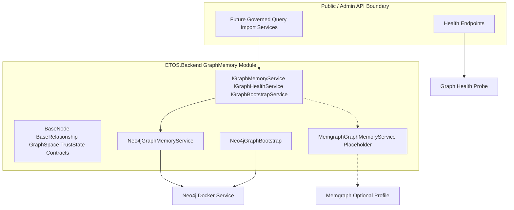

# Slice 6 Graph Memory Abstraction And Neo4j Backend

## Goal

Deliver Issue 6 from [`.docs/.prd/engineering-execution-issues.md`](d:/00.WORK/SOURCE_REPS/EnterpriseThreadOS/.docs/.prd/engineering-execution-issues.md): implement the graph memory abstraction with BaseNode/BaseRelationship conventions, Neo4j as the active MVP backend, internal-only graph access, bootstrap constraints/indexes, and an optional Memgraph adapter placeholder.

Slice 5 established classification and policy enforcement. Slice 6 adds the graph memory layer that later governed query, import/staging, identity resolution, and explorers will traverse — always through internal contracts, never raw Cypher in public or admin APIs.

Architecture direction is fixed by [`.cursor/plans/neo4j_graph_decision_5dc4efa8.plan.md`](d:/00.WORK/SOURCE_REPS/EnterpriseThreadOS/.cursor/plans/neo4j_graph_decision_5dc4efa8.plan.md): Neo4j primary, Memgraph optional.

## Current Repo Gaps (Rechecked)

| Area | Current state | Slice 6 target |
| ---- | ------------- | -------------- |
| `infra/local/docker-compose.yml` | Memgraph on 7687 as default graph service | Neo4j on 7687 as default; Memgraph behind optional profile |
| `.env.example` | `MEMGRAPH_*` vars only | `NEO4J_*` vars; optional `MEMGRAPH_*` for profile |
| `ETOS.Backend/appsettings.json` | Infrastructure health probes Memgraph TCP | Infrastructure health probes Neo4j (HTTP and/or Bolt) |
| `InfrastructureHealthOptions` / `InfrastructureHealthService` | `Memgraph` endpoint option | `Neo4j` endpoint option |
| `StaticExtensionPointCatalog.cs` | Says Neo4j deferred, Memgraph MVP | Flip: Neo4j active in Issue 6; Memgraph optional adapter |
| `docs/local-development.md`, `ARCHITECTURE.md`, frontend shell copy | Memgraph listed as graph backend | Neo4j primary; Memgraph optional profile documented |
| Backend graph module | Not present | New `ETOS.Backend/GraphMemory/` module |
| NuGet packages | No `Neo4j.Driver` | Add `Neo4j.Driver`; add `Testcontainers.Neo4j` in tests |
| Public graph APIs | None (good) | Keep none; add internal service contracts only |

Issue 1 originally listed Neo4j infra in Milestone 1 deliverables, but implementation stopped at Memgraph TCP health probing. Slice 6 closes that gap and delivers the actual graph abstraction Issue 6 owns.

## Existing Foundation To Reuse

- [`.docs/.prd/engineering-execution-issues.md`](d:/00.WORK/SOURCE_REPS/EnterpriseThreadOS/.docs/.prd/engineering-execution-issues.md): Slice 6 scope and acceptance criteria.
- [`.docs/.prd/engineering-execution-prd.md`](d:/00.WORK/SOURCE_REPS/EnterpriseThreadOS/.docs/.prd/engineering-execution-prd.md): BaseNode/BaseRelationship vocabulary, staging vs trusted graph spaces, raw-query restriction, Neo4j storage ownership.
- [`ETOS.Backend/Health/InfrastructureHealthService.cs`](d:/00.WORK/SOURCE_REPS/EnterpriseThreadOS/ETOS.Backend/Health/InfrastructureHealthService.cs): existing TCP/HTTP probe pattern for infrastructure health.
- [`ETOS.Backend/Platform/EnterpriseThreadPlatform.cs`](d:/00.WORK/SOURCE_REPS/EnterpriseThreadOS/ETOS.Backend/Platform/EnterpriseThreadPlatform.cs): centralized module registration pattern used by Classification, Artifacts, Governance.
- [`ETOS.Backend/Tenancy/`](d:/00.WORK/SOURCE_REPS/EnterpriseThreadOS/ETOS.Backend/Tenancy/): tenant-scope conventions for fail-closed tenant context.
- [`ETOS.Backend/Classification/`](d:/00.WORK/SOURCE_REPS/EnterpriseThreadOS/ETOS.Backend/Classification/): policy evaluation contract later slices will combine with graph retrieval; do not wire governed query yet.
- [`ETOS.Backend.Tests/HealthEndpointTests.cs`](d:/00.WORK/SOURCE_REPS/EnterpriseThreadOS/ETOS.Backend.Tests/HealthEndpointTests.cs): WebApplicationFactory and stubbed health patterns.

## Scope Decisions

### In scope for Slice 6

- Local infra alignment: Neo4j in Docker Compose, Memgraph optional profile, docs/config/health updates.
- Graph memory abstraction with explicit contracts for nodes, relationships, attributes, tenant scope, source references, trust state, graph space, health, and snapshot/diff **contract placeholders**.
- Neo4j implementation: create, read, update, and bounded traverse operations with mandatory tenant filtering.
- Bootstrap on startup (or first connection): constraints, indexes, and label/property conventions for BaseNode/BaseRelationship.
- Internal graph health service used by platform/infrastructure health and tests.
- Memgraph adapter placeholder implementing the same interface but disabled/unregistered by default.
- Tests using Testcontainers Neo4j for real Bolt behavior.
- Minimal frontend/doc text updates where infrastructure component names are shown.

### Out of scope for Slice 6 (later issues)

- Canonical ontology and tenant attribute schemas (Issue 7).
- Import batches, staging graph population, trusted promotion (Issues 8, 11).
- Full GraphSnapshot/GraphDiff engines (Issue 11) — only contract shapes and no-op or stub service methods here.
- Governed query intents, context assembly, Graph Explorer UI (Issues 13, 16).
- Policy-filtered graph retrieval integration (Issue 13 combines Classification + Graph).
- Public or admin endpoints that accept raw Cypher or expose unconstrained graph query execution.

### Neo4j vs Memgraph in local dev

- **Yes, add Neo4j to Docker Compose now.** Slice 6 must implement and test against a real Neo4j instance locally.
- **Yes, Memgraph stays optional.** Use a Compose profile such as `memgraph-optional` so default `docker compose up -d` starts Neo4j only.
- Both use Bolt 7687 by default; do not run both as co-primary services on the same host port. If someone enables the Memgraph profile, document remapping `MEMGRAPH_BOLT_PORT` (for example 7688).

## Proposed Architecture



Policy (Slice 5) decides allowed context; graph memory (Slice 6) stores relationships future retrieval will traverse after policy filtering in Slice 13.

## Phase 1 — Infra Alignment (Do First)

### Docker Compose

Add a default `neo4j` service, for example:

- Image: `neo4j:5` (or current LTS tag used consistently in docs/tests)
- Ports: Bolt `${NEO4J_BOLT_PORT:-7687}:7687`, Browser `${NEO4J_HTTP_PORT:-7474}:7474`
- Auth: `NEO4J_AUTH=${NEO4J_USER:-neo4j}/${NEO4J_PASSWORD:-etos_neo4j_dev_password}`
- Plugins/apoc: not required for Slice 6 unless a concrete need appears
- Volume: `neo4j-data`
- Healthcheck: HTTP against `http://localhost:7474` or Bolt-aware probe

Move existing `memgraph` service under profiles:

```yaml
profiles: ["memgraph-optional"]
```

Default stack becomes: PostgreSQL, Neo4j, Qdrant, MinIO, Redis, RabbitMQ.

### Environment and configuration

Update [`.env.example`](d:/00.WORK/SOURCE_REPS/EnterpriseThreadOS/.env.example):

```env
NEO4J_BOLT_PORT=7687
NEO4J_HTTP_PORT=7474
NEO4J_USER=neo4j
NEO4J_PASSWORD=etos_neo4j_dev_password

# Optional Memgraph evaluation profile only
# MEMGRAPH_BOLT_PORT=7688
# MEMGRAPH_HTTP_PORT=7444
```

Add backend configuration section, for example `GraphMemory:Neo4j`:

- `Uri` (`bolt://localhost:7687`)
- `Username`, `Password`
- `Database` (default `neo4j`)
- `Enabled` (default `true`)
- `BootstrapOnStartup` (default `true` in Development)

Replace `Infrastructure:Memgraph` with `Infrastructure:Neo4j` in [`appsettings.json`](d:/00.WORK/SOURCE_REPS/EnterpriseThreadOS/ETOS.Backend/appsettings.json) and [`InfrastructureHealthOptions`](d:/00.WORK/SOURCE_REPS/EnterpriseThreadOS/ETOS.Backend/Infrastructure/Configuration/InfrastructureHealthOptions.cs). Prefer HTTP health URL to Neo4j browser port when available; keep Bolt TCP as fallback if needed.

### Docs and catalog fixes

- [`docs/local-development.md`](d:/00.WORK/SOURCE_REPS/EnterpriseThreadOS/docs/local-development.md): Neo4j default; Memgraph optional profile command example.
- [`ARCHITECTURE.md`](d:/00.WORK/SOURCE_REPS/EnterpriseThreadOS/ARCHITECTURE.md): diagram and implemented-vs-planned wording.
- [`StaticExtensionPointCatalog.cs`](d:/00.WORK/SOURCE_REPS/EnterpriseThreadOS/ETOS.Backend/Platform/Extensions/StaticExtensionPointCatalog.cs): change Neo4j entry to active/Issue 6; add or reword Memgraph as optional adapter placeholder.
- [`ETOS.Frontend/src/app/page.tsx`](d:/00.WORK/SOURCE_REPS/EnterpriseThreadOS/ETOS.Frontend/src/app/page.tsx): replace Memgraph mention with Neo4j in infrastructure copy.

## Phase 2 — Graph Memory Module

Create `ETOS.Backend/GraphMemory/` with the following files.

### Contracts and models

| File | Responsibility |
| ---- | -------------- |
| `GraphMemoryModels.cs` | `BaseNode`, `BaseRelationship`, enums for `GraphSpace` (`Staging`, `Trusted`), `TrustState` (`Unverified`, `Provisional`, `Trusted`, `Conflicted`), attribute bag, source reference metadata |
| `GraphMemoryContracts.cs` | Request/response DTOs for create/update/get/traverse; snapshot/diff contract records as placeholders |
| `IGraphMemoryService.cs` | Internal create/read/update/traverse operations; every method requires tenant id |
| `IGraphHealthService.cs` | Graph backend connectivity and schema bootstrap status |
| `IGraphBootstrapService.cs` | Apply constraints/indexes/conventions idempotently |
| `GraphMemoryOptions.cs` | Backend selection (`Neo4j` default), Neo4j connection options, optional Memgraph disabled flag |
| `GraphMemoryPermissions.cs` | Internal permission constants only if an admin diagnostic endpoint is added; prefer no new public graph admin APIs in this slice |

### BaseNode / BaseRelationship conventions (Neo4j)

Use stable platform conventions documented in code and bootstrap scripts:

**BaseNode labels/properties**

- Labels: `:BaseNode` plus optional domain label placeholder `:EtosNode` until Issue 7 ontology arrives
- Required properties: `nodeId` (UUID string, unique), `tenantId` (UUID string), `graphSpace`, `objectType`, `trustState`, `createdAt`, `updatedAt`
- Optional: `sourceSystem`, `sourceRecordId`, `sourceBatchId`, `attributesJson` or flattened attribute map strategy (pick one; prefer JSON map property for MVP flexibility)
- Index: `(tenantId, graphSpace, objectType)`, unique constraint on `nodeId`

**BaseRelationship types/properties**

- Type: `BASE_RELationship` or typed rel names with required `relationshipId`, `tenantId`, `relationshipType`, `trustState`, source metadata, `createdAt`, `updatedAt`
- Index: `(tenantId, relationshipType)`
- Traversal queries must always include `tenantId` predicate

**Logical graph spaces**

- Represent staging vs trusted using `graphSpace` property/filter, not separate databases in MVP.
- Rejected staging summaries remain SQL/audit concern later; Slice 6 only models the property convention.

### Snapshot / diff placeholders

Issue 6 acceptance requires contract support, not full engines:

- Define `GraphSnapshotContract` and `GraphDiffContract` records plus `IGraphSnapshotService` / `IGraphDiffService` interfaces with `NotImplementedException` or explicit `GraphFeatureAvailability` responses.
- Document in XML comments that Issue 11 owns implementation.

## Phase 3 — Neo4j Implementation

### Packages

Add to [`ETOS.Backend.csproj`](d:/00.WORK/SOURCE_REPS/EnterpriseThreadOS/ETOS.Backend/ETOS.Backend.csproj):

- `Neo4j.Driver`

Add to [`ETOS.Backend.Tests.csproj`](d:/00.WORK/SOURCE_REPS/EnterpriseThreadOS/ETOS.Backend.Tests/ETOS.Backend.Tests.csproj):

- `Testcontainers.Neo4j` (or equivalent supported Neo4j Testcontainers package for .NET)

### Services

| File | Responsibility |
| ---- | ---------------- |
| `Neo4jGraphDriverFactory.cs` | Creates/shared `IDriver`, validates options |
| `Neo4jGraphBootstrapService.cs` | Idempotent `CREATE CONSTRAINT` / `CREATE INDEX` Cypher for BaseNode/BaseRelationship conventions |
| `Neo4jGraphMemoryService.cs` | Implements `IGraphMemoryService` with parameterized Cypher only; no string concatenation of tenant ids from unvalidated input |
| `Neo4jGraphHealthService.cs` | Verifies driver connectivity and bootstrap completeness |
| `Neo4jGraphMemoryServiceExtensions.cs` | DI registration helpers |

### Tenant isolation rules (fail closed)

- All graph writes include `tenantId` on node/relationship properties.
- All reads/traversals require `tenantId` parameter and filter in Cypher.
- If tenant context is missing in calling application code, throw before hitting Neo4j.
- Cross-tenant reads must return empty/not-found, never partial foreign data.
- Do not expose generic `ExecuteCypher(string query)` on public-facing interfaces.

### Bootstrap script

Implement bootstrap in C# (`Neo4jGraphBootstrapService`) rather than a standalone shell script, but mirror the Cypher in docs for operators:

- Unique constraint on `BaseNode.nodeId`
- Indexes on `tenantId`, `graphSpace`, `objectType`, `relationshipType`
- Optional composite indexes aligned to expected traversal filters

Run bootstrap:

- On application startup in Development when `BootstrapOnStartup=true`
- Always before integration tests against Testcontainers

## Phase 4 — Memgraph Placeholder

Add `MemgraphGraphMemoryService.cs` and options gated by `GraphMemory:Memgraph:Enabled=false` default.

Behavior:

- Placeholder implements the same interfaces.
- Methods throw `NotSupportedException` with message that Memgraph adapter is deferred optional backend.
- Do not register in DI unless explicitly enabled.
- No requirement to run Memgraph in default compose or CI for Slice 6.

Optional future note in extension catalog: enable profile + flip config to experiment with Bolt-compatible adapter work.

## Phase 5 — Platform Wiring And Access Boundaries

### Register in platform

Update [`EnterpriseThreadPlatform.cs`](d:/00.WORK/SOURCE_REPS/EnterpriseThreadOS/ETOS.Backend/Platform/EnterpriseThreadPlatform.cs):

- Bind `GraphMemoryOptions`
- Register Neo4j driver factory, bootstrap, memory service, health service
- Optionally hosted bootstrap on startup

Update [`InfrastructureHealthService`](d:/00.WORK/SOURCE_REPS/EnterpriseThreadOS/ETOS.Backend/Health/InfrastructureHealthService.cs):

- Replace Memgraph TCP check with Neo4j check
- Optionally combine infrastructure TCP/HTTP probe with `IGraphHealthService` summary

### Program.cs / endpoints

- Do **not** map public graph CRUD or Cypher endpoints.
- If any diagnostic surface is needed for Slice 6, restrict it to existing aggregate health endpoints only.
- Add a compile-time or test-time assertion that no route accepts raw Cypher (search for forbidden endpoint patterns in tests).

Internal consumers in later slices will inject `IGraphMemoryService` from governed import/query modules only.

## Phase 6 — Tests And Verification

Add `ETOS.Backend.Tests/GraphMemoryTests.cs` (or split files if clearer):

| Test | Proves |
| ---- | ------ |
| `GraphHealthReportsHealthyAgainstNeo4jContainer` | Driver connectivity + bootstrap |
| `CreateNodeRequiresTenantId` | Fail closed without tenant |
| `NodesAreVisibleOnlyWithinTenant` | Tenant isolation on create/read |
| `RelationshipTraversalRespectsTenantBoundary` | Traversal cannot cross tenants |
| `RelationshipMetadataIsPersisted` | relationshipType/trustState/source refs |
| `BootstrapIsIdempotent` | Safe repeated startup |
| `NoPublicGraphQueryRoutesExist` | Raw access restriction |
| `MemgraphAdapterRemainsDisabledByDefault` | Placeholder not active |

Use Testcontainers Neo4j for integration tests; keep fast unit tests for option binding and guard logic.

Update [`ConfigurationTests.cs`](d:/00.WORK/SOURCE_REPS/EnterpriseThreadOS/ETOS.Backend.Tests/ConfigurationTests.cs) for Neo4j infrastructure options instead of Memgraph.

Verification commands:

```powershell
dotnet test EnterpriseThreadOS.sln
```

```powershell
Push-Location ETOS.Frontend
npm run typecheck
npm run lint
Pop-Location
```

Manual smoke (after infra alignment):

```powershell
docker compose --env-file .env -f infra/local/docker-compose.yml up -d
dotnet run --project ETOS.Backend/ETOS.Backend.csproj --urls http://localhost:5000
# GET /health/infrastructure should report Neo4j healthy when container is up
```

## Frontend Scope

Keep UI changes minimal:

- Update infrastructure description text from Memgraph to Neo4j in [`page.tsx`](d:/00.WORK/SOURCE_REPS/EnterpriseThreadOS/ETOS.Frontend/src/app/page.tsx).
- No Graph Explorer, node CRUD UI, or Cypher console in Slice 6 (Issue 16).

## Acceptance Criteria Mapping

| Issue 6 criterion | Slice 6 deliverable |
| ----------------- | ------------------- |
| Graph contracts support nodes, relationships, attributes, tenant scope, source refs, trust state, snapshots, diffs, health | `GraphMemoryModels`, service interfaces, snapshot/diff contract placeholders |
| Neo4j backend create/query/update/traverse tenant-scoped records through abstraction | `Neo4jGraphMemoryService` + tests |
| Raw graph query not exposed through public/admin APIs | No graph query endpoints; negative route test |
| Memgraph optional disabled placeholder | `MemgraphGraphMemoryService`, config default disabled, compose profile optional |
| Bootstrap constraints/indexes/conventions | `Neo4jGraphBootstrapService` |
| Tests for health, tenant filtering, relationship metadata, traversal constraints, raw access restrictions | `GraphMemoryTests` with Testcontainers |

## Suggested Implementation Order

1. Infra alignment (Neo4j compose, env, health options, docs, catalog, frontend copy).
2. Graph contracts and options types.
3. Neo4j driver + bootstrap + health.
4. Neo4j memory service CRUD/traverse with tenant guards.
5. Memgraph placeholder + DI guards.
6. Platform wiring and infrastructure health swap.
7. Tests and full verification.

## Follow-On: Issue 7

After Slice 6 merges, Issue 7 (Canonical Ontology and Tenant Attribute Schemas) can publish semantic object types and attribute schemas that populate graph nodes using the BaseNode conventions established here. Do not hard-code ontology types beyond minimal `objectType` string placeholders in Slice 6.
