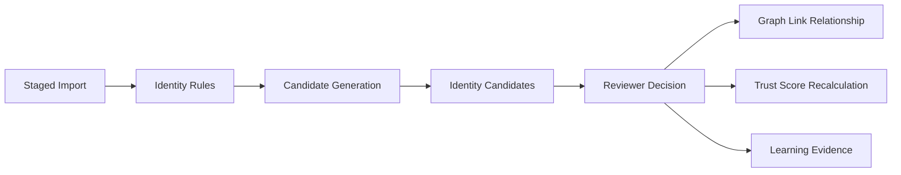

# Issue 9 Identity Resolution Review and Trust Scoring

## Goal
Add the first identity-resolution review loop after import staging. Users should be able to generate candidate identity links from staged records, approve or reject uncertain matches, see unverified/conflicted link state, and have trust scores recalculated from mappings, decisions, conflicts, and verification state.

## Context Anchors
- Backlog source: [`.docs/.prd/engineering-execution-issues.md`](.docs/.prd/engineering-execution-issues.md), Issue 9 acceptance criteria.
- Existing import staging foundation: [`ETOS.Backend/Imports/ImportModels.cs`](ETOS.Backend/Imports/ImportModels.cs), [`ETOS.Backend/Imports/ImportService.cs`](ETOS.Backend/Imports/ImportService.cs), and [`ETOS.Backend/Imports/ImportEndpointExtensions.cs`](ETOS.Backend/Imports/ImportEndpointExtensions.cs).
- Graph trust model already exists in [`ETOS.Backend/GraphMemory/GraphMemoryModels.cs`](ETOS.Backend/GraphMemory/GraphMemoryModels.cs): `GraphSpace.Staging`, `GraphSpace.Trusted`, `TrustState.Unverified`, `TrustState.Provisional`, `TrustState.Trusted`, and `TrustState.Conflicted`.
- Graph links should use [`IGraphMemoryService.CreateRelationshipAsync`](ETOS.Backend/GraphMemory/IGraphMemoryService.cs), not node merges.
- EF persistence is centralized in [`ETOS.Backend/Infrastructure/Persistence/EnterpriseThreadDbContext.cs`](ETOS.Backend/Infrastructure/Persistence/EnterpriseThreadDbContext.cs).
- Frontend import review surface already exists at [`ETOS.Frontend/src/app/imports/page.tsx`](ETOS.Frontend/src/app/imports/page.tsx) with typed helpers in [`ETOS.Frontend/src/lib/etos-api.ts`](ETOS.Frontend/src/lib/etos-api.ts).

## Scope Boundaries
- Do not promote staged records into the trusted graph; that belongs to Issue 11.
- Do not destructively merge source records or canonical objects.
- Do not add fake AI/LLM matching. Use an honest deterministic scorer and leave an adapter boundary for future AI-assisted identity review.
- Do not create full data-quality review tasks; Issue 10 owns that. Slice 9 can record conflicts and trust effects as identity-resolution artifacts.

## Implementation Plan

### 1. Add Identity Resolution Domain and Persistence
Create a backend module under [`ETOS.Backend/IdentityResolution/`](ETOS.Backend/IdentityResolution/) with models, DTOs, service, and endpoint extension.

Add EF entities such as:
- `IdentityResolutionRule`: tenant-scoped rule set for candidate generation, source-system scope, object type, identity attribute keys, confidence thresholds, conflict policy, and status.
- `IdentityCandidateLink`: generated candidate between two graph nodes/source records, tied to `ImportBatch`, optional `ImportStagingGraphRun`, `ImportMappingVersion`, score, reason, state, and evidence summary.
- `IdentityResolutionDecision`: reviewer approval/rejection/conflict decision with rationale, actor, timestamp, and resulting trust effect.
- `IdentityLearningEvidence`: lightweight feedback record from accepted/rejected candidates for later matching improvements.
- `TrustScoreRecord`: current trust score and component breakdown for staged graph nodes or candidate links.

Wire these into [`EnterpriseThreadDbContext`](ETOS.Backend/Infrastructure/Persistence/EnterpriseThreadDbContext.cs) with tenant indexes, restrictive delete behavior for audit history, enum string conversions, and a migration named `Slice9IdentityResolutionTrust`.

### 2. Generate Candidate Links from Staged Imports
Add an `IIdentityResolutionService` that loads a staged import batch, approved mapping, staging run graph node IDs, and parsed identity fields.

Candidate generation should:
- Require `ImportBatchStatus.Staged` and at least one approved mapping.
- Use identity columns from `ImportColumnMapping.IsIdentityField` as the default rule input.
- Compare records across different source systems when data exists, and avoid self-links from the same source record.
- Normalize identity values consistently with existing import normalization.
- Produce deterministic confidence scores based on exact identity matches, partial identity matches, source-system difference, lifecycle compatibility, and validation warnings.
- Persist candidates as `Unverified`, `Provisional`, or `Conflicted` according to threshold and duplicate/conflict detection.

Suggested flow:

### 3. Record Review Decisions and Graph Link Relationships
Add review endpoints that let authorized users approve, reject, or mark a candidate as conflicted.

Decision behavior:
- Approved candidates create graph relationships through `IGraphMemoryService.CreateRelationshipAsync` with a platform-owned relationship type such as `IDENTITY_LINK`.
- Approved-but-not-promoted links should use `GraphSpace.Staging` and `TrustState.Provisional` unless the rule/decision is strong enough for `TrustState.Trusted` within staging review context.
- Rejected candidates do not create graph relationships but do create `IdentityResolutionDecision` and `IdentityLearningEvidence` records.
- Conflicted candidates remain visible, receive `TrustState.Conflicted`, and are excluded from trusted recommendations by trust filtering metadata.
- Re-running candidate generation should be idempotent for the same batch/rule/source pair and should not duplicate existing decisions.

### 4. Recalculate Trust Scores
Add a small trust scoring service rather than scattering calculations through import and review code.

Trust score inputs should include:
- Mapping approval state and mapping confidence provenance.
- Import validation issue counts and severity.
- Candidate identity match confidence.
- Reviewer decision state.
- Conflict state and duplicate competing links.
- Verification state from graph trust metadata.

Persist a score breakdown so the UI and tests can explain why a score changed. For now, trust scores should be used as metadata and filtering inputs only; later slices can consume them for recommendations and promotion decisions.

### 5. Add Minimal Admin API and UI
Backend endpoints should follow existing minimal API style under a group like `/api/admin/identity-resolution`:
- `GET /rules`
- `POST /rules`
- `POST /batches/{batchId}/candidates/generate`
- `GET /batches/{batchId}/candidates`
- `POST /candidates/{candidateId}/approve`
- `POST /candidates/{candidateId}/reject`
- `POST /candidates/{candidateId}/mark-conflicted`
- `GET /batches/{batchId}/trust-scores`

Register the module in [`EnterpriseThreadPlatform.cs`](ETOS.Backend/Platform/EnterpriseThreadPlatform.cs) and map endpoints from [`Program.cs`](ETOS.Backend/Program.cs). Add permissions such as `identity_resolution.read`, `identity_resolution.manage`, `identity_resolution.review`, and `identity_resolution.admin`, and seed them alongside existing module permissions.

Frontend should extend the existing imports page rather than introduce a separate rich workflow:
- Add typed DTOs and helpers in [`ETOS.Frontend/src/lib/etos-api.ts`](ETOS.Frontend/src/lib/etos-api.ts).
- Add import-detail panels in [`ETOS.Frontend/src/app/imports/page.tsx`](ETOS.Frontend/src/app/imports/page.tsx) for identity candidates, decision status, trust score breakdowns, and demo actions.
- Keep the UI server-rendered and minimal, matching current slice 8 patterns.

### 6. Tests and Verification
Add focused backend tests, likely in a new [`ETOS.Backend.Tests/IdentityResolutionTests.cs`](ETOS.Backend.Tests/IdentityResolutionTests.cs), using the existing `WebApplicationFactory` pattern from [`ImportTests`](ETOS.Backend.Tests/ImportTests.cs).

Test coverage should include:
- Candidate generation from identity fields across source systems.
- Candidate generation does not duplicate reviewed candidates.
- Uncertain candidates require approval before graph link creation.
- Approved links create graph relationships, not merged nodes.
- Rejection records learning evidence and prevents relationship creation.
- Conflicted links are visible and marked as excluded from trusted recommendation use.
- Trust scores change after mapping, validation, approval, rejection, and conflict states.
- Cross-tenant access is denied and audited.

Verification commands:
- `dotnet test EnterpriseThreadOS.sln`
- `Push-Location ETOS.Frontend; npm run typecheck; npm run lint; Pop-Location`

## Out of Scope
- Trusted graph promotion, snapshots, diffs, and BOM comparison.
- Data quality issue workflow tasks beyond identity conflict metadata.
- Governed recommendations, chat, retrieval, or AI trace consumption.
- LLM-based identity matching.
- Enterprise source-system writes or external connector actions.