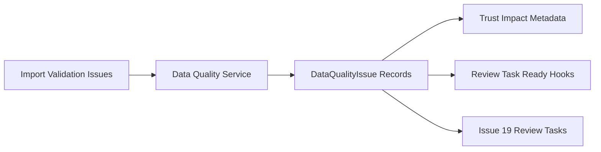

# Issue 10 Data Quality Issues and Review Hooks

## Goal
Make data-quality problems first-class and durable after import/identity review. Users should be able to see rule-generated issues, create manual issues from existing platform contexts, understand severity/trust impact, and have review-task-ready metadata available for later task slices.

## Context Anchors
- Backlog source: [`.docs/.prd/engineering-execution-issues.md`](.docs/.prd/engineering-execution-issues.md), Issue 10 acceptance criteria.
- Import validation already exists as batch-local records in [`ETOS.Backend/Imports/ImportModels.cs`](ETOS.Backend/Imports/ImportModels.cs): `ImportValidationIssue` has severity, row/column/object scope, issue code, and message.
- Existing trust score persistence lives in [`ETOS.Backend/IdentityResolution/IdentityResolutionModels.cs`](ETOS.Backend/IdentityResolution/IdentityResolutionModels.cs): `TrustScoreRecord` can already carry graph node/relationship IDs, trust state, and a JSON breakdown.
- Security events already expose review-task readiness in [`ETOS.Backend/Governance/GovernanceModels.cs`](ETOS.Backend/Governance/GovernanceModels.cs): `ReviewTaskReady`, `ReviewTaskHint`, and `ReviewTaskCreatedAt`.
- Backend module registration follows [`ETOS.Backend/Platform/EnterpriseThreadPlatform.cs`](ETOS.Backend/Platform/EnterpriseThreadPlatform.cs) and endpoint mapping in [`ETOS.Backend/Program.cs`](ETOS.Backend/Program.cs).
- The main UI surface should extend [`ETOS.Frontend/src/app/imports/page.tsx`](ETOS.Frontend/src/app/imports/page.tsx) and typed helpers in [`ETOS.Frontend/src/lib/etos-api.ts`](ETOS.Frontend/src/lib/etos-api.ts).

## Scope Boundaries
- Do not implement full `ReviewTaskArtifact`; Issue 19 owns task assignment, blocking, escalation, and completion workflows.
- Do not implement trusted graph promotion, snapshots, diffs, or BOM comparison; Issue 11 owns those gates.
- Do not build chat/dashboard/explorer manual issue entry yet. Slice 10 can support API/context metadata and a minimal demo action, but rich originating surfaces arrive in later slices.
- Do not add live source scanning or agent execution. Monitoring-agent support should be disabled contracts/metadata that can inspect already-created issue types later.
- Keep `ImportValidationIssue` as import-run-local evidence. Add durable data-quality issue records rather than overloading validation rows as the long-lived governance object.

## Implementation Plan

### 1. Add Data Quality Domain and Persistence
Create a backend module under [`ETOS.Backend/DataQuality/`](ETOS.Backend/DataQuality/) with models, DTOs, service, and endpoint extension.

Add EF entities such as:
- `DataQualityIssue`: tenant-scoped durable issue record with title/code, severity, status, origin, affected entity type, graph node/relationship IDs, import batch/mapping/staging run links, source evidence links, security event link, trust impact, review-task-ready metadata, created/updated timestamps, and created-by user.
- `DataQualityIssueSourceLink`: normalized links to `ImportValidationIssue`, `ImportFileEvidence`, `ImportBatch`, `IdentityCandidateLink`, `SecurityEvent`, graph records, or later trace/document/dashboard contexts.
- `DataQualityTrustImpact`: optional child/breakdown record when a single issue affects several graph nodes, relationships, identity candidates, or task-priority inputs.
- `MonitoringIssueTypeDefinition`: disabled MVP placeholder describing issue types a future monitoring agent may inspect, without live scanning.

Wire these into [`EnterpriseThreadDbContext`](ETOS.Backend/Infrastructure/Persistence/EnterpriseThreadDbContext.cs) with tenant indexes, enum string conversions, unique idempotency keys for generated issues, restrictive delete behavior for history, and a migration named `Slice10DataQualityIssues`.

### 2. Promote Import Validation Issues into Durable Quality Issues
Add an `IDataQualityIssueService` command such as `CreateFromImportValidationAsync(batchId)`.

Behavior should:
- Require a validated or staged import batch.
- Read existing `ImportValidationIssue` rows and create durable data-quality issues with source links back to the validation row, import batch, mapping version, and file evidence where available.
- Use idempotency keys like `import-validation:{tenantId}:{validationIssueId}` so repeated commands update/summarize instead of duplicating issues.
- Map import warnings/errors into data-quality severities and trust impact defaults.
- Audit issue generation with safe summaries only.

Suggested flow:

### 3. Add Manual and Security-Event Issue Creation
Expose explicit creation paths without pretending all future source contexts exist.

Manual issue creation should support:
- Creating an issue against an import batch, validation issue, graph node, graph relationship, identity candidate, or generic source reference.
- Required title, issue code/category, severity, affected entity type, evidence summary, and rationale.
- Tenant-safe source link validation before persistence.

Security-event issue creation should support:
- Creating a review-ready quality issue from a `SecurityEvent` when `ReviewTaskReady` is true.
- Linking to the related audit/security event and preserving safe summaries.
- Marking the security event as having review-hook output without creating a full review task.

### 4. Severity, Trust Impact, and Review Hooks
Add deterministic severity-to-impact behavior and expose it in DTOs.

Rules should stay simple:
- Critical/high issues reduce trust more strongly than medium/low issues.
- Conflicted or unverified identity-related issues set `ExcludedFromTrustedRecommendations`-compatible metadata for downstream recommendation slices.
- Task priority metadata is derived from severity, conflict state, trust state, and source type, but no task is created yet.
- Existing `TrustScoreRecord` recalculation should consume durable data-quality issue impact where practical, while preserving the current validation-penalty behavior for identity candidates.

### 5. Add Minimal Admin API and UI
Backend endpoints should follow existing minimal API style under `/api/admin/data-quality`:
- `GET /issues`
- `GET /issues/{issueId}`
- `POST /issues`
- `POST /imports/batches/{batchId}/issues/generate`
- `POST /security-events/{securityEventId}/issues/create`
- `GET /monitoring-placeholders`

Register permissions such as `data_quality.read`, `data_quality.manage`, `data_quality.review_hook`, and `data_quality.admin`, then seed them in [`DevelopmentIdentitySeeder`](ETOS.Backend/Identity/DevelopmentIdentitySeeder.cs).

Frontend should stay minimal:
- Extend [`ETOS.Frontend/src/lib/etos-api.ts`](ETOS.Frontend/src/lib/etos-api.ts) with typed data-quality DTOs and helper actions.
- Extend [`ETOS.Frontend/src/app/imports/page.tsx`](ETOS.Frontend/src/app/imports/page.tsx) with a `Data Quality Issues` panel showing severity, status, source links, trust impact, and review-hook readiness.
- Add demo buttons for generating quality issues from latest import validation and creating one issue from the latest review-ready security event.
- Optionally enrich [`ETOS.Frontend/src/app/page.tsx`](ETOS.Frontend/src/app/page.tsx) to show whether security events have data-quality review-hook output.

### 6. Tests and Verification
Add focused backend tests, likely [`ETOS.Backend.Tests/DataQualityTests.cs`](ETOS.Backend.Tests/DataQualityTests.cs), reusing patterns from [`ETOS.Backend.Tests/ImportTests.cs`](ETOS.Backend.Tests/ImportTests.cs), [`ETOS.Backend.Tests/IdentityResolutionTests.cs`](ETOS.Backend.Tests/IdentityResolutionTests.cs), and [`ETOS.Backend.Tests/GovernanceAuditTests.cs`](ETOS.Backend.Tests/GovernanceAuditTests.cs).

Test coverage should include:
- Import validation issues create durable data-quality issues with source links.
- Re-running import issue generation is idempotent.
- Manual issue creation validates tenant and source references.
- Issue severity maps to trust impact and review priority metadata.
- Security events can create review-ready issue records and preserve audit links.
- Monitoring-agent placeholders are inert and cannot scan live sources.
- Cross-tenant access is denied and audit/security behavior remains tenant-safe.

Verification commands:
- `dotnet test EnterpriseThreadOS.sln`
- `Push-Location ETOS.Frontend; npm run typecheck; npm run lint; Pop-Location`

## Out of Scope
- Full review task workflow, task assignment, comments, escalation, completion, or decision creation.
- Trusted graph promotion, graph snapshots, graph diffs, and BOM comparison.
- Chat/dashboard/explorer-originated rich manual issue UX beyond minimal API/demo hooks.
- Monitoring agent execution, live source scanning, scheduled jobs, or agent runtime integration.
- Recommendations, governed chat, AI trace, dashboards, reports, or workflow execution.
- Enterprise source-system writes or connector actions.