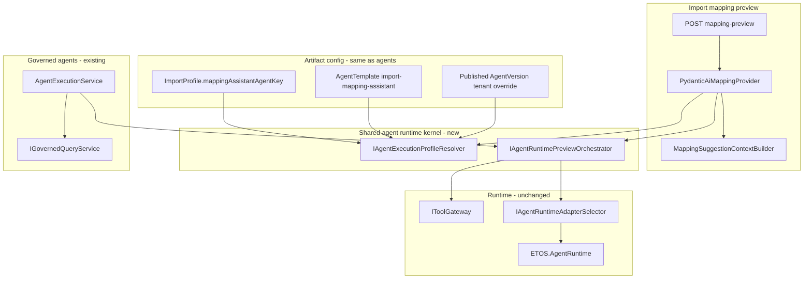

# Unified Mapping Agent Framework

## Problem

Today mapping and governed agents **share the sidecar** (`IAgentRuntimeAdapter` → `ETOS.AgentRuntime`) but **not the configuration or orchestration framework**:

| Concern | Governed agents ([`AgentExecutionService.cs`](ETOS.Backend/AgentRuntime/AgentExecutionService.cs)) | Mapping ([`PydanticAiMappingProvider.cs`](ETOS.Backend/Imports/MappingSuggestions/PydanticAiMappingProvider.cs)) |
|---------|-----------------------------------|---------|
| Model routing | `AgentVersion` payload: `primaryModelProviderKey`, `primaryModelId`, `fallbackModels` | [`MappingSuggestionOptions`](ETOS.Backend/Imports/MappingSuggestions/MappingSuggestionProviderSelector.cs) in appsettings |
| Prompt / schema | Published prompt + output schema artifacts | Hardcoded `PromptTemplateBody` + [`MappingSuggestionOutputSchema.cs`](ETOS.Backend/Imports/MappingSuggestions/MappingSuggestionOutputSchema.cs) |
| Tools | Referenced tool versions → `IToolGateway` | Ad-hoc prefetch via `mapping-predictor-tool` + config flag |
| Runtime call | `AgentRuntimeExecutionRequest` per run | Duplicate inline build of same request |

PRD constraint to preserve ([`engineering-execution-prd.md`](.docs/.prd/engineering-execution-prd.md) § Mapping Assistant Model): import mapping is **not a governed agent** in MVP — **no `AgentRun` / workflow required** on the default path. Configuration and runtime adapter reuse are allowed; full agent lifecycle persistence is not.

## Target architecture

**Config resolution (per request, no restart):**

1. Read `mappingAssistantAgentKey` from [`ModelPackageImportProfile`](ETOS.Backend/Ontology/ModelPackageProfiles.cs) (new field); default `import-mapping-assistant`.
2. Resolve **published tenant `AgentVersion`** by `agentKey` (tenant override from `/agents`).
3. If missing, resolve **published `AgentTemplate`** by `templateKey` and materialize an ephemeral in-memory profile (or fail with actionable install message).
4. Build shared [`AgentExecutionProfile`](ETOS.Backend/AgentRuntime/AgentExecutionProfile.cs) (new record): adapter key, model provider/id, fallbacks, prompt/schema artifact ids, referenced tool version ids, `patternCategory`.

**Execution (mapping-specific context, shared kernel):**

- Mapping builds governed context via existing [`MappingSuggestionContextBuilder`](ETOS.Backend/Imports/MappingSuggestions/MappingSuggestionContextBuilder.cs) (ontology + CSV sample) — **does not** run full governed-query retrieval.
- Orchestrator runs referenced tools (includes `mapping-predictor-tool`), then calls `IAgentRuntimeAdapterSelector` — same path agents use after context assembly.
- Mapping maps structured JSON → column/lifecycle suggestions (existing validator/parser stays in Imports module).
- **No `AgentRun` persisted**; optional diagnostics continue via `includeDiagnostics`.

## Implementation status (completed)

### Phase 1 — Shared runtime kernel (backend refactor)

- Added `AgentExecutionProfile`, `AgentExecutionContextKind`, `IAgentExecutionProfileResolver`, `IAgentRuntimePreviewOrchestrator` under [`ETOS.Backend/AgentRuntime/`](ETOS.Backend/AgentRuntime/).
- Refactored [`AgentExecutionService.cs`](ETOS.Backend/AgentRuntime/AgentExecutionService.cs) to call the orchestrator after governed query.
- Refactored [`PydanticAiMappingProvider.cs`](ETOS.Backend/Imports/MappingSuggestions/PydanticAiMappingProvider.cs) to resolve agent profile + orchestrator (no appsettings model fields).
- Slimmed [`MappingSuggestionOptions`](ETOS.Backend/Imports/MappingSuggestions/MappingSuggestionProviderSelector.cs) to `Enabled`, `DefaultProviderKey`, `MappingAssistantAgentKey`, `FallbackToRuleBasedOnRuntimeFailure`.

### Phase 2 — Package + artifact seeds

- Added `import-mapping-assistant` template, `import-mapping-assistance` capability, and `mappingAssistantAgentKey` in reference package.
- Added [`ImportMappingArtifactSeeder`](ETOS.Backend/Imports/ImportMappingArtifactSeeder.cs) for mapping prompt/schema platform artifacts.
- [`ManufacturingReferencePackageInstaller`](ETOS.Backend/Packages/ManufacturingReferencePackageInstaller.cs) seeds mapping artifacts, template, and published tenant `AgentVersion` when absent.
- Relaxed [`AgentTemplateDefinitionReadinessValidator`](ETOS.Backend/AgentTemplates/AgentTemplateDefinitionReadinessValidator.cs) query/retrieval requirements for `patternCategory == mapping-assistant`.

### Phase 3 — Per-request routing API + UI

- Extended [`ImportPreviewRequest`](ETOS.Backend/Imports/ImportContracts.cs) with `MappingAssistantAgentKey` / `MappingAssistantAgentVersionId`.
- Diagnostics include `ResolvedAgentKey`, `PrimaryModelProviderKey`, `PrimaryModelId`.
- Updated [`MappingAgentDebugPanel.tsx`](ETOS.Frontend/src/components/imports/MappingAgentDebugPanel.tsx) with agent selector and link to `/agents/{agentKey}/configure`.

### Phase 4 — Tests and docs

- Added `AgentExecutionProfileResolverTests`, `AgentRuntimePreviewOrchestratorTests`; updated `MappingSuggestionProviderTests`, `ManufacturingReferencePackageTests`.
- Updated [`docs/local-development.md`](docs/local-development.md), [`docs/backend/architecture.md`](docs/backend/architecture.md), [`ARCHITECTURE.md`](ARCHITECTURE.md), [`.env.example`](.env.example).

## Key design decisions

| Decision | Choice | Rationale |
|----------|--------|-----------|
| Config source | Template seeds + tenant AgentVersion override | Matches user choice; same `/agents` model UI |
| AgentRun | Not created for mapping preview | PRD MVP constraint |
| Context assembly | Import ontology builder, not governed query | Mapping input is CSV headers/rows + package ontology |
| `IMappingSuggestionProvider` | Keep as import façade | PRD provider plug-in contract; `pydantic-ai-v1` becomes thin wrapper over shared kernel |
| `rule-based-v1` | Unchanged | Deterministic provider stays independent |

## Migration / rollout

1. Ship kernel + resolver behind existing mapping preview (feature-complete before removing appsettings model fields). **Done.**
2. Run reference package reinstall so tenants get template + default mapping agent.
3. Remove deprecated `MappingSuggestionOptions` model fields; update Development appsettings. **Done.**
4. Existing mapping previews fall back to rule-based if mapping agent not installed (clear error in diagnostics).

## Out of scope (defer)

- Hermes mapping provider ([`DeferredMappingProviders.cs`](ETOS.Backend/Imports/MappingSuggestions/DeferredMappingProviders.cs))
- Persisting `AgentRun` / AI Trace links for mapping (optional future enhancement)
- Tenant-level provider credential artifacts (env-based credentials sufficient for local dev)
- Full `IAgentExecutionService.PreviewAsync` delegation for mapping (wrong context assembly; shared orchestrator is the correct seam)
