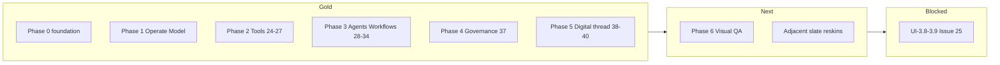

# Gap Analysis: UI Program (UI-0.x – UI-6.x) vs Current Frontend

**Scope:** `.docs/.prd/.ui/engineering-execution-ui-issues.md` — the full 40-screen mockup-driven UI program (Phases 0–6) against `ETOS.Frontend/` as implemented today. Backend issue status is covered separately in `.docs/.gapAnalysis/issues-1-18.5-22-23-gap-analysis.md`; this document only assesses UI/UX depth against the mockup pack.  
**Evidence base:** `(shell)/` route tree (**70** `page.tsx`), `src/components/ui/` (**17** primitives), `src/components/workflows/WorkflowCanvas.tsx`, `src/components/governance/GovernanceTrendCharts.tsx`, `src/components/digital-thread/`, `src/config/navigation.ts`, `src/lib/ui-fixtures/`, `globals.css` tokens, `/dev/ui-kit`, `package.json` (`@xyflow/react` + `recharts`), Phases 0–5 gold, `npm run typecheck` / `lint` / `build` (pass).  
**Generated:** 2026-07-16 (re-audit after Phase 5 Digital Thread — UI-5.1–5.3 / Issue 16.1b)

---

## Executive Summary

| UI Issue | Title | Status | Depth |
|----------|-------|--------|-------|
| UI-0.1 | Design tokens, theme provider, Tailwind mapping | **Implemented** | ~95% — tokens + `next-themes` + Inter live |
| UI-0.2 | Enterprise app shell (sidebar/topbar/breadcrumb) | **Implemented** | ~90% — full shell + `(shell)/` route group |
| UI-0.3 | Shared UI component library | **Implemented** | ~95% — 17 primitives incl. Tabs, Stepper, TraceTimeline, GovernancePanel, Notice, TanStack DataTable |
| UI-0.4 | Navigation IA and placeholder policy | **Implemented** | ~95% — nav config, `PlaceholderPage`, no dead links |
| UI-1.1 | Mission Control Timeline home (`/`) | **Gold** | ~98% — digital-thread APIs + Live/scrubber SSE (UI-5.3); AI insights still fixture |
| UI-1.2 | Model package & ontology detail | **Gold** | ~98% |
| UI-1.3 | Layer 3–6 definition libraries | **Gold** | ~98% |
| UI-1.4 | Import hub & wizard sub-routes | **Gold** | ~98% |
| UI-1.5 | Graph promotion & document explorer | **Gold** | ~95% |
| UI-1.6 | Graph explorer & 360° context | **Gold** | ~95% |
| UI-1.7 | Governed chat & AI trace detail | **Gold** | ~98% |
| UI-1.8 | Dashboard & report builder preview | **Gold** | ~95% |
| UI-1.9 | Recommendation inbox & detail | **Gold** | ~98% |
| UI-1.10 | Identity admin create forms (`/admin/identity`) | **Gold** | ~95% |
| UI-2.1 | Tool / skill / connector registry (`/tools`) | **Gold** | ~95% — mockup 24; Register disabled |
| UI-2.2 | Tool definition editor (`/tools/[id]/edit`) | **Gold** | ~92% — read-only schemas; Save draft disabled |
| UI-2.3 | Connector credential boundary | **Gold** | ~95% — mockup 26 |
| UI-2.4 | Tool run & dry-run trace | **Gold** | ~92% — mockup 27 + `/tool-runs` list |
| UI-3.1 | Agent registry + builder (`/agents`, `/agents/new`) | **Gold** | ~95% — mockup 28; template/prompt Tabs |
| UI-3.2 | Agent configure | **Gold** | ~93% — mockup 29; composition table + publish rail |
| UI-3.3 | Agent test-run | **Gold** | ~92% — mockup 30; preview/test/gated execute |
| UI-3.4 | Agent runs explorer | **Gold** | ~93% — mockup 31; list + KPI/`TraceTimeline` detail |
| UI-3.5 | Workflow canvas | **Gold** | ~90% — mockup 32; `@xyflow/react`; Add step disabled |
| UI-3.6 | Workflow publish review | **Gold** | ~92% — mockup 33; Request changes disabled |
| UI-3.7 | Workflow runs + safe-mode detail | **Gold** | ~93% — mockup 34; `/workflow-runs` list added |
| UI-3.8 | Agent teams builder | **Placeholder** | Issue 25 — `/agent-teams` |
| UI-3.9 | Agent team runs | **Placeholder** | Issue 25 — `/agent-team-runs/[runId]` |
| UI-4.1 | Governance & audit dashboard (`/governance`) | **Gold** | ~92% — shared KpiCard; Recharts trends; boundary widget; Export disabled |
| UI-5.1–5.3 | Digital thread timeline canvas | **Gold** | SVG pan-zoom + inspector + SSE Live; Issue 16.1b APIs shipped |
| UI-6.1–6.3 | Playwright visual regression, parity checklist, a11y | **Minimal** | ~15% — Issue 26 smoke only; no light+dark visual suite |

**Parity bar:** Import-hub gold = mockup HTML/PNG region layout + `--etos-*` tokens + shared `PageHeader` / `DataTable` / `SidePanel`/`PillStack` / Advanced/Debug demotion. Not mockup hex colors.

**Bottom line:** Phases **0–5 are gold** (foundation + Operate/Model + Tool registry + Agents/workflows + Governance + Digital thread canvas). Largest remaining UI gap is **Phase 6** visual QA and adjacent slate dumps (`/tasks`, `/decisions`, …). Teams stay Issue 25 placeholders.

**Program depth (rough):** ~88% of backlog issues at gold/implemented; ~4% functional shells (adjacent slate dumps); ~8% placeholder/blocked/QA.

---

## Phase 0 — Foundation

### UI-0.1: Design Tokens, Theme Provider, Tailwind Mapping — **~95%**

**Implemented**

- `--etos-*` in `globals.css`: `:root` light, `.dark`, ops-canvas family for Mission Control
- Tailwind 4 `@theme inline` + `@custom-variant dark`
- `next-themes` (`storageKey="etos-theme"`, system default) + `ThemeToggle`
- **Inter** via `next/font/google`

**Residual gaps**

| Item | Note |
|------|------|
| Inner `slate-*` on non-gold pages | Remaining slate dumps: `/tasks`, `/decisions`, `/context-packages`, `/admin/foundation` — not Phase 0–4 token failure |
| Topbar health / search | Honest disabled / Mission Control KPI only |

---

### UI-0.2: Enterprise App Shell — **~90%**

**Implemented:** `AppShell` / `Sidebar` / `Topbar` / `ThemeToggle`; all product routes under `(shell)/`; nav from `navigation.ts`; tenant pill + user initials from `getIdentityLists()`; skip link; navy sidebar both themes.

**Residual gaps:** No topbar backend-health dot; sidebar footer MVP progress static; mobile drawer focus-trap unverified (UI-6.3).

---

### UI-0.3: Shared UI Component Library — **~95%**

**Implemented (17 files under `src/components/ui/`):**

| Primitive | Used by |
|-----------|---------|
| `Badge` / `StatusBadge`, `Button`, `Card`, `PageHeader`, `KpiCard`, `EmptyState`, `ErrorState` | Gold surfaces |
| `DataTable` (card-row) + `TanStackDataTable` | Registry / inbox / tools / agents / workflows |
| `Tabs` | Identity admin, tool registry, agent builder |
| `Stepper` | Import wizard |
| `SidePanel` / `PillStack` / `Quote` | Chat, docs, model libs, tool/agent/workflow runs |
| `TraceTimeline` | AI traces, connectors, tool runs, agent runs, workflow runs |
| `GovernancePanel` | Chat / governance rails |
| `Notice` / `Callout` | Tools, connectors, imports, agents, workflows |
| `ListItem`, `Timeline` | Lists / mission control style |

Gallery: `/dev/ui-kit` (dev builds). Feature canvas: `components/workflows/WorkflowCanvas.tsx` (`@xyflow/react`). Feature charts: `components/governance/GovernanceTrendCharts.tsx` (`recharts`).

**Residual gaps**

| Item | Note |
|------|------|
| Dedicated `FlowLine` component | Not a standalone primitive; artifacts/explorers use inline flowline copy/layout |
| Full StatusBadge migration | Adjacent slate dumps (`/tasks`, `/decisions`, …) still use ad-hoc pills |
| react-hook-form / zod | Form libs still deferred; `recharts` + `@xyflow/react` landed |

---

### UI-0.4: Navigation IA and Placeholder Policy — **~95%**

**Implemented:** Single `navItems` source; `implemented` + `blockerIssue`; `PlaceholderPage` with mockup thumb + blocker badge.

**Honest placeholders (sidebar):** `/agent-teams` (Issue 25), `/admin/settings` (no settings API).  
**Off-nav placeholder:** `/agent-team-runs/[runId]` (Issue 25) — reachable by URL only until Issue 25.  
**Not placeholders:** `/admin/identity` is gold (UI-1.10); agents/workflows are gold (UI-3.1–3.7).

**Residual gaps:** Issue 25 interactive teams. Digital-thread canvas shipped (UI-5.x / 16.1b). Workflow Runs stays off sidebar (reach via `/workflows` links) — intentional.

---

## Phase 1 — Operate & Model Surfaces — **gold (UI-1.1–1.10)**

| Issue | Depth | Residual (honest) |
|-------|-------|-------------------|
| UI-1.1 Mission Control | ~98% | Timeline/stream/heatmap/alerts/systems KPIs + Live/scrubber SSE; AI insights fixture |
| UI-1.2 Model / ontology | ~98% | Impact CTA disabled (no endpoint) |
| UI-1.3 Layer 3–6 libs | ~98% | Detail pages thinner than list shells |
| UI-1.4 Import hub/wizard | ~98% | Some steps still lean on “latest batch” helpers |
| UI-1.5 Promote / documents | ~95% | Heat table query-param driven; doc version often v1 until detail |
| UI-1.6 Graph / 360 / artifacts | ~95% | 360 nodes are layout approximations, not force-graph |
| UI-1.7 Chat / AI Trace | ~98% | Intent key falls back to session default when turn omits it |
| UI-1.8 Dashboards / reports | ~95% | Spark decorative; some CTAs disabled |
| UI-1.9 Recommendations | ~98% | List evidence column still summarized |
| UI-1.10 Identity admin | ~95% | No dedicated membership/grant explorer table |

Phase 1 no longer the program bottleneck.

---

## Phase 2 — Tool Registry UX — **~93% gold (UI-2.1–2.4)**

**Re-audit evidence (2026-07-16):**

| Route | Mockup | Status |
|-------|--------|--------|
| `/tools` | 24 | Gold — KPI ×4, unified Kind `DataTable`, `?kind=` Tabs, Register disabled, compatibility-scan action, Advanced dumps + tool-run links |
| `/tools/[artifactId]/edit` | 25 | Gold — Definition + schema wells; Mark ready / Publish / Validate / Dry-run via `tools/actions.ts`; Save draft disabled; `/tools/[id]` → redirect `/edit` |
| `/connectors/[artifactId]` | 26 | Gold — capability table + credential `TraceTimeline` + secret `Notice` |
| `/tool-runs` | (list) | Thin gold list for discoverability |
| `/tool-runs/[runId]` | 27 | Gold — KPI strip, `TraceTimeline`, expected/actual panels, gated Execute `PillStack` rail, AI Trace link |

**API wrappers (Issue 22 endpoints only):** `markToolDefinitionReady`, `publishToolDefinition`, `compatibilityScanToolDefinition`, `dryRunToolDefinition`, `executeToolDefinition`.

### Per-issue residual gaps

| Issue | Gap vs backlog / mockup |
|-------|-------------------------|
| UI-2.1 | No dedicated **dry-run indicator column** on registry table (dry-run lives on editor + Advanced run list). Skills are name-only (no skill detail route). Register tool disabled by design. |
| UI-2.2 | Schemas **read-only** (no interactive JSON schema authoring). Save draft / create wizard deferred. |
| UI-2.3 | Capability rows derived from `supportedOperations` + write heuristics — not a separate capability catalog API. |
| UI-2.4 | Mockup “classification filter summary” approximated via compatibility notes status (`Filtered`); audit id in Advanced, not primary viewport. Execute gated on connector write/disabled flags. Linked-tool resolve walks versions (N+1 list) — fine for MVP. |

**Honesty check:** No fake write-connector enablement; Register/Save draft never claim success.

---

## Phase 3 — Agentic Platform UX — **~92% gold (UI-3.1–3.7) / placeholders (UI-3.8–3.9)**

**Re-audit evidence (2026-07-16):**

| Route | Mockup | Status |
|-------|--------|--------|
| `/agents` | hub | Gold — KPI ×4 (total/published/draft/blocked), card-row `DataTable`, Advanced dumps |
| `/agents/new` | 28 | Gold — template \| prompt `Tabs`, composition form + Draft governance `SidePanel` |
| `/agents/[agentKey]/configure` | 29 | Gold — composition `DataTable`, restyled `AgentModelConfigPanel`/`Form`, publish rail + risk pills |
| `/agents/[agentKey]/test-run` | 30 | Gold — Preview / Test-run / gated Execute; output + `TraceTimeline`; ToolRun / AI Trace links |
| `/agent-runs` | 31 | Gold — runs explorer `DataTable` (Run/Agent/Invoked/Status/Mode/Confidence/Trace) + KPIs |
| `/agent-runs/[runId]` | 31 detail | Gold — KPI strip, `TraceTimeline`, PillStack links, Advanced JSON |
| `/workflows` | hub | Gold — KPI + registry `DataTable`; link to `/workflow-runs` |
| `/workflows/new` | create | Gold — metadata create (`steps: []`) → edit canvas |
| `/workflows/[workflowKey]/edit` | 32 | Gold — `WorkflowCanvas` (`@xyflow/react`); Validate=preview; Save draft=create-version; Add step disabled |
| `/workflows/[workflowKey]/publish` | 33 | Gold — publish checks table, mark-ready/publish, Request changes disabled, execute when published |
| `/workflow-runs` | (list) | Gold thin list (tool-runs pattern) |
| `/workflow-runs/[runId]` | 34 | Gold — safe-mode KPIs (source writes = 0 SAFE), `TraceTimeline`, child run rail |
| `/agent-teams` | 35 | PlaceholderPage (Issue 25) |
| `/agent-team-runs/[runId]` | 36 | PlaceholderPage (Issue 25; thumb reuses mockup 35 asset) |

**API wrappers (Issue 23–24 endpoints only):**

- Agents: `postAgentFromTemplate` / `FromPrompt`, model-config / mark-ready / publish, `postAgentPreview` / `TestRun` / `Execute` via `agents/actions.ts`
- Workflows: `postWorkflowDefinition`, **`postWorkflowDefinitionVersion`** (new), mark-ready / publish, `postWorkflowPreview` / `TestRun` / `Execute` via `workflows/actions.ts`
- Runs: `getAgentRuns` / `getAgentRunDetail`, `getWorkflowRuns` / `getWorkflowRunDetail`

### Per-issue residual gaps

| Issue | Gap vs backlog / mockup |
|-------|-------------------------|
| UI-3.1 | Prompt create cannot deep-link agent key until detail fetch; composition fields thinner than mockup package/capability pickers (backend defaults) |
| UI-3.2 | Model routing still the only mutable composition surface; referenced tools/skills are read-only pills |
| UI-3.3 | Execute gated when unpublished or safe mode on — correct honesty; structured output panel depends on run detail reload |
| UI-3.4 | Confidence column is trace/preview heuristic, not a backend confidence score |
| UI-3.5 | **Add step disabled** (no typed step picker — prefer disable over inventing payloads). Linear layout for dependsOn edges; empty canvas Notice for `steps: []` |
| UI-3.6 | Request changes disabled (no backend). Risk “donut” approximated by KPIs + checks table |
| UI-3.7 | Step results JSON demoted to Advanced; timeline built from safe-mode events + status (not a full step-result parser) |
| UI-3.8–3.9 | Correct placeholders until Issue 25; mockup 36 PNG not copied to `public/mockups` (reuses 35) |

**Honesty check:** No fake publish/execute success; Add step / Request changes never claim success; teams never fake AgentTeamRun data.

**Next UI program slice for Build:** UI-6.x visual QA, or adjacent slate reskins (`/tasks`, `/decisions`, …).

---

## Phase 4 — Governance Dashboard (`/governance`) — **~92% gold**

**Implemented:** Gold `/governance` (mockup 37): shared `KpiCard`, Recharts `GovernanceTrendCharts` for TrendSupported keys (`open_reviews`, `blocked_decisions`, `decision_throughput`, `outcome_verification_rate`, `learning_signal_rate`), events `DataTable`, audit design + read-only boundary `SidePanel`/`PillStack`, connector write-disabled counts, disabled Export, Trace exports Notice → `/ai-traces`, Advanced/Debug JSON.

**Honesty:** Write actions always 0 SAFE (architecture); no invented export-count KPI; empty charts when no points; deferred `tenant_custom_kpi` labeled Deferred.

**Residual (~8%):** no live “trace exports” KPI field (honest Notice instead); Export CTA stays disabled until export API exists; adjacent slate dumps out of Phase 4 scope.

**Also still slate (not Phase 4 backlog):** `/tasks`, `/decisions`, `/context-packages`, `/admin/foundation`.

---

## Phase 5 — Digital Thread Timeline — **gold (UI-5.1–5.3 + Issue 16.1b)**

**Implemented:** Issue 16.1 + 16.1b projection APIs (`summary/systems/events/branches/lineage/events/{id}/minimap/events/stream`); Mission Control Live + scrubber; `/digital-thread/timeline` SVG ops canvas (pan-zoom, minimap, filters, inspector, SSE). Site/product-line filters disabled honestly.

**Still out of scope:** WebGL renderer, SignalR, site/product-line ontology dimensions.

---

## Phase 6 — E2E Verification & Visual QA — **~15%**

**Implemented:** Issue 26 Playwright smoke (demo-flow); typecheck/lint/build clean; manual smoke on gold routes (Phases 1–4).

**Gaps:** no automated light+dark visual snapshots (UI-6.1); no systematic mockup parity checklist runs (UI-6.2); no a11y pass (UI-6.3). Gold surface count grew with Phase 4 — UI-6.1 should lock Phases 1–4 when started.

---

## Cross-Cutting Gaps



| Theme | Present | Missing / deferred |
|-------|---------|--------------------|
| **Token / gold adoption** | Phases 0–4 (incl. `/governance`) use `--etos-*` + primitives | Remaining slate dumps: `tasks`, `decisions`, `context-packages`, `admin/foundation` |
| **Component library** | 17 primitives + `/dev/ui-kit` + `WorkflowCanvas` + `GovernanceTrendCharts` | Standalone `FlowLine`; form libs (rhf/zod) |
| **Stack** | `next-themes`, `lucide-react`, `@tanstack/react-table`, **`@xyflow/react`**, **`recharts`** | `@tanstack/react-query`, `react-hook-form`+`zod` |
| **Routes** | **70** `(shell)` pages; `/` + `/digital-thread/timeline` gold (16.1b); gold `/governance`; `/workflow-runs` list + `/agent-team-runs/[runId]` shipped | Interactive teams (Issue 25) |
| **Write honesty** | Disabled Register/Save draft/Add step/Request changes/Export audit; Write actions = 0 SAFE; placeholders labeled | Maintained |
| **Verification** | typecheck/lint/build + Issue 26 smoke | UI-6.x visual + a11y automation |

---

## Recommended Closure Order

1. ~~Phase 0–2~~ — **done (gold)**
2. ~~**UI-3.x agent/workflow mockup parity**~~ — **done (gold)**; `@xyflow/react` + create-version save landed
3. ~~**UI-4.1 governance charts**~~ — **done (gold)**; `recharts` + shared `KpiCard` + boundary widget
4. **UI-6.1 Playwright light+dark snapshots** — lock gold surfaces (Phases 1–4)
5. **Issue 25** — interactive teams only after Issue 25 (digital-thread canvas already on 16.1b)

Optional polish (not blockers): registry dry-run column (UI-2.1), skill detail route, typed workflow step picker (UI-3.5), FlowLine primitive, mockup-36 public asset, foundation dump demotion, adjacent slate reskins (`/tasks`, `/decisions`).

---

## Verification Snapshot

```text
npm run typecheck → pass
npm run lint      → pass (pre-existing warnings unrelated to Phase 4)
npm run build     → pass
Shell pages       → 70 page.tsx under (shell)/
UI primitives     → 17 files in src/components/ui/
Workflow canvas   → components/workflows/WorkflowCanvas.tsx (@xyflow/react)
Governance charts → components/governance/GovernanceTrendCharts.tsx (recharts)
Slate dump pages  → tasks / decisions / foundation / context-packages
Placeholders      → 2 sidebar + 1 off-nav team-run (/agent-teams, /admin/settings, /agent-team-runs/[runId])
```

| Area | Count / notes |
|------|----------------|
| Routes under `(shell)/` | **70** `page.tsx` |
| Shell components | `AppShell`, `Sidebar`, `Topbar`, `ThemeToggle`, `ThemeProvider` |
| UI primitives | **17** files |
| Placeholder routes | **3** sidebar + `/agent-team-runs/[runId]` off-nav |
| Nav config | `navigation.ts` — Agents / Agent Runs / Workflows / Governance implemented; Teams/Digital Thread blocked |
| Preview fixtures | `ui-fixtures/mission-control.ts` (`data-ui-preview="true"`) |
| Phase 2 plan | `.cursor/plans/phase_2_tools_ui_7f66a719.plan.md` — completed |
| Phase 3 plan | `.cursor/plans/phase_3_agents_ui_9c758737.plan.md` — completed |
| Phase 4 plan | `.cursor/plans/phase_4_governance_ui_7f88f6cb.plan.md` — completed |

---

## Source References

- UI backlog: `.docs/.prd/.ui/engineering-execution-ui-issues.md`
- Screen/API map: `.docs/.prd/.ui/ui-screen-api-map.md`
- Delivery checklist: `.docs/.prd/.ui/ui-delivery-checklist.md`
- Implementation guide: `.docs/.prd/.ui/ui-agent-implementation-guide.md`
- Backend gap analysis: `.docs/.gapAnalysis/issues-1-18.5-22-23-gap-analysis.md`
- Frontend conventions: `ETOS.Frontend/AGENTS.md`
- Plans: `.cursor/plans/phase_4_governance_ui_7f88f6cb.plan.md`, `.cursor/plans/phase_3_agents_ui_9c758737.plan.md`, `.cursor/plans/phase_2_tools_ui_7f66a719.plan.md`
- Mockup pack: `References/etos_ui_mockup_pack_with_digital_thread_timeline/etos_ui_mockups/`
