# Gap Analysis: Issues 1–13 vs Current Codebase

**Scope:** `.docs/.prd/engineering-execution-issues.md` issues 1–13 only.  
**Evidence base:** backend modules, EF migrations, `ETOS.Backend.Tests` (68 tests, all passing), frontend pages, `ARCHITECTURE.md`.  
**Generated:** 2026-06-13

---

## Executive Summary

| Issue | Title | Status | Backend | Frontend | Tests |
|-------|-------|--------|---------|----------|-------|
| 1 | Platform Foundation | **Mostly complete** | Strong | Shell + health | Yes |
| 2 | Tenant Identity & Access | **Mostly complete** | Strong | Partial | Partial |
| 3 | Audit & Security Events | **Mostly complete** | Strong | Read-only explorer | Yes |
| 4 | Artifact Registry | **Mostly complete** | Strong | Minimal explorer | Yes |
| 5 | Classification & Policy | **Mostly complete** | Strong | Read-only | Yes |
| 6 | Graph Memory / Neo4j | **Mostly complete** | Strong | None | Yes (Testcontainers) |
| 7 | Canonical Ontology | **Substantial, schema-only** | Strong | Model artifacts page | Yes |
| 8 | Import & Staging Graph | **Mostly complete** | Strong | Imports page | Yes |
| 9 | Identity Resolution | **Mostly complete** | Strong | Via imports page | Yes |
| 10 | Data Quality | **Mostly complete** | Strong | Via imports page | Yes |
| 11 | Trusted Promotion / Snapshots | **Mostly complete** | Strong | Via imports demo | Yes |
| 12 | Document Memory | **Mostly complete** | Strong (hooks disabled) | Documents page | Yes |
| 13 | Governed Query Intents | **Backend complete, UI thin** | Strong | API only, no page | Yes |

**Bottom line:** Issues 1–6 foundation solid. 7–12 vertical data path largely wired backend-to-graph. Issue 13 backend landed; no dedicated UI yet. Biggest cross-cutting gaps: real auth/OIDC, object-instance modeling (vs schema), MinIO/Qdrant live integrations, governed-query UI, on-demand BOM query.

---

## Issue-by-Issue

### Issue 1: Bootstrap Local Platform Foundation — **~90%**

**Implemented**

- Modular monolith: `ETOS.Backend/`, DI via `EnterpriseThreadPlatform.cs`, explicit endpoint mapping in `Program.cs`
- EF Core + PostgreSQL migrations from `InitialOperationalStore`
- Frontend shell calls `/health/app`, shows environment (`ETOS.Frontend/src/app/page.tsx`)
- Docker Compose: Postgres, Neo4j, Qdrant, MinIO, Redis, RabbitMQ; Memgraph optional profile (`infra/local/docker-compose.yml`)
- Infrastructure health probes all six services (`InfrastructureHealthService.cs`)
- Extension-point catalog for K8s, SQL Server, Keycloak, Temporal, CI/CD (`StaticExtensionPointCatalog.cs`)
- Tests: health, config binding, tenant persistence

**Gaps**

| Acceptance criterion | Gap |
|---------------------|-----|
| OpenTelemetry / Serilog | Not wired; default ASP.NET logging only |
| Scalar / NSwag API docs | OpenAPI mapped in dev; no Scalar/NSwag UI |
| Testcontainers for full infra | Only `Testcontainers.Neo4j` in graph tests |
| CI/CD extension | Documented placeholder only |

---

### Issue 2: Tenant Identity and Access Baseline — **~75%**

**Implemented**

- Admin APIs: tenants, users, roles, permissions, memberships, grants, access-request placeholders (`IdentityEndpointExtensions.cs`)
- Finbuckle multi-tenant + header-based dev auth (`LocalHeaderAuthenticationHandler`)
- Tenant context required; cross-tenant denied + audit (`IdentityAccessTests`)
- Grant metadata: permanent needs justification; temporary needs future expiry
- Runtime expiry checks on memberships/grants (`TenantContext.cs`)
- Home UI lists tenants, users, roles, memberships, grants

**Gaps**

| Acceptance criterion | Gap |
|---------------------|-----|
| Login / token flow | Dev headers only; no OIDC/JWT (Keycloak deferred — OK per PRD) |
| Access requests in admin UI | API exists; home page does not list them |
| Expired grant denial tests | Runtime logic present; no explicit test for expired grant at access time |
| OpenIddict / ASP.NET Identity login UX | Identity store exists; no login endpoints or session UI |

---

### Issue 3: Audit, Security Events, and Runtime Retention — **~85%**

**Implemented**

- `AuditRecorder`, immutable tenant-scoped audit records
- Security events for cross-tenant, sensitive access, etc. (`AccessDenialRecorder`, `TenantContext`)
- Retention category placeholders on audit records
- Admin UI: audit + security event lists on home page
- Tests: `GovernanceAuditTests.cs`

**Gaps**

| Acceptance criterion | Gap |
|---------------------|-----|
| Export denials, override usage, suspicious policy violations | Partial event-type coverage |
| Async audit/event fan-out (MassTransit) | Deferred — acceptable for MVP slice |
| Dedicated audit explorer page | Embedded in home only; no filtered/search UI |

---

### Issue 4: Base Artifact Registry and Dependency Graph — **~85%**

**Implemented**

- `BaseArtifact`, immutable versions, relationships, dependencies
- Readiness states + publish with dependency/policy checks (`ArtifactRegistryTests`, `ClassificationPolicyTests`)
- Generic artifact relationships (no per-type tables)
- Home UI: artifacts, versions, relationships, dependencies (first-artifact scoped)
- Tests: immutability, publish blocking, tenant isolation

**Gaps**

| Acceptance criterion | Gap |
|---------------------|-----|
| Full readiness state machine in UI | All states in model; UI shows status badges only |
| Rich artifact explorer | List-first artifact only; no navigation between artifacts |
| Publish checks ownership | Partial vs full ownership enforcement |

---

### Issue 5: Classification and Policy Enforcement — **~80%**

**Implemented**

- Versioned classification schemes + policy versions
- Restricted context rules; ABAC-style `EvaluateAsync` with allowed / denied / sensitive-denied split
- Publish compatibility blocking artifacts (`ClassificationPolicyTests`)
- Policy impact analysis endpoint + home UI card
- Tests: pre-context filtering, versioning immutability, temporary grants in policy eval

**Gaps**

| Acceptance criterion | Gap |
|---------------------|-----|
| Policy changes auditable + impact-analyzed + linked to artifacts | Impact endpoint exists; full audit linkage for every policy change not proven |
| Classification/policy management UI | Read-only lists; no create/publish forms in frontend |
| Temporary access policy checks end-to-end | Backend yes; limited frontend workflow |

---

### Issue 6: Graph Memory Abstraction and Neo4j Backend — **~85%**

**Implemented**

- `IGraphMemoryService`, Neo4j implementation, bootstrap constraints/indexes
- Tenant-scoped nodes/relationships, trust state, staging vs trusted spaces
- Graph health checks; Testcontainers Neo4j integration tests
- Public APIs: snapshots/diffs only — no raw Cypher (`GraphMemoryEndpointExtensions.cs`)
- Memgraph: disabled placeholder (`MemgraphGraphMemoryService` throws)

**Gaps**

| Acceptance criterion | Gap |
|---------------------|-----|
| Graph snapshots/diffs in product UI | API only; no graph explorer page |
| Full traversal constraint tests | Core tests present; not exhaustive |
| Memgraph adapter | Placeholder only (intentional) |

---

### Issue 7: Canonical Ontology and Tenant Attribute Schemas — **~70%**

**Implemented** (issues doc marks this implemented)

- Ontology, semantic layer, model package, lifecycle vocabulary, attribute schema versions
- Publish immutability, active model package, BOM relationship metadata in schemas
- Attribute validation: type, visibility, permissions, searchability, AI metadata
- UI: `model-artifacts/page.tsx`
- Tests: publish gates, BOM metadata validation, immutability (`OntologyTests.cs`)

**Gaps**

| Acceptance criterion | Gap |
|---------------------|-----|
| **Object versions** with lifecycle, attributes, BOM lines, approvals | No `ObjectVersion` domain entity; instances live in graph/import flow, not ontology module |
| Object/version modeling as first-class persisted records | Schema versioning yes; instance versioning deferred |
| Full BOM line modeling | BOM metadata in attribute schema; not per-object BOM instances in ontology |
| Extension permissions for tenant-specific schemas | Partial |

---

### Issue 8: Import Mapping and Staging Graph Flow — **~80%**

**Implemented**

- Import batches, CSV + Excel (`ExcelDataReader` in `ImportFileParser.cs`)
- Raw file evidence metadata linked to batches
- Mapping versions: preview → approve → immutable
- Validation, staging graph (unverified), audit trail
- UI: `imports/page.tsx` with demo flows
- Tests: 11 import tests including staging, validation, tenant isolation

**Gaps**

| Acceptance criterion | Gap |
|---------------------|-----|
| **AI-assisted mapping suggestions** | `deterministic-heuristic-v1` only — preview-only, not LLM |
| Raw files in MinIO | `LocalImportFileStorage` — local disk, not MinIO SDK |
| CAD/PDM-specific semantics | Generic CSV/Excel; no CAD-specific parsers |

---

### Issue 9: Identity Resolution Review and Trust Scoring — **~90%**

**Implemented**

- Identity rules → candidates; approve/reject/conflict flows
- Graph relationships (non-destructive links), trust states, trust score recalculation
- Learning evidence on approve/reject (`IdentityLearningEvidence`)
- Excluded from trusted recommendations when conflicted/provisional
- Tests: candidate gen, approval, rejection, conflict, trust, learning evidence

**Gaps**

| Acceptance criterion | Gap |
|---------------------|-----|
| Dedicated identity review UI | Wired through imports page demo actions, not standalone explorer |
| Trust recalculation on mapping changes | Recalc on identity decisions + DQ; mapping-change trigger less explicit |

---

### Issue 10: Data Quality Issues and Review Hooks — **~85%**

**Implemented** (issues doc marks this implemented)

- Rule-based import validation → DQ issues with source links
- Manual issue creation API; security events → review-ready issues
- Severity → trust impact on identity candidates (`DataQualityTests`)
- Monitoring agent placeholders (`ListMonitoringPlaceholdersAsync`)
- UI hooks on imports page

**Gaps**

| Acceptance criterion | Gap |
|---------------------|-----|
| Manual creation from **chat, dashboards, explorers** | API + imports/security-event paths only; no chat/dashboard UI |
| Standalone data-quality explorer page | None |
| Assignment hooks | Metadata/review-task-ready flags; no task assignment (Issue 19) |

---

### Issue 11: Trusted Graph Promotion, Snapshots, Diffs, BOM Comparison — **~80%**

**Implemented**

- Staging → trusted promotion with audit (`ImportService.PromoteBatchAsync`)
- Rejected staging summaries retained
- `DeferredGraphSnapshotService` / `DeferredGraphDiffService` — snapshots + diffs persisted
- CAD BOM vs EBOM comparison during import (`CreateBomComparisonAsync`)
- Tests: promotion, rejection, snapshots, diffs, BOM (`ImportTests.cs`)

**Gaps**

| Acceptance criterion | Gap |
|---------------------|-----|
| Snapshots capture **document** state | Payload: nodes, relationships, identity links, DQ issues — **no document artifacts** |
| **On-demand** CAD/EBOM comparison query | Batch-scoped only; no trusted-graph BOM compare endpoint |
| Promotion/snapshot UI | Demo actions on imports page; no snapshot/diff viewer |
| Service naming "Deferred" | Implemented but class names suggest interim architecture |

---

### Issue 12: Document Memory and Object Linking — **~75%**

**Implemented** (issues doc marks this implemented)

- `DocumentArtifact`, `DocumentVersion`, object links with confidence/evidence
- Extraction failures → DQ issues
- Qdrant + CAD contracts as disabled placeholders (`DisabledDocumentVectorIndexingService`, `DisabledCadParsingPlaceholder`)
- Policy-filtered document listing
- UI: `documents/page.tsx`
- Tests: `DocumentMemoryTests.cs` (6 tests)

**Gaps**

| Acceptance criterion | Gap |
|---------------------|-----|
| **Live Qdrant vector indexing** | Contract + disabled impl; vectors not actually indexed |
| Policy-filtered retrieval before governed query | Governed query pulls documents from SQL; vector fallback not live |
| Native CAD parsing | Disabled placeholder (intentional per PRD) |
| MinIO document storage | Local file storage pattern (same as imports) |

---

### Issue 13: Governed Query Intents and Context Assembly — **~85%**

**Implemented** (in working tree, migration `Slice13GovernedQueryContextAssembly`)

- Fixed platform intents (`object-360-context`, `document-evidence-context`)
- `GovernedQueryService`: graph-first, document-second, trust + policy filtering
- `RetrievalRun`, `ContextPackage`, `ContextAccessDecision` persisted
- Denied / sensitive-denied / LLM-visible context separated
- Tenant-defined intents: placeholder records only
- Tests: 5 tests in `GovernedQueryTests.cs` — GraphRAG order, trust, policy, document intent

**Gaps**

| Acceptance criterion | Gap |
|---------------------|-----|
| **Governed query UI** | `etos-api.ts` has helpers; **no `/governed-query` page**; home has no link |
| Semantic/vector fallback in retrieval strategy | Graph + SQL documents; Qdrant fallback not active |
| Neo4j Agent Memory | Correctly absent / deferred |
| End-user "run query intent" workflow | API-only today |

---

## Cross-Cutting Gaps (Issues 1–13)

```mermaid
flowchart LR
  subgraph done [Largely Done]
    I1[Platform]
    I2[Identity APIs]
    I3[Audit]
    I4[Artifacts]
    I5[Policy]
    I6[Neo4j Graph]
  end
  subgraph partial [Partial / Thin UI]
    I7[Ontology schemas]
    I8[Import staging]
    I9[Identity resolution]
    I10[Data quality]
    I11[Promotion snapshots]
    I12[Documents]
    I13[Governed query API]
  end
  subgraph missing [Not Live Yet]
    Auth[Real OIDC login]
    MinIO[MinIO object storage]
    Qdrant[Qdrant indexing]
    ObjVer[ObjectVersion model]
    GQ_UI[Governed query UI]
  end
  done --> partial
  partial --> missing
```



| Theme | Present | Missing / deferred |
|-------|---------|-------------------|
| **Auth** | Header-based dev identity | Login, tokens, OIDC |
| **Object storage** | Local disk + evidence metadata | MinIO SDK for imports/documents |
| **Vector retrieval** | Health probe + disabled contracts | Live Qdrant indexing in retrieval |
| **AI mapping** | Heuristic suggestions | LLM-assisted preview |
| **Domain modeling** | Schema + graph instances | First-class `ObjectVersion` / BOM instances |
| **Frontend coverage** | Home, model-artifacts, imports, documents | Governed query, graph explorer, identity/DQ explorers, write forms |
| **Observability** | Basic health | Serilog, OpenTelemetry |
| **BOM compare** | Per import batch | On-demand across trusted graph |

---

## Recommended Closure Order (within 1–13)

1. **Issue 13 UI** — governed query page; wire `runGovernedQueryForGraphNode` / context package display
2. **Issue 2 auth UX** — at minimum document dev-auth; plan OIDC boundary
3. **Issue 12 + 8 storage** — swap `Local*FileStorage` for MinIO behind existing interfaces
4. **Issue 12 Qdrant** — enable `IDocumentVectorIndexingService`; hook into Issue 13 retrieval fallback
5. **Issue 7 object instances** — decide: graph-only vs `ObjectVersion` table; closes ontology AC gap
6. **Issue 11** — add document state to snapshots; standalone BOM compare endpoint
7. **Issue 1 observability** — Serilog + OpenTelemetry baseline

---

## Verification Snapshot

```text
dotnet test EnterpriseThreadOS.sln → 68 passed, 0 failed
```

Backend endpoint modules registered for all slices 1–13. Frontend pages: 4 (`/`, `/model-artifacts`, `/imports`, `/documents`). Issue 13 backend present; frontend is main visible gap for that slice.

---

## Source References

- Product backlog: `.docs/.prd/engineering-execution-issues.md`
- Backend registration: `ETOS.Backend/Platform/EnterpriseThreadPlatform.cs`, `ETOS.Backend/Program.cs`
- Test suite: `ETOS.Backend.Tests/`
- Frontend shell: `ETOS.Frontend/src/app/`
