# Gap Analysis: Issues 1–18 vs Current Codebase

**Scope:** `.docs/.prd/engineering-execution-issues.md` issues 1–18 only.  
**Evidence base:** backend modules, EF migrations, `ETOS.Backend.Tests` (118 tests, all passing), frontend pages, `ARCHITECTURE.md`, `docs/backend/architecture.md`.  
**Generated:** 2026-06-13 (updated through Issue 18)

---

## Executive Summary

| Issue | Title | Status | Backend | Frontend | Tests |
|-------|-------|--------|---------|----------|-------|
| 1 | Platform Foundation | **Mostly complete** | Strong | Shell + health | Yes |
| 2 | Tenant Identity & Access | **Mostly complete** | Strong | Partial | Partial |
| 3 | Audit & Security Events | **Mostly complete** | Strong | Read-only explorer | Yes |
| 4 | Artifact Registry | **Mostly complete** | Strong | Explorer + 360° | Yes |
| 5 | Classification & Policy | **Mostly complete** | Strong | Read-only | Yes |
| 6 | Graph Memory / Neo4j | **Mostly complete** | Strong | Graph explorer | Yes (Testcontainers) |
| 7 | Canonical Ontology | **Substantial, schema-only** | Strong | Model artifacts page | Yes |
| 8 | Import & Staging Graph | **Mostly complete** | Strong | Imports page | Yes |
| 9 | Identity Resolution | **Mostly complete** | Strong | Via imports page | Yes |
| 10 | Data Quality | **Mostly complete** | Strong | Via imports + recommendations | Yes |
| 11 | Trusted Promotion / Snapshots | **Mostly complete** | Strong | Via imports demo | Yes |
| 12 | Document Memory | **Mostly complete** | Strong (hooks disabled) | Documents + 360° | Yes |
| 13 | Governed Query Intents | **Mostly complete** | Strong | Context packages + traces | Yes |
| 14 | AI Trace & Export | **Mostly complete** | Strong | `/ai-traces` | Yes |
| 15 | Governed Chat | **Mostly complete** | Strong | `/chat` | Yes |
| 16 | Explorers & 360° Views | **Mostly complete** | Strong | `/explorers` hub + routes | Yes |
| 17 | Dashboard & Reports | **Mostly complete** | Strong | `/dashboards` + `/reports` | Yes |
| 18 | Recommendations | **Mostly complete** | Strong | `/recommendations` | Yes |

**Bottom line:** Issues 1–6 foundation solid. 7–12 vertical data path wired backend-to-graph. Issues 13–18 AI/governance UX path landed backend + minimal but real UI shells. Biggest remaining cross-cutting gaps: real auth/OIDC, MinIO/Qdrant live integrations, first-class `ObjectVersion` modeling, review-task/decision workflows (Issues 19–20), live governance KPI analytics (Issue 21), agents/tools/workflows (Issues 22–25). Issue 18 closes the Milestone 3 recommendation slice; Milestone 4 starts at Issue 19.

---

## Issue-by-Issue

### Issue 1: Bootstrap Local Platform Foundation — **~90%**

**Implemented**

- Modular monolith: `ETOS.Backend/`, DI via `EnterpriseThreadPlatform.cs`, explicit endpoint mapping in `Program.cs`
- EF Core + PostgreSQL migrations from `InitialOperationalStore` through Slice 17
- Frontend shell calls `/health/app`, shows environment (`ETOS.Frontend/src/app/page.tsx`)
- Docker Compose: Postgres, Neo4j, Qdrant, MinIO, Redis, RabbitMQ; Memgraph optional profile (`infra/local/docker-compose.yml`)
- Infrastructure health probes all six services (`InfrastructureHealthService.cs`)
- Extension-point catalog for K8s, SQL Server, Keycloak, Temporal, CI/CD (`StaticExtensionPointCatalog.cs`)
- Tests: health, config binding, tenant persistence

**Gaps**

| Acceptance criterion | Gap |
|---------------------|-----|
| OpenTelemetry / Serilog | Not wired; default ASP.NET logging only |
| Scalar / NSwag API docs | OpenAPI mapped in dev; no Scalar/NSwag UI |
| Testcontainers for full infra | Only `Testcontainers.Neo4j` in graph tests |
| CI/CD extension | Documented placeholder only |

---

### Issue 2: Tenant Identity and Access Baseline — **~75%**

**Implemented**

- Admin APIs: tenants, users, roles, permissions, memberships, grants, access-request placeholders (`IdentityEndpointExtensions.cs`)
- Finbuckle multi-tenant + header-based dev auth (`LocalHeaderAuthenticationHandler`)
- Tenant context required; cross-tenant denied + audit (`IdentityAccessTests`)
- Grant metadata: permanent needs justification; temporary needs future expiry
- Runtime expiry checks on memberships/grants (`TenantContext.cs`)
- Home UI lists tenants, users, roles, memberships, grants

**Gaps**

| Acceptance criterion | Gap |
|---------------------|-----|
| Login / token flow | Dev headers only; no OIDC/JWT (Keycloak deferred — OK per PRD) |
| Access requests in admin UI | API exists; home page does not list them |
| Expired grant denial tests | Runtime logic present; no explicit test for expired grant at access time |
| OpenIddict / ASP.NET Identity login UX | Identity store exists; no login endpoints or session UI |

---

### Issue 3: Audit, Security Events, and Runtime Retention — **~85%**

**Implemented**

- `AuditRecorder`, immutable tenant-scoped audit records
- Security events for cross-tenant, sensitive access, export denials (AI trace, dashboard/report export), etc.
- Retention category placeholders on audit records
- Admin UI: audit + security event lists on home page
- Tests: `GovernanceAuditTests.cs`

**Gaps**

| Acceptance criterion | Gap |
|---------------------|-----|
| Export denials, override usage, suspicious policy violations | Partial event-type coverage; export-denial paths covered for Issue 14/17 |
| Async audit/event fan-out (MassTransit) | Deferred — acceptable for MVP slice |
| Dedicated audit explorer page | Embedded in home only; no filtered/search UI |

---

### Issue 4: Base Artifact Registry and Dependency Graph — **~90%**

**Implemented**

- `BaseArtifact`, immutable versions, relationships, dependencies
- Readiness states + publish with dependency/policy checks (`ArtifactRegistryTests`, `ClassificationPolicyTests`)
- Generic artifact relationships (no per-type tables)
- UI: `/artifacts` list + `/artifacts/[artifactId]` detail with 360° context sections; home page still lists first-artifact scoped data
- Tests: immutability, publish blocking, tenant isolation

**Gaps**

| Acceptance criterion | Gap |
|---------------------|-----|
| Full readiness state machine in UI | States in model; explorer shows status; limited transition actions in UI |
| Rich artifact explorer | List + 360° foundation; no cross-artifact search/filter beyond explorer APIs |
| Publish checks ownership | Partial vs full ownership enforcement |

---

### Issue 5: Classification and Policy Enforcement — **~80%**

**Implemented**

- Versioned classification schemes + policy versions
- Restricted context rules; ABAC-style `EvaluateAsync` with allowed / denied / sensitive-denied split
- Publish compatibility blocking artifacts (`ClassificationPolicyTests`)
- Policy impact analysis endpoint + home UI card
- Tests: pre-context filtering, versioning immutability, temporary grants in policy eval

**Gaps**

| Acceptance criterion | Gap |
|---------------------|-----|
| Policy changes auditable + impact-analyzed + linked to artifacts | Impact endpoint exists; full audit linkage for every policy change not proven |
| Classification/policy management UI | Read-only lists; no create/publish forms in frontend |
| Temporary access policy checks end-to-end | Backend yes; limited frontend workflow |

---

### Issue 6: Graph Memory Abstraction and Neo4j Backend — **~90%**

**Implemented**

- `IGraphMemoryService`, Neo4j implementation, bootstrap constraints/indexes
- Tenant-scoped nodes/relationships, trust state, staging vs trusted spaces
- Graph health checks; Testcontainers Neo4j integration tests
- Public APIs: snapshots/diffs only — no raw Cypher (`GraphMemoryEndpointExtensions.cs`)
- Memgraph: disabled placeholder (`MemgraphGraphMemoryService` throws)
- UI: `/graph` list + `/graph/[nodeId]` 360° context view (Issue 16)

**Gaps**

| Acceptance criterion | Gap |
|---------------------|-----|
| Graph visual explorer (nodes/edges diagram) | List + 360° text sections; no React Flow / graph canvas |
| Full traversal constraint tests | Core tests present; not exhaustive |
| Memgraph adapter | Placeholder only (intentional) |

---

### Issue 7: Canonical Ontology and Tenant Attribute Schemas — **~70%**

**Implemented** (issues doc marks this implemented)

- Ontology, semantic layer, model package, lifecycle vocabulary, attribute schema versions
- Publish immutability, active model package, BOM relationship metadata in schemas
- Attribute validation: type, visibility, permissions, searchability, AI metadata
- UI: `model-artifacts/page.tsx`
- Tests: publish gates, BOM metadata validation, immutability (`OntologyTests.cs`)

**Gaps**

| Acceptance criterion | Gap |
|---------------------|-----|
| **Object versions** with lifecycle, attributes, BOM lines, approvals | No `ObjectVersion` domain entity; instances live in graph/import flow, not ontology module |
| Object/version modeling as first-class persisted records | Schema versioning yes; instance versioning deferred |
| Full BOM line modeling | BOM metadata in attribute schema; not per-object BOM instances in ontology |
| Extension permissions for tenant-specific schemas | Partial |

---

### Issue 8: Import Mapping and Staging Graph Flow — **~80%**

**Implemented**

- Import batches, CSV + Excel (`ExcelDataReader` in `ImportFileParser.cs`)
- Raw file evidence metadata linked to batches
- Mapping versions: preview → approve → immutable
- Validation, staging graph (unverified), audit trail
- UI: `imports/page.tsx` with demo flows
- Tests: 11 import tests including staging, validation, tenant isolation

**Gaps**

| Acceptance criterion | Gap |
|---------------------|-----|
| **AI-assisted mapping suggestions** | `deterministic-heuristic-v1` only — preview-only, not LLM |
| Raw files in MinIO | `LocalImportFileStorage` — local disk, not MinIO SDK |
| CAD/PDM-specific semantics | Generic CSV/Excel; no CAD-specific parsers |

---

### Issue 9: Identity Resolution Review and Trust Scoring — **~90%**

**Implemented**

- Identity rules → candidates; approve/reject/conflict flows
- Graph relationships (non-destructive links), trust states, trust score recalculation
- Learning evidence on approve/reject (`IdentityLearningEvidence`)
- Excluded from trusted recommendations when conflicted/provisional
- Tests: candidate gen, approval, rejection, conflict, trust, learning evidence

**Gaps**

| Acceptance criterion | Gap |
|---------------------|-----|
| Dedicated identity review UI | Wired through imports page demo actions, not standalone explorer |
| Trust recalculation on mapping changes | Recalc on identity decisions + DQ; mapping-change trigger less explicit |

---

### Issue 10: Data Quality Issues and Review Hooks — **~85%**

**Implemented** (issues doc marks this implemented)

- Rule-based import validation → DQ issues with source links
- Manual issue creation API; security events → review-ready issues
- Severity → trust impact on identity candidates (`DataQualityTests`)
- Monitoring agent placeholders (`ListMonitoringPlaceholdersAsync`)
- Recommendation factory from DQ issues (`RecommendationFactory`, Issue 18)
- UI hooks on imports page

**Gaps**

| Acceptance criterion | Gap |
|---------------------|-----|
| Manual creation from **chat, dashboards, explorers** | Chat/dashboard/report → recommendation drafts (Issue 15/18); no standalone DQ create from those UIs |
| Standalone data-quality explorer page | None |
| Assignment hooks | Metadata/review-task-ready flags; no task assignment (Issue 19) |

---

### Issue 11: Trusted Graph Promotion, Snapshots, Diffs, BOM Comparison — **~80%**

**Implemented**

- Staging → trusted promotion with audit (`ImportService.PromoteBatchAsync`)
- Rejected staging summaries retained
- `DeferredGraphSnapshotService` / `DeferredGraphDiffService` — snapshots + diffs persisted
- CAD BOM vs EBOM comparison during import (`CreateBomComparisonAsync`)
- BOM comparison → recommendation factory hook when drift counts non-zero (Issue 18)
- Governed query intent `bom-impact-context` (Issue 13)
- Tests: promotion, rejection, snapshots, diffs, BOM (`ImportTests.cs`)

**Gaps**

| Acceptance criterion | Gap |
|---------------------|-----|
| Snapshots capture **document** state | Payload: nodes, relationships, identity links, DQ issues — **no document artifacts** |
| **On-demand** CAD/EBOM comparison query | Batch-scoped compare + `bom-impact-context` intent; no standalone trusted-graph BOM compare endpoint |
| Promotion/snapshot UI | Demo actions on imports page; no snapshot/diff viewer |
| Service naming "Deferred" | Implemented but class names suggest interim architecture |

---

### Issue 12: Document Memory and Object Linking — **~80%**

**Implemented** (issues doc marks this implemented)

- `DocumentArtifact`, `DocumentVersion`, object links with confidence/evidence
- Extraction failures → DQ issues
- Qdrant + CAD contracts as disabled placeholders (`DisabledDocumentVectorIndexingService`, `DisabledCadParsingPlaceholder`)
- Policy-filtered document listing
- UI: `/documents` + `/documents/[documentId]` 360° view
- Tests: `DocumentMemoryTests.cs` (6 tests)

**Gaps**

| Acceptance criterion | Gap |
|---------------------|-----|
| **Live Qdrant vector indexing** | Contract + disabled impl; vectors not actually indexed |
| Policy-filtered retrieval before governed query | Governed query pulls documents from SQL; vector fallback not live |
| Native CAD parsing | Disabled placeholder (intentional per PRD) |
| MinIO document storage | Local file storage pattern (same as imports) |

---

### Issue 13: Governed Query Intents and Context Assembly — **~90%**

**Implemented** (migration `Slice13GovernedQueryContextAssembly`)

- Fixed platform intents: `object-360-context`, `bom-impact-context`, `document-evidence-context`
- `GovernedQueryService`: graph-first, document-second, trust + policy filtering
- `RetrievalRun`, `ContextPackage`, `ContextAccessDecision` persisted
- Denied / sensitive-denied / LLM-visible context separated
- Tenant-defined intents: placeholder records only
- UI: `/context-packages` list + detail; `/ai-traces` can trigger `runGovernedQueryForGraphNode`; graph/artifact 360° views consume governed context
- Tests: 5 tests in `GovernedQueryTests.cs`

**Gaps**

| Acceptance criterion | Gap |
|---------------------|-----|
| Dedicated **run intent** form page | No `/governed-query` runner; trigger via ai-traces action or API only |
| Semantic/vector fallback in retrieval strategy | Graph + SQL documents; Qdrant fallback not active |
| Neo4j Agent Memory | Correctly absent / deferred |
| Tenant-defined query intent execution | Placeholder records only |

---

### Issue 14: AI Trace, Trace Explorer, and Trace Export — **~90%**

**Implemented** (migration `Slice14AiTraceTraceExport`)

- `AiTraceRecord` with retrieval strategy, sources, filtered/denied summaries, confidence impact
- Prompt/template and output schema labels on governed-chat traces; governed-query traces link retrieval runs
- Separate view (`ai_trace.read`) and export (`ai_trace.export`) permissions
- On-demand export packages with redaction metadata, export hash, audit records
- Export denial → security events (`AiTraceTests`)
- UI: `/ai-traces` list, detail panel, export action, governed-query seed action
- Tests: 6 tests in `AiTraceTests.cs`

**Gaps**

| Acceptance criterion | Gap |
|---------------------|-----|
| Rich trace explorer filtering | List + detail; limited search/filter UX |
| Trace visualization of retrieval graph | Tabular/summary presentation; no visual source graph |
| Home nav link | Present on home; not in explorers hub cards (ai-traces is in hub) |

---

### Issue 15: Governed Chat and Chat-to-Artifact Drafting — **~85%**

**Implemented** (migration `Slice15GovernedChatChatToArtifact`)

- Chat sessions + turns over governed retrieval context only (`GovernedChatService`)
- Responses include evidence, confidence, safe summaries, AI Trace link per turn
- Platform-seeded `PromptTemplateVersion` + `OutputSchemaVersion` pinned on traces
- Chat-to-artifact drafts: query intents, dashboards, reports, recommendations — draft versions blocked by existing publish gates
- Deterministic default LLM (`DeterministicLlmCompletionService`); optional OpenAI via `GovernedChat:LlmProvider`
- UI: `/chat` minimal shell
- Tests: 9 tests in `GovernedChatTests.cs`

**Gaps**

| Acceptance criterion | Gap |
|---------------------|-----|
| Publish governance UX for generated artifacts | Drafts created; publish/mark-ready flows live on owning artifact pages, not inline in chat |
| Tenant-defined query intent drafts execution | Draft records only; tenant intent execution still deferred |
| Streaming / multi-turn rich UX | Single-turn API; minimal UI |
| Live OpenAI in CI | Deterministic provider default for tests/local |

---

### Issue 16: Explorers and 360-Degree Context Views — **~85%**

**Implemented** (no separate EF migration — uses existing stores + explorer services)

- Explorer APIs: artifacts, graph nodes, documents, context packages, decision foundation (`Explorers/`)
- Generic 360° context views for artifact, graph node, document, context package, AI trace anchors
- Governance flow projection with Milestone 4 review-chain placeholders (`GovernanceFlowService`)
- Policy/trust-filtered graph browse
- UI: `/explorers` hub; routes for artifacts, graph, documents, context-packages, ai-traces, decisions; shared explorer panels
- Tests: 11 tests in `ExplorersTests.cs`

**Gaps**

| Acceptance criterion | Gap |
|---------------------|-----|
| **Decision Explorer** full workflow | `/decisions` lists foundation/placeholder records until Issue 20 |
| Governance Flow View in UI | API + context sections; no dedicated flow diagram page |
| Graph canvas visualization | Text/list 360° sections only |
| Review chain placeholders | Present in governance flow API; no live review tasks (Issue 19) |

---

### Issue 17: Dashboard and Report Generation — **~85%**

**Implemented** (migration `Slice17DashboardReportExport`)

- `DashboardVersion` / `ReportVersion` structured template parsing (`DashboardReportTemplateParser`)
- Preview **only** through governed query (`DashboardReportService.PreviewAsync`)
- Readiness transition + existing artifact publish gates
- JSON export with audit/redaction metadata (`DashboardReportExportBuilder`)
- Governance KPI **placeholder** catalog (`PlatformGovernanceKpiPlaceholders`) — not live analytics
- Chat-created drafts linked from Issue 15
- UI: `/dashboards`, `/dashboards/[artifactId]`, `/reports`, `/reports/[artifactId]`
- Tests: 11 tests in `DashboardReportTests.cs`

**Gaps**

| Acceptance criterion | Gap |
|---------------------|-----|
| Live governance KPI analytics / trends | Placeholder catalog only; Issue 21 |
| Rich chart/preview rendering | Block summaries + counts; no Tremor/Recharts visuals |
| PDF or multi-format exports | JSON export only |
| Dashboard/report create forms outside chat | Chat drafting primary path; no standalone builder UI |

---

### Issue 18: Recommendation Artifacts and Evidence Rules — **~90%**

**Implemented** (payload in artifact registry; no separate migration)

- `RecommendationVersion` via `PayloadJson` with embedded `evidenceLinks[]` and `suggestedActions[]`
- Evidence-required `MarkReviewed`; trust/conflict-aware `MarkReady` (`RecommendationReadinessValidator`)
- `RecommendationEvidenceResolver` for DQ issues, BOM runs, AI traces, graph nodes
- Creation: manual, from DQ issue, from BOM comparison, from chat draft, from dashboard/report provenance (`RecommendationFactory`)
- Idempotent factory keys for DQ and BOM sources; post-comparison hook in `ImportService`
- Suggested-action status transitions with audit; `CONVERTED_TO_REVIEW_TASK` status-only until Issue 19
- `RecommendationCreationSource.AgentDeferred` contract for Milestone 5; no agent auto-creation
- Governance-flow integration: real recommendation nodes in flow when anchored on recommendation
- UI: `/recommendations`, `/recommendations/[artifactId]` (`RecommendationDetailView`)
- Tests: 13 tests in `RecommendationTests.cs`

**Gaps**

| Acceptance criterion | Gap |
|---------------------|-----|
| Creation from **agents/workflows** | `AgentDeferred` enum only; Issues 22–24 |
| Convert suggested action → review task | Status transition only; Issue 19 |
| Rich recommendation workflow UI | List + detail + mark reviewed/ready; no assignment/escalation |
| Publish/accept lifecycle beyond reviewed/ready | `Accepted`/`Rejected` in model; limited UI exposure |

---

## Cross-Cutting Gaps (Issues 1–18)

```mermaid
flowchart LR
  subgraph done [Largely Done]
    I1[Platform]
    I2[Identity APIs]
    I3[Audit]
    I4[Artifacts]
    I5[Policy]
    I6[Neo4j Graph]
    I13[Governed Query]
    I14[AI Trace]
    I15[Chat]
    I16[Explorers]
    I17[Dashboards Reports]
    I18[Recommendations]
  end
  subgraph partial [Partial / Thin UI]
    I7[Ontology schemas]
    I8[Import staging]
    I9[Identity resolution]
    I10[Data quality]
    I11[Promotion snapshots]
    I12[Documents]
  end
  subgraph missing [Not Live Yet]
    Auth[Real OIDC login]
    MinIO[MinIO object storage]
    Qdrant[Qdrant indexing]
    ObjVer[ObjectVersion model]
    Tasks[Review tasks Issue 19]
    Agents[Agents workflows 22-25]
  end
  done --> partial
  partial --> missing
```



| Theme | Present | Missing / deferred |
|-------|---------|-------------------|
| **Auth** | Header-based dev identity | Login, tokens, OIDC |
| **Object storage** | Local disk + evidence metadata | MinIO SDK for imports/documents |
| **Vector retrieval** | Health probe + disabled contracts | Live Qdrant indexing in retrieval |
| **AI mapping** | Heuristic suggestions | LLM-assisted preview |
| **Domain modeling** | Schema + graph instances | First-class `ObjectVersion` / BOM instances |
| **Frontend coverage** | Home, explorers hub, artifacts, graph, documents, context-packages, ai-traces, chat, dashboards, reports, recommendations, decisions foundation, model-artifacts, imports | Write forms for policy/classification; DQ/identity explorers; graph canvas; governance KPI charts |
| **Observability** | Basic health | Serilog, OpenTelemetry |
| **BOM compare** | Per import batch + `bom-impact-context` intent | On-demand trusted-graph BOM compare endpoint |
| **Review workflow** | Recommendation readiness + placeholders | Review tasks, decisions, outcomes (Issues 19–20) |
| **Agent automation** | `AgentDeferred` contract | Agent/workflow recommendation creation (Issues 22–24) |

---

## Recommended Closure Order

### Within Issues 1–18 (residual)

1. **Issue 12 + 8 storage** — swap `Local*FileStorage` for MinIO behind existing interfaces
2. **Issue 12 Qdrant** — enable `IDocumentVectorIndexingService`; hook into Issue 13 retrieval fallback
3. **Issue 7 object instances** — decide: graph-only vs `ObjectVersion` table; closes ontology AC gap
4. **Issue 11** — document state in snapshots; standalone BOM compare endpoint
5. **Issue 2 auth UX** — document dev-auth; plan OIDC boundary
6. **Issue 1 observability** — Serilog + OpenTelemetry baseline
7. **Issue 13 UI** — optional dedicated governed-query runner page (functionality exists via ai-traces API)

### Next backlog slices (Issues 19+)

1. **Issue 19** — review tasks; unlocks `CONVERTED_TO_REVIEW_TASK` from Issue 18
2. **Issue 20** — decisions, votes, outcomes; replaces decision explorer placeholders
3. **Issue 21** — live governance KPI analytics; extends Issue 17 placeholder catalog
4. **Issues 22–25** — tools, agents, workflows; unlocks `AgentDeferred` recommendation source

---

## Verification Snapshot

```text
dotnet test EnterpriseThreadOS.sln → 118 passed, 0 failed
```

| Area | Count / notes |
|------|----------------|
| Test files | 18 files (incl. `AiTraceTests`, `GovernedChatTests`, `ExplorersTests`, `DashboardReportTests`, `RecommendationTests`) |
| EF migrations (slices 13–17) | `Slice13GovernedQueryContextAssembly`, `Slice14AiTraceTraceExport`, `Slice15GovernedChatChatToArtifact`, `Slice17DashboardReportExport` (Issue 16/18 use existing artifact tables) |
| Frontend routes | 21 `page.tsx` routes: `/`, `/explorers`, `/artifacts`, `/artifacts/[artifactId]`, `/graph`, `/graph/[nodeId]`, `/documents`, `/documents/[documentId]`, `/context-packages`, `/context-packages/[packageId]`, `/ai-traces`, `/chat`, `/dashboards`, `/dashboards/[artifactId]`, `/reports`, `/reports/[artifactId]`, `/recommendations`, `/recommendations/[artifactId]`, `/decisions`, `/model-artifacts`, `/imports` |
| Home nav links | explorers, artifacts, model-artifacts, imports, documents, ai-traces, chat, dashboards, reports, recommendations |

Backend endpoint modules registered for slices 1–18. Milestone 3 (Issues 13–18) is implemented at foundation depth; Milestone 4 starts with Issue 19.

---

## Source References

- Product backlog: `.docs/.prd/engineering-execution-issues.md`
- Architecture: `ARCHITECTURE.md`, `docs/backend/architecture.md`, `docs/frontend/architecture.md`
- Backend registration: `ETOS.Backend/Platform/EnterpriseThreadPlatform.cs`, `ETOS.Backend/Program.cs`
- Test suite: `ETOS.Backend.Tests/`
- Frontend shell: `ETOS.Frontend/src/app/`
- Implementation plans: `.cursor/plans/issue_14_ai_trace_b0b9d2cf.plan.md`, `.cursor/plans/issue_16_explorers_context_views.plan.md`, `.cursor/plans/issue_17_dashboard_reports_05df64dd.plan.md`, `.cursor/plans/issue_18_recommendations_f30d3826.plan.md`
