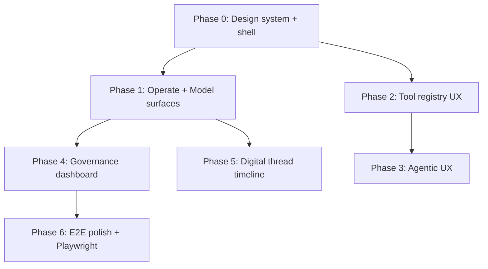

# EnterpriseThreadOS UI Implementation Issues

Source mockups: `References/etos_ui_mockup_pack_with_digital_thread_timeline/etos_ui_mockups/` (start at `index.html`)

Source product backlog: `.docs/.prd/engineering-execution-issues.md`

Source screen map: `References/.../etos_ui_mockups/SCREEN_MAP.md`

Digital thread spec: `References/.../etos_ui_mockups/docs/DIGITAL_THREAD_TIMELINE_SPEC.md`

**Agent docs (read before coding):** [README](./README.md) · [Implementation guide](./ui-agent-implementation-guide.md) · [Screen/API map](./ui-screen-api-map.md) · [Delivery checklist](./ui-delivery-checklist.md) · Cursor rule: `.cursor/rules/etos-frontend-ui-only.mdc`

**Backend freeze:** UI program changes `ETOS.Frontend/` only. Do not add backend endpoints or modify `ETOS.Backend/` during UI slices.

---

## Purpose

This backlog turns the 40-screen EnterpriseThreadOS mockup pack into a phased, implementable UI program aligned with the existing Next.js 16 frontend (`ETOS.Frontend/`), backend APIs, and engineering issue dependencies.

The mockups define a **persistent enterprise shell** (sidebar + top bar), **light-first workspace** with navy navigation, and **semantic status/risk/governance affordances** on every AI, import, tool, agent, and audit surface. The current frontend is a functional developer shell: route-per-feature pages, inline Tailwind, dark slate styling only, no shared layout, and no component library.

**Non-negotiable for this program:**

- Light and dark mode on every screen, user-toggleable with system preference as default.
- Architecture-honest UI: no fake integrations; disabled states for write connectors, agent/workflow surfaces until backend issues land.
- Reuse existing `etos-api.ts` fetch helpers and server-component data loading unless interactivity requires client islands.
- Governance visibility: trust, confidence, policy, trace, audit, and read-only MVP boundary visible in shell and detail panels.

---

## Current State Summary

| Area | Mockup target | Current implementation | Gap |
| --- | --- | --- | --- |
| App shell | Sidebar (Operate/Govern/Model/Build/Admin), top bar, breadcrumb, search, tenant pill, MVP badge | None; each page is standalone | Full shell missing |
| Theme | Light workspace + navy sidebar; dark equivalent | Hardcoded `bg-slate-950`; `prefers-color-scheme` only in `globals.css` | Design tokens + toggle |
| Home `/` | Command center KPIs, flow status, governance watch | Admin foundation dump | Replace layout + wire KPIs |
| Model `/model-artifacts` | Package seed + ontology detail | Basic list/actions | Wizard/detail routes |
| Layer 3–6 | Polished list + detail with publish/impact | Minimal list + detail views | Shell + tables + panels |
| Imports | Hub + wizard sub-routes (mapping, staging, identity, DQ) | Single long page with server actions | Route split + stepper |
| Graph | Promotion + snapshot diff | List + node detail only | Promotion UI |
| Explorers | 360° rich layout + artifact explorer | Basic components exist | Layout polish + unified IA |
| Chat / traces | Split conversation + governance panel; trace detail | Thin pages; no `/ai-traces/[id]` | Panels + detail route |
| Dashboards / reports | Builder preview with approval CTAs | List + detail | Preview layout |
| Recommendations | Inbox filters + evidence detail | Basic list + detail | Inbox UX |
| Tools (Issue 22) | Registry tabs, editor, connector boundary, run trace | List pages exist | Editor + trace layout |
| Agents 23–25 | Builder, config, runs, workflow canvas, teams | Not implemented | Blocked on backend |
| Governance | Audit dashboard KPIs | Audit on home only | Dedicated `/governance` |
| Digital thread | Interactive timeline (screens 38–40) | Not implemented | Issue 16.1 + backend projection |

**Existing routes to preserve and reskin:** `/`, `/model-artifacts`, `/capabilities`, `/business-policies`, `/optimization-models`, `/agent-templates`, `/imports`, `/documents`, `/graph`, `/explorers`, `/artifacts`, `/chat`, `/ai-traces`, `/dashboards`, `/reports`, `/recommendations`, `/tools`, `/connectors/[artifactId]`, `/tool-runs/[runId]`, `/decisions`, `/context-packages`.

---

## Recommended Frontend Stack Additions

Align with engineering issue library guidance (Issues 16–21):

| Package | Use |
| --- | --- |
| `shadcn/ui` + Radix | Accessible primitives: Button, Dialog, Tabs, Dropdown, Tooltip |
| `lucide-react` | Icon set consistent with mockup affordances |
| `@tanstack/react-query` | Client-side cache for interactive explorers, timeline, chat follow-ups |
| `@tanstack/react-table` | Filterable tables (imports, recommendations, tool runs, audit) |
| `react-hook-form` + `zod` | Wizards and editors |
| `reactflow` | Workflow builder (Issue 24), optional 360 graph mini-views |
| `recharts` or `@tremor/react` | KPI cards, governance dashboard, command center |
| `next-themes` | Light/dark/system theme with `class` strategy on `<html>` |
| `@xyflow/react` or Canvas/WebGL lib | Digital thread timeline renderer (Issue UI-5.x) |

Install incrementally per phase; do not add agent/workflow libraries until Phase 3.

---

## Design System — Light & Dark Mode

### Token model

Define CSS custom properties in `ETOS.Frontend/src/app/globals.css` and map through Tailwind 4 `@theme inline`. Mockup light tokens (from `01-command-center.html`) become the canonical light palette; derive dark equivalents by inverting surface/ink relationships while keeping semantic colors stable.

| Token | Light | Dark | Usage |
| --- | --- | --- | --- |
| `--surface-canvas` | `#f5f7fb` | `#0b1220` | Page background gradient base |
| `--surface-panel` | `#ffffff` | `#0f172a` | Cards, main content |
| `--surface-muted` | `#f8fafc` | `#1e293b` | Table rows, list items |
| `--ink-primary` | `#0f172a` | `#e2e8f0` | Headings, body |
| `--ink-muted` | `#64748b` | `#94a3b8` | Secondary text |
| `--border-default` | `#d8e0ea` | `#334155` | Card/table borders |
| `--nav-bg` | `#101a33` → `#0b1224` | `#070d1a` → `#050810` | Sidebar gradient |
| `--nav-ink` | `#dbeafe` | `#cbd5e1` | Sidebar labels |
| `--nav-active` | cyan/indigo gradient overlay | Same hues, higher opacity | Active nav item |
| `--accent-primary` | `#2563eb` | `#60a5fa` | Primary CTA |
| `--accent-cyan` | `#0ea5e9` | `#38bdf8` | Links, highlights |
| `--status-success` | `#059669` / `#dcfce7` | `#34d399` / `#052e2b` | Healthy, published |
| `--status-warning` | `#d97706` / `#fef3c7` | `#fbbf24` / `#422006` | Staged, review |
| `--status-danger` | `#dc2626` / `#fee2e2` | `#f87171` / `#450a0a` | Blocked, high risk |
| `--status-info` | `#2563eb` / `#dbeafe` | `#60a5fa` / `#172554` | Trace, schema |
| `--shadow-panel` | `0 18px 44px rgba(15,23,42,.10)` | `0 18px 44px rgba(0,0,0,.35)` | Card elevation |

### Theme behavior

- Default: `prefers-color-scheme` via `next-themes` `defaultTheme="system"`.
- Persist user choice in `localStorage` key `etos-theme`.
- Shell sidebar stays **navy in both modes** (brand anchor); content canvas switches light/dark.
- Digital thread timeline (screens 38–40) uses a **deeper canvas** in both modes; mockup dark navy is the reference for that feature area only.
- Status badges must meet WCAG AA contrast in both modes; do not rely on color alone—pair with label text.
- All new components consume tokens (`bg-surface-panel`, `text-ink-primary`, etc.), not raw `slate-*` classes.

### Typography

- Mockups use **Inter**; current app uses **Geist**. Decision: adopt Inter for UI chrome via `next/font/google` OR keep Geist and map mockup scale (30px H1, 18px H2, 13px table) to Geist—document in UI-0.1. Prefer one family for product consistency.

### Shared layout regions

```
┌─────────────────────────────────────────────────────────────┐
│ Sidebar 280px │ Topbar: breadcrumb | search | tenant | theme │
│ Operate       ├───────────────────────────────────────────────┤
│ Govern        │ Title row: H1 + description + actions         │
│ Model         │ Content: cards | tables | split panels        │
│ Build         │ Optional: right governance/evidence panel     │
│ Admin         │ Screen-id footer (dev only)                   │
│ MVP footer    │                                               │
└─────────────────────────────────────────────────────────────┘
```

---

## Implementation Phases



---

## Phase 0 — Foundation

### UI-0.1: Design Tokens, Theme Provider, and Tailwind Mapping

**Blocked by:** None  
**Engineering dependency:** None  
**Mockup reference:** All screens (shared CSS in `html/*.html`)

**What to build**

- Token file in `globals.css` with `:root` and `.dark` blocks.
- `next-themes` `ThemeProvider` in root layout.
- Theme toggle in top bar (sun/moon + system option in dropdown).
- Replace hardcoded `slate-950` page backgrounds with token utilities across existing pages (mechanical pass).

**Acceptance criteria**

- User can switch light, dark, and system; choice persists across reloads.
- Command center mockup colors match within reasonable delta in light mode.
- Dark mode preserves hierarchy: panel vs canvas vs muted surfaces distinguishable.
- No page renders unreadable text in either mode.

---

### UI-0.2: Enterprise App Shell (Sidebar + Topbar + Breadcrumb)

**Blocked by:** UI-0.1  
**Engineering dependency:** Issue 2 (tenant context display)  
**Mockup reference:** Screen 01 — persistent chrome

**What to build**

- `ETOS.Frontend/src/components/shell/AppShell.tsx` wrapping all routes via `src/app/(shell)/layout.tsx`.
- Sidebar nav groups: **Operate**, **Govern**, **Model**, **Build**, **Admin** with items from SCREEN_MAP.
- Active route highlighting; collapse to icon rail on `< lg` with overlay drawer.
- Top bar: breadcrumb from pathname, global search input (placeholder), tenant name from API/env, **Read-only MVP** badge, user avatar initials, theme toggle.
- Sidebar footer: MVP safety boundary progress callout (static copy until KPIs wired).

**Route group migration**

- Move existing pages under `src/app/(shell)/` route group; keep URLs unchanged.
- Dev/admin dump content on `/` moves to `/admin/foundation` or stays on `/` but inside shell—**prefer transforming `/` into command center (UI-1.1) and moving admin lists to `/admin/foundation`.**

**Acceptance criteria**

- Every mockup nav item resolves to a route (implemented page or honest placeholder with backend blocker note).
- Breadcrumb reflects `EnterpriseThreadOS / segment / …`.
- Shell renders correctly at 1280px and 1600px mockup widths.
- Keyboard: skip link to main content; sidebar trap focus when mobile drawer open.

---

### UI-0.3: Shared UI Component Library

**Blocked by:** UI-0.1  
**Engineering dependency:** None  
**Mockup reference:** Badges, cards, KPIs, tables, steppers, tabs, trace timeline, callouts across screens 01–27

**What to build in `src/components/ui/`**

| Component | Mockup usage |
| --- | --- |
| `Badge` | Status chips: green/amber/red/blue/purple/teal/gray |
| `Card`, `CardHeader`, `CardTitle` | Panel containers |
| `KpiCard` | Command center, governance, timeline summary |
| `Button` variants | primary, ghost, danger, good |
| `DataTable` | TanStack Table wrapper with token styling |
| `Stepper` | Import wizard, publish flows |
| `Tabs` | Registry views, explorer sections |
| `PageHeader` | Title row + description + actions slot |
| `EmptyState`, `ErrorState` | Replace inline duplicates |
| `GovernancePanel` | Right-side pills: intent, confidence, policy, trace links |
| `TraceTimeline` | AI trace, tool run, workflow run |
| `FlowLine` | Operational flow status (screen 01) |
| `Notice`, `Callout` | MVP boundary, policy warnings |

**Acceptance criteria**

- Storybook optional; minimum: one `/dev/ui-kit` internal page listing components in light and dark.
- Components use design tokens only.
- `StatusBadge` in `page.tsx` migrated to shared `Badge`.

---

### UI-0.4: Navigation IA and Placeholder Policy

**Blocked by:** UI-0.2  
**Engineering dependency:** Issues 19–25 for Govern/Build placeholders  
**Mockup reference:** SCREEN_MAP information architecture

**What to build**

- Central nav config: `src/config/navigation.ts` with `href`, `label`, `group`, `requiredIssue`, `implemented`.
- Placeholder page template: explains mockup intent, backend blocker, link to engineering issue, screenshot from mockup pack.
- Unimplemented routes: `/tasks`, `/governance` (partial), `/agents/*`, `/workflows/*`, `/agent-teams/*`, `/digital-thread/*`, `/admin/*`, `/imports/new`, sub-routes.

**Acceptance criteria**

- No dead links in sidebar.
- Placeholders show mockup thumbnail and honest “blocked by Issue N” messaging.

---

## Phase 1 — Operate & Model Surfaces (Mockups 01–23)

Maps to implemented backend Issues 1–18.5. Reskin and restructure existing pages; add missing routes.

### UI-1.1: Enterprise Command Center (`/`)

**Blocked by:** UI-0.2, UI-0.3  
**Engineering dependency:** Issues 1, 3, 13, 18, 21 (KPIs)  
**Mockup:** 01 — `/`

**What to build**

- KPI row: backend health (from `getPlatformHealth`), open recommendations count, context package stats, write actions = 0.
- Operational flow line: Import → Staging → Identity → Trusted Graph → Chat/Dashboards → Recommendations.
- Status table: model package, imports, chat, agentic layer readiness.
- Governance watch timeline: recent audit/security events.
- Actions: **Run demo flow** (link to scripted flow doc), **Export status** (JSON download of health snapshot).

**Acceptance criteria**

- Matches mockup layout structure; live data where APIs exist, em dash when not.
- Admin foundation lists move to `/admin/foundation` without losing functionality.

---

### UI-1.2: Model Package & Ontology (`/model-artifacts`, `/model-artifacts/ontology`)

**Blocked by:** UI-0.3  
**Engineering dependency:** Issue 7, 18.5  
**Mockup:** 02, 03

**What to build**

- Package overview: seed button, dependency graph summary, published version cards.
- Ontology detail route with semantic layer tabs, AI usage metadata, version timeline.
- Publish/impact analysis CTAs wired to existing APIs or disabled with explanation.

---

### UI-1.3: Layer 3–6 Definition Libraries

**Blocked by:** UI-0.3  
**Engineering dependency:** Issues 18.2–18.4  
**Mockup:** 04–07 — `/capabilities`, `/business-policies`, `/optimization-models`, `/agent-templates`

**What to build**

- Unified list pattern: filters, readiness badges, dependency columns.
- Detail pages: version history sidebar, publish gate panel, resolved dependency labels (reuse existing detail views, reshell).
- Cross-links between capability ↔ policy ↔ optimization ↔ agent template.

---

### UI-1.4: Import Hub & Wizard Sub-Routes

**Blocked by:** UI-0.3  
**Engineering dependency:** Issues 8–10  
**Mockup:** 08–13

**What to build**

- `/imports` — hub cards: batches, identity, DQ summary, demo actions (preserve server actions).
- `/imports/new` — upload wizard step 1.
- `/imports/[batchId]/mapping` — mapping review with approve/reject.
- `/imports/[batchId]/staging` — validation issues, promote blockers.
- `/imports/[batchId]/identity` — candidate cards, trust scores.
- `/imports/data-quality` — triage table with severity and trust penalty columns.
- Shared `ImportStepper` across sub-routes.

**Acceptance criteria**

- Same backend behavior as current monolithic `/imports` page.
- Stepper state derived from batch status API fields.

---

### UI-1.5: Trusted Graph Promotion & Document Explorer

**Blocked by:** UI-0.3  
**Engineering dependency:** Issues 11, 12  
**Mockup:** 14, 15 — `/graph/promote`, `/documents`

**What to build**

- `/graph/promote` — snapshot/diff/BOM compare UI; promotion CTA with DQ blockers.
- `/documents` — explorer layout: list + filters + detail drawer; vector index status; link to graph/360.

---

### UI-1.6: Graph Explorer & 360° Context

**Blocked by:** UI-0.3  
**Engineering dependency:** Issue 16  
**Mockup:** 16, 23 — `/explorers/360/[anchorId]`, `/artifacts`

**What to build**

- Route alias: `/explorers/360/[anchorId]` → reuse `ContextView360` with split layout (graph mini-panel + sections).
- Artifact explorer: unified table with type, readiness, dependency impact column.
- Section visibility badges and governance flow panel promoted to mockup styling.

---

### UI-1.7: Governed Chat & AI Trace Detail

**Blocked by:** UI-0.3  
**Engineering dependency:** Issues 14, 15  
**Mockup:** 17, 18 — `/chat`, `/ai-traces/[traceId]`

**What to build**

- `/chat` — split layout: conversation + `GovernancePanel` (intent, retrieval, confidence, evidence).
- Chat-to-artifact draft buttons: dashboard, recommendation.
- `/ai-traces/[traceId]` — trace step timeline, export panel, context package link.

---

### UI-1.8: Dashboard & Report Builder Preview

**Blocked by:** UI-0.3  
**Engineering dependency:** Issue 17  
**Mockup:** 19, 20

**What to build**

- Preview layout with widget grid placeholder, evidence appendix panel for reports.
- CTAs: Save draft, Request publish approval (wired or disabled per readiness).

---

### UI-1.9: Recommendation Inbox & Detail

**Blocked by:** UI-0.3  
**Engineering dependency:** Issue 18  
**Mockup:** 21, 22

**What to build**

- Inbox: risk filters, trusted/blocked tabs, high-risk queue.
- Detail: evidence chain, suggested actions, trace links, task creation readiness placeholder (Issue 19).

---

## Phase 2 — Tool Registry UX (Mockups 24–27)

**Engineering dependency:** Issue 22 (implemented)

### UI-2.1: Tool, Skill & Connector Registry (`/tools`)

**Mockup:** 24

- Tabbed registry: Tools | Skills | Connectors.
- Compatibility scan action, dry-run indicators, risk level column.

### UI-2.2: Tool Definition Editor (`/tools/[artifactId]/edit`)

**Mockup:** 25

- Schema JSON editor, risk metadata, allowlists, validation preview.
- Save draft / Mark ready actions.

### UI-2.3: Connector Credential Boundary (`/connectors/[artifactId]`)

**Mockup:** 26

- Reshell existing connector detail: scoped credential path diagram, write-disabled banner.

### UI-2.4: Tool Run & Dry-Run Trace (`/tool-runs/[runId]`)

**Mockup:** 27

- Trace timeline, expected vs actual output, classification filter summary, audit links.

---

## Phase 3 — Agentic Platform UX (Mockups 28–36)

**Blocked by:** Engineering Issues 23, 24, 25  
**Do not implement interactive flows until backend accepts agent/workflow/team runs.**

| Issue | Route | Mockup |
| --- | --- | --- |
| UI-3.1 | `/agents/new` | 28 Agent builder |
| UI-3.2 | `/agents/[agentKey]/configure` | 29 Advanced configuration |
| UI-3.3 | `/agents/[agentKey]/test-run` | 30 Test run |
| UI-3.4 | `/agent-runs`, `/agent-runs/[runId]` | 31 Runs explorer |
| UI-3.5 | `/workflows/new`, `/workflows/[key]/edit` | 32 Workflow canvas (React Flow) |
| UI-3.6 | `/workflows/[key]/publish` | 33 Publish risk review |
| UI-3.7 | `/workflow-runs/[runId]` | 34 Safe mode trace |
| UI-3.8 | `/agent-teams/new` | 35 Team builder |
| UI-3.9 | `/agent-team-runs/[runId]` | 36 Delegation & consensus |

**Placeholder rule until backend ready:** show mockup screenshot, architecture summary, link to Issue 23/24/25 plan.

---

## Phase 4 — Governance Dashboard (Mockup 37)

### UI-4.1: Governance & Audit Dashboard (`/governance`)

**Blocked by:** UI-0.2  
**Engineering dependency:** Issues 3, 19, 21  
**Mockup:** 37

**What to build**

- KPI cards: approvals pending, audit events 24h, security events, trace exports.
- Charts: trend lines for denials, policy violations (Recharts/Tremor).
- Tables: recent audit records, security events with drill-through.
- Read-only boundary verification widget (write actions = 0, connector write flags).

---

## Phase 5 — Digital Thread Timeline (Mockups 38–40)

**Engineering dependency:** Issue 16.1 (proposed in mockup pack; add to main backlog when approved)

### UI-5.1: Timeline Shell & Semantic Zoom Canvas

**Mockup:** 38–40 — `/digital-thread/timeline`

- Full-bleed canvas inside shell (deeper nav canvas treatment).
- Zoom levels 5–25%, 25–200%, 200–600% with level-appropriate overlays.
- Minimap, time scrubber, live/pause, fit-to-view.
- Filter bar: time range, site, product line, system, event type, trust state.

### UI-5.2: Event Inspector & Drill-Through

- Right panel: selected event details, confidence, policy, DQ, evidence links.
- Drill-through to `/explorers/360/`, `/ai-traces/`, `/artifacts/` with permission checks.

### UI-5.3: Live Stream Client

- SSE or SignalR client hook; incremental pulse animation without viewport reset.
- Debounced refetch on zoom/pan/filter change.

**Backend contract:** implement `DigitalThreadProjectionService` per `DIGITAL_THREAD_TIMELINE_SPEC.md` before UI-5.1 goes live.

---

## Phase 6 — E2E Verification & Visual QA

### UI-6.1: Playwright Visual Regression Suite

- Capture light + dark snapshots for screens 01–27 against seeded demo data.
- Run in CI after `dotnet test` + `npm run typecheck`.

### UI-6.2: Mockup Parity Review Checklist

- Per-screen checklist: layout regions, primary CTA, governance panel, MVP badge, theme parity.
- Reference images: `References/.../etos_ui_mockups/images/*.png`.

### UI-6.3: Accessibility Pass

- Focus order in shell, dialog traps, table headers, color-contrast audit in both themes.

---

## Cross-Cutting Rules

1. **Server-first:** default to React Server Components; client components only for theme, search autocomplete, chat input, timeline canvas, workflow canvas, tables with client sort/filter.
2. **API boundary:** extend `src/lib/etos-api.ts`; no direct infra access from browser.
3. **Governance copy:** reuse backend `safeSummary` fields; never invent sensitive detail in UI.
4. **Disabled writes:** any CTA that would write to source systems renders disabled with tooltip citing MVP policy.
5. **Loading/error:** consistent `EmptyState`, `ErrorState`, skeleton patterns from UI-0.3.
6. **Mobile:** mockups are desktop-first (1600×1000); shell collapses gracefully but timeline/workflow canvases may require `min-width` warning.

---

## Issue Dependency Graph (UI)

| UI Issue | Blocked by | Engineering issue |
| --- | --- | --- |
| UI-0.1 | — | — |
| UI-0.2 | UI-0.1 | 2 |
| UI-0.3 | UI-0.1 | — |
| UI-0.4 | UI-0.2 | 19–25 |
| UI-1.1 | UI-0.2, UI-0.3 | 1, 3, 18, 21 |
| UI-1.4 | UI-0.3 | 8–10 |
| UI-1.7 | UI-0.3 | 14, 15 |
| UI-2.x | UI-0.3 | 22 |
| UI-3.x | UI-0.4 | 23–25 |
| UI-4.1 | UI-0.2 | 3, 21 |
| UI-5.x | UI-0.2, UI-0.3 | 16.1 (new) |
| UI-6.x | Phase 1–2 complete | 26 |

---

## Suggested Execution Order

1. **UI-0.1 → UI-0.3 → UI-0.2 → UI-0.4** (foundation sprint, ~1–2 weeks)
2. **UI-1.1** command center (validates shell + KPIs)
3. **UI-1.4** import wizard split (highest UX pain today)
4. **UI-1.7, UI-1.9** chat + recommendations (demo-critical path)
5. **UI-1.2–UI-1.3, UI-1.5–UI-1.6, UI-1.8** parallel reskin pass
6. **UI-2.x** when Issue 22 UI parity needed
7. **UI-4.1** governance dashboard
8. **UI-5.x** after backend Issue 16.1 API exists
9. **UI-3.x** locked until Issues 23–25 land
10. **UI-6.x** continuous from Phase 1 onward

---

## Acceptance Criteria — Program Complete

- [ ] All 40 mockup screens have a corresponding route: implemented UI or architecture-honest placeholder.
- [ ] Light and dark mode verified on every route.
- [ ] Enterprise shell persistent across authenticated app routes.
- [ ] E2E demo flow (`.docs/.prd/` + mockup `issues-1-18-e2e-flow` doc) completable entirely through reshelled UI.
- [ ] No raw `slate-950` hardcoding in page files; tokens only.
- [ ] Playwright smoke covers command center, imports hub, chat, recommendations, tools registry in both themes.
- [ ] Digital thread timeline reaches mockup parity when Issue 16.1 backend is available.

---

## Files to Create (implementation reference)

```
ETOS.Frontend/
  src/app/(shell)/layout.tsx
  src/app/(shell)/page.tsx                    # command center
  src/app/(shell)/admin/foundation/page.tsx   # moved admin dump
  src/app/(shell)/imports/[batchId]/mapping/page.tsx
  src/app/(shell)/digital-thread/timeline/page.tsx
  src/components/shell/AppShell.tsx
  src/components/shell/Sidebar.tsx
  src/components/shell/Topbar.tsx
  src/components/ui/*                         # design system
  src/config/navigation.ts
  src/config/theme-tokens.css                 # optional split from globals.css
```

---

## Open Questions

1. **Typography:** Inter (mockup) vs Geist (current)—product decision in UI-0.1.
2. **Issue 16.1:** add Digital Thread Timeline to main `.docs/.prd/engineering-execution-issues.md` or track UI-only until backend scoped?
3. **Auth UI:** mockups show avatar/tenant; full OIDC login shell deferred—use env-based dev identity until Issue 2 login UI scoped?
4. **Global search:** mockup search is omnibar; backend unified search API does not exist—placeholder vs scoped artifact search?
5. **Admin foundation:** keep on `/` for developers or move to `/admin/foundation` when UI-1.1 ships?

---

*Generated from mockup pack analysis against `ETOS.Frontend` as of Issue 22 backend scope. Update this backlog when engineering issues 23–25 and 16.1 are merged into the main PRD.*
