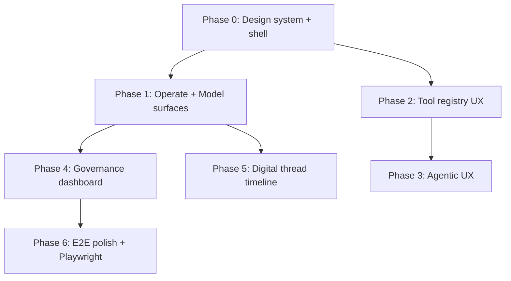

# EnterpriseThreadOS UI Implementation Issues

Source mockups: `References/etos_ui_mockup_pack_with_digital_thread_timeline/etos_ui_mockups/` (start at `index.html`)

Source product backlog: `.docs/.prd/engineering-execution-issues.md`

Source screen map: `References/.../etos_ui_mockups/SCREEN_MAP.md`

Digital thread spec: `References/.../etos_ui_mockups/docs/DIGITAL_THREAD_TIMELINE_SPEC.md`

**Agent docs (read before coding):** [README](./README.md) · [Implementation guide](./ui-agent-implementation-guide.md) · [Screen/API map](./ui-screen-api-map.md) · [Delivery checklist](./ui-delivery-checklist.md) · Cursor rule: `.cursor/rules/etos-frontend-ui-only.mdc`

**Backend freeze:** UI program changes `ETOS.Frontend/` only. Do not add backend endpoints or modify `ETOS.Backend/` during UI slices.

---

## Purpose

This backlog turns the 40-screen EnterpriseThreadOS mockup pack into a phased, implementable UI program aligned with the existing Next.js 16 frontend (`ETOS.Frontend/`), backend APIs, and engineering issue dependencies.

The mockups define a **persistent enterprise shell** (sidebar + top bar), **light-first workspace** with navy navigation, and **semantic status/risk/governance affordances** on every AI, import, tool, agent, and audit surface. **Phases 0–5 are gold** (shell, Operate/Model, Tool registry, Agents/workflows, Governance dashboard, Digital thread canvas). Remaining work is Phase 6 visual QA, adjacent slate reskins, and Issue 25 teams.

**Non-negotiable for this program:**

- Light and dark mode on every screen, user-toggleable with system preference as default.
- Architecture-honest UI: no fake integrations; disabled states for write connectors and blocked surfaces (Issue 25 teams, Issue 16.1 timeline).
- Reuse existing `etos-api.ts` fetch helpers and server-component data loading unless interactivity requires client islands.
- Governance visibility: trust, confidence, policy, trace, audit, and read-only MVP boundary visible in shell and detail panels.

---

## Current State Summary

| Area | Mockup target | Current implementation | Gap |
| --- | --- | --- | --- |
| App shell | Sidebar (Operate/Govern/Model/Build/Admin), top bar, breadcrumb, search, tenant pill, MVP badge | **Gold (UI-0.2)** | Topbar health dot deferred |
| Theme | Light workspace + navy sidebar; dark equivalent | **Gold (UI-0.1)** | — |
| Shared primitives | KPI, Tabs, Stepper, TraceTimeline, DataTable, … | **Gold (UI-0.3)** | Standalone FlowLine optional |
| Home `/` | Mission Control Timeline | **Gold (UI-1.1 + Issue 16.1 + UI-5.3)** | AI insights still fixture |
| Admin identity | Create tenant / user / role / membership / grant | **Gold (UI-1.10)** | No membership explorer table |
| Model `/model-artifacts` | Package seed + ontology detail | **Gold (UI-1.2)** | Impact analysis CTA disabled |
| Layer 3–6 | Polished list + detail with publish/impact | **Gold (UI-1.3)** | — |
| Imports | Hub + wizard sub-routes | **Gold (UI-1.4)** | Some steps still use latest-batch helpers |
| Graph / docs | Promotion + snapshot diff + documents | **Gold (UI-1.5–1.6)** | — |
| Explorers | 360° rich layout + artifact explorer | **Gold (UI-1.6)** | — |
| Chat / traces | Split conversation + governance; trace detail | **Gold (UI-1.7)** | — |
| Dashboards / reports | Builder preview with approval CTAs | **Gold (UI-1.8)** | Save/approve CTAs disabled |
| Recommendations | Inbox filters + evidence detail | **Gold (UI-1.9)** | — |
| Tools (Issue 22) | Registry tabs, editor, connector boundary, run trace | **Gold (UI-2.1–2.4)** | Register/Save draft disabled; schemas read-only |
| Agents / workflows 23–24 | Builder, config, runs, workflow canvas | **Gold** (UI-3.1–3.7) | `@xyflow/react`; create-version save |
| Agent teams 25 | Team builder + runs | Placeholder `/agent-teams` + `/agent-team-runs/[runId]` | Issue 25 |
| Governance | Audit dashboard KPIs + charts | **Gold (UI-4.1)** | Recharts trends; Export disabled |
| Decisions | Explorer + detail votes/outcomes | Functional `/decisions` | Slate reskin still open |
| Learning signals | Tenant rollup list + detail | ✅ `/learning-signals` | `listLearningSignals` / `getLearningSignalDetail` |
| Digital thread | Interactive timeline (screens 38–40) | **Gold (UI-5.1–5.3 + Issue 16.1b)** | SVG canvas; site/product-line filters disabled |

**Gold routes (preserve + polish only):** `/`, `/model-artifacts`, `/model-artifacts/ontology`, `/capabilities`, `/business-policies`, `/optimization-models`, `/agent-templates`, `/imports` (+ wizard sub-routes), `/documents`, `/graph`, `/graph/promote`, `/explorers`, `/explorers/360/[anchorId]`, `/artifacts`, `/chat`, `/ai-traces`, `/dashboards`, `/reports`, `/recommendations`, `/learning-signals`, `/admin/identity`, `/tools`, `/tools/[artifactId]/edit`, `/connectors/[artifactId]`, `/tool-runs`, `/tool-runs/[runId]`, `/governance`, `/digital-thread/timeline`.

**Still slate / mockup-parity next:** `/tasks`, `/decisions`, `/context-packages`, `/admin/foundation`.

---

## Recommended Frontend Stack Additions

Align with engineering issue library guidance (Issues 16–21):

| Package | Use |
| --- | --- |
| `shadcn/ui` + Radix | Accessible primitives: Button, Dialog, Tabs, Dropdown, Tooltip |
| `lucide-react` | Icon set consistent with mockup affordances |
| `@tanstack/react-query` | Client-side cache for interactive explorers, timeline, chat follow-ups |
| `@tanstack/react-table` | Filterable tables (imports, recommendations, tool runs, audit) |
| `react-hook-form` + `zod` | Wizards and editors |
| `reactflow` | Workflow builder (Issue 24), optional 360 graph mini-views |
| `recharts` or `@tremor/react` | KPI cards, governance dashboard, command center |
| `next-themes` | Light/dark/system theme with `class` strategy on `<html>` |
| `@xyflow/react` or Canvas/WebGL lib | Digital thread timeline renderer (Issue UI-5.x) |

Install incrementally per phase; React Flow landed in Phase 3; Recharts landed in Phase 4 (`GovernanceTrendCharts`).

---

## Design System — Light & Dark Mode

### Token model

Define CSS custom properties in `ETOS.Frontend/src/app/globals.css` and map through Tailwind 4 `@theme inline`. Mockup light tokens (from screens 02–37 HTML, e.g. legacy `01-command-center-legacy-executive.html`) become the canonical light workspace palette; derive dark equivalents by inverting surface/ink relationships while keeping semantic colors stable. **Home Mission Control (screen 01 PNG)** and digital-thread screens 38–40 use a deeper ops canvas (near-black / navy) — treat as a dedicated surface family, same semantic status colors.

| Token | Light | Dark | Usage |
| --- | --- | --- | --- |
| `--surface-canvas` | `#f5f7fb` | `#0b1220` | Page background gradient base |
| `--surface-panel` | `#ffffff` | `#0f172a` | Cards, main content |
| `--surface-muted` | `#f8fafc` | `#1e293b` | Table rows, list items |
| `--ink-primary` | `#0f172a` | `#e2e8f0` | Headings, body |
| `--ink-muted` | `#64748b` | `#94a3b8` | Secondary text |
| `--border-default` | `#d8e0ea` | `#334155` | Card/table borders |
| `--nav-bg` | `#101a33` → `#0b1224` | `#070d1a` → `#050810` | Sidebar gradient |
| `--nav-ink` | `#dbeafe` | `#cbd5e1` | Sidebar labels |
| `--nav-active` | cyan/indigo gradient overlay | Same hues, higher opacity | Active nav item |
| `--accent-primary` | `#2563eb` | `#60a5fa` | Primary CTA |
| `--accent-cyan` | `#0ea5e9` | `#38bdf8` | Links, highlights |
| `--status-success` | `#059669` / `#dcfce7` | `#34d399` / `#052e2b` | Healthy, published |
| `--status-warning` | `#d97706` / `#fef3c7` | `#fbbf24` / `#422006` | Staged, review |
| `--status-danger` | `#dc2626` / `#fee2e2` | `#f87171` / `#450a0a` | Blocked, high risk |
| `--status-info` | `#2563eb` / `#dbeafe` | `#60a5fa` / `#172554` | Trace, schema |
| `--shadow-panel` | `0 18px 44px rgba(15,23,42,.10)` | `0 18px 44px rgba(0,0,0,.35)` | Card elevation |

### Theme behavior

- Default: `prefers-color-scheme` via `next-themes` `defaultTheme="system"`.
- Persist user choice in `localStorage` key `etos-theme`.
- Shell sidebar stays **navy in both modes** (brand anchor); content canvas switches light/dark.
- Home Mission Control (screen 01) and digital thread timeline (screens 38–40) use a **deeper ops canvas**; mockup dark navy is the reference for those surfaces. Other product routes stay light-first workspace + navy sidebar.
- Status badges must meet WCAG AA contrast in both modes; do not rely on color alone—pair with label text.
- All new components consume tokens (`bg-surface-panel`, `text-ink-primary`, etc.), not raw `slate-*` classes.

### Typography

- Mockups use **Inter**; current app uses **Geist**. Decision: adopt Inter for UI chrome via `next/font/google` OR keep Geist and map mockup scale (30px H1, 18px H2, 13px table) to Geist—document in UI-0.1. Prefer one family for product consistency.

### Shared layout regions

```
┌─────────────────────────────────────────────────────────────┐
│ Sidebar 280px │ Topbar: breadcrumb | search | tenant | theme │
│ Operate       ├───────────────────────────────────────────────┤
│ Govern        │ Title row: H1 + description + actions         │
│ Model         │ Content: cards | tables | split panels        │
│ Build         │ Optional: right governance/evidence panel     │
│ Admin         │ Screen-id footer (dev only)                   │
│ MVP footer    │                                               │
└─────────────────────────────────────────────────────────────┘
```

---

## Implementation Phases



---

## Phase 0 — Foundation

### UI-0.1: Design Tokens, Theme Provider, and Tailwind Mapping ✅ Implemented

**Blocked by:** None  
**Engineering dependency:** None  
**Mockup reference:** All screens (shared CSS in `html/*.html`)  
**Status:** Implemented — `--etos-*` tokens (`:root` + `.dark` + ops-canvas family) in `globals.css` with Tailwind 4 `@theme inline` mapping, `next-themes` provider (`storageKey="etos-theme"`, system default), **Inter** font. Migrated pages keep inner dark cards until per-page reskin (UI-1.2+).

**What to build**

- Token file in `globals.css` with `:root` and `.dark` blocks.
- `next-themes` `ThemeProvider` in root layout.
- Theme toggle in top bar (sun/moon + system option in dropdown).
- Replace hardcoded `slate-950` page backgrounds with token utilities across existing pages (mechanical pass).

**Acceptance criteria**

- User can switch light, dark, and system; choice persists across reloads.
- Command center mockup colors match within reasonable delta in light mode.
- Dark mode preserves hierarchy: panel vs canvas vs muted surfaces distinguishable.
- No page renders unreadable text in either mode.

---

### UI-0.2: Enterprise App Shell (Sidebar + Topbar + Breadcrumb) ✅ Implemented

**Blocked by:** UI-0.1  
**Engineering dependency:** Issue 2 (tenant context display)  
**Mockup reference:** Screen 01 — persistent chrome  
**Status:** Implemented — `AppShell`/`Sidebar`/`Topbar`/`ThemeToggle` in `src/components/shell/`, all product routes moved into `src/app/(shell)/` (URLs unchanged), breadcrumb from pathname, disabled global search, tenant pill from `getIdentityLists()`, Read-only MVP badge, mobile drawer, skip link.

**What to build**

- `ETOS.Frontend/src/components/shell/AppShell.tsx` wrapping all routes via `src/app/(shell)/layout.tsx`.
- Sidebar nav groups: **Operate**, **Govern**, **Model**, **Build**, **Admin** with items from SCREEN_MAP.
- Active route highlighting; collapse to icon rail on `< lg` with overlay drawer.
- Top bar: breadcrumb from pathname, global search input (placeholder), tenant name from API/env, **Read-only MVP** badge, user avatar initials, theme toggle.
- Sidebar footer: MVP safety boundary progress callout (static copy until KPIs wired).

**Route group migration**

- Move existing pages under `src/app/(shell)/` route group; keep URLs unchanged.
- Dev/admin dump content on `/` moves to `/admin/foundation` or stays on `/` but inside shell—**prefer transforming `/` into command center (UI-1.1) and moving admin lists to `/admin/foundation`.**

**Acceptance criteria**

- Every mockup nav item resolves to a route (implemented page or honest placeholder with backend blocker note).
- Breadcrumb reflects `EnterpriseThreadOS / segment / …`.
- Shell renders correctly at 1280px and 1600px mockup widths.
- Keyboard: skip link to main content; sidebar trap focus when mobile drawer open.

---

### UI-0.3: Shared UI Component Library ⚠️ Partially implemented

**Blocked by:** UI-0.1  
**Engineering dependency:** None  
**Mockup reference:** Badges, cards, KPIs, tables, steppers, tabs, trace timeline, callouts across screens 01–27  
**Status:** Core primitives implemented (hand-rolled, token-based, no shadcn init): `Badge`/`StatusBadge`, `Card` family, `Button` (primary/ghost/danger), `PageHeader`, `KpiCard` (incl. ops variant), `EmptyState`, `ErrorState`, simple `DataTable`; gallery at `/dev/ui-kit` (dev only). Remaining: `Stepper`, `Tabs`, `GovernancePanel`, `TraceTimeline`, `FlowLine`, `Notice/Callout`, TanStack `DataTable` — land with their owning Phase 1–2 issues.

**What to build in `src/components/ui/`**

| Component | Mockup usage |
| --- | --- |
| `Badge` | Status chips: green/amber/red/blue/purple/teal/gray |
| `Card`, `CardHeader`, `CardTitle` | Panel containers |
| `KpiCard` | Command center, governance, timeline summary |
| `Button` variants | primary, ghost, danger, good |
| `DataTable` | TanStack Table wrapper with token styling |
| `Stepper` | Import wizard, publish flows |
| `Tabs` | Registry views, explorer sections |
| `PageHeader` | Title row + description + actions slot |
| `EmptyState`, `ErrorState` | Replace inline duplicates |
| `GovernancePanel` | Right-side pills: intent, confidence, policy, trace links |
| `TraceTimeline` | AI trace, tool run, workflow run |
| `FlowLine` | Operational flow status (screen 01) |
| `Notice`, `Callout` | MVP boundary, policy warnings |

**Acceptance criteria**

- Storybook optional; minimum: one `/dev/ui-kit` internal page listing components in light and dark.
- Components use design tokens only.
- `StatusBadge` in `page.tsx` migrated to shared `Badge`.

---

### UI-0.4: Navigation IA and Placeholder Policy ✅ Implemented

**Blocked by:** UI-0.2  
**Engineering dependency:** Issues 19–25 for Govern/Build placeholders  
**Mockup reference:** SCREEN_MAP information architecture  
**Status:** Implemented — `src/config/navigation.ts` (`NavItem` contract, Operate/Govern/Model/Build/Admin groups), `PlaceholderPage` component with mockup thumbnail + blocker badge + disabled CTA, placeholder routes `/digital-thread/timeline` (Issue 16.1), `/agent-teams` (Issue 25), `/admin/identity` (UI-1.10), `/admin/settings` (static). Mockup PNGs copied to `ETOS.Frontend/public/mockups/`. No dead sidebar links.

**What to build**

- Central nav config: `src/config/navigation.ts` with `href`, `label`, `group`, `requiredIssue`, `implemented`.
- Placeholder page template: explains mockup intent, backend blocker, link to engineering issue, screenshot from mockup pack.
- Unimplemented routes: `/tasks`, `/governance` (partial), `/agents/*`, `/workflows/*`, `/agent-teams/*`, `/digital-thread/*`, `/admin/settings` (static), `/imports/new`, sub-routes. `/admin/foundation` + `/admin/identity` are real (UI-1.1 / UI-1.10).

**Acceptance criteria**

- No dead links in sidebar.
- Placeholders show mockup thumbnail and honest “blocked by Issue N” messaging.

---

## Phase 1 — Operate & Model Surfaces (Mockups 01–23)

Maps to implemented backend Issues 1–18.5. Reskin and restructure existing pages; add missing routes.

### UI-1.1: Mission Control Timeline home (`/`) ✅ Implemented

**Blocked by:** UI-0.2, UI-0.3
**Engineering dependency:** Issues 1, 3, 13, 18, 21 (KPIs); Issue 16.1 + 16.1b digital-thread projection + SSE
**Mockup:** 01 — `images/01-command-center.png` (Mission Control Timeline). Legacy executive landing: `images/01-command-center-legacy-executive.png` (archive only).
**Status:** Implemented — `/` is a dark ops-canvas Mission Control page. Wired KPIs: thread health (`getPlatformHealth`), systems connected + events/min (`getDigitalThreadSystems` / `getDigitalThreadSummary`), recommendations, agent runs, open decisions, data quality. Timeline, heatmap, top threads, live event stream, and thread alerts consume `/api/admin/digital-thread/*` via `digital-thread-map.ts` (no fixture fallback on API error). Live button + master scrubber enabled via SSE (`MissionControlLiveChrome` + `digital-thread-stream.ts`). AI insights remain fixture + preview. Admin dump at `/admin/foundation`.

**What to build**

- Dark Mission Control layout matching screen 01 regions:
  - KPI strip: thread health, systems connected, events/min, recommendations, active agents, open decisions (wire from existing list/health APIs where possible; em dash / fixture otherwise).
  - Digital Thread Timeline — live view panel (systems + event callouts); **fixture or disabled Live** until digital-thread APIs exist.
  - Thread activity heatmap, top active threads, system status donut.
  - Bottom panels: active agents, recommendations, decisions summary, data quality, AI insights.
  - Right rail: live event stream + thread alerts.
  - Master timeline scrubber + sidebar time controls (Live / range).
- Nav labels may follow Mission Control IA on home; product-wide sidebar still lands via UI-0.2 (Operate/Govern/… or unified mapping — document choice in PR).
- Admin foundation lists move to `/admin/foundation` without losing functionality.

**Acceptance criteria**

- Matches Mission Control mockup layout structure; live data where APIs exist, honest placeholders when not.
- No fake live stream success without backend; scrubber/stream marked preview when using fixtures (`data-ui-preview="true"`).
- `/admin/foundation` reachable from Admin nav.

---

### UI-1.2: Model Package & Ontology (`/model-artifacts`, `/model-artifacts/ontology`) ✅ Implemented

**Blocked by:** UI-0.3  
**Engineering dependency:** Issue 7, 18.5  
**Mockup:** 02, 03
**Status:** Gold — mockup-parity composition matching import hub (callout + package table + boundaries pill-stack); `/model-artifacts/ontology` split catalog + detail; Advanced/Debug for raw version dumps.

**What to build**

- Package overview: seed button, dependency graph summary, published version cards.
- Ontology detail route with semantic layer tabs, AI usage metadata, version timeline.
- Publish/impact analysis CTAs wired to existing APIs or disabled with explanation.

---

### UI-1.3: Layer 3–6 Definition Libraries ✅ Implemented

**Blocked by:** UI-0.3  
**Engineering dependency:** Issues 18.2–18.4  
**Mockup:** 04–07 — `/capabilities`, `/business-policies`, `/optimization-models`, `/agent-templates`
**Status:** Gold — `DefinitionLibraryPage` (KPI + registry + preview SidePanel) with per-mockup extras: policy composition flow (05), optimization donut + contract well (06), template pill-stack (07).

**What to build**

- Unified list pattern: filters, readiness badges, dependency columns.
- Detail pages: version history sidebar, publish gate panel, resolved dependency labels (reuse existing detail views, reshell).
- Cross-links between capability ↔ policy ↔ optimization ↔ agent template.

---

### UI-1.4: Import Hub & Wizard Sub-Routes ✅ Implemented

**Blocked by:** UI-0.3  
**Engineering dependency:** Issues 8–10  
**Mockup:** 08–13
**Status:** Gold — mockup 08 hub is the gold bar (title + New import/Upload, 4 KPIs, numbered demo list, Import state timeline); wizard routes 09–13 with Source→Mapping→Validate→Identity→Commit stepper; Mapping Agent Debug demoted to Advanced/Debug; `actions.ts` unchanged.

**What to build**

- `/imports` — hub cards: batches, identity, DQ summary, demo actions (preserve server actions).
- `/imports/new` — upload wizard step 1.
- `/imports/[batchId]/mapping` — mapping review with approve/reject.
- `/imports/[batchId]/staging` — validation issues, promote blockers.
- `/imports/[batchId]/identity` — candidate cards, trust scores.
- `/imports/data-quality` — triage table with severity and trust penalty columns.
- Shared `ImportStepper` across sub-routes.

**Acceptance criteria**

- Same backend behavior as current monolithic `/imports` page.
- Stepper state derived from batch status API fields.

---

### UI-1.5: Trusted Graph Promotion & Document Explorer ✅ Implemented

**Blocked by:** UI-0.3  
**Engineering dependency:** Issues 11, 12  
**Mockup:** 14, 15 — `/graph/promote`, `/documents`
**Status:** Gold — `/graph/promote` gate + diff + BOM heat table (mockup 14); `/documents` split table + side panel (mockup 15); dumps in Advanced.

**What to build**

- `/graph/promote` — snapshot/diff/BOM compare UI; promotion CTA with DQ blockers.
- `/documents` — explorer layout: list + filters + detail drawer; vector index status; link to graph/360.

---

### UI-1.6: Graph Explorer & 360° Context ✅ Implemented

**Blocked by:** UI-0.3  
**Engineering dependency:** Issue 16  
**Mockup:** 16, 23 — `/explorers/360/[anchorId]`, `/artifacts`
**Status:** Gold — `/graph` lightweight hub into 360/promote; `/explorers/360/[anchorId]` canvas + context panels (mockup 16); artifacts registry + flowline + readiness rail (mockup 23); explorers hub points at gold surfaces.

**What to build**

- Route alias: `/explorers/360/[anchorId]` → reuse `ContextView360` with split layout (graph mini-panel + sections).
- Artifact explorer: unified table with type, readiness, dependency impact column.
- Section visibility badges and governance flow panel promoted to mockup styling.

---

### UI-1.7: Governed Chat & AI Trace Detail ✅ Implemented

**Blocked by:** UI-0.3  
**Engineering dependency:** Issues 14, 15  
**Mockup:** 17, 18 — `/chat`, `/ai-traces/[traceId]`
**Status:** Gold — chat conversation + Answer Governance side panel with draft CTAs (mockup 17); AI Trace list KPIs + card-row; `/ai-traces/[traceId]` timeline + access rail (mockup 18); demo export demoted.

**What to build**

- `/chat` — split layout: conversation + `GovernancePanel` (intent, retrieval, confidence, evidence).
- Chat-to-artifact draft buttons: dashboard, recommendation.
- `/ai-traces/[traceId]` — trace step timeline, export panel, context package link.

---

### UI-1.8: Dashboard & Report Builder Preview ✅ Implemented

**Blocked by:** UI-0.3  
**Engineering dependency:** Issue 17  
**Mockup:** 19, 20
**Status:** Gold — dashboards KPI strip wired to DQ/recommendations/tasks + spark/table + publish readiness rail (mockup 19); reports outline + canvas preview (mockup 20).

**What to build**

- Preview layout with widget grid placeholder, evidence appendix panel for reports.
- CTAs: Save draft, Request publish approval (wired or disabled per readiness).

---

### UI-1.9: Recommendation Inbox & Detail ✅ Implemented

**Blocked by:** UI-0.3  
**Engineering dependency:** Issue 18  
**Mockup:** 21, 22
**Status:** Gold — 4 KPI cards + server card-row `DataTable` inbox with high-risk filter (mockup 21); detail evidence/actions + related-object side panel (mockup 22); publish/debug demoted.

**What to build**

- Inbox: risk filters, trusted/blocked tabs, high-risk queue.
- Detail: evidence chain, suggested actions, trace links, review task creation (Issue 19 — server action + debug buttons).

---

### UI-1.10: Identity Admin — Create Tenants, Users & Access (`/admin/identity`) ✅ Implemented

**Blocked by:** UI-0.2, UI-0.3, UI-1.1 (foundation route exists)  
**Engineering dependency:** Issue 2 (backend identity APIs already shipped)  
**Mockup:** No dedicated pack screen — use Admin nav + Mission Control **Administration** intent; layout follows light-shell cards/tables from screens 02–37.  
**Constraint:** Frontend-only. Call existing `POST /api/admin/identity/*` only. No OIDC/login UI (still env / header identity).
**Status:** Implemented — tabbed create forms, `createTenant`/`createUser`/`createRole`/`createMembership`/`createGrant` wrappers, cookie tenant switcher (`etos-tenant-id`), nav marked implemented.
**Routes**

| Route | Purpose |
| --- | --- |
| `/admin/foundation` | Keep dump lists + demo reset (from UI-1.1) |
| `/admin/identity` | Primary identity workspace: tabs + create forms |
| `/admin/identity?tab=tenants\|users\|roles\|memberships\|grants` | Deep-link tabs |

**Nav:** Admin → **Identity** (`/admin/identity`), Admin → **Foundation** (`/admin/foundation`).

**What to build**

1. **`etos-api.ts` thin wrappers** (existing endpoints only):
   - `createTenant({ identifier, name, description? })` → `POST /api/admin/identity/tenants`
   - `createUser({ userName, email, displayName?, password?, id? })` → `POST /api/admin/identity/users`
   - `createRole({ name, description? })` → `POST /api/admin/identity/roles` (tenant-scoped via current headers)
   - `createMembership({ userId, tenantRoleId, expiresAt? })` → `POST /api/admin/identity/memberships`
   - `createGrant({ userId, permissionKey, kind, expiresAt?, justification? })` → `POST /api/admin/identity/grants`
   - Optional same slice: `createPermission`, `assignRolePermission`, `createAccessRequest` if list UX needs them
   - Reuse `getIdentityLists()` for tables after mutate + `revalidatePath`

2. **Identity page UI**
   - Tabs: Tenants | Users | Roles | Memberships | Grants
   - Each tab: DataTable of current list + **Create** panel/dialog (PageHeader + form)
   - Server Actions for creates; surface `ApiResult.error` / validation messages
   - After create tenant: show success callout that current user may have been auto-added as Tenant Admin (backend behavior when caller headers present)

3. **Active tenant switcher (dev/MVP)**
   - Topbar or Identity page control: pick tenant from `getIdentityLists().tenants`
   - Persist selection for subsequent API calls (cookie / `localStorage` + server-readable preference — match existing `etos-api` header pattern; do **not** invent new backend session API)
   - Document: switching tenant changes `X-ETOS-Tenant-Id` for this browser session; not full multi-tenant SSO

4. **Out of scope for UI-1.10**
   - Login / logout / OIDC / password-reset product UI
   - Keycloak or external IdP
   - Delete/deactivate tenant-user lifecycle (unless GET already implies and a POST/PATCH exists — do not add backend)
   - Settings branding pages (`/admin/settings` stays static placeholder)

**Happy-path demo script (acceptance)**

1. Open `/admin/identity` as seeded admin headers.  
2. Create tenant `acme-demo-2` / name “Acme Demo 2”.  
3. Create user `steward@example.com`.  
4. Create role `Data Steward` (under active tenant).  
5. Create membership: user → role.  
6. Optional: create grant `identity.admin` or use role permissions.  
7. Switch active tenant to new tenant; Identity lists refresh for that tenant context.  
8. Foundation dump still works at `/admin/foundation`.

**Acceptance criteria**

- [x] Can create tenant, user, role, membership, grant from UI without curling APIs.
- [x] No new backend routes; wrappers only call paths in `IdentityEndpointExtensions`.
- [x] Validation errors from backend shown in UI (duplicate identifier, missing fields).
- [x] Password field optional on create user; helper text: “Platform identity only — not a login portal.”
- [x] Light + dark readable; forms use shared `Button` / inputs from UI-0.3.
- [ ] Playwright or manual checklist: create tenant + user + membership happy path.

---

## Phase 2 — Tool Registry UX (Mockups 24–27)

**Engineering dependency:** Issue 22 (implemented)

### UI-2.1: Tool, Skill & Connector Registry (`/tools`) ✅ Implemented (gold)

**Mockup:** 24

- Tabbed registry: Tools | Skills | Connectors (`?kind=` Tabs on unified Kind-column table).
- Compatibility scan action, risk level column, KPI strip; Register tool disabled (create wizard deferred).

### UI-2.2: Tool Definition Editor (`/tools/[artifactId]/edit`) ✅ Implemented (gold)

**Mockup:** 25

- Split Definition + Schema references (read-only schema wells); Mark ready / Publish / Validate / Dry-run wired.
- Save draft disabled with Advanced note; detail route redirects to `/edit`.

### UI-2.3: Connector Credential Boundary (`/connectors/[artifactId]`) ✅ Implemented (gold)

**Mockup:** 26

- Capability `DataTable` + credential issuance `TraceTimeline` + secret Notice; write-disabled banner when applicable.

### UI-2.4: Tool Run & Dry-Run Trace (`/tool-runs/[runId]`) ✅ Implemented (gold)

**Mockup:** 27

- Trace timeline, expected vs actual summaries, gated Execute rail, AI Trace link; `/tool-runs` list for discoverability.

---

## Phase 3 — Agentic Platform UX (Mockups 28–36)

**Engineering dependency:** Issues 23–24 **implemented** (functional shells); Issue 25 **deferred** (teams).  
**Do not invent new backend endpoints.** Reskin existing agent/workflow routes to mockup parity; keep teams as placeholders until Issue 25.

| Issue | Route | Mockup | Codebase status |
| --- | --- | --- | --- |
| UI-3.1 | `/agents`, `/agents/new` | 28 Agent builder | **Gold** — registry KPIs + template/prompt Tabs |
| UI-3.2 | `/agents/[agentKey]/configure` | 29 Advanced configuration | **Gold** — composition table + publish rail |
| UI-3.3 | `/agents/[agentKey]/test-run` | 30 Test run | **Gold** — preview/test/gated execute + TraceTimeline |
| UI-3.4 | `/agent-runs`, `/agent-runs/[runId]` | 31 Runs explorer | **Gold** — DataTable + KPI/timeline detail |
| UI-3.5 | `/workflows/new`, `/workflows/[key]/edit` | 32 Workflow canvas | **Gold** — `@xyflow/react`; Save draft → create-version |
| UI-3.6 | `/workflows/[key]/publish` | 33 Publish risk review | **Gold** — checks + mark-ready/publish/execute |
| UI-3.7 | `/workflow-runs`, `/workflow-runs/[runId]` | 34 Safe mode trace | **Gold** — list + safe-mode TraceTimeline |
| UI-3.8 | `/agent-teams` | 35 Team builder | PlaceholderPage (Issue 25) |
| UI-3.9 | `/agent-team-runs/[runId]` | 36 Delegation & consensus | PlaceholderPage (Issue 25) |

**Placeholder rule for Issue 25 only:** show mockup screenshot, architecture summary, link to Issue 25. Do **not** replace working Issue 23–24 agent/workflow pages with placeholders.

---

## Phase 4 — Governance Dashboard (Mockup 37)

### UI-4.1: Governance & Audit Dashboard (`/governance`) — **Done (gold)**

**Blocked by:** UI-0.2  
**Engineering dependency:** Issues 3, 19, 21  
**Mockup:** 37

**Shipped**

- Shared `KpiCard` strip from live Issue 21 keys + honest Write actions = 0 SAFE.
- Recharts `GovernanceTrendCharts` for TrendSupported keys (14-day window).
- Card-row `DataTable` governance/security/high-risk events; `SidePanel` audit design checks + connector boundary.
- Export audit summary disabled; Trace exports → `/ai-traces` Notice (no invent count).

---

## Phase 5 — Digital Thread Timeline (Mockups 38–40) ✅ Implemented

**Engineering dependency:** Issue 16.1 + Issue 16.1b (shipped)

### UI-5.1: Timeline Shell & Semantic Zoom Canvas ✅

**Mockup:** 38–40 — `/digital-thread/timeline`
**Status:** Implemented — ops-canvas SVG pan-zoom (`DigitalThreadCanvas`), minimap, filter bar (site/product-line disabled + tooltip), scrubber. Consumes Issue 16.1b `branches` / `minimap` / `events` / `summary` / `systems`.

### UI-5.2: Event Inspector & Drill-Through ✅

**Status:** Implemented — `DigitalThreadEventInspector` SidePanel via `getDigitalThreadEventDetail`; drill links to `/explorers/360/`, `/ai-traces/`, `/artifacts/` when ids present (API fields only).

### UI-5.3: Live Stream Client ✅

**Status:** Implemented — fetch ReadableStream SSE client (`digital-thread-stream.ts`); Live on timeline + Mission Control; pulse append without viewport reset.

**Backend contract:** Issue 16.1b `DigitalThreadProjectionService` + `/api/admin/digital-thread/{branches,lineage,events/{id},minimap,events/stream}` (SVG renderer; no WebGL / SignalR).

---

## Phase 6 — E2E Verification & Visual QA

### UI-6.1: Playwright Visual Regression Suite

- Capture light + dark snapshots for screens 01–27 against seeded demo data.
- Run in CI after `dotnet test` + `npm run typecheck`.

### UI-6.2: Mockup Parity Review Checklist

- Per-screen checklist: layout regions, primary CTA, governance panel, MVP badge, theme parity.
- Reference images: `References/.../etos_ui_mockups/images/*.png`.

### UI-6.3: Accessibility Pass

- Focus order in shell, dialog traps, table headers, color-contrast audit in both themes.

---

## Cross-Cutting Rules

1. **Server-first:** default to React Server Components; client components only for theme, search autocomplete, chat input, timeline canvas, workflow canvas, tables with client sort/filter.
2. **API boundary:** extend `src/lib/etos-api.ts`; no direct infra access from browser.
3. **Governance copy:** reuse backend `safeSummary` fields; never invent sensitive detail in UI.
4. **Disabled writes:** any CTA that would write to source systems renders disabled with tooltip citing MVP policy.
5. **Loading/error:** consistent `EmptyState`, `ErrorState`, skeleton patterns from UI-0.3.
6. **Mobile:** mockups are desktop-first (1600×1000); shell collapses gracefully but timeline/workflow canvases may require `min-width` warning.

---

## Issue Dependency Graph (UI)

| UI Issue | Blocked by | Engineering issue |
| --- | --- | --- |
| UI-0.1 | — | — |
| UI-0.2 | UI-0.1 | 2 |
| UI-0.3 | UI-0.1 | — |
| UI-0.4 | UI-0.2 | 19–25 |
| UI-1.1 | UI-0.2, UI-0.3 | 1, 3, 18, 21 |
| UI-1.4 | UI-0.3 | 8–10 |
| UI-1.7 | UI-0.3 | 14, 15 |
| UI-1.10 | UI-0.2, UI-0.3, UI-1.1 | 2 (APIs exist) |
| UI-2.x | UI-0.3 | 22 |
| UI-3.x | UI-0.4 | 23–25 |
| UI-4.1 | UI-0.2 | 3, 21 |
| UI-5.x | UI-0.2, UI-0.3 | 16.1 (new) |
| UI-6.x | Phase 1–2 complete | 26 |

---

## Suggested Execution Order

1. ~~**UI-0.x foundation**~~ — **done**
2. ~~**UI-1.x Operate & Model**~~ — **done (gold)**
3. ~~**UI-2.x Tool registry**~~ — **done (gold)**
4. ~~**UI-3.x** agent/workflow mockup parity~~ **done** (teams still Issue 25 placeholders)
5. ~~**UI-4.1** governance dashboard charts + reskin~~ — **done (gold)**
6. **UI-6.x** Playwright light+dark snapshots on gold routes (continuous)
7. **UI-5.x** only after backend Issue 16.1 API exists
8. **UI-3.8–3.9** only after Issue 25

---

## Acceptance Criteria — Program Complete

- [ ] All 40 mockup screens have a corresponding route: implemented UI or architecture-honest placeholder.
- [ ] Light and dark mode verified on every route.
- [ ] Enterprise shell persistent across authenticated app routes.
- [ ] E2E demo flow (`.docs/.prd/` + mockup `issues-1-18-e2e-flow` doc) completable entirely through reshelled UI.
- [ ] No raw `slate-950` hardcoding in page files; tokens only.
- [ ] Playwright smoke covers command center, imports hub, chat, recommendations, tools registry in both themes.
- [ ] Identity Admin (UI-1.10): create tenant + user + membership from `/admin/identity` without API tools.
- [ ] Digital thread timeline reaches mockup parity when Issue 16.1 backend is available.

---

## Files to Create (implementation reference)

```
ETOS.Frontend/
  src/app/(shell)/layout.tsx
  src/app/(shell)/page.tsx                         # Mission Control (UI-1.1) — shipped
  src/app/(shell)/admin/foundation/page.tsx        # shipped
  src/app/(shell)/admin/identity/page.tsx          # UI-1.10 — shipped
  src/app/(shell)/tools/[artifactId]/edit/page.tsx # UI-2.2 — shipped
  src/app/(shell)/tool-runs/page.tsx               # UI-2.4 list — shipped
  src/app/(shell)/tools/actions.ts                 # tool mark-ready/publish/scan/dry-run/execute — shipped
  src/components/admin/IdentityCreateForms.tsx     # shipped
  src/app/(shell)/imports/[batchId]/mapping/page.tsx  # shipped
  src/app/(shell)/digital-thread/timeline/page.tsx # placeholder — shipped
  src/components/shell/*                           # shipped
  src/components/ui/*                              # 17 primitives — shipped
  src/config/navigation.ts                         # shipped
```

Phase 4 gold landed (UI-4.1 governance + Recharts). Phase 5 gold landed (UI-5.1–5.3 + Issue 16.1b). Next: UI-6.x visual QA / adjacent slate reskins; Issue 25 for interactive teams.

---

## Open Questions

1. **Typography:** **Decided (UI-0.1)** — **Inter** via `next/font/google` (`--font-inter`), replacing Geist, for mockup parity and one product family.
2. **Issue 16.1:** add Digital Thread Timeline to main `.docs/.prd/engineering-execution-issues.md` or track UI-only until backend scoped?
3. **Auth UI:** mockups show avatar/tenant; full OIDC login shell deferred—use env-based / header identity. **UI-1.10** adds create + tenant switcher only, not login portal.
4. **Global search:** mockup search is omnibar; backend unified search API does not exist—placeholder vs scoped artifact search?
5. **Admin foundation:** **Decided** — developer dump at `/admin/foundation`; `/` is Mission Control Timeline.
6. **Identity create:** **Decided** — **UI-1.10** on `/admin/identity` using existing Issue 2 APIs — **shipped**.
7. **Tool create wizard:** deferred — Register tool / Save draft stay disabled until a create POST UI is explicitly scoped.

---

*Updated 2026-07-16 against `ETOS.Frontend` after Phase 0–5 gold (UI-0.x … UI-5.3 + Issue 16.1b). Next: UI-6.x / adjacent slate; Issue 25 for teams.*
