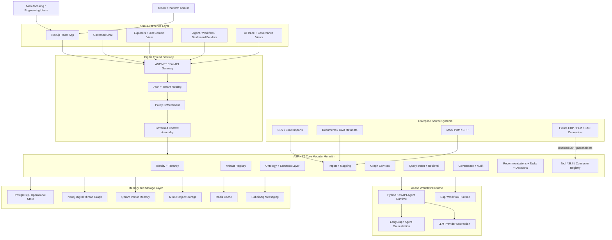
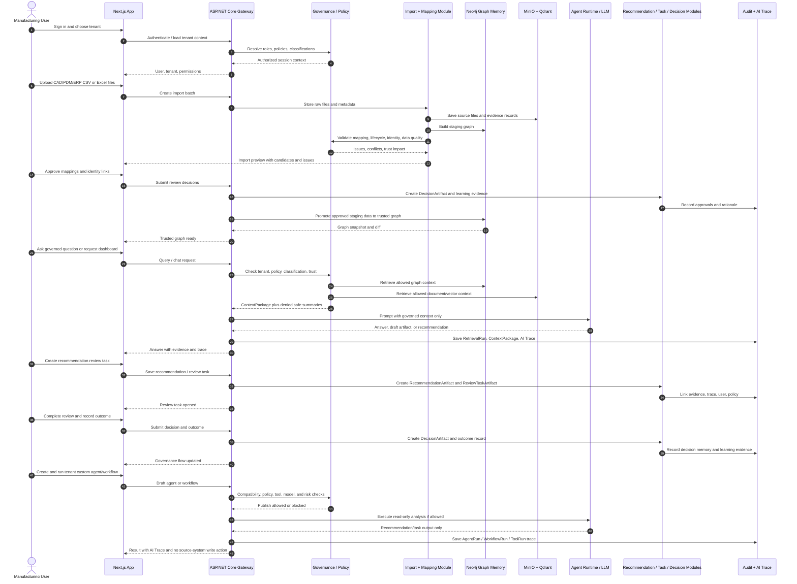
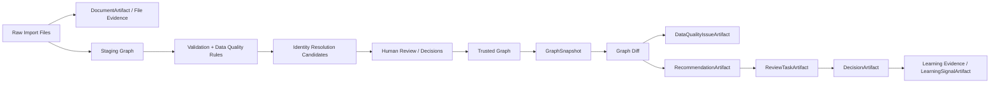

# EnterpriseThreadOS Engineering Execution PRD

## Problem Statement

Enterprise manufacturing data is fragmented across CAD, PDM, PLM, ERP, CRM, MES, QMS, documents, spreadsheets, and local expert knowledge. Engineering and operations users cannot reliably answer cross-system questions such as which CAD revisions map to which EBOMs, where lifecycle states conflict, which records are trustworthy, why an AI recommendation was made, or what decision trail led to a business outcome.

EnterpriseThreadOS must become an AI-native Enterprise Digital Thread Operating System that connects source data into a governed digital thread, exposes trusted graph and document context to users and agents, generates dashboards/reports/artifacts from natural language, creates reviewable recommendations and tasks, records decisions and learning, and prepares the architecture for future governed enterprise write actions.

The MVP must prove the core loop without becoming a full enterprise integration project: ingest source-owned data, build a governed graph, retrieve trusted context, explain AI outputs, generate artifacts, create reviewable recommendations/tasks, record decisions, and support tenant-defined agents/workflows in a safe read-only execution model.

## Solution

Build a custom Digital Thread Agentic OS, not a generic AIOS foundation. The platform will use a modular monolith backend with clear module boundaries, compiled placeholder contracts for future architecture components, a pluggable graph memory layer, governed context assembly, first-class versioned artifacts, and an agent/workflow runtime that remains read-only for enterprise systems during MVP.

The initial product experience targets a manufacturing operations or engineering manager. The user can import CAD/PDM/ERP-style CSV or Excel exports, map the data into a canonical digital thread model, validate identity links and data quality issues, explore trusted graph/document context, ask governed questions, generate draft dashboards/reports/query intents, create recommendations and review tasks, approve or reject decisions, and see an auditable trace of how evidence, policy, users, tools, agents, and workflows contributed to the outcome.

The MVP must be architecture-honest. Future capabilities such as live ERP/PDM connectors, native CAD automation, Keycloak, Temporal, Kubernetes, external supplier collaboration, enterprise write-back actions, custom artifact types, advanced retention, and tenant-defined retrieval strategies should exist as contracts, disabled modules, metadata placeholders, or project structure, but not as fake implementations.

## Product Principles

- Source systems remain the system of record during MVP. Imported enterprise data is read-only inside EnterpriseThreadOS.
- Platform-owned overlays may be created and edited, including mappings, classifications, graph links, trust states, dashboards, reports, agents, workflows, recommendations, review tasks, decisions, learning evidence, and audit records.
- Every important object that can affect AI behavior, governance, permissions, or explainability must be versioned, auditable, and dependency-aware.
- Restricted data must be filtered before it reaches an LLM. Post-generation redaction is not sufficient.
- The graph is the primary memory layer. Documents and LLM reasoning enrich the graph but do not replace it.
- Trust, confidence, provenance, source references, and conflict state must be visible to users.
- Agents and workflows may analyze, recommend, create reviewable tasks, and learn from explicit decisions in MVP. They must not execute enterprise write actions.
- Tenant isolation is enforced at every layer: storage, graph memory, documents, artifacts, audit, tools, agents, workflows, retrieval, exports, and learning.
- Placeholder modules should compile where practical so future extension points remain real contracts, not only documentation.

## Architecture Diagrams

The PRD should include visual architecture and flow diagrams because the platform spans UI, backend modules, AI runtime, workflow runtime, graph memory, operational storage, document/vector memory, governance, and future enterprise connectors. These diagrams are part of the execution contract: they show the intended boundaries, call paths, and safety gates before implementation starts.

### Layered Platform Architecture

### Tech Stack by Layer

| Layer                 | MVP Stack                                                                     | Future / Placeholder                                                                |
| --------------------- | ----------------------------------------------------------------------------- | ----------------------------------------------------------------------------------- |
| Frontend              | Next.js, React, TypeScript, Tailwind CSS, shadcn/ui, React Flow               | Advanced graph/workflow visual authoring, embedded analytics, richer admin consoles |
| API / Modular Backend | ASP.NET Core .NET 10, EF Core, REST APIs, modular monolith                    | Split services only if module boundaries and scale require it                       |
| Identity              | ASP.NET Identity, tenant-aware authorization, RBAC + ABAC                     | Keycloak or enterprise IdP federation                                               |
| Operational Store     | PostgreSQL, EF Core migrations                                                | SQL Server support through EF Core abstraction                                      |
| Graph Memory          | Neo4j via graph abstraction contracts                                         | Memgraph and other graph backends                                                   |
| Vector Memory         | Qdrant                                                                        | Additional vector stores if customer deployment requires them                       |
| Object Storage        | MinIO                                                                         | S3, Azure Blob, or enterprise object storage                                        |
| Cache / Messaging     | Redis, RabbitMQ                                                               | Managed cache/message services                                                      |
| Agent Runtime         | Python FastAPI, LangGraph, LLM provider abstraction                           | Additional agent runtimes, private/local model execution, and optional agent-memory providers behind platform contracts |
| Workflow Runtime      | Dapr Workflow                                                                 | Temporal                                                                            |
| Local Infrastructure  | Docker Compose for PostgreSQL, Neo4j, Qdrant, MinIO, Redis, RabbitMQ          | Kubernetes, optional Memgraph evaluation profile                                    |
| Connectors            | CSV, Excel, document import, mock ERP/PDM, disabled write connector contracts | Live ERP, PDM, PLM, MES, QMS, CRM, CAD automation                                   |
| Observability / Audit | Audit records, AI Trace, ToolRun, AgentRun, WorkflowRun, governed export logs | Centralized observability stack, retention/archive automation                       |

Decision: Neo4j is the primary MVP graph memory backend because EnterpriseThreadOS must support large, durable enterprise digital-thread graphs without requiring the full graph dataset to fit in RAM. Memgraph remains a possible optional backend behind the graph abstraction for memory-first analytics or future evaluation, but it is not the default system-of-record graph backend.

Decision: Neo4j Agent Memory is a future agent-runtime enhancement, not a replacement for the EnterpriseThreadOS graph memory abstraction. During MVP, keep placeholders behind platform-owned agent memory contracts. If later adopted, use it for conversation, extracted fact/preference, and reasoning/tool memory for governed agents, while trusted enterprise graph state continues to flow through the platform graph, policy, audit, and review boundaries.

### Open-Source Development Accelerators

The platform should prefer proven open-source libraries for commodity infrastructure and application plumbing so custom code stays focused on EnterpriseThreadOS domain behavior: digital-thread modeling, governance, traceability, artifact lifecycle, tenant safety, and agent/workflow policy. Libraries listed here are implementation accelerators, not scope expansion. They should be wrapped behind module interfaces where future deployment profiles, enterprise substitutions, or commercial services are likely.

| Concern | Recommended OSS Library / Framework | Where to Use | Notes |
| ------- | ----------------------------------- | ------------ | ----- |
| Multi-tenancy | Finbuckle.MultiTenant | Identity and Access Module, Tenancy Module, request pipeline, tenant-aware options | Use for tenant resolution and tenant context. Keep custom storage-routing contracts for shared versus isolated deployment profiles. |
| Identity | ASP.NET Core Identity | MVP user, role, membership, password, and auth baseline | Keep Keycloak as future enterprise federation. Consider OpenIddict only if first-party OAuth2/OIDC token server behavior is needed before Keycloak. |
| Authorization / ABAC | ASP.NET Core authorization policies and custom handlers | Policy enforcement, classification filtering, artifact publishing, trace/export permissions | Start with built-in policy handlers. Evaluate OpenFGA or Casbin.NET only if relationship-based authorization becomes too complex for local policies. |
| SQL persistence | EF Core, Npgsql.EntityFrameworkCore.PostgreSQL | Operational store for tenants, artifacts, policy, audit, runtime summaries, decisions, dashboards | EF Core remains the default abstraction for PostgreSQL and future SQL Server. Add Dapper only for hot-path read projections where EF Core becomes inefficient. |
| DTO/domain validation | FluentValidation | API commands, import mappings, schema publishing, policy versions, tool schemas, agent/workflow publishing | Prefer explicit validators over scattered controller checks. Validation errors should remain tenant-safe and audit-friendly. |
| DTO mapping | Mapperly or Mapster | REST DTOs, artifact versions, import previews, explorer read models | Prefer Mapperly when compile-time generated mappings are valuable; use only where mapping reduces repetitive code. |
| OpenAPI and client generation | Microsoft.AspNetCore.OpenApi, Scalar.AspNetCore, NSwag | Backend API docs and optional generated frontend clients | Keep explicit DTO contracts. Use generated clients only if they reduce frontend drift without hiding governed API boundaries. |
| Messaging and async processing | MassTransit with RabbitMQ | Audit/event fan-out, import processing, tool runs, workflow-adjacent async jobs | Use when durable retries, consumers, and outbox patterns are needed. Avoid bypassing Dapr Workflow for governed workflow orchestration. |
| Background jobs | Dapr Workflow, Hangfire or Quartz.NET | MVP workflows, scheduled placeholders, maintenance tasks | Dapr Workflow is the MVP workflow runtime. Hangfire or Quartz.NET may be used for simple scheduled/background jobs that are not governed business workflows. |
| Graph backend access | Custom graph abstraction with Neo4j.Driver for Neo4j primary access | Graph Memory Module, Neo4j implementation, optional Memgraph adapter placeholder | Keep raw graph queries internal. Use the abstraction for tenant filtering, trust state, snapshots, diffs, and backend portability. Preserve Cypher/Bolt portability where practical without constraining Neo4j-specific operational needs. |
| Vector retrieval | Qdrant.Client (.NET) or qdrant-client (Python) | Document Memory Module, Retrieval and Context Module, agent runtime retrieval hooks | Tenant, classification, and trust filters must be applied before vector context becomes LLM-visible. |
| Object storage | Minio .NET SDK behind an object-storage abstraction | Import files, document versions, trace export packages | Keep S3/Azure Blob compatibility behind the abstraction. |
| Observability | OpenTelemetry, Serilog.AspNetCore, AspNetCore.Diagnostics.HealthChecks | API gateway, module services, infrastructure health, runtime traces | Use structured logs and trace correlation with tenant-safe identifiers. Do not log restricted payloads or long-lived secrets. |
| Testing | xUnit, Testcontainers for .NET, Respawn, FluentAssertions, NSubstitute or Moq | Domain, API, persistence, graph, infra, and governance tests | Prefer Testcontainers for PostgreSQL, Neo4j, Redis, RabbitMQ, MinIO, and Qdrant behavior that cannot be proven with in-memory fakes. Add optional Memgraph contract tests only if that backend is enabled. |
| Frontend data and forms | TanStack Query, React Hook Form, Zod, TanStack Table | Admin CRUD, explorers, mapping UI, policy screens, dashboards | Zod schemas should align with backend DTOs; generated or shared contracts may be introduced later if duplication becomes risky. |
| Frontend visualization | React Flow, shadcn/ui, Tailwind CSS, Lucide React | Graph explorer, workflow builder, governance flow, dashboard/report shell | Use configuration-driven UI components and accessible primitives; avoid bespoke visualization frameworks until product needs exceed React Flow. |
| Python agent runtime | FastAPI, Pydantic, LangGraph, httpx, tenacity, qdrant-client | Agent runtime, model/tool adapters, retrieval adapters | LangChain may be used selectively for integrations, but governed context assembly and tool authorization must remain platform-owned. Neo4j Agent Memory may be evaluated later behind internal agent-memory contracts, not exposed directly to product APIs. |

### End-to-End MVP Customer Flow

### MVP Data Promotion Flow

## User Stories

1. As a manufacturing operations manager, I want to import CAD/PDM and ERP export files, so that I can build a connected digital thread without live integrations.
2. As an engineering manager, I want CAD BOM and EBOM data represented in one model, so that I can compare design intent against engineering structure.
3. As a tenant admin, I want to define import mappings, so that source-specific column names and lifecycle values map into a canonical platform language.
4. As a tenant admin, I want AI-assisted mapping suggestions, so that I can configure imports faster while still approving mappings manually.
5. As a tenant admin, I want mapping versions to be immutable after publication, so that historical imports and AI outputs remain explainable.
6. As a platform admin, I want a canonical model with tenant-specific attribute extensions, so that the platform stays consistent while customers can capture custom fields.
7. As a tenant admin, I want custom attribute schemas with types, validation, visibility, permissions, and searchability, so that dashboards and agents can safely use tenant extensions.
8. As a tenant admin, I want attribute schema versions, so that older dashboards, agents, workflows, and imports keep their original meaning.
9. As an engineering user, I want objects to have stable internal identities separate from business identifiers, so that renumbering or ERP migration does not break long-term traceability.
10. As an engineering user, I want object versions to be first-class records, so that revisions can have their own lifecycle state, attributes, relationships, BOMs, approvals, and audit history.
11. As an engineering user, I want BOM lines modeled as relationships with quantity and usage metadata, so that BOM structure can be queried and explained accurately.
12. As a manufacturing user, I want lifecycle states imported as read-only data, so that I can filter and analyze objects without EnterpriseThreadOS changing source lifecycle values.
13. As a tenant admin, I want lifecycle mapping rules, so that different source lifecycle names resolve into a canonical lifecycle vocabulary.
14. As a tenant admin, I want identity resolution rules, so that records from different source systems can be linked into one digital thread.
15. As a reviewer, I want identity candidates to require approval when uncertain, so that incorrect merges do not corrupt the graph.
16. As a user, I want approved identity links represented as graph relationships rather than destructive physical merges, so that source truth remains visible.
17. As a user, I want conflicted or unverified links clearly marked, so that dashboards, chat, and agents do not present provisional data as trusted.
18. As an AI user, I want agents to avoid trusted recommendations based on conflicted links, so that decisions are not made from unreliable graph connections.
19. As a user, I want data trust scores on objects and relationships, so that I understand how much confidence to place in an answer or recommendation.
20. As an admin, I want trust scores recalculated as mappings, identity links, conflicts, and verification states change, so that trust reflects current governance state.
21. As a data steward, I want data quality issues as first-class artifacts, so that issues can be tracked, reviewed, assigned, and linked to decisions.
22. As a data steward, I want import validation to detect rule-based issues during graph build, so that bad data is surfaced before it becomes trusted knowledge.
23. As a data steward, I want manual issue creation from chat, dashboards, and review flows, so that real-world context can be captured when rules cannot infer it.
24. As an engineering user, I want to compare CAD BOM and EBOM structures, so that missing, mismatched, or stale relationships are visible.
25. As an engineering user, I want BOM comparison available during import and on demand from chat/dashboard intents, so that I can investigate at any time.
26. As a tenant admin, I want raw imports to land in a staging graph first, so that validation and approval happen before data reaches the trusted graph.
27. As a reviewer, I want rejected staged graph data summarized rather than fully retained, so that auditability is preserved without storing low-value payloads.
28. As a user, I want import files treated as evidence artifacts, so that AI traces, graph snapshots, decisions, and quality issues can link back to the source input.
29. As a user, I want document artifacts and document versions linked to enterprise objects, so that specifications, drawings, and notes enrich the digital thread.
30. As a user, I want document extraction failures and uncertain links to become reviewable issues, so that AI does not rely silently on incomplete document memory.
31. As a user, I want native CAD parsing deferred but CAD metadata import supported, so that MVP can demonstrate engineering context without geometry-processing scope.
32. As a tenant admin, I want configurable multi-tenancy with shared or isolated database profiles, so that deployment can match customer isolation requirements.
33. As a platform admin, I want one active deployment profile per tenant in MVP, so that storage routing remains simple while isolated modes are planned.
34. As a security admin, I want strict tenant isolation enforced in all storage and runtime paths, so that cross-tenant data leakage is prevented.
35. As a user, I want governed query intents instead of raw database access, so that permissions, trust, tenant isolation, and audit are enforced.
36. As a power user, I want fixed platform query intents in MVP, so that common digital-thread questions are reliable and testable.
37. As a future tenant admin, I want placeholders for tenant-defined query intents, so that custom query semantics can be added later.
38. As a user, I want retrieval to be graph-first, document-second, and LLM-last, so that answers are grounded in connected enterprise context.
39. As a user, I want context assembly to record what was retrieved, filtered, denied, and used, so that AI outputs are explainable.
40. As a security admin, I want denied or filtered context stored separately from LLM-visible context, so that restricted information does not leak into prompts.
41. As a user, I want a basic AI Trace panel, so that I can inspect evidence, retrieval strategy, confidence changes, filtered data summaries, and generated outputs.
42. As an authorized user, I want to export AI Trace packages on demand, so that audit and compliance reviews can be shared outside the system when permitted.
43. As a security admin, I want viewing traces and exporting traces to be separate permissions, so that external copies require stricter control.
44. As a security admin, I want export denials and sensitive access attempts logged as security events, so that suspicious behavior can be investigated.
45. As a governance user, I want security events to create review tasks, so that policy violations are actionable rather than passive logs.
46. As an admin, I want data classification schemes and restricted attributes, so that sensitive data is excluded before context reaches an LLM.
47. As an admin, I want classification changes versioned with permission rules, so that past AI outputs can be explained against the active policy set.
48. As an admin, I want temporary access grants by default, so that access exceptions expire unless permanent approval is explicitly justified.
49. As a user, I want to request access when evidence is restricted, so that blocked analysis can become a governed review flow.
50. As a business user, I want a 360-degree context view for artifacts and enterprise objects, so that connected evidence, decisions, issues, documents, and traces are discoverable from one place.
51. As a user, I want basic explorers for artifacts, graph nodes, documents, AI traces, and context packages, so that I can inspect the platform foundation.
52. As a user, I want chat over trusted graph and document context, so that I can ask natural questions without bypassing governance.
53. As a user, I want chat-to-artifact generation for draft query intents, dashboards, and reports, so that exploratory work can become governed platform artifacts.
54. As a user, I want generated dashboards and reports saved as structured templates with versions, so that generated artifacts are reproducible.
55. As a user, I want artifact readiness states, so that I know whether a generated draft is blocked, requires approval, or is ready to publish.
56. As a platform admin, I want publish governance to block or require approval based on risk, dependencies, permissions, and compatibility, so that artifact changes are controlled.
57. As a platform admin, I want dependency graphs for artifacts, so that impact analysis can identify what changes when a model, policy, prompt, tool, or query intent changes.
58. As a developer, I want all first-class artifacts to inherit from a common base model, so that versioning, ownership, tenant isolation, dependencies, audit, and relationships are consistent.
59. As a developer, I want generic artifact relationships, so that artifacts can link to one another without bespoke relationship tables for every combination.
60. As a platform admin, I want prompt templates as first-class versioned artifacts, so that agent behavior is governed and traceable.
61. As a platform admin, I want output schemas as first-class versioned artifacts, so that AI and tool outputs can be validated before downstream use.
62. As a platform admin, I want tools, skills, and connectors as first-class versioned artifacts, so that capabilities are discoverable, permissioned, tested, and audited.
63. As a developer, I want tool runs as runtime records, so that every tool invocation has input/output validation, traceability, and audit links.
64. As an admin, I want tool schema compatibility checked during publishing and execution, so that agents and workflows do not break at runtime.
65. As an admin, I want read-only tools to support preview/dry-run metadata, so that execution behavior is visible even before write actions exist.
66. As a business user, I want recommendations to be first-class artifacts, so that AI suggestions are evidence-backed, reviewable, versioned, and linked to outcomes.
67. As a reviewer, I want recommendations to include suggested actions as embedded lower-level objects, so that a recommendation can propose multiple options without over-modeling each action.
68. As a reviewer, I want recommendations to require evidence before moving to reviewed state, so that unsupported recommendations cannot progress.
69. As a business user, I want review tasks to be first-class artifacts, so that assignments, review templates, decisions, evidence, comments, and outcomes are traceable.
70. As a tenant user, I want review tasks assigned internally in MVP, so that supplier/customer access is deferred until external collaboration is ready.
71. As a reviewer, I want task priority derived from severity and trust/conflict state, so that critical trusted issues are handled differently from blocked data-quality problems.
72. As a reviewer, I want task chains visible, so that data quality reviews, business reviews, decisions, outcomes, and learning can be followed as one governance flow.
73. As a reviewer, I want blocked business tasks to unblock only after prerequisite data-quality tasks are accepted, so that unresolved data issues do not become trusted decisions.
74. As an approver, I want every completed review task to produce a decision artifact, including rejections and no-action outcomes, so that organizational memory captures what was decided and why.
75. As an approver, I want multi-participant decision records, so that approvals, dissent, comments, and evidence are preserved.
76. As an approver, I want conflicting votes to create a blocked/conflict decision state unless the approval rule allows majority or escalation, so that disagreement is not hidden.
77. As a governance lead, I want escalation tasks created only when the review template defines an escalation path, so that conflicts follow the correct process.
78. As a business user, I want outcome tracking, so that accepted recommendations can be checked against later results.
79. As a business user, I want manual outcome tracking in MVP, so that learning remains explainable and auditable.
80. As a platform user, I want learning evidence captured from decisions, outcomes, accepted matches, rejected suggestions, and repeated patterns, so that future recommendations can improve.
81. As a governance user, I want learning signals to become first-class artifacts only when meaningful patterns are detected, so that low-level evidence does not flood the artifact model.
82. As an admin, I want learning policies and learning models as versioned artifacts, so that behavior changes from learning are approved, reversible, and auditable.
83. As a governance user, I want a Decision Explorer, so that decisions, participants, statuses, evidence, conflicts, and outcomes are searchable.
84. As a governance user, I want a Governance Dashboard, so that open reviews, pending decisions, blocked decisions, escalations, throughput, and outcome rates are visible.
85. As a governance user, I want platform-defined governance KPIs in MVP, so that governance effectiveness is measured consistently before tenant customization.
86. As a tenant admin, I want custom KPI definitions as a future placeholder, so that later deployments can tailor governance analytics.
87. As a tenant user, I want tenant-defined custom agents in MVP, so that users can create agents for their business context rather than only using seeded agents.
88. As a business user, I want agent creation from prompts, so that natural language can create a draft agent definition.
89. As an expert user, I want advanced agent configuration, so that query intents, memory sources, trust thresholds, prompts, tools, output format, approval rules, and task creation rules can be controlled.
90. As an admin, I want draft agents testable by creators/admins only, so that unapproved agents do not affect other users.
91. As an admin, I want AgentVersion implemented before WorkflowVersion, so that workflows orchestrate governed agents rather than raw logic.
92. As an admin, I want model selection and fallback policy defined inside AgentVersion, so that cost, latency, quality, compliance, and behavior are approved per agent.
93. As an admin, I want prompt templates pinned to agent versions, so that prompt changes cannot silently alter approved behavior.
94. As an admin, I want global shared skills and per-agent skills, so that reusable capabilities and agent-specific tools are both supported.
95. As a user, I want agent executions recorded as separate runs, so that every invocation is traceable.
96. As an admin, I want agent capability/risk derived from actual tools, data access, retrieval strategies, output schemas, and creation permissions, so that declared capability cannot understate risk.
97. As an admin, I want safe mode, preview mode, blocked-mode messages, fallback rules, and compatibility tests versioned with agents, so that runtime behavior is governed.
98. As a workflow builder, I want workflow versions to calculate inherited risk/trust from included agents and tools, so that workflow publishing reflects component risk.
99. As a workflow builder, I want workflows to have their own capability/trust profiles, so that orchestration-specific permissions and approval rules can be enforced.
100. As a workflow runner, I want workflow safe mode to support partial execution where allowed, so that safe steps can complete while blocked steps are skipped and traced.
101. As an admin, I want safe-mode events stored as execution events, so that skipped/blocked behavior is auditable.
102. As a user, I want workflows in MVP to create reviewable recommendations/tasks only, so that source systems remain read-only.
103. As an admin, I want manual trigger execution in MVP with scheduled/event-driven placeholders, so that background automation can be added later.
104. As a user, I want monitoring agents to monitor already-created issue types after import, so that MVP demonstrates intelligence without live source scanning.
105. As an admin, I want write-capable connector contracts disabled in MVP, so that future action architecture is planned without enabling risky write-back.
106. As a user, I want multi-agent teams represented as first-class artifacts, so that collaboration patterns, coordinators, members, and trust rules are governed.
107. As an admin, I want coordinator agents versioned like any other agent, so that coordination behavior is testable, permissioned, and replaceable.
108. As an admin, I want collaboration pattern definitions as reusable artifacts, so that agent teams can use approved patterns.
109. As an admin, I want agent-to-agent delegation controlled by explicit delegation rules, so that agents cannot freely delegate outside approved scope.
110. As an admin, I want every delegation to create its own agent run linked to the parent run, so that delegated work has independent traceability.
111. As a user, I want agent team runs as first-class runtime records, so that team-level confidence, consensus, outputs, and failures are visible.
112. As an admin, I want team confidence rules platform-defined in MVP, so that team output trust remains explainable.
113. As a governance user, I want consensus definitions for scenarios that require explicit agreement, so that coordinator-only synthesis is not used where consensus is required.
114. As a developer, I want Dapr Workflow used for MVP workflow runtime and Temporal kept as future placeholder, so that orchestration starts simple while preserving future scale.
115. As a developer, I want Neo4j supported as the primary graph memory backend and Memgraph kept as an optional adapter option, so that graph storage can scale for large enterprise digital threads while remaining pluggable.
116. As a developer, I want PostgreSQL as the default operational SQL database, so that tenants, artifacts, classifications, audit, and runtime records have reliable relational persistence.
117. As a developer, I want EF Core migrations from day one, so that operational schema changes are controlled.
118. As a developer, I want Docker Compose for infrastructure services only in early milestones, so that local development remains IDE-friendly while dependencies are reproducible.
119. As a developer, I want CI/CD deferred from Milestone 1 but easy to add later, so that initial work can move quickly without blocking on pipeline setup.
120. As a developer, I want automated tests from Milestone 1 onward, so that foundational models, APIs, graph abstractions, and governance behavior remain stable.

## Implementation Decisions

### Target Architecture

- Frontend: Next.js, React, TypeScript, Tailwind CSS, shadcn/ui, and React Flow for explorers, builders, trace views, dashboards, and graph/workflow visualization.
- Backend: ASP.NET Core .NET 10 modular monolith with explicit module boundaries, dependency injection, EF Core, PostgreSQL by default, and future SQL Server support through EF Core abstraction.
- Agent runtime: Python FastAPI and LangGraph-style orchestration for agent internals, integrated through governed contracts rather than direct database access.
- Workflow runtime: Dapr Workflow for MVP; Temporal remains a future placeholder.
- Graph memory: Neo4j as the first-class MVP graph backend; Memgraph remains an optional pluggable backend for memory-first analytics or future evaluation.
- Vector memory: Qdrant for embedding-backed document/vector retrieval.
- Object storage: MinIO for import files, original documents, extraction artifacts, and trace export packages.
- Cache and messaging: Redis and RabbitMQ for local infrastructure where needed by runtime, background jobs, cache invalidation, and async workflows.
- Identity: ASP.NET Identity for MVP; Keycloak remains a future placeholder.
- Secrets: tenant-aware secret provider abstraction with scoped short-lived credentials for tools/connectors; tools must never receive raw long-lived secrets.
- Deployment: local developer-first deployment with Docker Compose for infrastructure; Kubernetes remains a future placeholder.
- Enterprise data posture: read-only imported source data in MVP; platform overlays are editable and governed.

### Core Domain Model

- Use a common BaseNode / BaseRelationship concept for graph memory.
- Use a common BaseArtifact concept for governed, versioned platform artifacts.
- Separate enterprise graph objects from meta/governance artifacts logically in MVP, with placeholders for stronger physical separation later.
- Model master objects and version objects separately. Versioned objects carry lifecycle, relationships, BOM structures, approvals, attributes, and audit links.
- Model BOM structure through relationship records that carry quantity, usage, BOM type, source system, effective dates, approval state, import batch, and audit metadata.
- Treat lifecycle state as read-only imported information in MVP. EnterpriseThreadOS can normalize and reason over lifecycle but must not mutate source lifecycle.
- Use global canonical core object types with tenant-specific attribute schema extensions.
- Version ontology, semantic layer, model packages, import mappings, policies, prompts, output schemas, tools, connectors, query intents, retrieval strategies, recommendations, review tasks, decisions, learning policies, and relevant taxonomies.

### First-Class Artifact Types

MVP and near-MVP architecture should include platform-defined artifact types for:

- OntologyVersion
- SemanticLayerVersion
- ModelPackageVersion
- ImportMappingVersion
- QueryIntentVersion
- RetrievalStrategyVersion
- PromptTemplateVersion
- OutputSchemaVersion
- ToolDefinitionVersion
- ConnectorDefinitionVersion
- SkillDefinitionVersion
- ClassificationSchemeVersion
- PolicyVersion
- DashboardVersion
- ReportVersion
- ExplorerViewVersion
- ConversationArtifact
- DocumentArtifact and DocumentVersion
- DataQualityIssueArtifact
- SecurityEventArtifact
- RecommendationArtifact
- ReviewTaskArtifact
- ReviewTaskTemplateVersion
- DecisionArtifact
- OutcomeTaxonomyVersion
- LearningSignalArtifact
- LearningPolicyVersion
- LearningModelVersion
- AgentTypeDefinition
- AgentVersion
- ModelProviderDefinition
- ModelDefinitionVersion
- TestFixtureVersion
- WorkflowVersion
- AgentCapabilityProfileVersion
- AgentTrustProfileVersion
- WorkflowCapabilityProfileVersion
- WorkflowTrustProfileVersion
- AgentTeamVersion
- CollaborationPatternDefinition
- AgentDelegationRuleVersion
- ConsensusDefinitionVersion

Execution objects such as ToolRun, SkillRun, AgentRun, WorkflowRun, AgentTeamRun, AgentConversationRun, RetrievalRun, ContextPackage, ContextAccessDecision, OutcomeCheckRun, CompatibilityReport, PendingOutcomeSuggestion, SafeModeEvent, and AuditRecord are runtime records, not BaseArtifact implementations in MVP.

### Module Map

- Identity and Access Module: users, roles, permissions, tenant membership, access grants, policy enforcement, access requests, identity provider abstraction.
- Tenancy Module: tenant registry, deployment profile, shared/isolated storage routing contracts, tenant isolation enforcement.
- Artifact Registry Module: BaseArtifact lifecycle, artifact versions, artifact relationships, dependency graph, publish workflow, compatibility checks, readiness states.
- Audit and Security Module: audit records, security events, denied access records, export events, trace/export permissions, retention placeholders.
- Classification and Policy Module: classification schemes, permission rules, ABAC-style filtering, policy versioning, temporary access, restricted context handling.
- Graph Memory Module: graph abstraction, graph health, Neo4j implementation, optional Memgraph adapter placeholder, graph bootstrap conventions, graph snapshots, graph diff.
- Ontology and Semantic Layer Module: canonical model, tenant attribute schemas, ontology versions, semantic metadata, AI descriptions, examples, synonyms, model package publishing.
- Ingestion and Mapping Module: raw import batches, staging graph, import mappings, lifecycle mapping, attribute mapping, import validation, import file evidence.
- Identity Resolution Module: identity rules, identity candidates, identity decisions, approved/provisional/conflicted links, trust effects, learning evidence.
- Data Quality Module: data quality rules, issue artifacts, severity, trust effects, review task creation, import-time validation, future continuous monitoring placeholder.
- Document Memory Module: document artifacts, document versions, extracted metadata, document-object links, document extraction issues, native CAD parsing placeholder.
- Query Intent Module: fixed platform query intents, intent schemas, allowed artifact/object types, governed query service, raw graph query restriction.
- Retrieval and Context Module: retrieval strategies, GraphRAG, governed context assembly, filtered/denied context decisions, context package, confidence impacts.
- AI Trace Module: trace records, trace viewer, trace export, redaction, export permission checks, on-demand export generation.
- Explorer and UX Shell Module: artifact explorer, graph explorer, document explorer, AI trace explorer, context package explorer, generic 360-degree context view, governance flow foundation.
- Dashboard and Report Module: chat-generated dashboards/reports, structured templates, versions, preview/publish readiness, governed data access.
- Recommendation Module: recommendation artifacts, evidence requirements, suggested actions, risk/capability state, task creation.
- Review Task Module: review task artifacts, templates, assignments, internal-only MVP assignment, task chains, blocked/unblocked logic, escalation placeholders.
- Decision Module: decision artifacts, participants, votes, conflict status, escalation task creation, decision memory.
- Outcome and Learning Module: outcome taxonomy, manual outcome tracking, learning evidence, learning signal rollup, learning policy/model placeholders.
- Governance Analytics Module: Decision Explorer, Governance Dashboard, platform-defined KPIs, trend analytics, custom KPI placeholder.
- Tool Registry Module: tool definitions, skill/connector registry, tenant-aware secret access, scoped credentials, tool gateway, capability model, schema compatibility, tool execution, tool traces, dry-run metadata.
- Agent Module: tenant-defined agents, seeded agent types, agent versions, prompt/model/tool/retrieval composition, draft testing, publish approval, runtime records.
- Workflow Module: workflow versions, Dapr workflow execution, safe mode, partial execution, reviewable outputs only, schedule/event placeholders.
- Multi-Agent Collaboration Module: agent teams, coordinator agent, collaboration patterns, delegation rules, team runs, team confidence, consensus definitions.
- Enterprise Action Module: disabled write-capable connector/action contracts, action plan placeholder, compensation placeholder, enterprise write-back future scope.
- External Collaboration Module: supplier/customer collaboration contracts only, external assignment and portal future scope.
- Retention and Archive Module: retention placeholders on execution records and audit records, future cold storage/archive interfaces.

### Milestone Execution Plan

#### Milestone 1: Platform Foundation

Build the backend/domain foundation, minimal admin UI, working CRUD APIs, automated tests, and local infrastructure services.

Deliverables:

- Identity, tenancy, classification schemes, audit records, access grant placeholders, execution retention placeholders.
- Artifact registry foundation with BaseArtifact, version metadata, status, ownership, tenant scoping, and generic artifact relationships.
- PostgreSQL local infrastructure and EF Core migrations.
- Neo4j local infrastructure and bootstrap scripts for BaseNode/BaseRelationship constraints, indexes, and conventions.
- Qdrant, MinIO, Redis, and RabbitMQ local infrastructure services.
- Graph abstraction package with graph memory, graph query, graph schema, graph snapshot, and graph health contracts.
- Neo4j graph memory implementation and optional Memgraph adapter placeholder.
- Minimal admin UI for tenants, users/roles, artifacts, classifications, and audit visibility.
- Foundation CRUD APIs with automated tests.

Acceptance criteria:

- A developer can run local infrastructure services through Docker Compose.
- The backend can create tenants, users/roles, classification schemes, artifacts, artifact versions, and audit records.
- The graph memory abstraction can connect to Neo4j and pass health checks.
- Raw graph database access is platform-internal only.
- Tenant isolation is represented in all persisted foundation records.
- Tests cover domain invariants and API behavior for foundation objects.

#### Milestone 2: Knowledge Foundation

Build the governed model, ingestion, staging graph, identity resolution, document memory, graph snapshots, graph diff, and data quality foundation.

Deliverables:

- OntologyVersion, SemanticLayerVersion, ModelPackageVersion, and ImportMappingVersion as first-class artifacts.
- Manual ontology/model creation with basic AI-assisted suggestions preview.
- Tenant-specific attribute schema extensions with versioning and governance.
- Import mapping workflow with AI-assisted suggestions and tenant admin approval.
- Lifecycle mapping rules.
- Raw import batch and staging graph architecture.
- Trusted graph promotion flow after validation and approval.
- Identity resolution rules, candidates, decisions, and relationship-based approved links.
- Data trust score calculation and conflict states.
- DataQualityIssueArtifact with severity, trust impact, source evidence, and review hooks.
- GraphSnapshot support and basic graph diff.
- DocumentArtifact and DocumentVersion with document-object linking and extraction issue handling.
- Import file evidence links.

Acceptance criteria:

- A tenant admin can define and publish ontology, semantic layer, model package, and import mapping versions.
- Imported CSV/Excel-style data can be staged, mapped, validated, and promoted to the trusted graph.
- CAD BOM and EBOM examples can be imported and compared.
- Identity candidates can be reviewed and approved without destructive physical merges.
- Data quality issues are created during import validation and linked to affected objects/artifacts.
- Graph snapshots and basic diffs show additions, removals, relationship changes, attribute changes, identity link changes, and data-quality changes.
- Documents can be linked to objects with confidence/evidence metadata.

#### Milestone 3: AI Consumption Layer

Turn trusted graph and document knowledge into governed AI context, traceable chat, explorers, draft artifact generation, and first user-facing context views.

Deliverables:

- QueryIntentVersion and RetrievalStrategyVersion as first-class artifacts.
- Platform-defined fixed query intents for MVP.
- Governed query service enforcing permissions, tenant isolation, classifications, trust status, and audit.
- Graph-first, documents-second, LLM-last retrieval architecture.
- RetrievalRun, ContextPackage, and ContextAccessDecision runtime records.
- Restricted data filtering before LLM context assembly.
- AI Trace records and basic AI Trace panel.
- On-demand AI Trace export with separate view/export permissions and redaction metadata.
- Basic governed chat over trusted graph/document context.
- Chat-to-artifact generation foundation for draft query intents, dashboards, and reports.
- Artifact readiness state for generated drafts.
- Artifact Explorer, Graph Explorer, Document Explorer, AI Trace Explorer, and Context Package Explorer.
- Generic 360-degree context view for BaseArtifact and DocumentArtifact types.
- Governance Flow View foundation for artifact relationships, dependencies, trace links, and AI Trace.

Acceptance criteria:

- A user can ask governed questions over trusted graph/document context.
- The LLM only receives context the user is allowed to access.
- The AI Trace shows retrieval strategy, sources, filtered summaries, confidence impact, prompt/template version, output schema, and artifact links.
- Chat can generate draft query intents, dashboards, and reports but cannot publish without governance.
- Explorers allow inspection of foundation artifacts, graph records, documents, traces, and context packages.

#### Milestone 4: Decision Intelligence and Governance

Build the recommendation, review task, decision, outcome, learning, and governance analytics loop.

Deliverables:

- RecommendationArtifact with evidence-backed readiness, suggested actions, risk state, and linked sources.
- ReviewTaskArtifact with templates, assignment, internal tenant users only, due date/escalation placeholders, comments, and evidence.
- Task chain support and blocked/unblocked behavior based on prerequisite reviews.
- DecisionArtifact for every completed review task, including rejection and no-action outcomes.
- Decision participants, votes, comments, conflict states, and escalation task creation when templates define escalation paths.
- OutcomeTaxonomyVersion and manual outcome tracking.
- Learning evidence capture from decisions, outcomes, identity decisions, rejected suggestions, and repeated patterns.
- LearningSignalArtifact rollup for meaningful patterns.
- LearningPolicyVersion and LearningModelVersion placeholders/governance.
- Decision Explorer and Governance Dashboard.
- Platform-defined governance KPIs and trend analytics.

Acceptance criteria:

- A recommendation cannot progress to reviewed state without linked evidence.
- A review task can be assigned, completed, blocked by data quality, and linked to a decision.
- Every completed review produces a decision artifact.
- Conflicting votes produce blocked/conflict status unless rules allow resolution.
- Manual outcomes can be recorded and linked to decisions/recommendations.
- Governance dashboard displays open reviews, pending decisions, blocked decisions, escalations, decision throughput, outcome verification rate, learning signal generation rate, and high-risk recommendations.

#### Milestone 5: Agentic Platform

Build tenant-defined agents, tool registry, workflow orchestration, safe read-only execution, multi-agent collaboration, delegation, team runs, and consensus foundations.

Deliverables:

- ToolDefinitionVersion and Tool Registry with capability, permissions, input/output schemas, compatibility checks, dry-run metadata, and ToolRun records.
- AgentVersion with tenant-defined custom agents, seeded agent types, prompt/model/tool/retrieval composition, fallback policies, capability/risk profiles, safe mode, preview mode, and publish governance.
- PromptTemplateVersion and OutputSchemaVersion integration with agents.
- Global shared skills and per-agent skills.
- AgentRun runtime records with trace and audit links.
- WorkflowVersion using Dapr Workflow with inherited risk/trust from agents/tools and workflow-level profiles.
- WorkflowRun runtime records, partial safe mode, skipped-step events, and reviewable outputs only.
- Manual trigger execution for MVP with schedule/event placeholders.
- Monitoring agents for existing issue types after import, not live source scanning.
- AgentTeamVersion, coordinator agent, CollaborationPatternDefinition, AgentDelegationRule, AgentTeamRun, team confidence rules, and ConsensusDefinition.

Acceptance criteria:

- A tenant admin can create, test, approve, and publish a custom agent.
- An agent can use approved tools, query intents, retrieval strategies, prompt templates, output schemas, and model fallback rules.
- Tool schema compatibility is checked before publishing and during execution.
- Agent execution creates traceable AgentRun and ToolRun records.
- A workflow can orchestrate approved agents/tools, run manually, create recommendations/tasks, and stop or partially execute in safe mode.
- Multi-agent team runs show member outputs, coordinator synthesis, delegation runs, confidence, consensus requirements, and trace links.
- No workflow or agent can write to enterprise source systems in MVP.

#### Future Milestone 6: Enterprise Action Framework

Move from decision intelligence to controlled execution only after MVP trust is proven.

Future deliverables:

- Enabled enterprise action connectors.
- ActionPlanArtifact.
- Approval-gated write-back operations.
- Compensation and rollback planning.
- Live ERP/PDM/PLM/MES/QMS integrations.
- Native CAD automation.
- External supplier/customer collaboration.
- Advanced retention and archive automation.
- Keycloak, Temporal, Kubernetes, hybrid tenant deployment, tenant-defined retrieval strategies, tenant-defined query intents, custom artifacts, custom KPI definitions, and production-scale multi-tenant operations.

## Data and Storage Decisions

- PostgreSQL stores operational data: tenants, users, roles, artifacts, artifact versions, classifications, policies, audit records, access grants, runtime summaries, task/decision operational fields, deployment profiles, and governance analytics.
- Neo4j stores graph memory: enterprise objects, object versions, relationships, BOM lines, identity links, document links, data quality links, artifact relationship projections, dependency graph projections, and context navigation links.
- Neo4j Agent Memory, if adopted after MVP, stores agent conversation, fact/preference, and reasoning memory behind an internal agent-memory contract. It must not become the source of truth for trusted enterprise graph state or bypass review, policy, trace, and audit records.
- Documents and import files should be represented by governed metadata and evidence links. Physical storage implementation can be local/object-storage abstraction in MVP with cloud storage as future extension.
- Staging graph and trusted graph are separate logical spaces in MVP.
- Rejected staged data keeps summaries, validation results, identity decisions, and audit records rather than full payload retention.
- Audit records are retained longer than high-volume execution payloads.
- Execution records carry retention placeholders; full archival/cold restore is future scope.

## API and Integration Decisions

- Expose module APIs through RESTful ASP.NET Core endpoints with attribute routing.
- Keep raw graph queries internal. Public and admin-facing data access goes through governed query/query-intent services.
- Use explicit DTOs for artifact versions, graph objects, import batches, identity candidates, review tasks, decisions, traces, and agent/workflow executions.
- Enforce tenant, permission, classification, and trust filtering in application services before data reaches graph queries, LLM prompts, dashboards, reports, exports, agents, or workflows.
- Build connector interfaces for read-only source import, document ingestion, future live integrations, and disabled write-capable actions.
- Build tool interfaces around explicit input/output schemas, permission requirements, capability/risk metadata, dry-run support, and trace output.
- Integrate the Python agent runtime through approved backend tool/context APIs rather than direct database access.
- Keep any future Neo4j Agent Memory integration behind approved agent-runtime APIs and platform-owned contracts; agents may propose learned evidence or recommendations, but cannot directly promote memories into trusted graph state.

## Security, Governance, and Compliance Requirements

- Tenant isolation is mandatory and default-deny.
- Every user-visible query, dashboard, report, trace, agent, workflow, export, and generated artifact must be permission-filtered.
- Restricted attributes/documents/audit details must be excluded before LLM context assembly.
- Denied context references are sensitive and require stronger access controls than normal trace summaries.
- Viewing an AI Trace and exporting an AI Trace are separate permissions.
- Redaction must be auditable and visible as metadata in exports.
- Cross-tenant attempts, repeated denied exports, sensitive policy violations, override usage, and suspicious access attempts create security events.
- Access requests produce review flows and temporary access grants by default.
- Policy changes are versioned, compatibility-tested, impact-analyzed, approved, published, and auditable.
- Publishing an artifact can be blocked, require approval, or proceed based on risk, dependencies, compatibility, permissions, and tenant policy.
- Overrides are allowed only with reason, permission, audit record, and reversibility.

## Nonfunctional Requirements

- Modularity: each major capability is a module with explicit interfaces, internal persistence, and testable domain services.
- Explainability: AI answers, recommendations, tasks, decisions, and workflow outputs must link to evidence, context, policies, artifact versions, and execution traces.
- Reproducibility: published artifact versions are immutable and referenced by imports, dashboards, agents, workflows, recommendations, decisions, and audit records.
- Safety: source-owned enterprise data remains read-only in MVP; write-capable contracts stay disabled.
- Extensibility: placeholders compile where practical and expose contracts for future integrations, actions, external collaboration, and deployment modes.
- Performance: graph traversal and governed query services must support efficient filtering by tenant, classification, object type, version, trust state, and relationship type.
- Observability: runtime records must capture execution inputs/outputs at safe summary levels, errors, compatibility decisions, policy decisions, confidence changes, and trace links.
- Testability: deep modules should expose stable interfaces that can be tested without UI or external enterprise systems.

## Testing Decisions

Good tests should verify external behavior, invariants, governance decisions, persistence contracts, and API responses. They should not assert implementation details, private helper behavior, or incidental ordering unless the order is part of the contract.

Test modules from Milestone 1 onward:

- Foundation domain tests for tenants, artifacts, versions, artifact relationships, classifications, audit records, and deployment profiles.
- API tests for foundation CRUD behavior, tenant isolation, validation failures, and permission boundaries.
- Graph abstraction tests using a test Neo4j container or local test fixture, with optional Memgraph contract tests only when the optional backend is enabled.
- Import/mapping tests for staged import, mapping validation, lifecycle normalization, and trusted graph promotion.
- Identity resolution tests for candidate generation, approval, conflict handling, and relationship-based linking.
- Data quality tests for rule-detected issues, trust score effects, and issue artifact links.
- Graph snapshot/diff tests for object, relationship, attribute, identity, document, and data-quality changes.
- Governed query/context tests for classification filtering, denied context handling, trust filtering, and LLM-safe context package output.
- AI Trace tests for retrieval records, filtered summaries, export permissions, and redaction metadata.
- Recommendation/review/decision tests for evidence requirements, assignment, blocked task chains, decision conflict states, and escalation creation.
- Agent/tool/workflow tests for schema compatibility, capability/risk derivation, fallback policy, safe mode, partial workflow execution, and runtime trace records.

Prior art expected in the codebase once implementation begins:

- ASP.NET Core controller/service integration tests for REST APIs.
- EF Core repository or DbContext tests for persistence invariants.
- Domain service unit tests for artifact lifecycle, publishing, compatibility, trust scoring, identity resolution, and governance state machines.
- Contract tests for graph memory implementations.
- End-to-end smoke tests for the MVP demonstration flow after UI and backend are available.

## MVP Demonstration Flow

1. Create a tenant and admin user.
2. Define or publish the initial ontology, semantic layer, and model package.
3. Import CAD/PDM and ERP-style CSV/Excel files.
4. Map source columns and lifecycle values into the canonical model using AI suggestions plus tenant admin approval.
5. Build a staging graph and run validation.
6. Review identity candidates, conflicts, and data-quality issues.
7. Promote approved data to the trusted graph.
8. Generate a graph snapshot and basic diff.
9. Ask governed chat questions over the trusted graph and linked documents.
10. View AI Trace showing retrieved graph/document context, filtered data, trust score impact, and sources.
11. Generate a dashboard/report draft from chat and save it as a versioned artifact.
12. Compare CAD BOM and EBOM for an assembly.
13. Create a recommendation from detected BOM/data-quality evidence.
14. Create an internal review task from the recommendation.
15. Complete the review task and produce a decision artifact.
16. Record a manual outcome and generate learning evidence.
17. Create and test a tenant-defined custom agent.
18. Publish the agent after compatibility, policy, and approval checks.
19. Create a manually triggered workflow that uses the agent to create reviewable recommendations/tasks.
20. Confirm that no enterprise source write action is executed and that all actions are audited.

## Out of Scope

- Live ERP, PDM, PLM, MES, QMS, CRM, or CAD integrations.
- Native CAD geometry parsing or CAD write-back automation.
- Enterprise source-system write actions.
- Production-grade multi-step approval workflows beyond the defined MVP governance flows.
- External supplier/customer portal collaboration.
- Full custom artifact type framework.
- Tenant-defined query intents and retrieval strategies beyond placeholders.
- Advanced ontology management beyond the initial manual plus AI-assisted suggestion workflow.
- Complex archival automation and cold-storage restore.
- Production Kubernetes deployment.
- Temporal workflow runtime.
- Keycloak identity provider integration.
- Full CI/CD implementation in Milestone 1.
- Production-scale multi-tenant routing, migration, sharding, and hybrid deployment.
- Automatic behavioral learning that changes agent behavior without explicit approval.
- Full report lifecycle management beyond versioned generated dashboards/reports and simple exports.

## Execution Risks

- The artifact model can become too broad if every operational record is promoted to a first-class artifact. Keep high-volume runtime records separate.
- Graph and SQL duplication can drift. Define ownership: SQL for operational/governance state, graph for relationship traversal and context memory, with explicit projections.
- AI features can become unsafe if context filtering is implemented after generation. Filtering must happen before context assembly.
- Identity resolution mistakes can corrupt user trust. MVP must prioritize reviewable candidates and relationship-based links over automatic merges.
- Placeholder modules can create maintenance drag if they contain fake implementation. Keep placeholders as contracts, disabled features, DTOs, and extension points.
- Agent/workflow scope can expand into write-back actions too early. Keep Milestone 5 read-only and recommendation/task focused.
- Governance UX can overwhelm business users. Use focused explorers and 360-degree context views to make traceability navigable.

## Further Notes

- This PRD synthesizes the ordered initial conversation parts into a build-oriented execution document.
- The repository currently appears to contain PRD source material rather than application source code, so this document is written as the seed engineering plan for platform implementation.
- The platform should use the domain vocabulary from the source conversation: Digital Thread Gateway, Governance/Policy Enforcement Layer, Digital Thread Agent Kernel, Agent Orchestration Layer, Skills/Tools System, Digital Thread Runtime, Real-World Action Layer, Decision Memory, Learning Memory, Meta Graph, Trusted Graph, Staging Graph, BaseArtifact, BaseNode, BaseRelationship, QueryIntent, RetrievalStrategy, ContextPackage, AI Trace, Recommendation, Review Task, Decision, Outcome, Learning Signal, AgentVersion, WorkflowVersion, AgentTeam, and Consensus.
- Before implementation starts, create separate technical design documents or ADRs for graph/SQL ownership, artifact lifecycle state machine, tenant isolation strategy, governed context assembly, and agent/workflow runtime integration.

