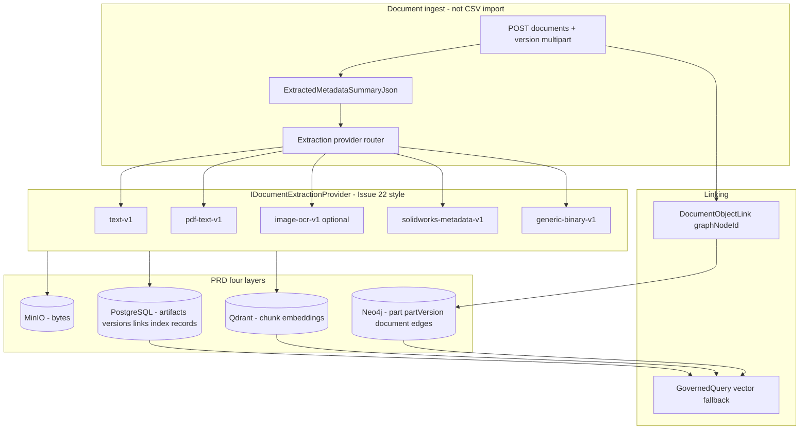

# Issue 12.1: Governed Document Ingest, Extraction Parsers, and Qdrant Retrieval

Source PRD: `engineering-execution-prd.md` (Document Memory Layers, user stories 28–31, 35, 38)  
Related issues: Issue 12 (document memory foundation — ~80% complete), Issue 13 (governed query — vector fallback deferred), Issue 22 (connector/tool registry), Issue 29 (PDM `part` / `partVersion` graph — file metadata linkage)  
Label: `needs-triage`

## Summary

Complete the **remaining ~20% of Issue 12** and wire **live Qdrant retrieval** into governed context assembly. Deliver a PRD-aligned document ingest path where:

1. **Files** (CAD attachments, PDFs, specs, images, text) upload through the **Document Memory** module (not CSV import staging).
2. **Pluggable extraction providers** (by MIME/extension) produce safe text/metadata summaries.
3. **Qdrant** stores chunk embeddings as a **retrieval index only** (not source of truth).
4. **Document-object links** connect document versions to trusted `part` / `partVersion` graph nodes (and optionally import batches).
5. **Identity resolution** remains for **cross-system record matching** (e.g. Odoo ↔ PDM) — not for file→parent linking.

Do **not** introduce a parallel `ArchiveFiles` graph object that duplicates `DocumentArtifact`, ontology `document`, and `partVersion.fileName`. Extend the manufacturing package and existing document APIs instead.

---

## Problem statement

Issue 12 landed the contracts and disabled placeholders:

| Capability | Current state |
| ---------- | ------------- |
| `DocumentArtifact` / `DocumentVersion` / `DocumentObjectLink` | Implemented |
| File storage | Local disk (`LocalDocumentFileStorage`) |
| Vector indexing | `DisabledDocumentVectorIndexingService` → `DisabledPlaceholder` records only |
| Governed query | Graph-first, linked document **SQL metadata** second; `AllowsVectorFallback = false` |
| CAD parsing | `DisabledCadParsingPlaceholder` (intentional per PRD story 31) |
| Ontology `document` type | Declared in `object-types.json`; no attribute schema or import profile |
| PDM `fileName` on `partVersion` | Graph attribute from CSV import only — no document/vector pipeline |

Operators cannot yet:

- Upload a SolidWorks file, PDF, or Odoo attachment and get governed vector retrieval in chat/query.
- Register or swap extraction parsers (PDF vs text vs SolidWorks metadata vs generic binary).
- Rely on automatic indexing after upload.
- Use semantic document fallback in governed context assembly.

Issue 8 **CSV import** remains the path for structured `part` / `partVersion` / BOM rows. **Binary file ingest** is a separate document-memory slice.

---

## PRD alignment

### Four document memory layers (must preserve)

| Layer | Role | Source of truth? |
| ----- | ---- | ---------------- |
| Object storage (MinIO) | Original file bytes | Yes for files |
| PostgreSQL | Metadata, links, extraction status, vector index records, audit | Yes for governed metadata |
| Qdrant | Chunks, embeddings | **No** — retrieval index only |
| Graph (Neo4j) | `part` ↔ `partVersion` ↔ `document` relationships | Yes for connected context |

### Retrieval order (Issue 13)

```text
Trusted graph → linked document metadata (SQL) → vector/semantic fallback (Qdrant) → LLM
```

Tenant, classification, and trust filters apply **before** vector chunks become LLM-visible.

### CAD scope (story 31)

- **In scope:** CAD **metadata** (filename, vault path, custom properties, sidecar exports, checksum).
- **Out of scope:** Native SolidWorks **geometry** parsing (remains disabled placeholder or metadata-only provider).

### Linking vs identity resolution

| Mechanism | Use for file ingest |
| --------- | ------------------- |
| `DocumentObjectLink` → `graphNodeId` | Primary: file version → `part` or `partVersion` node |
| Graph relationship `part references document` | Optional staged `document` node in trusted graph |
| Identity resolution (Issue 9) | Only when the **same logical record** appears in multiple systems (Odoo attachment ↔ PDM file) |

---

## Target metadata model (manufacturing package)

Canonical fields for PDM/Odoo file evidence (stored on `DocumentVersion.ExtractedMetadataSummaryJson` and/or ontology `document` attributes):

| Field | Maps to |
| ----- | ------- |
| `documentId` | PDM part file id (`part.documentId`) |
| `pdmVersionKey` / `revision` | PDM version (`partVersion.pdmVersionKey`) |
| `filePath` | Vault or ERP storage path (metadata only — not a public raw URL) |
| `sourceSystem` | `SOLIDWORKS-PDM`, `ODOO-ERP`, etc. |
| `contentType` / `originalFileName` | From upload |
| `odooProductId` / `sourceDocumentId` | Odoo cross-refs when applicable |

**Recommended package choice:** extend ontology type `document` with attribute schema entries — do not add `ArchiveFiles` as a fourth parallel naming scheme unless a future ADR justifies it.

---

## Architecture



---

## Sub-slices

### 12.1.0 Manufacturing ontology extension for file evidence

**Path:** `packages/manufacturing-reference/ontology/`

- Add `attribute-schema.json` entries for `document`: `documentNumber`, `revision`, `filePath`, `sourceSystem`, `storageKey`, `contentType`, `sourceDocumentId`, `sourcePdmVersionKey` (subset as needed).
- Confirm or extend `relationships.json`: `part references document` (existing); optional `partVersion describes document` if version-scoped evidence is required.
- Add `profiles/document-import-mappings.json` only if graph-visible `document` nodes are staged from a **metadata manifest CSV** (optional; not required for API-only upload).
- Update `semantic-layer-mappings.json` for `document` / `DOCUMENT` if graph staging is added.
- Re-install reference package after publish.

---

### 12.1.1 Object storage — MinIO behind `IDocumentFileStorage`

**Problem:** Document and import file storage use local disk in dev.

**Solution:**

- Implement `MinioDocumentFileStorage` (or shared MinIO adapter) behind `IDocumentFileStorage`.
- Keep `LocalDocumentFileStorage` for tests without MinIO.
- Bind via `DocumentFileStorage` / shared object-storage options consistent with import evidence storage.
- Tests: Testcontainers MinIO upload + checksum round-trip.

---

### 12.1.2 Document extraction provider registry

**Problem:** No pluggable parsers; extraction status is set manually on upload.

**Solution:**

- Add `IDocumentExtractionProvider` with `ProviderKey`, supported extensions/MIME types, and `ExtractAsync(stream, context) → DocumentExtractionResult` (safe text, metadata JSON, status).
- Register providers in DI; router selects by extension/MIME with fallback to `generic-binary-v1`.
- Ship MVP providers:

  | Provider key | Scope |
  | ------------ | ----- |
  | `text-v1` | `.txt`, plain text |
  | `pdf-text-v1` | PDF text layer (no OCR requirement for MVP) |
  | `solidworks-metadata-v1` | Filename, custom properties, sidecar XML/JSON if present — **not** geometry |
  | `generic-binary-v1` | Checksum, filename, size, safe summary only |

- Optional deferred: `image-ocr-v1` (explicitly gated; may return `Uncertain` + DQ issue).
- Wire `DocumentService.AddVersionAsync` to run extraction after store (sync for MVP; async queue deferred to Issue 22 MassTransit follow-up).
- Register parser connectors as **read-only** `ConnectorDefinition` metadata where Issue 22 patterns apply (dry-run returns capability summary; no external write).

**CAD:** `ICadParsingPlaceholder` remains for **geometry**; `solidworks-metadata-v1` is metadata-only and does not enable geometry parsing.

---

### 12.1.3 Live Qdrant vector indexing

**Problem:** `DisabledDocumentVectorIndexingService` records placeholders only.

**Solution:**

- Implement `QdrantDocumentVectorIndexingService` using `Qdrant.Client`.
- On successful extraction: chunk safe text → embed (configurable provider; OpenAI or local compatible endpoint) → upsert to tenant-scoped collection with payload:
  - `tenantId`, `documentVersionId`, `documentArtifactId`, `classificationKey`, `graphNodeIds[]` (from links), `sourceSystem`, `safeSummary`
- Update `DocumentVectorIndexRecord`: `Indexed` / `Failed` with failure summary.
- Auto-trigger indexing after extraction completes (config flag `DocumentVectorIndexing:Enabled`).
- Keep `DisabledDocumentVectorIndexingService` when Qdrant disabled in config/tests.
- Tests: Testcontainers Qdrant — index + point count + tenant filter on payload.

**Public APIs still do not expose raw Qdrant or raw file bytes.**

---

### 12.1.4 Governed query vector fallback

**Problem:** Issue 13 implemented graph + SQL document metadata; vector fallback disabled.

**Solution:**

- When `RetrievalStrategyVersion.AllowsVectorFallback` is true and graph/document SQL candidates are insufficient, query Qdrant with same tenant/classification/trust filters.
- Merge vector hits into `RetrievedContextCandidate` with safe summaries only (chunk text subject to policy).
- Enable vector fallback on `document-evidence-context` intent (or dedicated strategy flag) when Qdrant is enabled.
- Record vector sources in `RetrievalRun` / AI Trace metadata.
- Tests: indexed document surfaces in governed query assembly; restricted classification excluded.

---

### 12.1.5 Linking, ingest runbook, UI, and integration smoke

**Linking API (extend existing):**

- Document upload request accepts optional link hints: `targetGraphNodeId`, `targetObjectType`, identity keys (`documentId`, `pdmVersionKey`) for server-side node resolution after promote.
- On link create: if confidence &lt; 0.75 or `Uncertain`, existing DQ hook applies.

**Runbook** (`docs/local-development.md`, `ETOS.Helpers/README.md` or new `docs/document-ingest.md`):

1. Import and promote PDM/Odoo CSV batches (Issue 29).
2. Upload files via document API with metadata JSON (`documentId`, `pdmVersionKey`, `filePath`).
3. Confirm extraction + vector index status on `/documents`.
4. Create `DocumentObjectLink` to trusted `part` / `partVersion` node (or use auto-resolve by identity keys).
5. Run governed chat / `document-evidence-context` query — verify graph + document + vector evidence in trace.

**UI (minimal):**

- Extend `/documents` or import wizards with “attach file to staged/promoted part” harness (multipart via API route if server-action size limits apply).
- Show extraction provider used, index status, linked graph node id.

**Integration test:**

- Promote PDM demo `part` + `partVersion` → upload PDF/text fixture → link → index → governed query returns document/vector candidate.

**Optional Issue 29 follow-up (29.6 — not blocking 12.1):**

- PDM transform emits `document-manifest.csv` (metadata rows only) for bulk link planning; binaries still upload through document API.

---

## Acceptance criteria

### Ontology (12.1.0)

- [ ] Manufacturing package defines `document` attribute schema for file evidence fields.
- [ ] Relationships support part/version → document evidence without new `ArchiveFiles` type.

### Storage (12.1.1)

- [ ] `IDocumentFileStorage` can use MinIO in local Docker Compose.
- [ ] Local disk implementation remains for fast tests.

### Extraction (12.1.2)

- [ ] Router selects provider by file type with generic fallback.
- [ ] At least `text-v1`, `pdf-text-v1`, `generic-binary-v1` implemented and tested.
- [ ] `solidworks-metadata-v1` returns metadata only; geometry placeholder unchanged.
- [ ] Extraction failures and uncertain results create reviewable DQ issues.

### Vector index (12.1.3)

- [ ] Live Qdrant indexing when enabled in config.
- [ ] `DocumentVectorIndexRecord` reflects real `Indexed` / `Failed` states.
- [ ] Tenant and classification metadata stored on index records and Qdrant payloads.
- [ ] No public API exposes raw Qdrant or embeddings.

### Retrieval (12.1.4)

- [ ] Governed query can use vector fallback when strategy allows and Qdrant is enabled.
- [ ] Restricted documents/chunks excluded before LLM context assembly.
- [ ] AI Trace records vector source participation.

### End-to-end (12.1.5)

- [ ] Documented runbook from PDM-promoted graph → file upload → link → query.
- [ ] Integration test proves indexing + retrieval path.
- [ ] Identity resolution not misused for primary file→parent linking.

---

## Out of scope

- Native SolidWorks **geometry** parsing or CAD write-back.
- CSV import engine accepting binary files as staging rows.
- Vectors as primary Neo4j nodes.
- Live OCR requirement for MVP (optional provider may defer).
- Async MassTransit document processing queue (defer unless Issue 22 queue is ready).
- Full production document upload UI (minimal harness only).
- Automatic identity resolution for every file upload.
- Storing raw file content in PostgreSQL or returning raw bytes from public APIs.

---

## Dependency graph

```text
Issue 12 (contracts) ──► Issue 12.1 (live ingest + Qdrant + parsers)
Issue 18.5 (mfg package) ──► 12.1.0 ontology extension
Issue 22 (connector patterns) ──► 12.1.2 parser registration style
Issue 29 (part/partVersion graph) ──► 12.1.5 link targets + optional 29.6 manifest
Issue 12.1 ──► completes Issue 13 vector fallback acceptance gap
Issue 1 (MinIO infra) ──► 12.1.1
```

**Blocked by:** Issue 12 (foundation), Issue 18.5 (package publish path).  
**Blocks:** Full PRD acceptance of Issue 12 vector criteria; semantic document fallback in Issue 13/15 demos.

---

## Implementation order (recommended)

1. **12.1.1** MinIO document storage adapter + tests.
2. **12.1.2** Extraction provider registry + text/PDF/generic providers.
3. **12.1.3** Qdrant indexing service + auto-index hook.
4. **12.1.0** Package ontology extension (can parallel with 2–3).
5. **12.1.4** Governed query vector fallback.
6. **12.1.5** Runbook, UI harness, integration smoke.

---

## Key files (implementation reference)

| Area | Files |
| ---- | ----- |
| Document module | `ETOS.Backend/Documents/DocumentService.cs`, `DocumentStorage.cs`, `DocumentContracts.cs`, `DocumentEndpointExtensions.cs` |
| Extraction (new) | `ETOS.Backend/Documents/Extraction/**` |
| Qdrant (new) | `ETOS.Backend/Documents/QdrantDocumentVectorIndexingService.cs` or `Infrastructure/Vector/**` |
| Governed query | `ETOS.Backend/GovernedQuery/GovernedQueryService.cs` |
| Tool registry | `ETOS.Backend/ToolRegistry/**` (connector metadata for parsers) |
| Ontology | `packages/manufacturing-reference/ontology/**` |
| Config | `ETOS.Backend/appsettings.json`, `.env.example` |
| Tests | `ETOS.Backend.Tests/DocumentMemoryTests.cs`, new `DocumentIngestFlowTests.cs`, `GovernedQueryTests.cs` |
| Frontend | `ETOS.Frontend/src/app/documents/**`, optional wizard attach panel |
| Docs | `docs/local-development.md`, `docs/document-ingest.md` (new) |

---

## Review questions

1. Should graph-visible `document` nodes be staged from a manifest CSV, or is API-only upload sufficient for MVP?
2. Is `image-ocr-v1` in MVP or explicitly deferred?
3. Should auto-link by `documentId` + `pdmVersionKey` require trusted graph only, or allow staging nodes?
4. Embedding provider: OpenAI only vs pluggable `IEmbeddingProvider` from day one?
