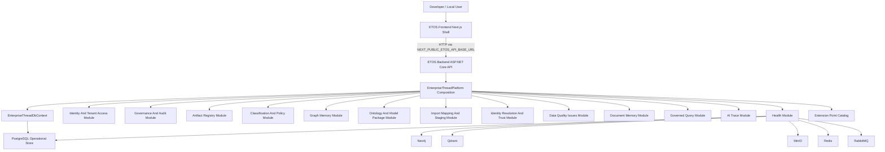

# EnterpriseThreadOS Architecture

EnterpriseThreadOS is intended to become an AI-native Enterprise Digital Thread Operating System. The current repository is the local-first platform foundation for that product: a .NET modular monolith backend, a Next.js frontend shell, local infrastructure services, persistence, health checks, tenant identity/access, audit/security events, the BaseArtifact registry foundation, graph memory, canonical model governance, import/mapping/staging, identity-resolution review and trust scoring, data-quality issue review hooks, and document memory/object linking.

For product intent, start with `.docs/.prd/engineering-execution-prd.md`. For implementation order, use `.docs/.prd/engineering-execution-issues.md`.

## Current System

## Implemented Components

- `ETOS.Backend/Program.cs` creates the ASP.NET Core app, maps OpenAPI in development, enables CORS/auth, and maps health, identity/access, governance, and artifact endpoints.
- `ETOS.Backend/Platform/EnterpriseThreadPlatform.cs` centralizes platform service registration: options, EF Core, Identity, authentication, authorization, CORS, health checks, tenant context, identity access services, audit services, artifact registry services, and extension point catalog.
- `ETOS.Backend/Infrastructure/Persistence/EnterpriseThreadDbContext.cs` is the operational EF Core context using ASP.NET Identity, tenant identity/access models, audit records, security events, and artifact registry records.
- `ETOS.Backend/Health/` exposes app, infrastructure, and aggregate platform health.
- `ETOS.Backend/Identity/` contains tenant, user, role, permission, membership, access grant, access request, local header auth, tenant context resolution, denial audit records, services, DTOs, and minimal API endpoint mapping.
- `ETOS.Backend/Governance/` contains audit/security models, recorder services, tenant-filtered explorer services, DTOs, and minimal API endpoint mapping.
- `ETOS.Backend/Artifacts/` contains tenant-scoped artifacts, immutable versions, generic relationships, dependency edges, readiness/publish services, DTOs, and minimal API endpoint mapping.
- `ETOS.Backend/Classification/` contains versioned classification schemes, policy versions, restricted context rules, policy evaluation, policy impact, artifact publish risk integration, DTOs, and minimal API endpoint mapping.
- `ETOS.Backend/GraphMemory/` contains the internal graph memory abstraction, Neo4j driver implementation, graph health/bootstrap services, and optional disabled Memgraph adapter placeholder.
- `ETOS.Backend/Ontology/` contains versioned ontology, semantic layer, lifecycle vocabulary, attribute schema, model package records, publish validation, DTOs, and minimal API endpoint mapping.
- `ETOS.Backend/Imports/` contains import batches, raw file evidence metadata, CSV/Excel parsing, deterministic mapping preview/approval, validation, staging graph creation, DTOs, and minimal API endpoint mapping.
- `ETOS.Backend/IdentityResolution/` contains identity resolution rules, deterministic candidate generation from staged import identity fields, human review decisions, identity-link graph relationship creation, learning evidence, trust score records, DTOs, and minimal API endpoint mapping.
- `ETOS.Backend/DataQuality/` contains durable data-quality issues, source links, trust-impact metadata, security-event review hooks, inert monitoring placeholders, DTOs, and minimal API endpoint mapping.
- `ETOS.Backend/Documents/` contains document artifacts, immutable document versions, document-object links, extraction issue hooks, vector indexing metadata records, disabled CAD parsing placeholder contracts, DTOs, and minimal API endpoint mapping.
- `ETOS.Backend/GovernedQuery/` contains query intent versions, retrieval strategy versions, fixed platform query intents, retrieval runs, context packages, context access decisions, governed query service with graph-first document-second retrieval, policy-filtered context assembly, and minimal API endpoint mapping.
- `ETOS.Backend/AiTrace/` contains AI Trace records, artifact links, on-demand export audit metadata, trace explorer service with separate view/export permissions, redaction metadata, export denial security events, and minimal API endpoint mapping.
- `ETOS.Backend/Tenancy/` contains tenant-scope conventions used by persisted tenant-owned records.
- `ETOS.Backend/Platform/Extensions/` exposes deferred extension points for planned platform capabilities without pretending they are active.
- `ETOS.Frontend/` is a Next.js 16 shell that renders local platform health from the backend.
- `infra/local/docker-compose.yml` defines local PostgreSQL, Neo4j, Qdrant, MinIO, Redis, and RabbitMQ services, with Memgraph available only through an optional evaluation profile.

## Implemented Vs Planned

Implemented or partially implemented:

- Local Docker Compose infrastructure for platform dependencies.
- ASP.NET Core backend host with centralized composition.
- EF Core PostgreSQL operational store.
- Health endpoints for app and infrastructure status.
- Next.js frontend health shell.
- Extension point catalog for deferred capabilities.
- Tenant identity/access baseline.
- Audit records, security events, retention placeholders, and tenant-filtered governance explorer endpoints.
- BaseArtifact registry foundation with immutable versions, generic relationships, dependency edges, readiness-aware publish checks, and a minimal artifact explorer.
- Graph memory abstraction and Neo4j backend foundation for tenant-scoped BaseNode/BaseRelationship records.
- Classification and policy enforcement foundation with pre-context filtering contracts and artifact publish risk checks.
- Canonical ontology and tenant schema foundation with model packages, lifecycle vocabularies, attribute schemas, BOM metadata, and a minimal model-artifacts UI.
- Import mapping and staging graph foundation with raw evidence metadata, CSV/Excel import parsing, deterministic mapping suggestions, approved immutable mapping versions, row validation, and staging/unverified graph writes.
- Identity resolution and trust-scoring foundation with deterministic cross-source candidate links, approval/rejection/conflict review decisions, graph `IDENTITY_LINK` relationships instead of destructive merges, learning evidence, trust score breakdowns, and a minimal imports-page review UI.
- Data quality issue foundation with durable issue records generated from import validation, manual issue creation, security-event review hooks, severity-to-trust-impact metadata, review-priority metadata, inert monitoring placeholders, and a minimal imports-page UI.
- Document memory foundation with document artifact metadata, immutable version storage metadata, document-to-graph/import links, extraction issue hooks, Qdrant-ready vector indexing records, disabled native CAD geometry parsing placeholder, and a minimal documents-page UI.
- Governed query and context assembly foundation with fixed platform query intents (object-360-context, bom-impact-context, document-evidence-context), retrieval runs, context packages, policy-filtered LLM-safe context assembly, denied context separation, and trust/conflict filtering.
- AI Trace foundation for governed-query runs with trace records, artifact links, tenant-scoped trace explorer APIs, separate view/export permissions, on-demand export packages with redaction metadata, export audit records, and a minimal `/ai-traces` UI.

Planned by PRD and backlog, but not generally implemented unless future source code says otherwise:

- Graph business flows beyond the current import staging and identity-review foundations: trusted graph promotion, snapshots, diffs, and governed traversals.
- Full review task workflows for data quality issues, including assignment, blocking, escalation, completion, and decision creation.
- Live Qdrant indexing/provider execution.
- Governed chat, dashboard/report generation, recommendations, review tasks, decisions, outcomes, and learning.
- Tool registry, agent runtime, workflow runtime, multi-agent collaboration, and enterprise action framework.
- Neo4j Agent Memory or any other persistent agent-memory provider. These remain deferred behind EnterpriseThreadOS-owned contracts and must not replace the platform graph memory abstraction.
- Live enterprise connectors, source-system write actions, external collaboration portal, Keycloak, Temporal, Kubernetes, and production multi-tenant deployment hardening.

## Backend Request Flow

1. `Program.cs` builds the web app and calls `AddEnterpriseThreadPlatform`.
2. Platform composition binds options, configures EF Core/PostgreSQL, Identity, local header auth, CORS, health services, tenant context, and module services.
3. Endpoint extension methods map routes.
4. Tenant-protected identity endpoints resolve tenant context from the authenticated user and `X-ETOS-Tenant-Id`.
5. Unauthorized or cross-tenant access fails closed and writes an access-denial record plus first-class audit/security records.
6. Services use DTOs and EF Core persistence through `EnterpriseThreadDbContext`.

## Data Ownership

Current SQL ownership:

- ASP.NET Identity users and roles.
- Tenants, memberships, tenant roles, permissions, role-permission assignments, access grants, access requests, access-denial audit records, audit records, security events, artifacts, artifact versions, artifact relationships, artifact dependency edges, classification/policy records, ontology versions, semantic layer versions, lifecycle vocabularies, attribute schemas, model package versions, import batches, file evidence metadata, mapping versions, validation issues, staging run summaries, identity resolution rules, identity candidate links, review decisions, learning evidence, trust score records, data-quality issues, issue source links, trust-impact records, monitoring issue type placeholders, document artifacts, document versions, document-object links, document vector index records, query intent versions, retrieval strategy versions, retrieval runs, context packages, context access decisions, AI trace records, AI trace artifact links, and AI trace export audit records.
- Early tenant-scoped persistence conventions.

Current local infrastructure availability:

- PostgreSQL is the active operational store.
- Neo4j, Qdrant, MinIO, Redis, and RabbitMQ are available locally for health and future slices. Memgraph is available only through an optional graph-adapter evaluation profile.

Future PRD ownership model:

- SQL stores operational, governance, artifact, audit, runtime summary, and tenant state.
- Graph memory stores connected enterprise objects, versions, relationships, BOM structures, identity links, document links, quality links, and dependency projections.
- The Neo4j Digital Thread Graph also serves as the platform's context graph for governed agent retrieval.
- Object storage holds import files, documents, extraction artifacts, and trace export packages. Current import and document file storage use local file-backed abstractions while preserving the object-storage boundary.
- Vector memory supports document retrieval after tenant/policy filtering. Current document vector indexing records provider/filter metadata only; live Qdrant execution is deferred.
- Persistent agent memory, if added later, stores governed conversation, fact/preference, and reasoning memory behind an internal provider contract. It cannot directly promote learned facts into trusted graph state.

## Guardrails

- Source systems remain read-only in MVP.
- Platform-owned overlays may be created only when the owning issue defines behavior and tests.
- Restricted data must be filtered before LLM context assembly.
- Public APIs must not expose raw graph or database query access.
- Agents must use approved backend tool/context APIs. Future Agent Memory integrations stay behind platform contracts and cannot bypass tenant, policy, trace, audit, or review boundaries.
- Future extension points should stay honest: contracts and documentation are acceptable; mock implementations that look production-ready are not.

## Related Docs

- `AGENTS.md`
- `README.md`
- `docs/local-development.md`
- `docs/backend/architecture.md`
- `docs/frontend/architecture.md`
- `docs/architecture/extension-points.md`
- `docs/architecture/adr/README.md`
- `docs/ai-agent-workflow.md`
