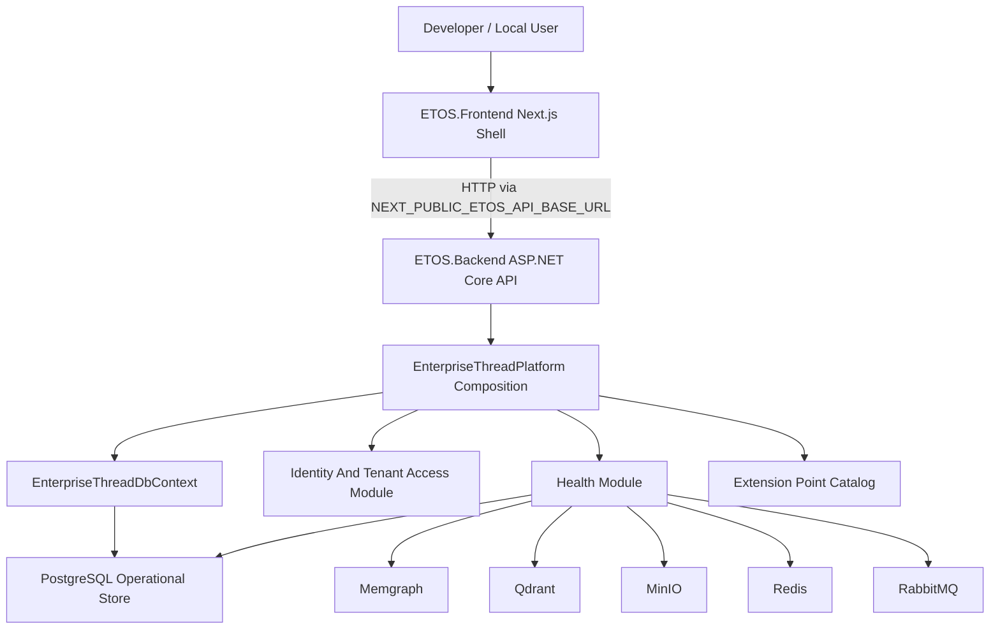

# EnterpriseThreadOS Architecture

EnterpriseThreadOS is intended to become an AI-native Enterprise Digital Thread Operating System. The current repository is the local-first platform foundation for that product: a .NET modular monolith backend, a Next.js frontend shell, local infrastructure services, persistence, health checks, and partial tenant identity/access foundation.

For product intent, start with `.docs/.prd/engineering-execution-prd.md`. For implementation order, use `.docs/.prd/engineering-execution-issues.md`.

## Current System

## Implemented Components

- `ETOS.Backend/Program.cs` creates the ASP.NET Core app, maps OpenAPI in development, enables CORS/auth, and maps health plus identity/access endpoints.
- `ETOS.Backend/Platform/EnterpriseThreadPlatform.cs` centralizes platform service registration: options, EF Core, Identity, authentication, authorization, CORS, health checks, tenant context, identity access services, and extension point catalog.
- `ETOS.Backend/Infrastructure/Persistence/EnterpriseThreadDbContext.cs` is the operational EF Core context using ASP.NET Identity and tenant identity/access models.
- `ETOS.Backend/Health/` exposes app, infrastructure, and aggregate platform health.
- `ETOS.Backend/Identity/` contains tenant, user, role, permission, membership, access grant, access request, local header auth, tenant context resolution, denial audit records, services, DTOs, and minimal API endpoint mapping.
- `ETOS.Backend/Tenancy/` contains tenant-scope conventions used by persisted tenant-owned records.
- `ETOS.Backend/Platform/Extensions/` exposes deferred extension points for planned platform capabilities without pretending they are active.
- `ETOS.Frontend/` is a Next.js 16 shell that renders local platform health from the backend.
- `infra/local/docker-compose.yml` defines local PostgreSQL, Memgraph, Qdrant, MinIO, Redis, and RabbitMQ services.

## Implemented Vs Planned

Implemented or partially implemented:

- Local Docker Compose infrastructure for platform dependencies.
- ASP.NET Core backend host with centralized composition.
- EF Core PostgreSQL operational store.
- Health endpoints for app and infrastructure status.
- Next.js frontend health shell.
- Extension point catalog for deferred capabilities.
- Tenant identity/access baseline is partially present in source code.

Planned by PRD and backlog, but not generally implemented unless future source code says otherwise:

- BaseArtifact registry and dependency graph.
- Classification and policy enforcement beyond identity/access placeholders.
- Graph memory abstraction and Memgraph business graph operations.
- Canonical ontology, semantic layer, model packages, imports, staging graph, trusted graph promotion, identity resolution, and trust scoring.
- Document memory, Qdrant indexing, governed query intents, context assembly, and AI Trace.
- Governed chat, dashboard/report generation, recommendations, review tasks, decisions, outcomes, and learning.
- Tool registry, agent runtime, workflow runtime, multi-agent collaboration, and enterprise action framework.
- Live enterprise connectors, source-system write actions, external collaboration portal, Keycloak, Temporal, Kubernetes, and production multi-tenant deployment hardening.

## Backend Request Flow

1. `Program.cs` builds the web app and calls `AddEnterpriseThreadPlatform`.
2. Platform composition binds options, configures EF Core/PostgreSQL, Identity, local header auth, CORS, health services, tenant context, and module services.
3. Endpoint extension methods map routes.
4. Tenant-protected identity endpoints resolve tenant context from the authenticated user and `X-ETOS-Tenant-Id`.
5. Unauthorized or cross-tenant access fails closed and writes a minimal access-denial audit record.
6. Services use DTOs and EF Core persistence through `EnterpriseThreadDbContext`.

## Data Ownership

Current SQL ownership:

- ASP.NET Identity users and roles.
- Tenants, memberships, tenant roles, permissions, role-permission assignments, access grants, access requests, and access-denial audit records.
- Early tenant-scoped persistence conventions.

Current local infrastructure availability:

- PostgreSQL is the active operational store.
- Memgraph, Qdrant, MinIO, Redis, and RabbitMQ are available locally for health and future slices.

Future PRD ownership model:

- SQL stores operational, governance, artifact, audit, runtime summary, and tenant state.
- Graph memory stores connected enterprise objects, versions, relationships, BOM structures, identity links, document links, quality links, and dependency projections.
- Object storage holds import files, documents, extraction artifacts, and trace export packages.
- Vector memory supports document retrieval after tenant/policy filtering.

## Guardrails

- Source systems remain read-only in MVP.
- Platform-owned overlays may be created only when the owning issue defines behavior and tests.
- Restricted data must be filtered before LLM context assembly.
- Public APIs must not expose raw graph or database query access.
- Future extension points should stay honest: contracts and documentation are acceptable; mock implementations that look production-ready are not.

## Related Docs

- `AGENTS.md`
- `README.md`
- `docs/local-development.md`
- `docs/backend/architecture.md`
- `docs/frontend/architecture.md`
- `docs/architecture/extension-points.md`
- `docs/architecture/adr/README.md`
- `docs/ai-agent-workflow.md`
