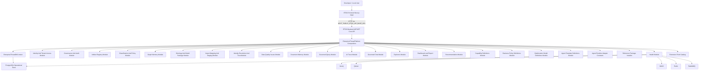

# EnterpriseThreadOS Architecture

EnterpriseThreadOS is intended to become an AI-native Enterprise Digital Thread Operating System. The current repository is the local-first platform foundation for that product: a .NET modular monolith backend, a Next.js frontend shell, local infrastructure services, persistence, health checks, tenant identity/access, audit/security events, the BaseArtifact registry foundation, graph memory, canonical model governance, package-driven import/mapping/staging, identity-resolution review and trust scoring, data-quality issue review hooks, document memory/object linking, governed query/context assembly, AI Trace, governed chat, explorers/360° context views, dashboard/report artifacts, recommendation artifacts, Layer 3–6 governed artifact definitions (capabilities, business policies, optimization models, agent templates), agent runtime adapter contracts, and the manufacturing reference domain package.

For product intent, start with `.docs/.prd/engineering-execution-prd.md`. For implementation order, use `.docs/.prd/engineering-execution-issues.md`.

## Current System

```mermaid
flowchart TB
    user["Developer / Local User"] --> frontend["ETOS.Frontend Next.js Shell"]
    frontend -->|"HTTP via NEXT_PUBLIC_ETOS_API_BASE_URL"| backend["ETOS.Backend ASP.NET Core API"]

    backend --> platform["EnterpriseThreadPlatform Composition"]
    platform --> health["Health Module"]
    platform --> identity["Identity And Tenant Access Module"]
    platform --> governance["Governance And Audit Module"]
    platform --> artifacts["Artifact Registry Module"]
    platform --> classification["Classification And Policy Module"]
    platform --> graphmemory["Graph Memory Module"]
    platform --> ontology["Ontology And Model Package Module"]
    platform --> imports["Import Mapping And Staging Module"]
    platform --> identityresolution["Identity Resolution And Trust Module"]
    platform --> dataquality["Data Quality Issues Module"]
    platform --> documents["Document Memory Module"]
    platform --> governedquery["Governed Query Module"]
    platform --> aitrace["AI Trace Module"]
    platform --> governedchat["Governed Chat Module"]
    platform --> explorers["Explorers Module"]
    platform --> dashboards["Dashboard and Report Module"]
    platform --> recommendations["Recommendation Module"]
    platform --> capabilities["Capability Definitions Module"]
    platform --> businesspolicies["Business Policy Definitions Module"]
    platform --> optimization["Optimization Model Definitions Module"]
    platform --> agenttemplates["Agent Template Definitions Module"]
    platform --> agentruntime["Agent Runtime Adapter Contracts"]
    platform --> packages["Reference Package Installer"]
    platform --> persistence["EnterpriseThreadDbContext"]
    platform --> extensions["Extension Point Catalog"]

    persistence --> postgres["PostgreSQL Operational Store"]
    health --> postgres
    health --> neo4j["Neo4j"]
    health --> qdrant["Qdrant"]
    health --> minio["MinIO"]
    health --> redis["Redis"]
    health --> rabbitmq["RabbitMQ"]
```

## Implemented Components

- `ETOS.Backend/Program.cs` creates the ASP.NET Core app, maps OpenAPI in development, enables CORS/auth, and maps health, identity/access, governance, and artifact endpoints.
- `ETOS.Backend/Platform/EnterpriseThreadPlatform.cs` centralizes platform service registration: options, EF Core, Identity, authentication, authorization, CORS, health checks, tenant context, identity access services, audit services, artifact registry services, and extension point catalog.
- `ETOS.Backend/Infrastructure/Persistence/EnterpriseThreadDbContext.cs` is the operational EF Core context using ASP.NET Identity, tenant identity/access models, audit records, security events, and artifact registry records.
- `ETOS.Backend/Health/` exposes app, infrastructure, and aggregate platform health.
- `ETOS.Backend/Identity/` contains tenant, user, role, permission, membership, access grant, access request, local header auth, tenant context resolution, denial audit records, services, DTOs, and minimal API endpoint mapping.
- `ETOS.Backend/Governance/` contains audit/security models, recorder services, tenant-filtered explorer services, DTOs, and minimal API endpoint mapping.
- `ETOS.Backend/Artifacts/` contains tenant-scoped artifacts, immutable versions, generic relationships, dependency edges, readiness/publish services, DTOs, and minimal API endpoint mapping.
- `ETOS.Backend/Classification/` contains versioned classification schemes, policy versions, restricted context rules, policy evaluation, policy impact, artifact publish risk integration, DTOs, and minimal API endpoint mapping.
- `ETOS.Backend/GraphMemory/` contains the internal graph memory abstraction, Neo4j driver implementation, graph health/bootstrap services, and optional disabled Memgraph adapter placeholder.
- `ETOS.Backend/Ontology/` contains versioned ontology, semantic layer, lifecycle vocabulary, attribute schema, model package records with optional `ImportProfileJson` and `QueryIntentExtensionsJson`, publish validation, `IModelPackageContextResolver`, DTOs, and minimal API endpoint mapping.
- `ETOS.Backend/Imports/` contains import batches, raw file evidence metadata, CSV/Excel parsing, `IMappingSuggestionProvider` mapping preview (`rule-based-v1` default; `pydantic-ai-v1` LLM provider via shared agent runtime kernel and published mapping assistant agent config), mapping preview diagnostics (`includeDiagnostics`), mapping-predictor tool prefetch via orchestrator, mapping approve/reject/correct learning-signal inputs, package-driven validation/staging/BOM comparison, DTOs, and minimal API endpoint mapping.
- `ETOS.Backend/IdentityResolution/` contains identity resolution rules, deterministic candidate generation from staged import identity fields, human review decisions, identity-link graph relationship creation, learning evidence, trust score records, DTOs, and minimal API endpoint mapping.
- `ETOS.Backend/DataQuality/` contains durable data-quality issues, source links, trust-impact metadata, security-event review hooks, inert monitoring placeholders, DTOs, and minimal API endpoint mapping.
- `ETOS.Backend/Documents/` contains document artifacts, immutable document versions, document-object links, extraction issue hooks, vector indexing metadata records, disabled CAD parsing placeholder contracts, DTOs, and minimal API endpoint mapping.
- `ETOS.Backend/GovernedQuery/` contains query intent versions, retrieval strategy versions, fixed platform query intents with package-driven relationship resolution for `bom-impact-context`, retrieval runs, context packages, context access decisions, governed query service with graph-first document-second retrieval, policy-filtered context assembly, and minimal API endpoint mapping.
- `ETOS.Backend/AiTrace/` contains AI Trace records, artifact links, on-demand export audit metadata, trace explorer service with separate view/export permissions, redaction metadata, export denial security events, and minimal API endpoint mapping.
- `ETOS.Backend/GovernedChat/` contains governed chat sessions/turns, platform-seeded `PromptTemplateVersion` and `OutputSchemaVersion` artifacts, deterministic default LLM completion with optional OpenAI provider behind config, output schema validation, chat-to-artifact draft creation via the artifact registry, enriched `GovernedChat` AI Trace records with pinned prompt/output labels, and minimal API endpoint mapping.
- `ETOS.Backend/Explorers/` contains read-only explorer orchestration for tenant-filtered artifact/graph/document/context-package/decision lists (with status/conflict/outcome/evidence filters), generic 360° context views, governance flow projections, policy/trust-filtered graph browse, and minimal API endpoint mapping.
- `ETOS.Backend/Dashboards/` contains dashboard/report template parsing, governed-query preview orchestration, readiness validation and mark-ready workflow, JSON export builder with audit records, and governance KPI block rendering wired to live analytics from `GovernanceAnalytics`.
- `ETOS.Backend/GovernanceAnalytics/` contains platform-defined governance KPI calculations, trend aggregation, high-risk recommendation views, graph relationship supplements, unified dashboard APIs under `/api/admin/governance-analytics`, and custom KPI placeholder catalog entries only (no tenant-configurable formulas in MVP).
- `ETOS.Backend/Recommendations/` contains versioned `RecommendationVersion` artifacts with embedded evidence links and suggested actions, trust/conflict-aware readiness validation, package-neutral evidence resolution for data-quality issues and BOM comparison runs, creation factories (manual, data quality, BOM comparison, governed chat draft, dashboard/report provenance), suggested-action status transitions with audit, and minimal API endpoint mapping. Review-task conversion from suggested actions is implemented in Issue 19 (`ETOS.Backend/ReviewTasks/`). Agent/workflow auto-creation remains deferred (`AGENT_DEFERRED` contract only).
- `ETOS.Backend/ReviewTasks/` contains governed `ReviewTaskTemplateVersion` and operational `ReviewTaskVersion` artifacts, deterministic priority derivation, creation factories (recommendation suggested action, data quality issue, security event, access request, manual), prerequisite chain links with auto-unblock, append-only comments, template-gated escalation placeholders, internal-only assignment validation, completion with deferred decision hook (`IReviewTaskCompletionHandler`), and admin endpoints under `/api/admin/review-tasks` and `/api/admin/review-task-templates`.
- `ETOS.Backend/Capabilities/` contains governed `CapabilityDefinitionVersion` artifacts (Layer 3 business outcomes), readiness/publish workflow, model-package compatibility validation, DTOs, and minimal API endpoint mapping under `/api/admin/capabilities`.
- `ETOS.Backend/BusinessPolicies/` contains governed `BusinessPolicyDefinitionVersion` artifacts (Layer 4 business constraints), separate from classification `PolicyVersion`, capability/package dependency validation, DTOs, and minimal API endpoint mapping under `/api/admin/business-policies`.
- `ETOS.Backend/OptimizationModels/` contains governed `OptimizationModelVersion` artifacts (Layer 5 optimization objective metadata only; no solver execution), capability/policy/package dependency validation, DTOs, and minimal API endpoint mapping under `/api/admin/optimization-models`.
- `ETOS.Backend/AgentTemplates/` contains governed `AgentTemplateVersion` artifacts (Layer 6 reusable agent patterns), cross-layer composition validation, DTOs, and minimal API endpoint mapping under `/api/admin/agent-templates`.
- `ETOS.Backend/AgentRuntime/` contains `IAgentRuntimeAdapter` contracts, HTTP `PydanticAiRuntimeAdapter` to `ETOS.AgentRuntime`, governed agent execute/preview/test (Issue 23), and reuse by `PydanticAiMappingProvider` for LLM-assisted import mapping preview.
- `ETOS.Backend/Workflows/` contains governed `WorkflowVersion` artifacts with JSON-canonical step definitions, inherited risk/trust derivation on publish, readiness/publish workflow, and admin APIs under `/api/admin/workflows`.
- `ETOS.Backend/WorkflowRuns/` contains `WorkflowRun` and `SafeModeEvent` runtime records with list/get APIs under `/api/admin/workflow-runs`.
- `ETOS.Backend/WorkflowRuntime/` contains `IWorkflowRuntimeAdapter` (`in-process-v1` default for CI/tests; `dapr-v1` real Dapr Workflow runtime), shared `WorkflowOrchestrationCoordinator`, `WorkflowStepExecutor`, business-policy and optimization step evaluators, governed workflow preview/test/execute orchestration, and read-only output guards (Issue 24 closed via 24.1).
- `ETOS.Backend/Packages/` contains reference package manifest loading, manufacturing reference package installer, development install endpoint, and optional development auto-seed hook.
- `packages/manufacturing-reference/` contains the versioned manufacturing demo ontology, import/query profiles, demo CSV fixtures, and governed artifact seed definitions installed by the reference package installer.
- `ETOS.Backend/Tenancy/` contains tenant-scope conventions used by persisted tenant-owned records.
- `ETOS.Backend/Platform/Extensions/` exposes deferred extension points for planned platform capabilities without pretending they are active.
- `ETOS.Frontend/` is a Next.js 16 shell that renders local platform health from the backend.
- `infra/local/docker-compose.yml` defines local PostgreSQL, Neo4j, Qdrant, MinIO, Redis, and RabbitMQ services, with Memgraph available only through an optional evaluation profile.

## Implemented Vs Planned

Implemented or partially implemented:

- Local Docker Compose infrastructure for platform dependencies.
- ASP.NET Core backend host with centralized composition.
- EF Core PostgreSQL operational store.
- Health endpoints for app and infrastructure status.
- Next.js frontend health shell.
- Extension point catalog for deferred capabilities.
- Tenant identity/access baseline.
- Audit records, security events, retention placeholders, and tenant-filtered governance explorer endpoints.
- BaseArtifact registry foundation with immutable versions, generic relationships, dependency edges, readiness-aware publish checks, and a minimal artifact explorer.
- Graph memory abstraction and Neo4j backend foundation for tenant-scoped BaseNode/BaseRelationship records.
- Classification and policy enforcement foundation with pre-context filtering contracts and artifact publish risk checks.
- Canonical ontology and tenant schema foundation with model packages, lifecycle vocabularies, attribute schemas, BOM metadata, import/query profile JSON on published packages, and a minimal model-artifacts UI that installs the manufacturing reference package.
- Package-driven import mapping and staging graph foundation with raw evidence metadata, CSV/Excel import parsing, pluggable mapping suggestion providers (`rule-based-v1` default; live `pydantic-ai-v1` via agent runtime when enabled in config), optional mapping-predictor tool prefetch, mapping preview diagnostics for local debugging, mapping approve/reject learning-signal inputs, approved immutable mapping versions, row validation, package-driven structural staging/BOM comparison, and staging/unverified graph writes.
- Identity resolution and trust-scoring foundation with deterministic cross-source candidate links, approval/rejection/conflict review decisions, graph `IDENTITY_LINK` relationships instead of destructive merges, learning evidence, trust score breakdowns, and a minimal imports-page review UI.
- Data quality issue foundation with durable issue records generated from import validation, manual issue creation, security-event review hooks, severity-to-trust-impact metadata, review-priority metadata, inert monitoring placeholders, and a minimal imports-page UI.
- Document memory foundation with document artifact metadata, immutable version storage metadata, document-to-graph/import links, extraction issue hooks, Qdrant-ready vector indexing records, disabled native CAD geometry parsing placeholder, and a minimal documents-page UI.
- Governed query and context assembly foundation with fixed platform query intents (`object-360-context`, `bom-impact-context`, `document-evidence-context`), package-driven relationship resolution for structural/BOM impact intents, retrieval runs, context packages, policy-filtered LLM-safe context assembly, denied context separation, and trust/conflict filtering.
- AI Trace foundation for governed-query runs with trace records, artifact links, tenant-scoped trace explorer APIs, separate view/export permissions, on-demand export packages with redaction metadata, export audit records, and a minimal `/ai-traces` UI.
- Governed chat foundation with natural-language Q&A over governed retrieval context only, evidence/confidence responses, single enriched AI Trace per chat turn (no duplicate query-only trace), platform prompt/output schema pinning, chat-to-artifact drafting for query intents/dashboards/reports/recommendations as draft artifact versions blocked by existing publish gates, deterministic default LLM provider for CI/local use, optional OpenAI provider behind `GovernedChat:LlmProvider`, and a minimal `/chat` UI.
- Explorers and 360° context view foundation (Issue 16) with governed explorer APIs, generic context views for artifacts/documents/graph nodes/context packages/AI traces, governance flow foundation with Milestone 4 review-chain placeholders, graph explorer with trust/policy filtering, context-package and decision explorer foundations, shared frontend panels, and `/explorers` hub routes.
- Dashboard and Report module (Issue 17) with structured `DashboardVersion`/`ReportVersion` template parsing, governed-query-only preview rendering, readiness transition workflow, JSON export with audit/redaction metadata, governance KPI placeholder catalog, and `/dashboards` + `/reports` UI shells linked from chat drafts.
- Recommendation module (Issue 18) with versioned `RecommendationVersion` artifacts, embedded evidence links and suggested actions, evidence-required `MarkReviewed` and trust/conflict-aware `MarkReady`, creation from data-quality issues, BOM comparison runs, governed chat drafts, and dashboard/report provenance, suggested-action status transitions with audit, governance-flow integration, and `/recommendations` UI shell.
- Review task module (Issue 19) with `ReviewTaskTemplateVersion` and `ReviewTaskVersion` artifacts, creation factories (recommendation suggested action, data quality issue, security event, access request, manual), prerequisite chain links with auto-unblock, append-only comments, template-gated escalation placeholders, internal-only assignment validation, completion with deferred decision hook, governance-flow live task nodes, dev template seed, and `/tasks` UI with debug harnesses.
- Architectural Abstraction Sprint (Issues 18.1–18.5): industry-neutral core cleanup; capability, business policy, optimization model, and agent template governed artifacts; mapping provider and agent runtime adapter contracts; manufacturing reference package extraction under `packages/manufacturing-reference/` with backend installer and frontend seed delegation.

Planned by PRD and backlog, but not generally implemented unless future source code says otherwise:

- Graph business flows beyond the current import staging and identity-review foundations: trusted graph promotion, snapshots, diffs, and governed traversals.
- Live Qdrant indexing/provider execution.
- `ETOS.Backend/Decisions/` implements `DecisionArtifact` creation from completed review tasks, votes, conflict resolution, escalation from blocked decisions, and admin APIs under `/api/admin/decisions`.
- `ETOS.Backend/Outcomes/` implements `OutcomeTaxonomyVersion` artifacts, `OutcomeCheckRun` manual outcome recording, and `/api/admin/outcome-taxonomies`.
- `ETOS.Backend/Learning/` implements `DecisionLearningEvidence`, rollup to `LearningSignalArtifact`, and placeholder `LearningPolicyVersion` / `LearningModelVersion` seeds.
- Review task completion invokes `DecisionReviewTaskCompletionHandler` and returns `decisionArtifactId` when creation succeeds (`decisionCreationDeferred: false`).
- `ETOS.Backend/GovernanceAnalytics/` implements platform-defined governance KPIs (open reviews, pending/blocked decisions, escalations, throughput, outcome verification rate, learning signal rate, high-risk recommendations), daily trend series, high-risk recommendation lists, and `/governance` frontend dashboard wiring.
- Multi-agent collaboration, scheduled/event-driven workflow triggers, skill runtime composition, and enterprise action framework. Tool registry, HTTP PydanticAI agent runtime, governed agent execute APIs, and governed workflow orchestration with Dapr Workflow runtime (`dapr-v1`) plus in-process fallback (`in-process-v1`) and safe-mode events are implemented (Issues 22–24); LLM-assisted import mapping preview reuses the same agent runtime. LangGraph team orchestration and enterprise write actions remain deferred.
- Neo4j Agent Memory or any other persistent agent-memory provider. These remain deferred behind EnterpriseThreadOS-owned contracts and must not replace the platform graph memory abstraction.
- Live enterprise connectors, source-system write actions, external collaboration portal, Keycloak, Temporal, Kubernetes, and production multi-tenant deployment hardening.

## Backend Request Flow

1. `Program.cs` builds the web app and calls `AddEnterpriseThreadPlatform`.
2. Platform composition binds options, configures EF Core/PostgreSQL, Identity, local header auth, CORS, health services, tenant context, and module services.
3. Endpoint extension methods map routes.
4. Tenant-protected identity endpoints resolve tenant context from the authenticated user and `X-ETOS-Tenant-Id`.
5. Unauthorized or cross-tenant access fails closed and writes an access-denial record plus first-class audit/security records.
6. Services use DTOs and EF Core persistence through `EnterpriseThreadDbContext`.

## Data Ownership

Current SQL ownership:

- ASP.NET Identity users and roles.
- Tenants, memberships, tenant roles, permissions, role-permission assignments, access grants, access requests, access-denial audit records, audit records, security events, artifacts, artifact versions, artifact relationships, artifact dependency edges, classification/policy records, ontology versions, semantic layer versions, lifecycle vocabularies, attribute schemas, model package versions (including import/query profile JSON), import batches, file evidence metadata, mapping versions, import mapping learning-signal inputs, validation issues, staging run summaries, identity resolution rules, identity candidate links, review decisions, learning evidence, trust score records, data-quality issues, issue source links, trust-impact records, monitoring issue type placeholders, document artifacts, document versions, document-object links, document vector index records, query intent versions, retrieval strategy versions, retrieval runs, context packages, context access decisions, AI trace records, AI trace artifact links, and AI trace export audit records. Layer 3–6 capability, business policy, optimization model, and agent template artifacts reuse artifact registry tables via `PayloadJson`.
- Early tenant-scoped persistence conventions.

Current local infrastructure availability:

- PostgreSQL is the active operational store.
- Neo4j, Qdrant, MinIO, Redis, and RabbitMQ are available locally for health and future slices. Memgraph is available only through an optional graph-adapter evaluation profile.

Future PRD ownership model:

- SQL stores operational, governance, artifact, audit, runtime summary, and tenant state.
- Graph memory stores connected enterprise objects, versions, relationships, BOM structures, identity links, document links, quality links, and dependency projections.
- The Neo4j Digital Thread Graph also serves as the platform's context graph for governed agent retrieval.
- Object storage holds import files, documents, extraction artifacts, and trace export packages. Current import and document file storage use local file-backed abstractions while preserving the object-storage boundary.
- Vector memory supports document retrieval after tenant/policy filtering. Current document vector indexing records provider/filter metadata only; live Qdrant execution is deferred.
- Persistent agent memory, if added later, stores governed conversation, fact/preference, and reasoning memory behind an internal provider contract. It cannot directly promote learned facts into trusted graph state.

## Guardrails

- Source systems remain read-only in MVP.
- Platform-owned overlays may be created only when the owning issue defines behavior and tests.
- Restricted data must be filtered before LLM context assembly.
- Public APIs must not expose raw graph or database query access.
- Agents must use approved backend tool/context APIs. Future Agent Memory integrations stay behind platform contracts and cannot bypass tenant, policy, trace, audit, or review boundaries.
- Future extension points should stay honest: contracts and documentation are acceptable; mock implementations that look production-ready are not.

## Related Docs

- `AGENTS.md`
- `README.md`
- `docs/local-development.md`
- `docs/backend/architecture.md`
- `docs/frontend/architecture.md`
- `docs/architecture/domain-packages.md`
- `docs/architecture/extension-points.md`
- `docs/architecture/adr/README.md`
- `docs/ai-agent-workflow.md`
